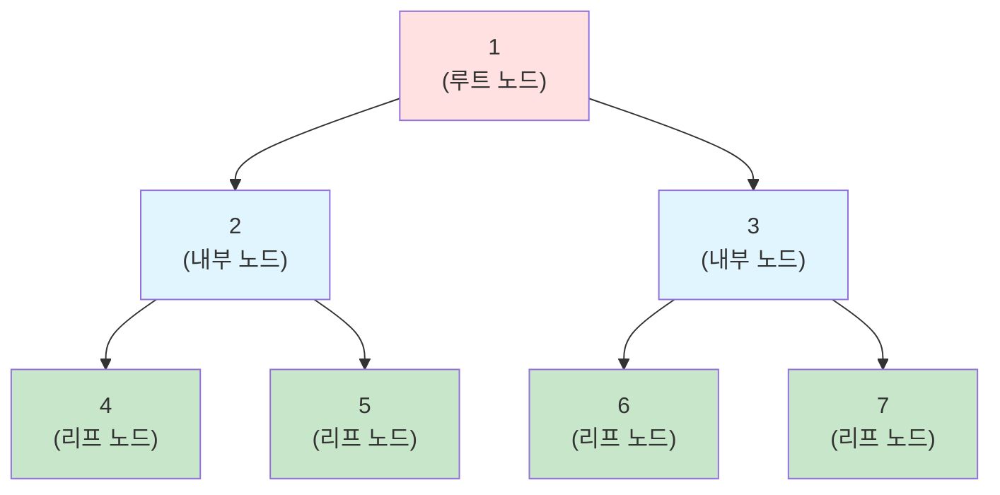
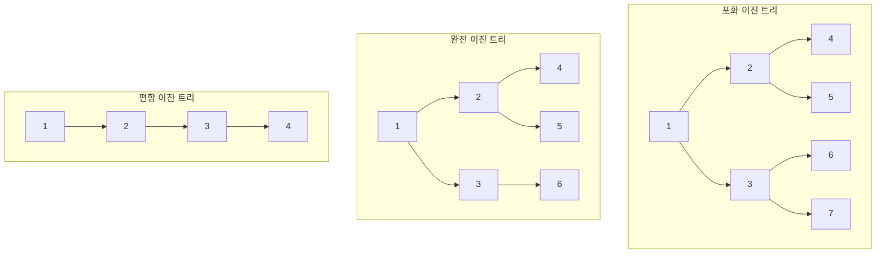
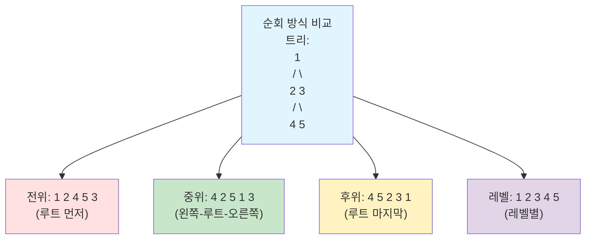
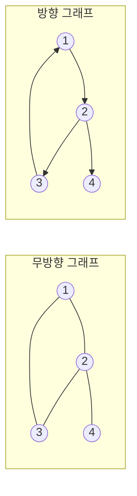
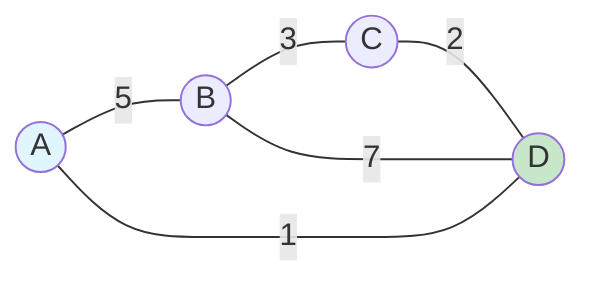

# 1. 학습목표

- 트리의 개념과 용어를 이해한다.
- 이진 트리의 순회 방법을 익힌다.
- 그래프의 개념과 표현 방법을 이해한다.
- Python으로 트리와 그래프를 구현할 수 있다.
- 실전 문제에서 트리와 그래프를 활용할 수 있다.

# 2. 트리 (Tree)

트리는 **노드들이 계층적으로 연결된 자료구조**입니다. 하나의 루트 노드에서 시작하여 자식 노드들로 뻗어나가는 형태로, 사이클이 없는 연결 그래프입니다.

## 2.1 트리의 기본 용어



- **노드(Node)**: 트리의 구성 요소
- **루트(Root)**: 최상위 노드 (노드 1)
- **부모(Parent)**: 특정 노드의 상위 노드 (2의 부모는 1)
- **자식(Child)**: 특정 노드의 하위 노드 (1의 자식은 2, 3)
- **형제(Sibling)**: 같은 부모를 가진 노드 (2와 3)
- **리프(Leaf)**: 자식이 없는 노드 (4, 5, 6, 7)
- **내부 노드(Internal Node)**: 자식이 있는 노드 (1, 2, 3)
- **깊이(Depth)**: 루트에서 특정 노드까지의 경로 길이 (4의 깊이: 2)
- **높이(Height)**: 트리의 최대 깊이 (이 트리의 높이: 2)
- **레벨(Level)**: 루트를 0 또는 1로 시작하는 깊이

## 2.2 트리의 특징

- **계층 구조**: 부모-자식 관계로 연결
- **사이클 없음**: 순환 구조가 없음
- **하나의 경로**: 두 노드 사이에는 정확히 하나의 경로만 존재
- **N개 노드, N-1개 간선**: N개의 노드는 N-1개의 간선으로 연결

# 3. 이진 트리 (Binary Tree)

이진 트리는 **각 노드가 최대 2개의 자식을 가지는 트리**입니다.

## 3.1 이진 트리의 종류



- **포화 이진 트리**: 모든 레벨이 노드로 꽉 차있음
- **완전 이진 트리**: 마지막 레벨을 제외하고 모든 레벨이 꽉 차있고, 마지막 레벨은 왼쪽부터 채워짐
- **편향 이진 트리**: 한쪽으로만 자식이 있는 트리

## 3.2 이진 트리 구현

```python
class TreeNode:
    def __init__(self, value):
        self.value = value
        self.left = None
        self.right = None

# 4. 트리 생성
# 5. 1
# 6. / \
# 7. 2   3
# 8. / \
# 9. 4   5

root = TreeNode(1)
root.left = TreeNode(2)
root.right = TreeNode(3)
root.left.left = TreeNode(4)
root.left.right = TreeNode(5)
```

## 9.1 이진 트리 순회

트리 순회는 트리의 모든 노드를 체계적으로 방문하는 과정입니다.

### 9.1.1 전위 순회 (Preorder)

**루트 → 왼쪽 → 오른쪽** 순서로 방문

```python
def preorder(node):
    """전위 순회: Root → Left → Right"""
    if node is None:
        return

    print(node.value, end=' ')  # 루트 방문
    preorder(node.left)         # 왼쪽 서브트리
    preorder(node.right)        # 오른쪽 서브트리

# 10. 결과: 1 2 4 5 3
```

### 10.0.1 중위 순회 (Inorder)

**왼쪽 → 루트 → 오른쪽** 순서로 방문

```python
def inorder(node):
    """중위 순회: Left → Root → Right"""
    if node is None:
        return

    inorder(node.left)          # 왼쪽 서브트리
    print(node.value, end=' ')  # 루트 방문
    inorder(node.right)         # 오른쪽 서브트리

# 11. 결과: 4 2 5 1 3
```

:::div{.callout}
<highlight>**이진 탐색 트리(BST)와 중위 순회**</highlight>

이진 탐색 트리를 중위 순회하면 **오름차순으로 정렬된 값**을 얻을 수 있습니다. 이는 BST의 왼쪽 자식 < 부모 < 오른쪽 자식 속성 때문입니다.
:::

### 11.0.1 후위 순회 (Postorder)

**왼쪽 → 오른쪽 → 루트** 순서로 방문

```python
def postorder(node):
    """후위 순회: Left → Right → Root"""
    if node is None:
        return

    postorder(node.left)        # 왼쪽 서브트리
    postorder(node.right)       # 오른쪽 서브트리
    print(node.value, end=' ')  # 루트 방문

# 12. 결과: 4 5 2 3 1
```

### 12.0.1 레벨 순회 (Level Order)

**레벨별로 왼쪽에서 오른쪽** 순서로 방문 (BFS 활용)

```python
from collections import deque

def level_order(root):
    """레벨 순회: BFS를 활용한 레벨별 순회"""
    if root is None:
        return

    queue = deque([root])

    while queue:
        node = queue.popleft()
        print(node.value, end=' ')

        if node.left:
            queue.append(node.left)
        if node.right:
            queue.append(node.right)

# 13. 결과: 1 2 3 4 5
```



# 14. 그래프 (Graph)

그래프는 **노드(정점)와 간선으로 이루어진 자료구조**로, 노드 간의 관계를 표현합니다.

## 14.1 그래프의 기본 용어

- **정점(Vertex)**: 노드, 데이터를 저장하는 위치
- **간선(Edge)**: 정점들을 연결하는 선
- **인접(Adjacent)**: 두 정점이 간선으로 연결된 관계
- **차수(Degree)**: 정점에 연결된 간선의 수
- **경로(Path)**: 한 정점에서 다른 정점으로 가는 간선의 순서
- **사이클(Cycle)**: 시작 정점과 끝 정점이 같은 경로

## 14.2 그래프의 종류

### 14.2.1 방향 그래프 vs 무방향 그래프



- **무방향 그래프**: 간선에 방향이 없음 (양방향 통행 가능)
- **방향 그래프**: 간선에 방향이 있음 (단방향 통행)

### 14.2.2 가중치 그래프



간선에 비용/거리/시간 등의 가중치가 있는 그래프입니다.

## 14.3 그래프 표현 방법

### 14.3.1 인접 행렬 (Adjacency Matrix)

2차원 배열로 그래프를 표현합니다.

```python
# 15. 무방향 그래프 예제
# 16. 0 - 1
# 17. |   |
# 18. 2 - 3

# 19. 인접 행렬 (4개 정점)
graph = [
    [0, 1, 1, 0],  # 0번 정점: 1, 2와 연결
    [1, 0, 0, 1],  # 1번 정점: 0, 3과 연결
    [1, 0, 0, 1],  # 2번 정점: 0, 3과 연결
    [0, 1, 1, 0]   # 3번 정점: 1, 2와 연결
]

# 20. 가중치 그래프
weighted_graph = [
    [0,   5,   INF, 1],
    [5,   0,   3,   7],
    [INF, 3,   0,   2],
    [1,   7,   2,   0]
]

# 21. 연결 확인
if graph[0][1] == 1:
    print("0과 1은 연결되어 있음")

# 22. 인접한 정점 찾기
def get_neighbors_matrix(graph, v):
    """인접 행렬에서 정점 v의 인접 정점들 반환"""
    neighbors = []
    for i in range(len(graph[v])):
        if graph[v][i] != 0:
            neighbors.append(i)
    return neighbors

print(get_neighbors_matrix(graph, 0))  # [1, 2]
```

**특징**:
- **공간복잡도**: O(V²) (V는 정점 수)
- **연결 확인**: O(1)
- **모든 간선 확인**: O(V²)
- **희소 그래프에서 비효율적** (간선이 적으면 0이 많음)

### 22.0.1 인접 리스트 (Adjacency List)

각 정점의 인접 정점들을 리스트로 저장합니다.

```python
# 23. 무방향 그래프
# 24. 0 - 1
# 25. |   |
# 26. 2 - 3

# 27. 인접 리스트 (딕셔너리)
graph = {
    0: [1, 2],
    1: [0, 3],
    2: [0, 3],
    3: [1, 2]
}

# 28. 또는 리스트의 리스트
graph_list = [
    [1, 2],     # 0번 정점
    [0, 3],     # 1번 정점
    [0, 3],     # 2번 정점
    [1, 2]      # 3번 정점
]

# 29. 가중치 그래프 (정점, 가중치) 튜플로 저장
weighted_graph = {
    0: [(1, 5), (3, 1)],
    1: [(0, 5), (2, 3), (3, 7)],
    2: [(1, 3), (3, 2)],
    3: [(0, 1), (1, 7), (2, 2)]
}

# 30. 인접한 정점 찾기
def get_neighbors_list(graph, v):
    """인접 리스트에서 정점 v의 인접 정점들 반환"""
    return graph[v]

print(get_neighbors_list(graph, 0))  # [1, 2]
```

**특징**:
- **공간복잡도**: O(V + E) (V는 정점 수, E는 간선 수)
- **연결 확인**: O(degree) (정점의 차수만큼)
- **모든 간선 확인**: O(V + E)
- **희소 그래프에서 효율적**

:::div{.callout}
<highlight>**인접 행렬 vs 인접 리스트 선택 기준**</highlight>

**인접 행렬을 사용할 때**:
- 그래프가 밀집(Dense)할 때 (간선이 많을 때)
- 두 정점 간 연결 여부를 자주 확인할 때
- 정점의 수가 적을 때

**인접 리스트를 사용할 때**:
- 그래프가 희소(Sparse)할 때 (간선이 적을 때)
- 모든 인접 정점을 순회할 때
- 메모리를 절약해야 할 때
- **대부분의 코딩테스트 문제** (일반적으로 희소 그래프)
:::

# 31. 실전 문제 해결

## 31.1 예제: 이진 트리의 최대 깊이

**문제**: 이진 트리의 최대 깊이를 구하세요.

```python
def max_depth(root):
    """
    접근 방법: 재귀
    - 리프 노드면 깊이 0
    - 왼쪽과 오른쪽 서브트리의 깊이 중 큰 값 + 1
    """
    if root is None:
        return 0

    left_depth = max_depth(root.left)
    right_depth = max_depth(root.right)

    return max(left_depth, right_depth) + 1

# 32. 테스트
# 33. 3
# 34. / \
# 35. 9  20
# 36. / \
# 37. 15  7
root = TreeNode(3)
root.left = TreeNode(9)
root.right = TreeNode(20)
root.right.left = TreeNode(15)
root.right.right = TreeNode(7)

print(max_depth(root))  # 3
```

## 37.1 예제: 네트워크 (그래프 연결 요소)

**문제**: n개의 컴퓨터가 연결 정보대로 연결되어 있을 때, 네트워크의 개수를 구하세요.

```python
def solution(n, computers):
    """
    접근 방법: DFS로 연결된 컴퓨터 그룹 찾기
    - 방문하지 않은 컴퓨터에서 DFS 시작
    - DFS를 시작한 횟수 = 네트워크 개수
    """
    def dfs(node):
        """DFS로 연결된 모든 컴퓨터 방문"""
        visited[node] = True

        for next_node in range(n):
            # 연결되어 있고 아직 방문하지 않았으면
            if computers[node][next_node] == 1 and not visited[next_node]:
                dfs(next_node)

    visited = [False] * n
    network_count = 0

    # 모든 컴퓨터 확인
    for i in range(n):
        if not visited[i]:
            dfs(i)
            network_count += 1

    return network_count

# 38. 테스트
n = 3
computers = [
    [1, 1, 0],
    [1, 1, 0],
    [0, 0, 1]
]
print(solution(n, computers))  # 2
# 39. 설명: [0, 1]과 [2] 두 개의 네트워크
```

## 39.1 예제: 가장 먼 노드

**문제**: n개의 노드가 있는 그래프에서 1번 노드로부터 가장 먼 노드의 개수를 구하세요.

```python
from collections import deque

def solution(n, edge):
    """
    접근 방법: BFS로 최단 거리 계산
    - 1번 노드에서 시작하여 BFS 수행
    - 각 노드까지의 거리 계산
    - 최대 거리를 가진 노드의 개수 반환
    """
    # 인접 리스트 생성
    graph = [[] for _ in range(n + 1)]
    for a, b in edge:
        graph[a].append(b)
        graph[b].append(a)

    # BFS
    distances = [-1] * (n + 1)
    distances[1] = 0
    queue = deque([1])

    while queue:
        node = queue.popleft()

        for next_node in graph[node]:
            if distances[next_node] == -1:  # 방문하지 않았으면
                distances[next_node] = distances[node] + 1
                queue.append(next_node)

    # 가장 먼 거리
    max_distance = max(distances)
    # 가장 먼 노드의 개수
    return distances.count(max_distance)

# 40. 테스트
n = 6
edge = [[3, 6], [4, 3], [3, 2], [1, 3], [1, 2], [2, 4], [5, 2]]
print(solution(n, edge))  # 3
# 41. 설명: 1번에서 4, 5, 6번까지의 거리가 3으로 가장 먼
```

## 41.1 예제: 이진 트리 레벨별 평균

**문제**: 이진 트리의 각 레벨별 평균값을 구하세요.

```python
from collections import deque

def average_of_levels(root):
    """
    접근 방법: 레벨 순회 (BFS)
    - 각 레벨의 모든 노드를 처리
    - 레벨별로 합계를 구하고 개수로 나눔
    """
    if not root:
        return []

    result = []
    queue = deque([root])

    while queue:
        level_size = len(queue)
        level_sum = 0

        # 현재 레벨의 모든 노드 처리
        for _ in range(level_size):
            node = queue.popleft()
            level_sum += node.value

            if node.left:
                queue.append(node.left)
            if node.right:
                queue.append(node.right)

        # 레벨 평균 계산
        level_avg = level_sum / level_size
        result.append(level_avg)

    return result

# 42. 테스트
# 43. 3
# 44. / \
# 45. 9  20
# 46. / \
# 47. 15  7
root = TreeNode(3)
root.left = TreeNode(9)
root.right = TreeNode(20)
root.right.left = TreeNode(15)
root.right.right = TreeNode(7)

print(average_of_levels(root))  # [3.0, 14.5, 11.0]
```

# 48. 언제 트리와 그래프를 사용하는가?

## 48.1 트리를 사용하는 경우

- **계층적 데이터 표현**
  - 파일 시스템, 조직도

- **검색 최적화**
  - 이진 탐색 트리 (BST)

- **우선순위 관리**
  - 힙 (다음 절에서 학습)

- **표현식 파싱**
  - 수식 트리

## 48.2 그래프를 사용하는 경우

- **네트워크 모델링**
  - 소셜 네트워크, 컴퓨터 네트워크

- **경로 찾기**
  - 최단 경로, 내비게이션

- **연결 관계 분석**
  - 친구 관계, 추천 시스템

- **상태 전이**
  - 게임 AI, 프로세스 관리

# 49. 핵심 정리

:::div{.callout}
<highlight>**트리와 그래프 핵심 포인트**</highlight>

**트리**:
- 사이클이 없는 연결 그래프
- N개 노드, N-1개 간선
- 이진 트리: 최대 2개의 자식
- 순회: 전위, 중위, 후위, 레벨

**그래프**:
- 정점과 간선으로 구성
- 방향/무방향, 가중치 유무
- 표현: 인접 행렬, 인접 리스트
- 탐색: DFS, BFS

**표현 방법 선택**:
- 밀집 그래프 → 인접 행렬
- 희소 그래프 → 인접 리스트 (대부분의 경우)

**순회/탐색**:
- 깊이 우선 (DFS): 스택 or 재귀
- 너비 우선 (BFS): 큐
:::

# 50. 연습 문제

다음 문제들을 풀어보며 트리와 그래프 개념을 확실히 다져보세요:

1. **이진 트리 대칭 확인**: 이진 트리가 대칭인지 확인
2. **경로의 합**: 루트에서 리프까지 경로의 합이 목표값인 경로 찾기
3. **순위**: 선수들의 경기 결과로 순위 결정 가능 여부 판단
4. **단어 변환**: 한 단어를 다른 단어로 변환하는 최소 단계
5. **여행 경로**: 모든 항공권을 사용하는 여행 경로 찾기

다음 절에서는 힙에 대해 알아보겠습니다!
