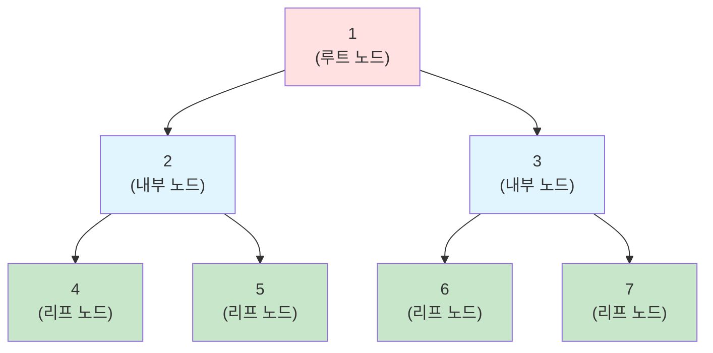
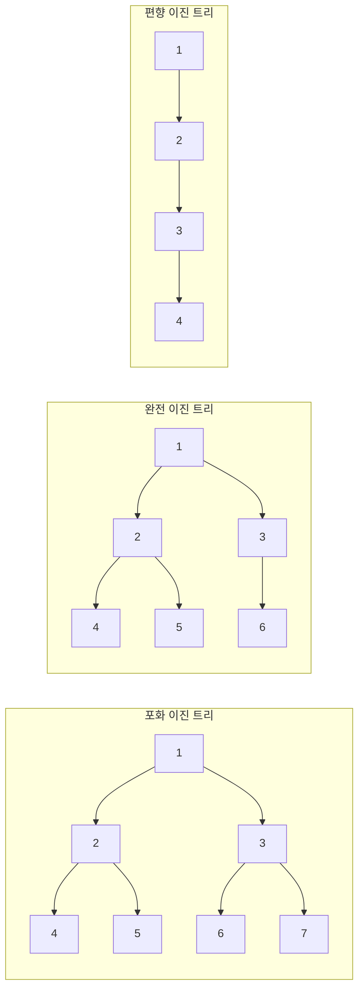
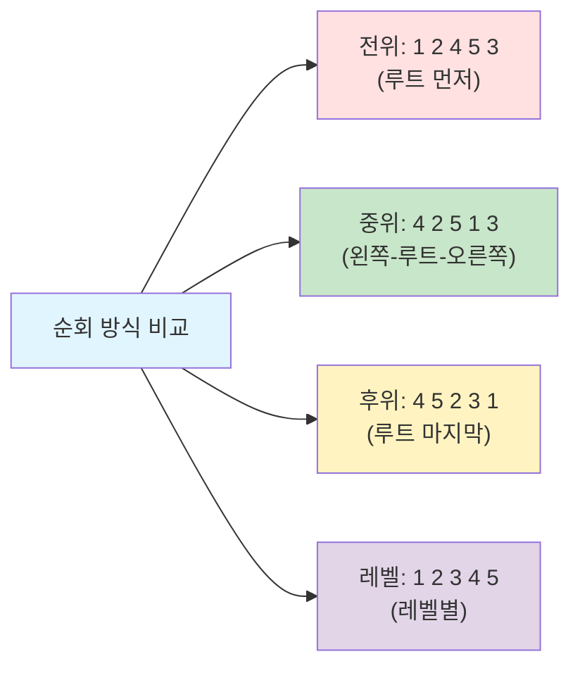
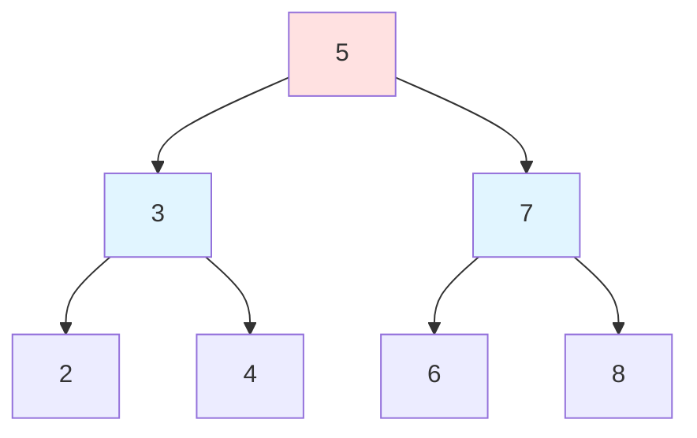

# 1. 트리 (Tree)

트리는 **노드들이 계층적으로 연결된 자료구조**입니다. 하나의 루트 노드에서 시작하여 자식 노드들로 뻗어나가는 형태로, 사이클이 없는 연결 그래프입니다.

## 1.1 트리의 기본 용어



- **노드(Node)**: 트리의 구성 요소
- **루트(Root)**: 최상위 노드 (노드 1)
- **부모(Parent)**: 특정 노드의 상위 노드 (2의 부모는 1)
- **자식(Child)**: 특정 노드의 하위 노드 (1의 자식은 2, 3)
- **형제(Sibling)**: 같은 부모를 가진 노드 (2와 3)
- **리프(Leaf)**: 자식이 없는 노드 (4, 5, 6, 7)
- **내부 노드(Internal Node)**: 자식이 있는 노드 (1, 2, 3)
- **깊이(Depth)**: 루트에서 특정 노드까지의 경로 길이 (4의 깊이: 2)
- **높이(Height)**: 트리의 최대 깊이 (이 트리의 높이: 2)
- **레벨(Level)**: 루트를 0 또는 1로 시작하는 깊이

## 1.2 트리의 특징

- **계층 구조**: 부모-자식 관계로 연결
- **사이클 없음**: 순환 구조가 없음
- **하나의 경로**: 두 노드 사이에는 정확히 하나의 경로만 존재
- **N개 노드, N-1개 간선**: N개의 노드는 N-1개의 간선으로 연결

# 2. 이진 트리 (Binary Tree)

이진 트리는 **각 노드가 최대 2개의 자식을 가지는 트리**입니다.

## 2.1 이진 트리의 종류



- **포화 이진 트리 (Full Binary Tree)**: 모든 레벨이 노드로 꽉 차있음
- **완전 이진 트리 (Complete Binary Tree)**: 마지막 레벨을 제외하고 모든 레벨이 꽉 차있고, 마지막 레벨은 왼쪽부터 채워짐
- **편향 이진 트리 (Skewed Binary Tree)**: 한쪽으로만 자식이 있는 트리

## 2.2 이진 트리 구현

```python
class TreeNode:
    def __init__(self, value):
        self.value = value
        self.left = None
        self.right = None

# 트리 생성
#     1
#    / \
#   2   3
#  / \
# 4   5

root = TreeNode(1)
root.left = TreeNode(2)
root.right = TreeNode(3)
root.left.left = TreeNode(4)
root.left.right = TreeNode(5)
```

## 2.3 이진 트리 순회

트리 순회는 트리의 모든 노드를 체계적으로 방문하는 과정입니다.

### 2.3.1 전위 순회 (Preorder)

**루트 → 왼쪽 → 오른쪽** 순서로 방문합니다.

```python
def preorder(node):
    """전위 순회: Root → Left → Right"""
    if node is None:
        return

    print(node.value, end=' ')  # 루트 방문
    preorder(node.left)         # 왼쪽 서브트리
    preorder(node.right)        # 오른쪽 서브트리

# 결과: 1 2 4 5 3
```

### 2.3.2 중위 순회 (Inorder)

**왼쪽 → 루트 → 오른쪽** 순서로 방문합니다.

```python
def inorder(node):
    """중위 순회: Left → Root → Right"""
    if node is None:
        return

    inorder(node.left)          # 왼쪽 서브트리
    print(node.value, end=' ')  # 루트 방문
    inorder(node.right)         # 오른쪽 서브트리

# 결과: 4 2 5 1 3
```

:::div{.callout}
**이진 탐색 트리(BST)와 중위 순회**

이진 탐색 트리를 중위 순회하면 **오름차순으로 정렬된 값**을 얻을 수 있습니다. 이는 BST의 왼쪽 자식 < 부모 < 오른쪽 자식 속성 때문입니다.
:::

### 2.3.3 후위 순회 (Postorder)

**왼쪽 → 오른쪽 → 루트** 순서로 방문합니다.

```python
def postorder(node):
    """후위 순회: Left → Right → Root"""
    if node is None:
        return

    postorder(node.left)        # 왼쪽 서브트리
    postorder(node.right)       # 오른쪽 서브트리
    print(node.value, end=' ')  # 루트 방문

# 결과: 4 5 2 3 1
```

### 2.3.4 레벨 순회 (Level Order)

**레벨별로 왼쪽에서 오른쪽** 순서로 방문합니다 (BFS 활용).

```python
from collections import deque

def level_order(root):
    """레벨 순회: BFS를 활용한 레벨별 순회"""
    if root is None:
        return

    queue = deque([root])

    while queue:
        node = queue.popleft()
        print(node.value, end=' ')

        if node.left:
            queue.append(node.left)
        if node.right:
            queue.append(node.right)

# 결과: 1 2 3 4 5
```

### 2.3.5 순회 방식 비교



## 2.4 이진 탐색 트리 (Binary Search Tree, BST)

이진 탐색 트리는 다음 속성을 만족하는 이진 트리입니다:
- **왼쪽 자식 < 부모 < 오른쪽 자식**



### 2.4.1 BST 연산

```python
class BSTNode:
    def __init__(self, value):
        self.value = value
        self.left = None
        self.right = None

def insert(root, value):
    """BST에 값 삽입 - O(log n) 평균, O(n) 최악"""
    if root is None:
        return BSTNode(value)

    if value < root.value:
        root.left = insert(root.left, value)
    elif value > root.value:
        root.right = insert(root.right, value)

    return root

def search(root, value):
    """BST에서 값 검색 - O(log n) 평균, O(n) 최악"""
    if root is None or root.value == value:
        return root

    if value < root.value:
        return search(root.left, value)
    else:
        return search(root.right, value)

# 사용 예제
root = None
values = [5, 3, 7, 2, 4, 6, 8]
for val in values:
    root = insert(root, val)

# 검색
node = search(root, 4)
print(node.value if node else "Not found")  # 4
```

## 2.5 트리의 시간복잡도

| 연산 | 균형 트리 | 편향 트리 |
|------|----------|----------|
| **검색** | O(log n) | O(n) |
| **삽입** | O(log n) | O(n) |
| **삭제** | O(log n) | O(n) |
| **순회** | O(n) | O(n) |

- **균형 트리**: AVL 트리, Red-Black 트리 등
- **편향 트리**: 한쪽으로만 치우친 트리 (연결 리스트와 유사)

# 3. 실전 활용 예제

## 3.1 이진 트리의 최대 깊이

이진 트리의 최대 깊이를 구하는 문제입니다.

```python
def max_depth(root):
    """
    접근 방법: 재귀
    - 리프 노드면 깊이 0
    - 왼쪽과 오른쪽 서브트리의 깊이 중 큰 값 + 1

    시간복잡도: O(n)
    공간복잡도: O(h) - h는 트리의 높이
    """
    if root is None:
        return 0

    left_depth = max_depth(root.left)
    right_depth = max_depth(root.right)

    return max(left_depth, right_depth) + 1

# 테스트
#     3
#    / \
#   9  20
#      / \
#     15  7
root = TreeNode(3)
root.left = TreeNode(9)
root.right = TreeNode(20)
root.right.left = TreeNode(15)
root.right.right = TreeNode(7)

print(max_depth(root))  # 3
```

## 3.2 이진 트리 레벨별 평균

이진 트리의 각 레벨별 평균값을 구하는 문제입니다.

```python
from collections import deque

def average_of_levels(root):
    """
    접근 방법: 레벨 순회 (BFS)
    - 각 레벨의 모든 노드를 처리
    - 레벨별로 합계를 구하고 개수로 나눔

    시간복잡도: O(n)
    공간복잡도: O(w) - w는 트리의 최대 너비
    """
    if not root:
        return []

    result = []
    queue = deque([root])

    while queue:
        level_size = len(queue)
        level_sum = 0

        # 현재 레벨의 모든 노드 처리
        for _ in range(level_size):
            node = queue.popleft()
            level_sum += node.value

            if node.left:
                queue.append(node.left)
            if node.right:
                queue.append(node.right)

        # 레벨 평균 계산
        level_avg = level_sum / level_size
        result.append(level_avg)

    return result

# 테스트
#     3
#    / \
#   9  20
#      / \
#     15  7
root = TreeNode(3)
root.left = TreeNode(9)
root.right = TreeNode(20)
root.right.left = TreeNode(15)
root.right.right = TreeNode(7)

print(average_of_levels(root))  # [3.0, 14.5, 11.0]
```

## 3.3 이진 트리의 대칭 확인

이진 트리가 좌우 대칭인지 확인하는 문제입니다.

```python
def is_symmetric(root):
    """
    접근 방법: 재귀
    - 왼쪽 서브트리와 오른쪽 서브트리가 대칭인지 확인

    시간복잡도: O(n)
    공간복잡도: O(h)
    """
    def is_mirror(left, right):
        # 둘 다 None이면 대칭
        if not left and not right:
            return True

        # 하나만 None이면 비대칭
        if not left or not right:
            return False

        # 값이 같고, 각각의 서브트리가 대칭이면 대칭
        return (left.value == right.value and
                is_mirror(left.left, right.right) and
                is_mirror(left.right, right.left))

    if not root:
        return True

    return is_mirror(root.left, root.right)

# 테스트
#      1
#     / \
#    2   2
#   / \ / \
#  3  4 4  3
root = TreeNode(1)
root.left = TreeNode(2)
root.right = TreeNode(2)
root.left.left = TreeNode(3)
root.left.right = TreeNode(4)
root.right.left = TreeNode(4)
root.right.right = TreeNode(3)

print(is_symmetric(root))  # True
```

## 3.4 경로의 합

루트에서 리프까지 경로의 합이 목표값과 같은지 확인하는 문제입니다.

```python
def has_path_sum(root, target_sum):
    """
    접근 방법: 재귀
    - 리프 노드에 도달했을 때 남은 합이 0인지 확인

    시간복잡도: O(n)
    공간복잡도: O(h)
    """
    if not root:
        return False

    # 리프 노드이고 합이 일치하면 True
    if not root.left and not root.right:
        return target_sum == root.value

    # 왼쪽 또는 오른쪽 서브트리에 경로가 있는지 확인
    remaining = target_sum - root.value
    return (has_path_sum(root.left, remaining) or
            has_path_sum(root.right, remaining))

# 테스트
#      5
#     / \
#    4   8
#   /   / \
#  11  13  4
# /  \      \
#7    2      1
root = TreeNode(5)
root.left = TreeNode(4)
root.right = TreeNode(8)
root.left.left = TreeNode(11)
root.left.left.left = TreeNode(7)
root.left.left.right = TreeNode(2)
root.right.left = TreeNode(13)
root.right.right = TreeNode(4)
root.right.right.right = TreeNode(1)

print(has_path_sum(root, 22))  # True (5→4→11→2)
```

# 4. 트리 사용 시나리오

## 4.1 트리를 사용하는 경우

- **계층적 데이터 표현**
  - 파일 시스템, 조직도, HTML DOM

- **검색 최적화**
  - 이진 탐색 트리 (BST)
  - 균형 트리 (AVL, Red-Black Tree)

- **우선순위 관리**
  - 힙 (Heap)

- **표현식 파싱**
  - 수식 트리, 구문 분석 트리

- **라우팅 테이블**
  - Trie (접두사 트리)

## 4.2 트리의 장단점

| 장점 | 단점 |
|------|------|
| 계층 구조 표현에 적합 | 구현이 복잡할 수 있음 |
| 검색/삽입/삭제 효율적 (균형 트리) | 편향 시 성능 저하 |
| 정렬된 데이터 유지 가능 (BST) | 메모리 오버헤드 (포인터) |

# 5. 핵심 정리

:::div{.callout}
**트리 핵심 포인트**

**기본 개념**
- 계층적 자료구조, 사이클 없음
- N개 노드, N-1개 간선
- 루트, 부모, 자식, 리프 개념

**이진 트리**
- 각 노드가 최대 2개의 자식
- 포화, 완전, 편향 이진 트리

**순회 방법**
- 전위(Preorder): 루트 → 왼쪽 → 오른쪽
- 중위(Inorder): 왼쪽 → 루트 → 오른쪽
- 후위(Postorder): 왼쪽 → 오른쪽 → 루트
- 레벨(Level Order): BFS로 레벨별 순회

**이진 탐색 트리**
- 왼쪽 < 부모 < 오른쪽
- 검색/삽입/삭제: 평균 O(log n), 최악 O(n)
- 중위 순회 시 정렬된 순서

**시간복잡도**
- 균형 트리: O(log n) 검색/삽입/삭제
- 편향 트리: O(n) 검색/삽입/삭제
- 순회: O(n)

**활용**
- 계층 데이터, 검색 최적화, 우선순위 관리
- 파일 시스템, BST, 힙, Trie
:::
