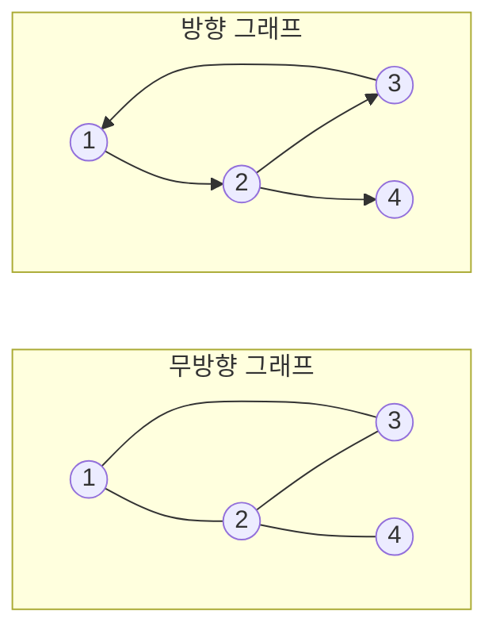
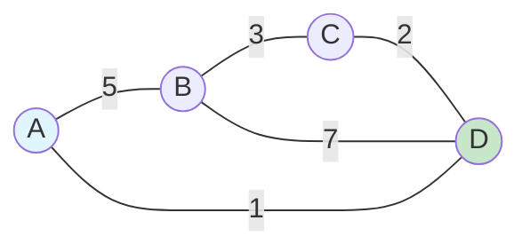
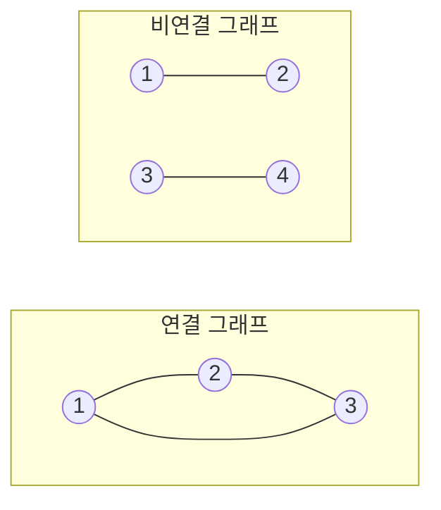
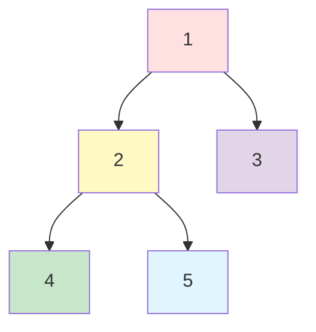
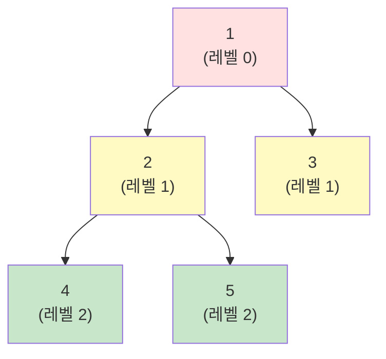

# 1. 그래프 (Graph)

그래프는 **노드(정점)와 간선으로 이루어진 자료구조**로, 노드 간의 관계를 표현합니다. 트리와 달리 사이클이 있을 수 있고, 방향성이 있을 수도 있습니다.

## 1.1 그래프의 기본 용어

- **정점(Vertex)**: 노드, 데이터를 저장하는 위치
- **간선(Edge)**: 정점들을 연결하는 선
- **인접(Adjacent)**: 두 정점이 간선으로 연결된 관계
- **차수(Degree)**: 정점에 연결된 간선의 수
- **경로(Path)**: 한 정점에서 다른 정점으로 가는 간선의 순서
- **사이클(Cycle)**: 시작 정점과 끝 정점이 같은 경로

## 1.2 그래프의 종류

### 1.2.1 방향 그래프 vs 무방향 그래프



- **무방향 그래프 (Undirected Graph)**: 간선에 방향이 없음 (양방향 통행 가능)
- **방향 그래프 (Directed Graph)**: 간선에 방향이 있음 (단방향 통행)

### 1.2.2 가중치 그래프



간선에 비용/거리/시간 등의 **가중치(Weight)**가 있는 그래프입니다.

### 1.2.3 연결 그래프 vs 비연결 그래프



- **연결 그래프**: 모든 정점 사이에 경로가 존재
- **비연결 그래프**: 일부 정점 사이에 경로가 없음

## 1.3 그래프 표현 방법

### 1.3.1 인접 행렬 (Adjacency Matrix)

2차원 배열로 그래프를 표현합니다.

```python
# 무방향 그래프 예제
# 0 - 1
# |   |
# 2 - 3

# 인접 행렬 (4개 정점)
graph = [
    [0, 1, 1, 0],  # 0번 정점: 1, 2와 연결
    [1, 0, 0, 1],  # 1번 정점: 0, 3과 연결
    [1, 0, 0, 1],  # 2번 정점: 0, 3과 연결
    [0, 1, 1, 0]   # 3번 정점: 1, 2와 연결
]

# 가중치 그래프 (INF는 무한대, 연결 안됨을 의미)
INF = float('inf')
weighted_graph = [
    [0,   5,   INF, 1],
    [5,   0,   3,   7],
    [INF, 3,   0,   2],
    [1,   7,   2,   0]
]

# 연결 확인
if graph[0][1] == 1:
    print("0과 1은 연결되어 있음")

# 인접한 정점 찾기
def get_neighbors_matrix(graph, v):
    """인접 행렬에서 정점 v의 인접 정점들 반환"""
    neighbors = []
    for i in range(len(graph[v])):
        if graph[v][i] != 0:
            neighbors.append(i)
    return neighbors

print(get_neighbors_matrix(graph, 0))  # [1, 2]
```

**특징**:
- **공간복잡도**: O(V²) (V는 정점 수)
- **연결 확인**: O(1)
- **모든 간선 확인**: O(V²)
- **희소 그래프에서 비효율적** (간선이 적으면 0이 많음)

### 1.3.2 인접 리스트 (Adjacency List)

각 정점의 인접 정점들을 리스트로 저장합니다.

```python
# 무방향 그래프
# 0 - 1
# |   |
# 2 - 3

# 인접 리스트 (딕셔너리)
graph = {
    0: [1, 2],
    1: [0, 3],
    2: [0, 3],
    3: [1, 2]
}

# 또는 리스트의 리스트
graph_list = [
    [1, 2],     # 0번 정점
    [0, 3],     # 1번 정점
    [0, 3],     # 2번 정점
    [1, 2]      # 3번 정점
]

# 가중치 그래프 (정점, 가중치) 튜플로 저장
weighted_graph = {
    0: [(1, 5), (3, 1)],
    1: [(0, 5), (2, 3), (3, 7)],
    2: [(1, 3), (3, 2)],
    3: [(0, 1), (1, 7), (2, 2)]
}

# 인접한 정점 찾기
def get_neighbors_list(graph, v):
    """인접 리스트에서 정점 v의 인접 정점들 반환"""
    return graph[v]

print(get_neighbors_list(graph, 0))  # [1, 2]
```

**특징**:
- **공간복잡도**: O(V + E) (V는 정점 수, E는 간선 수)
- **연결 확인**: O(degree) (정점의 차수만큼)
- **모든 간선 확인**: O(V + E)
- **희소 그래프에서 효율적**

:::div{.callout}
**인접 행렬 vs 인접 리스트 선택 기준**

**인접 행렬을 사용할 때**:
- 그래프가 밀집(Dense)할 때 (간선이 많을 때)
- 두 정점 간 연결 여부를 자주 확인할 때
- 정점의 수가 적을 때

**인접 리스트를 사용할 때**:
- 그래프가 희소(Sparse)할 때 (간선이 적을 때)
- 모든 인접 정점을 순회할 때
- 메모리를 절약해야 할 때
- **대부분의 코딩테스트 문제** (일반적으로 희소 그래프)
:::

# 2. 그래프 탐색

그래프의 모든 정점을 체계적으로 방문하는 방법입니다.

## 2.1 깊이 우선 탐색 (DFS, Depth-First Search)

한 경로를 끝까지 탐색한 후 다음 경로를 탐색하는 방법입니다. **스택** 또는 **재귀**를 사용합니다.



**탐색 순서**: 1 → 2 → 4 → 5 → 3

### 2.1.1 DFS 구현 (재귀)

```python
def dfs_recursive(graph, start, visited=None):
    """
    DFS 재귀 구현
    시간복잡도: O(V + E)
    공간복잡도: O(V)
    """
    if visited is None:
        visited = set()

    visited.add(start)
    print(start, end=' ')

    # 인접한 정점 중 방문하지 않은 정점 탐색
    for neighbor in graph[start]:
        if neighbor not in visited:
            dfs_recursive(graph, neighbor, visited)

    return visited

# 테스트
graph = {
    1: [2, 3],
    2: [1, 4, 5],
    3: [1],
    4: [2],
    5: [2]
}

dfs_recursive(graph, 1)  # 1 2 4 5 3
```

### 2.1.2 DFS 구현 (스택)

```python
def dfs_stack(graph, start):
    """
    DFS 스택 구현
    시간복잡도: O(V + E)
    공간복잡도: O(V)
    """
    visited = set()
    stack = [start]

    while stack:
        node = stack.pop()

        if node not in visited:
            visited.add(node)
            print(node, end=' ')

            # 인접한 정점을 역순으로 스택에 추가 (작은 번호부터 방문하기 위해)
            for neighbor in reversed(graph[node]):
                if neighbor not in visited:
                    stack.append(neighbor)

    return visited

# 테스트
dfs_stack(graph, 1)  # 1 2 4 5 3
```

## 2.2 너비 우선 탐색 (BFS, Breadth-First Search)

같은 레벨의 정점들을 먼저 탐색한 후 다음 레벨로 이동하는 방법입니다. **큐**를 사용합니다.



**탐색 순서**: 1 → 2 → 3 → 4 → 5

### 2.2.1 BFS 구현

```python
from collections import deque

def bfs(graph, start):
    """
    BFS 구현
    시간복잡도: O(V + E)
    공간복잡도: O(V)
    """
    visited = set()
    queue = deque([start])
    visited.add(start)

    while queue:
        node = queue.popleft()
        print(node, end=' ')

        # 인접한 정점 중 방문하지 않은 정점을 큐에 추가
        for neighbor in graph[node]:
            if neighbor not in visited:
                visited.add(neighbor)
                queue.append(neighbor)

    return visited

# 테스트
graph = {
    1: [2, 3],
    2: [1, 4, 5],
    3: [1],
    4: [2],
    5: [2]
}

bfs(graph, 1)  # 1 2 3 4 5
```

## 2.3 DFS vs BFS 비교

| 특성 | DFS | BFS |
|------|-----|-----|
| **자료구조** | 스택 (재귀) | 큐 |
| **탐색 방식** | 깊이 우선 | 너비 우선 |
| **경로 탐색** | 모든 경로 탐색 | 최단 경로 탐색 |
| **메모리** | 낮음 (경로 길이) | 높음 (같은 레벨 모두 저장) |
| **시간복잡도** | O(V + E) | O(V + E) |
| **활용** | 사이클 검사, 위상 정렬 | 최단 거리, 레벨별 처리 |

:::div{.callout}
**DFS vs BFS 선택 가이드**

**DFS를 사용할 때**:
- 모든 경로를 탐색해야 할 때
- 백트래킹 문제
- 사이클 검사
- 위상 정렬

**BFS를 사용할 때**:
- 최단 경로를 찾을 때 (가중치 없는 그래프)
- 레벨별로 처리해야 할 때
- 시작점에서 가까운 정점부터 탐색할 때
:::

# 3. 실전 활용 예제

## 3.1 네트워크 (연결 요소 개수)

n개의 컴퓨터가 연결 정보대로 연결되어 있을 때, 네트워크의 개수를 구하는 문제입니다.

```python
def solution(n, computers):
    """
    접근 방법: DFS로 연결된 컴퓨터 그룹 찾기
    - 방문하지 않은 컴퓨터에서 DFS 시작
    - DFS를 시작한 횟수 = 네트워크 개수

    시간복잡도: O(n²)
    공간복잡도: O(n)
    """
    def dfs(node):
        """DFS로 연결된 모든 컴퓨터 방문"""
        visited[node] = True

        for next_node in range(n):
            # 연결되어 있고 아직 방문하지 않았으면
            if computers[node][next_node] == 1 and not visited[next_node]:
                dfs(next_node)

    visited = [False] * n
    network_count = 0

    # 모든 컴퓨터 확인
    for i in range(n):
        if not visited[i]:
            dfs(i)
            network_count += 1

    return network_count

# 테스트
n = 3
computers = [
    [1, 1, 0],
    [1, 1, 0],
    [0, 0, 1]
]
print(solution(n, computers))  # 2
# 설명: [0, 1]과 [2] 두 개의 네트워크
```

## 3.2 가장 먼 노드

n개의 노드가 있는 그래프에서 1번 노드로부터 가장 먼 노드의 개수를 구하는 문제입니다.

```python
from collections import deque

def solution(n, edge):
    """
    접근 방법: BFS로 최단 거리 계산
    - 1번 노드에서 시작하여 BFS 수행
    - 각 노드까지의 거리 계산
    - 최대 거리를 가진 노드의 개수 반환

    시간복잡도: O(V + E)
    공간복잡도: O(V + E)
    """
    # 인접 리스트 생성
    graph = [[] for _ in range(n + 1)]
    for a, b in edge:
        graph[a].append(b)
        graph[b].append(a)

    # BFS
    distances = [-1] * (n + 1)
    distances[1] = 0
    queue = deque([1])

    while queue:
        node = queue.popleft()

        for next_node in graph[node]:
            if distances[next_node] == -1:  # 방문하지 않았으면
                distances[next_node] = distances[node] + 1
                queue.append(next_node)

    # 가장 먼 거리
    max_distance = max(distances)
    # 가장 먼 노드의 개수
    return distances.count(max_distance)

# 테스트
n = 6
edge = [[3, 6], [4, 3], [3, 2], [1, 3], [1, 2], [2, 4], [5, 2]]
print(solution(n, edge))  # 3
# 설명: 1번에서 4, 5, 6번까지의 거리가 3으로 가장 먼
```

## 3.3 단어 변환

한 단어를 다른 단어로 변환하는 최소 단계를 구하는 문제입니다 (한 번에 한 알파벳만 변경 가능).

```python
from collections import deque

def solution(begin, target, words):
    """
    접근 방법: BFS
    - 각 단계에서 한 글자만 다른 단어로 변환
    - 최단 경로 찾기

    시간복잡도: O(N * M) - N은 단어 개수, M은 단어 길이
    공간복잡도: O(N)
    """
    if target not in words:
        return 0

    def can_convert(word1, word2):
        """두 단어가 한 글자만 다른지 확인"""
        diff_count = 0
        for c1, c2 in zip(word1, word2):
            if c1 != c2:
                diff_count += 1
        return diff_count == 1

    queue = deque([(begin, 0)])  # (현재 단어, 변환 횟수)
    visited = set([begin])

    while queue:
        current_word, step = queue.popleft()

        # 목표 단어에 도달
        if current_word == target:
            return step

        # 한 글자만 다른 단어들 탐색
        for word in words:
            if word not in visited and can_convert(current_word, word):
                visited.add(word)
                queue.append((word, step + 1))

    return 0

# 테스트
begin = "hit"
target = "cog"
words = ["hot", "dot", "dog", "lot", "log", "cog"]
print(solution(begin, target, words))  # 4
# 설명: hit → hot → dot → dog → cog
```

## 3.4 여행 경로

모든 항공권을 사용하는 여행 경로를 찾는 문제입니다 (사전순으로 빠른 경로).

```python
from collections import defaultdict

def solution(tickets):
    """
    접근 방법: DFS + 백트래킹
    - 모든 티켓을 사용하는 경로 찾기
    - 사전순으로 정렬하여 빠른 경로 우선 탐색

    시간복잡도: O(E log E) - E는 티켓 개수
    공간복잡도: O(E)
    """
    # 인접 리스트 생성 (사전순 정렬)
    graph = defaultdict(list)
    for start, end in sorted(tickets, reverse=True):
        graph[start].append(end)

    path = []

    def dfs(airport):
        # 해당 공항에서 갈 수 있는 모든 곳 방문
        while graph[airport]:
            next_airport = graph[airport].pop()
            dfs(next_airport)
        path.append(airport)

    dfs("ICN")
    return path[::-1]  # 역순으로 반환

# 테스트
tickets = [["ICN", "JFK"], ["HND", "IAD"], ["JFK", "HND"]]
print(solution(tickets))  # ["ICN", "JFK", "HND", "IAD"]

tickets = [["ICN", "SFO"], ["ICN", "ATL"], ["SFO", "ATL"], ["ATL", "ICN"], ["ATL", "SFO"]]
print(solution(tickets))  # ["ICN", "ATL", "ICN", "SFO", "ATL", "SFO"]
```

## 3.5 순위 (위상 정렬)

선수들의 경기 결과로 순위를 정확히 결정할 수 있는 선수의 수를 구하는 문제입니다.

```python
def solution(n, results):
    """
    접근 방법: 플로이드-워셜
    - 승패 관계를 그래프로 표현
    - 간접적인 승패 관계 파악

    시간복잡도: O(n³)
    공간복잡도: O(n²)
    """
    # 승패 그래프 초기화
    win = [[False] * (n + 1) for _ in range(n + 1)]

    # 경기 결과 입력
    for winner, loser in results:
        win[winner][loser] = True

    # 플로이드-워셜: 간접적인 승패 관계 파악
    for k in range(1, n + 1):
        for i in range(1, n + 1):
            for j in range(1, n + 1):
                # i가 k를 이기고, k가 j를 이기면, i가 j를 이김
                if win[i][k] and win[k][j]:
                    win[i][j] = True

    # 각 선수의 순위를 정확히 알 수 있는지 확인
    answer = 0
    for i in range(1, n + 1):
        known = 0
        for j in range(1, n + 1):
            # i가 j를 이기거나, j가 i를 이기면 관계를 알 수 있음
            if win[i][j] or win[j][i]:
                known += 1

        # 모든 다른 선수와의 관계를 알면 순위 확정
        if known == n - 1:
            answer += 1

    return answer

# 테스트
n = 5
results = [[4, 3], [4, 2], [3, 2], [1, 2], [2, 5]]
print(solution(n, results))  # 2
# 설명: 2번과 5번 선수의 순위를 정확히 알 수 있음
```

# 4. 그래프 사용 시나리오

## 4.1 그래프를 사용하는 경우

- **네트워크 모델링**
  - 소셜 네트워크, 컴퓨터 네트워크, 교통 네트워크

- **경로 찾기**
  - 최단 경로 (다익스트라, 벨만-포드)
  - 모든 쌍 최단 경로 (플로이드-워셜)
  - 내비게이션

- **연결 관계 분석**
  - 친구 관계, 추천 시스템
  - 연결 요소 찾기

- **상태 전이**
  - 게임 AI, 프로세스 관리

- **의존성 관리**
  - 작업 순서 (위상 정렬)
  - 패키지 의존성

## 4.2 그래프 알고리즘 분류

| 알고리즘 | 목적 | 시간복잡도 |
|---------|------|-----------|
| **DFS** | 경로 탐색, 사이클 검사 | O(V + E) |
| **BFS** | 최단 경로 (무가중치) | O(V + E) |
| **다익스트라** | 최단 경로 (양의 가중치) | O((V + E) log V) |
| **벨만-포드** | 최단 경로 (음의 가중치) | O(VE) |
| **플로이드-워셜** | 모든 쌍 최단 경로 | O(V³) |
| **크루스칼** | 최소 신장 트리 | O(E log E) |
| **프림** | 최소 신장 트리 | O(E log V) |
| **위상 정렬** | 순서 결정 | O(V + E) |

# 5. 핵심 정리

:::div{.callout}
**그래프 핵심 포인트**

**기본 개념**
- 정점과 간선으로 구성
- 방향/무방향, 가중치 유무
- 사이클 가능 (트리와 차이)

**표현 방법**
- 인접 행렬: O(V²) 공간, O(1) 연결 확인
- 인접 리스트: O(V+E) 공간, 희소 그래프에 효율적

**탐색 알고리즘**
- DFS: 깊이 우선, 스택/재귀, 모든 경로 탐색
- BFS: 너비 우선, 큐, 최단 경로 탐색

**시간복잡도**
- DFS/BFS: O(V + E)
- 인접 행렬: O(V²) 모든 간선 확인
- 인접 리스트: O(V + E) 모든 간선 확인

**활용**
- 네트워크, 경로 찾기, 연결 관계
- 최단 경로, 최소 신장 트리, 위상 정렬

**선택 가이드**
- 희소 그래프 → 인접 리스트 (대부분의 경우)
- 밀집 그래프 → 인접 행렬
- 최단 경로 → BFS (무가중치), 다익스트라 (가중치)
- 모든 경로 → DFS
:::
