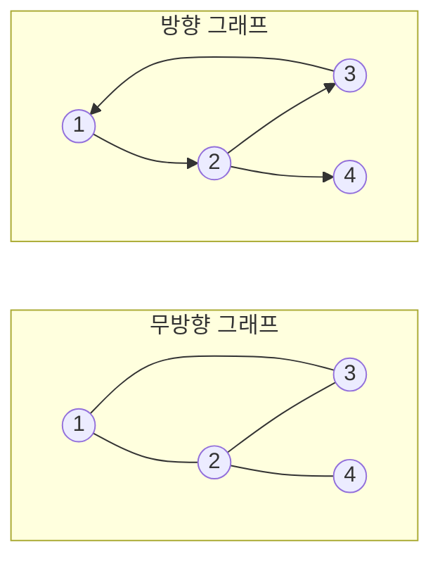
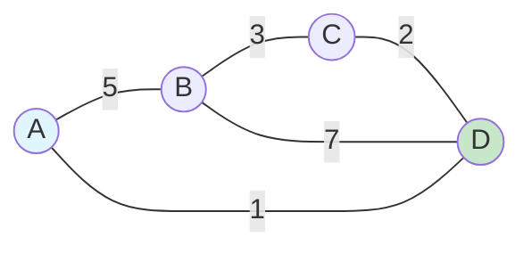
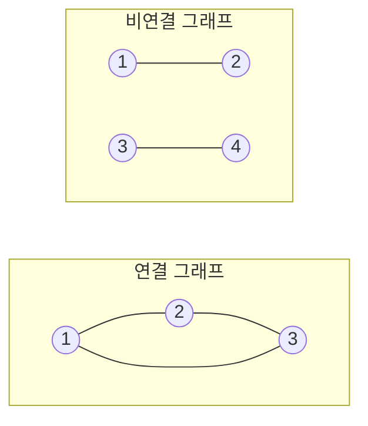

# 1. 그래프 (Graph)

그래프는 **노드(정점)와 간선으로 이루어진 자료구조**로, 노드 간의 관계를 표현합니다. 트리와 달리 사이클이 있을 수 있고, 방향성이 있을 수도 있습니다.

## 1.1 그래프의 기본 용어

- **정점(Vertex)**: 노드, 데이터를 저장하는 위치
- **간선(Edge)**: 정점들을 연결하는 선
- **인접(Adjacent)**: 두 정점이 간선으로 연결된 관계
- **차수(Degree)**: 정점에 연결된 간선의 수
- **경로(Path)**: 한 정점에서 다른 정점으로 가는 간선의 순서
- **사이클(Cycle)**: 시작 정점과 끝 정점이 같은 경로

## 1.2 그래프의 종류

### 1.2.1 방향 그래프 vs 무방향 그래프



- **무방향 그래프** (Undirected Graph): 간선에 방향이 없음 (양방향 통행 가능)
- **방향 그래프** (Directed Graph): 간선에 방향이 있음 (단방향 통행)

### 1.2.2 가중치 그래프



간선에 비용/거리/시간 등의 **가중치**(Weight)가 있는 그래프입니다.

### 1.2.3 연결 그래프 vs 비연결 그래프



- **연결 그래프**: 모든 정점 사이에 경로가 존재
- **비연결 그래프**: 일부 정점 사이에 경로가 없음

## 1.3 그래프 표현 방법

### 1.3.1 인접 행렬 (Adjacency Matrix)

2차원 배열로 그래프를 표현합니다.

```python
# 무방향 그래프 예제
# 0 - 1
# |   |
# 2 - 3

# 인접 행렬 (4개 정점)
graph = [
    [0, 1, 1, 0],  # 0번 정점: 1, 2와 연결
    [1, 0, 0, 1],  # 1번 정점: 0, 3과 연결
    [1, 0, 0, 1],  # 2번 정점: 0, 3과 연결
    [0, 1, 1, 0]   # 3번 정점: 1, 2와 연결
]

# 가중치 그래프 (INF는 무한대, 연결 안됨을 의미)
INF = float('inf')
weighted_graph = [
    [0,   5,   INF, 1],
    [5,   0,   3,   7],
    [INF, 3,   0,   2],
    [1,   7,   2,   0]
]

# 연결 확인
if graph[0][1] == 1:
    print("0과 1은 연결되어 있음")

# 인접한 정점 찾기
def get_neighbors_matrix(graph, v):
    """인접 행렬에서 정점 v의 인접 정점들 반환"""
    neighbors = []
    for i in range(len(graph[v])):
        if graph[v][i] != 0:
            neighbors.append(i)
    return neighbors

print(get_neighbors_matrix(graph, 0))  # [1, 2]
```

**특징**:
- **공간복잡도**: O(V²) (V는 정점 수)
- **연결 확인**: O(1)
- **모든 간선 확인**: O(V²)
- **희소 그래프에서 비효율적** (간선이 적으면 0이 많음)

### 1.3.2 인접 리스트 (Adjacency List)

각 정점의 인접 정점들을 리스트로 저장합니다.

```python
# 무방향 그래프
# 0 - 1
# |   |
# 2 - 3

# 인접 리스트 (딕셔너리)
graph = {
    0: [1, 2],
    1: [0, 3],
    2: [0, 3],
    3: [1, 2]
}

# 또는 리스트의 리스트
graph_list = [
    [1, 2],     # 0번 정점
    [0, 3],     # 1번 정점
    [0, 3],     # 2번 정점
    [1, 2]      # 3번 정점
]

# 가중치 그래프 (정점, 가중치) 튜플로 저장
weighted_graph = {
    0: [(1, 5), (3, 1)],
    1: [(0, 5), (2, 3), (3, 7)],
    2: [(1, 3), (3, 2)],
    3: [(0, 1), (1, 7), (2, 2)]
}

# 인접한 정점 찾기
def get_neighbors_list(graph, v):
    """인접 리스트에서 정점 v의 인접 정점들 반환"""
    return graph[v]

print(get_neighbors_list(graph, 0))  # [1, 2]
```

**특징**:
- **공간복잡도**: O(V + E) (V는 정점 수, E는 간선 수)
- **연결 확인**: O(degree) (정점의 차수만큼)
- **모든 간선 확인**: O(V + E)
- **희소 그래프에서 효율적**

:::div{.callout}
**인접 행렬 vs 인접 리스트 선택 기준**

**인접 행렬을 사용할 때**:
- 그래프가 밀집(Dense)할 때 (간선이 많을 때)
- 두 정점 간 연결 여부를 자주 확인할 때
- 정점의 수가 적을 때

**인접 리스트를 사용할 때**:
- 그래프가 희소(Sparse)할 때 (간선이 적을 때)
- 모든 인접 정점을 순회할 때
- 메모리를 절약해야 할 때
- **대부분의 코딩테스트 문제** (일반적으로 희소 그래프)
:::

# 2. 그래프 탐색

그래프의 모든 정점을 체계적으로 방문하는 방법입니다. 트리 챕터에서 학습한 DFS와 BFS를 그래프에 적용합니다.

:::div{.callout}
**트리 vs 그래프 탐색 차이**

**트리 탐색** (이전 챕터):
- 루트에서 시작하여 자식 노드 탐색
- 사이클이 없어 방문 체크 선택적
- 부모-자식 관계가 명확

**그래프 탐색** (현재 챕터):
- 임의의 정점에서 시작 가능
- 사이클이 있어 **반드시 방문 체크 필요**
- 양방향 간선도 가능
:::

## 2.1 그래프에서 DFS 구현

트리와 달리 그래프는 사이클이 있을 수 있으므로 **방문 체크가 필수**입니다.

### 2.1.1 DFS 재귀 구현

```python
def dfs_recursive(graph, start, visited=None):
    """
    그래프 DFS 재귀 구현
    시간복잡도: O(V + E)
    공간복잡도: O(V)
    """
    if visited is None:
        visited = set()

    visited.add(start)
    print(start, end=' ')

    # 인접한 정점 중 방문하지 않은 정점 탐색
    for neighbor in graph[start]:
        if neighbor not in visited:
            dfs_recursive(graph, neighbor, visited)

    return visited

# 테스트 (무방향 그래프)
graph = {
    1: [2, 3],
    2: [1, 4, 5],
    3: [1],
    4: [2],
    5: [2]
}

dfs_recursive(graph, 1)  # 1 2 4 5 3
```

### 2.1.2 DFS 스택 구현

```python
def dfs_stack(graph, start):
    """
    그래프 DFS 스택 구현
    시간복잡도: O(V + E)
    공간복잡도: O(V)
    """
    visited = set()
    stack = [start]

    while stack:
        node = stack.pop()

        if node not in visited:
            visited.add(node)
            print(node, end=' ')

            # 인접한 정점을 역순으로 스택에 추가
            for neighbor in reversed(graph[node]):
                if neighbor not in visited:
                    stack.append(neighbor)

    return visited

# 테스트
dfs_stack(graph, 1)  # 1 2 4 5 3
```

## 2.2 그래프에서 BFS 구현

BFS는 **최단 경로를 보장**하므로 가중치가 없는 그래프에서 최단 거리 문제에 자주 사용됩니다.

```python
from collections import deque

def bfs(graph, start):
    """
    그래프 BFS 구현
    시간복잡도: O(V + E)
    공간복잡도: O(V)
    """
    visited = set()
    queue = deque([start])
    visited.add(start)

    while queue:
        node = queue.popleft()
        print(node, end=' ')

        # 인접한 정점 중 방문하지 않은 정점을 큐에 추가
        for neighbor in graph[node]:
            if neighbor not in visited:
                visited.add(neighbor)
                queue.append(neighbor)

    return visited

# 테스트
graph = {
    1: [2, 3],
    2: [1, 4, 5],
    3: [1],
    4: [2],
    5: [2]
}

bfs(graph, 1)  # 1 2 3 4 5
```

## 2.3 DFS vs BFS 활용

| 특성 | DFS | BFS |
|------|-----|-----|
| **자료구조** | 스택 (재귀) | 큐 |
| **탐색 방식** | 깊이 우선 | 너비 우선 |
| **경로 탐색** | 모든 경로 탐색 | 최단 경로 탐색 |
| **메모리** | 낮음 (경로 길이) | 높음 (같은 레벨 모두 저장) |
| **시간복잡도** | O(V + E) | O(V + E) |
| **그래프 활용** | 사이클 검사, 위상 정렬, 연결 요소 | 최단 거리, 레벨별 처리 |

:::div{.callout}
**그래프 탐색 선택 가이드**

**DFS를 사용할 때**:
- 모든 경로를 탐색해야 할 때
- 백트래킹 문제 (미로 찾기, 조합 생성)
- 사이클 검사
- 위상 정렬
- 연결 요소(Connected Component) 찾기

**BFS를 사용할 때**:
- **최단 경로를 찾을 때 (가중치 없는 그래프)**
- 레벨별로 처리해야 할 때
- 시작점에서 가까운 정점부터 탐색할 때
- 최소 이동 횟수 구하기
:::

# 3. 그래프 사용 시나리오

## 3.1 그래프를 사용하는 경우

- **네트워크 모델링**
  - 소셜 네트워크, 컴퓨터 네트워크, 교통 네트워크

- **경로 찾기**
  - 최단 경로 (다익스트라, 벨만-포드)
  - 모든 쌍 최단 경로 (플로이드-워셜)
  - 내비게이션

- **연결 관계 분석**
  - 친구 관계, 추천 시스템
  - 연결 요소 찾기

- **상태 전이**
  - 게임 AI, 프로세스 관리

- **의존성 관리**
  - 작업 순서 (위상 정렬)
  - 패키지 의존성

## 3.2 그래프 알고리즘 분류

| 알고리즘 | 목적 | 시간복잡도 |
|---------|------|-----------|
| **DFS** | 경로 탐색, 사이클 검사 | O(V + E) |
| **BFS** | 최단 경로 (무가중치) | O(V + E) |
| **다익스트라** | 최단 경로 (양의 가중치) | O((V + E) log V) |
| **벨만-포드** | 최단 경로 (음의 가중치) | O(VE) |
| **플로이드-워셜** | 모든 쌍 최단 경로 | O(V³) |
| **크루스칼** | 최소 신장 트리 | O(E log E) |
| **프림** | 최소 신장 트리 | O(E log V) |
| **위상 정렬** | 순서 결정 | O(V + E) |