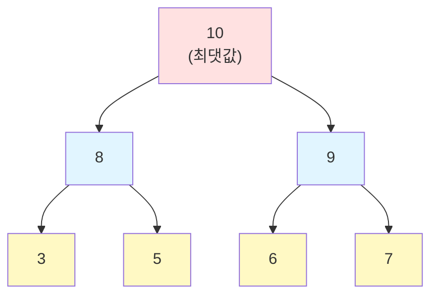
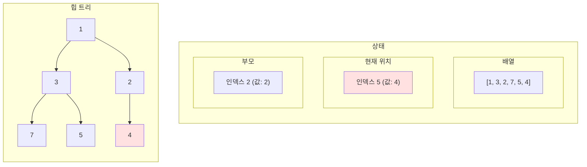
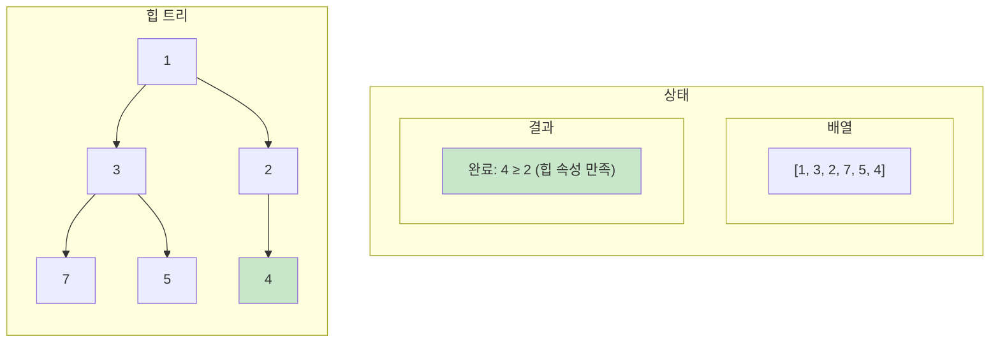
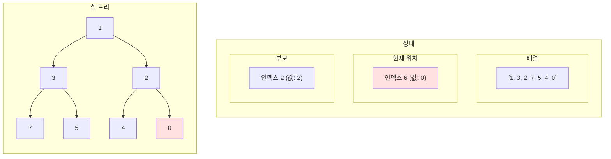
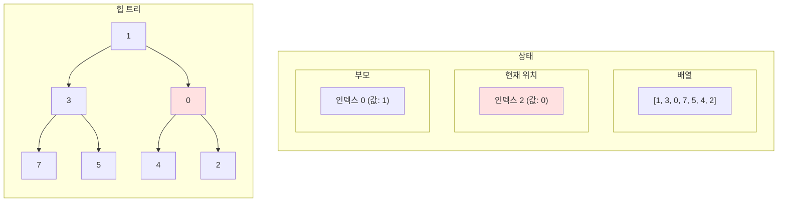
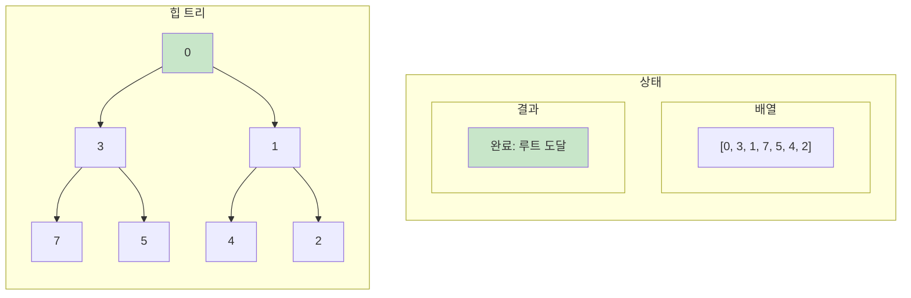
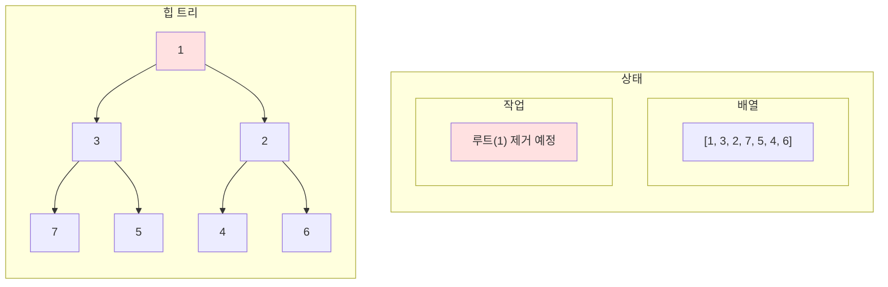
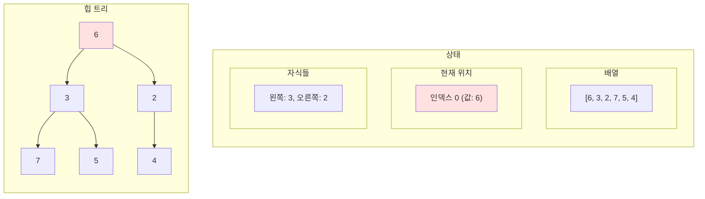
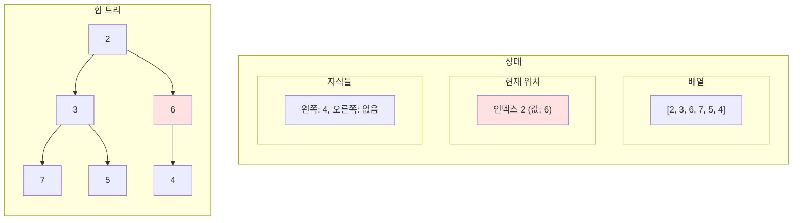
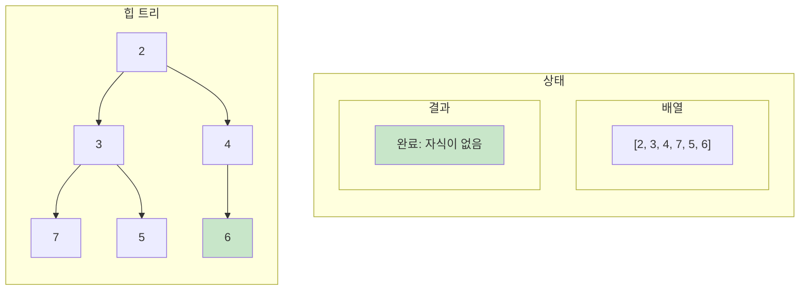

:::div{.callout}
힙 문제는 python으로 풀면 매우 간단하게 풀리지만, 다른 언어로 풀 때는 직접 구현해야 하는 경우가 많습니다. 따라서 해당 문제는 형평성 때문에 정렬문제로만 출제되는 경향이 강합니다. 연습문제는 별도로 없으니, 정렬 문제를 참고해주세요. 

* 다른 언어는 직접 구현해야 하지만 python에서는 `import heapq`로 쉽게 구현할 수 있습니다.
:::

# 1. 힙 (Heap)

힙은 **완전 이진 트리 기반의 자료구조**로, 부모 노드와 자식 노드 간에 특정한 순서 관계가 있습니다. 주로 **우선순위 큐**를 구현하는 데 사용됩니다.

## 1.1 힙의 특징

- **완전 이진 트리**: 마지막 레벨을 제외하고 모든 레벨이 채워져 있고, 마지막 레벨은 왼쪽부터 채워짐
- **힙 속성**: 부모 노드가 자식 노드보다 항상 크거나(최대 힙) 작음(최소 힙)
- **최댓값/최솟값 빠른 접근**: O(1) 시간에 최댓값 또는 최솟값 조회
- **효율적인 삽입/삭제**: O(log n) 시간에 삽입과 삭제

## 1.2 최소 힙 vs 최대 힙

### 1.2.1 최소 힙 (Min Heap)

부모 노드가 자식 노드보다 항상 작거나 같은 힙입니다.


**특징**: 루트 노드가 전체 힙에서 가장 작은 값

### 1.2.2 최대 힙 (Max Heap)

부모 노드가 자식 노드보다 항상 크거나 같은 힙입니다.



**특징**: 루트 노드가 전체 힙에서 가장 큰 값

## 1.3 힙의 배열 표현

힙은 완전 이진 트리이므로 배열로 효율적으로 표현할 수 있습니다.

```python
# 최소 힙: [1, 3, 2, 7, 5, 4, 6]
# 인덱스:   0  1  2  3  4  5  6

# 인덱스 i인 노드의:
# - 부모 인덱스: (i - 1) // 2
# - 왼쪽 자식 인덱스: 2 * i + 1
# - 오른쪽 자식 인덱스: 2 * i + 2

# 예시: 인덱스 1 (값: 3)
parent = (1 - 1) // 2        # 0 (값: 1)
left_child = 2 * 1 + 1       # 3 (값: 7)
right_child = 2 * 1 + 2      # 4 (값: 5)
```


**배열**: `[1, 3, 2, 7, 5, 4, 6]`

**트리**:
```
       1 (i=0)
      / \
     3   2 (i=1,2)
    / \ / \
   7  5 4  6 (i=3,4,5,6)
```

# 2. 힙의 연산

## 2.1 삽입 (Insert)

새로운 요소를 힙의 마지막에 추가한 후, 힙 속성을 만족할 때까지 위로 이동시킵니다.

```python
def heappush(heap, item):
    """최소 힙에 요소 삽입"""
    heap.append(item)  # 마지막에 추가
    _sift_up(heap, len(heap) - 1)  # 위로 이동

def _sift_up(heap, index):
    """힙 속성을 만족할 때까지 위로 이동"""
    parent = (index - 1) // 2

    # 부모가 있고, 부모보다 작으면 교환
    if index > 0 and heap[index] < heap[parent]:
        heap[index], heap[parent] = heap[parent], heap[index]
        _sift_up(heap, parent)  # 재귀적으로 위로 이동
```

**시간복잡도**: O(log n) - 트리의 높이만큼 이동

### 2.1.1 삽입 과정 시각화

배열 `[1, 3, 2, 7, 5]`에 `4`를 삽입하는 과정을 단계별로 살펴보겠습니다.

#### 초기 상태

마지막에 `4`를 추가합니다.



#### 1단계: 부모와 비교

현재 노드(4)가 부모 노드(2)보다 크므로 힙 속성을 만족합니다. 삽입 완료!



### 2.1.2 교환이 필요한 삽입 예제

배열 `[1, 3, 2, 7, 5, 4]`에 `0`을 삽입하는 과정입니다.

#### 초기 상태

마지막에 `0`을 추가합니다.



#### 1단계: 첫 번째 교환

0 < 2이므로 부모(2)와 교환합니다.



#### 2단계: 두 번째 교환

0 < 1이므로 부모(1)와 교환합니다.



## 2.2 삭제 (Delete)

루트 노드(최솟값 또는 최댓값)를 제거하고, 마지막 요소를 루트로 이동시킨 후 아래로 내립니다.

```python
def heappop(heap):
    """최소 힙에서 최솟값 제거하고 반환"""
    if not heap:
        raise IndexError("heap is empty")

    # 루트와 마지막 요소 교환
    heap[0], heap[-1] = heap[-1], heap[0]
    min_value = heap.pop()  # 마지막 요소(원래 루트) 제거

    # 새로운 루트를 아래로 내림
    if heap:
        _sift_down(heap, 0)

    return min_value

def _sift_down(heap, index):
    """힙 속성을 만족할 때까지 아래로 이동"""
    left = 2 * index + 1
    right = 2 * index + 2
    smallest = index

    # 왼쪽 자식이 더 작으면
    if left < len(heap) and heap[left] < heap[smallest]:
        smallest = left

    # 오른쪽 자식이 더 작으면
    if right < len(heap) and heap[right] < heap[smallest]:
        smallest = right

    # 자식 중 하나가 더 작으면 교환
    if smallest != index:
        heap[index], heap[smallest] = heap[smallest], heap[index]
        _sift_down(heap, smallest)  # 재귀적으로 아래로 이동
```

**시간복잡도**: O(log n) - 트리의 높이만큼 이동

### 2.2.1 삭제 과정 시각화

배열 `[1, 3, 2, 7, 5, 4, 6]`에서 최솟값(루트)을 삭제하는 과정을 단계별로 살펴보겠습니다.

#### 초기 상태

최솟값인 루트(1)를 제거합니다.



#### 1단계: 마지막 요소를 루트로 이동

마지막 요소(6)를 루트 자리로 옮기고, 원래 루트(1)를 제거합니다.



#### 2단계: 첫 번째 교환

자식 중 더 작은 값(2)과 교환합니다. (6 > 2이므로)



#### 3단계: 두 번째 교환

자식(4)과 교환합니다. (6 > 4이므로)



# 3. Python heapq 모듈

Python은 최소 힙을 구현한 `heapq` 모듈을 제공합니다.

## 3.1 기본 사용법

```python
import heapq

# 빈 힙 생성
heap = []

# 요소 추가 (최소 힙)
heapq.heappush(heap, 5)
heapq.heappush(heap, 3)
heapq.heappush(heap, 7)
heapq.heappush(heap, 1)
print(heap)  # [1, 3, 7, 5] (힙 구조)

# 최솟값 조회 (제거 X)
min_value = heap[0]
print(min_value)  # 1

# 최솟값 제거 및 반환
min_value = heapq.heappop(heap)
print(min_value)  # 1
print(heap)       # [3, 5, 7]

# 리스트를 힙으로 변환
numbers = [5, 3, 7, 1, 9, 2]
heapq.heapify(numbers)  # O(n) 시간
print(numbers)  # [1, 3, 2, 5, 9, 7] (힙 구조)
```

## 3.2 최대 힙 구현

Python의 heapq는 최소 힙만 제공하므로, 최대 힙은 값을 음수로 변환하여 구현합니다.

```python
import heapq

# 최대 힙
max_heap = []

# 요소 추가 (음수로 변환)
heapq.heappush(max_heap, -5)
heapq.heappush(max_heap, -3)
heapq.heappush(max_heap, -7)
heapq.heappush(max_heap, -1)
print(max_heap)  # [-7, -3, -5, -1]

# 최댓값 제거 및 반환 (음수를 다시 양수로)
max_value = -heapq.heappop(max_heap)
print(max_value)  # 7
```

## 3.3 유용한 heapq 함수들

```python
import heapq

# n개의 최솟값 찾기
numbers = [5, 3, 7, 1, 9, 2, 8, 4, 6]
smallest_3 = heapq.nsmallest(3, numbers)
print(smallest_3)  # [1, 2, 3]

# n개의 최댓값 찾기
largest_3 = heapq.nlargest(3, numbers)
print(largest_3)  # [9, 8, 7]

# 두 힙 병합
heap1 = [1, 3, 5]
heap2 = [2, 4, 6]
heapq.heapify(heap1)
heapq.heapify(heap2)

merged = []
while heap1 and heap2:
    if heap1[0] < heap2[0]:
        merged.append(heapq.heappop(heap1))
    else:
        merged.append(heapq.heappop(heap2))

merged.extend(heap1 or heap2)
print(merged)  # [1, 2, 3, 4, 5, 6]
```

# 4. 우선순위 큐 (Priority Queue)

우선순위 큐는 **각 요소가 우선순위를 가지며, 우선순위가 높은 요소가 먼저 나가는 자료구조**입니다. 힙으로 구현하면 효율적입니다.

## 4.1 우선순위 큐 구현

```python
import heapq

class PriorityQueue:
    def __init__(self):
        self.heap = []
        self.counter = 0  # 같은 우선순위일 때 삽입 순서 보장

    def push(self, item, priority):
        """우선순위와 함께 요소 추가 (낮은 값이 높은 우선순위)"""
        # (우선순위, 삽입순서, 값) 튜플로 저장
        heapq.heappush(self.heap, (priority, self.counter, item))
        self.counter += 1

    def pop(self):
        """가장 높은 우선순위 요소 제거 및 반환"""
        if not self.heap:
            raise IndexError("Priority queue is empty")
        priority, _, item = heapq.heappop(self.heap)
        return item

    def peek(self):
        """가장 높은 우선순위 요소 조회 (제거 X)"""
        if not self.heap:
            raise IndexError("Priority queue is empty")
        priority, _, item = self.heap[0]
        return item

    def is_empty(self):
        return len(self.heap) == 0

    def size(self):
        return len(self.heap)

# 사용 예제
pq = PriorityQueue()
pq.push("작업 A", priority=3)
pq.push("작업 B", priority=1)  # 가장 높은 우선순위
pq.push("작업 C", priority=2)

print(pq.pop())  # "작업 B" (우선순위 1)
print(pq.pop())  # "작업 C" (우선순위 2)
print(pq.pop())  # "작업 A" (우선순위 3)
```

# 5. 힙 사용 시나리오

## 5.1 힙이 적합한 경우

- **최댓값/최솟값을 자주 찾을 때**
  - K번째로 큰/작은 요소 찾기
  - 중간값 유지

- **우선순위 기반 처리**
  - 작업 스케줄링
  - 이벤트 관리

- **정렬이 필요하지만 전체 정렬은 비효율적일 때**
  - 상위 K개만 필요한 경우
  - 힙 정렬 (Heap Sort)

- **다익스트라 알고리즘**
  - 최단 경로 찾기

## 5.2 힙이 부적합한 경우

- **임의의 요소 검색**
  - O(n) 시간 소요, 해시 테이블이 더 적합

- **모든 요소 정렬 필요**
  - 일반 정렬 알고리즘 사용

- **FIFO/LIFO 순서 필요**
  - 큐/스택 사용

# 6. 힙의 시간복잡도

| 연산 | 시간복잡도 | 설명 |
|------|-----------|------|
| **최댓값/최솟값 조회** | O(1) | 루트 노드 접근 |
| **삽입 (heappush)** | O(log n) | 트리 높이만큼 이동 |
| **삭제 (heappop)** | O(log n) | 트리 높이만큼 이동 |
| **힙 생성 (heapify)** | O(n) | 상향식 힙 구성 |
| **K개 최댓값/최솟값** | O(n log k) | 크기 k인 힙 유지 |