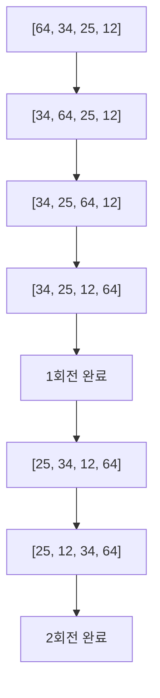
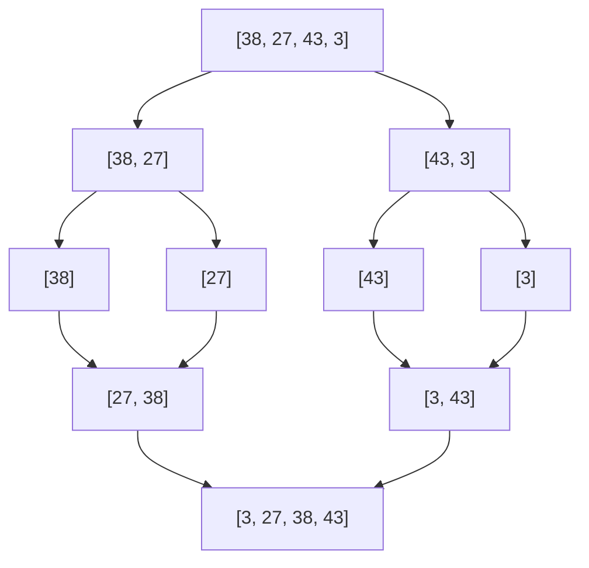

# 1. 정렬 알고리즘이란?

정렬(Sorting)은 데이터를 특정 순서로 배열하는 알고리즘입니다. 코딩 테스트에서 가장 기본이 되는 알고리즘이며, 많은 문제의 전처리 단계로 활용됩니다.

:::div{.callout}
**왜 정렬을 배워야 할까요?**

1. 데이터 탐색 효율 향상 (이진 탐색 가능)
2. 중복 제거, 순위 결정 등 다양한 활용
3. 시간 복잡도 분석의 기본 학습
:::

# 2. 기본 정렬 알고리즘

## 2.1 버블 정렬 (Bubble Sort)

인접한 두 원소를 비교하여 정렬하는 가장 단순한 알고리즘입니다.

```python
def bubble_sort(arr):
    n = len(arr)
    for i in range(n):
        for j in range(0, n-i-1):
            if arr[j] > arr[j+1]:
                arr[j], arr[j+1] = arr[j+1], arr[j]
    return arr

# 3. 사용 예시
data = [64, 34, 25, 12, 22, 11, 90]
print(bubble_sort(data))  # [11, 12, 22, 25, 34, 64, 90]
```

**시간 복잡도**: O(n²)
**공간 복잡도**: O(1)



## 3.1 선택 정렬 (Selection Sort)

매번 최솟값을 찾아 앞자리와 교환하는 방식입니다.

```python
def selection_sort(arr):
    n = len(arr)
    for i in range(n):
        min_idx = i
        for j in range(i+1, n):
            if arr[j] < arr[min_idx]:
                min_idx = j
        arr[i], arr[min_idx] = arr[min_idx], arr[i]
    return arr

# 4. 사용 예시
data = [64, 25, 12, 22, 11]
print(selection_sort(data))  # [11, 12, 22, 25, 64]
```

**시간 복잡도**: O(n²)
**공간 복잡도**: O(1)

## 4.1 삽입 정렬 (Insertion Sort)

이미 정렬된 부분에 새로운 원소를 적절한 위치에 삽입하는 방식입니다.

```python
def insertion_sort(arr):
    for i in range(1, len(arr)):
        key = arr[i]
        j = i - 1
        while j >= 0 and arr[j] > key:
            arr[j + 1] = arr[j]
            j -= 1
        arr[j + 1] = key
    return arr

# 5. 사용 예시
data = [12, 11, 13, 5, 6]
print(insertion_sort(data))  # [5, 6, 11, 12, 13]
```

**시간 복잡도**: 최선 O(n), 평균/최악 O(n²)
**공간 복잡도**: O(1)

:::div{.callout}
**삽입 정렬의 장점**

데이터가 거의 정렬되어 있을 때 매우 효율적입니다. 실제로 작은 데이터셋에서는 고급 정렬 알고리즘보다 빠를 수 있습니다.
:::

# 6. 고급 정렬 알고리즘

## 6.1 병합 정렬 (Merge Sort)

분할 정복(Divide and Conquer) 방식을 사용하는 효율적인 정렬 알고리즘입니다.

```python
def merge_sort(arr):
    if len(arr) <= 1:
        return arr

    # 분할
    mid = len(arr) // 2
    left = merge_sort(arr[:mid])
    right = merge_sort(arr[mid:])

    # 병합
    return merge(left, right)

def merge(left, right):
    result = []
    i = j = 0

    while i < len(left) and j < len(right):
        if left[i] <= right[j]:
            result.append(left[i])
            i += 1
        else:
            result.append(right[j])
            j += 1

    result.extend(left[i:])
    result.extend(right[j:])
    return result

# 7. 사용 예시
data = [38, 27, 43, 3, 9, 82, 10]
print(merge_sort(data))  # [3, 9, 10, 27, 38, 43, 82]
```

**시간 복잡도**: O(n log n)
**공간 복잡도**: O(n)



## 7.1 퀵 정렬 (Quick Sort)

피벗(pivot)을 기준으로 분할하여 정렬하는 방식입니다.

```python
def quick_sort(arr):
    if len(arr) <= 1:
        return arr

    pivot = arr[len(arr) // 2]
    left = [x for x in arr if x < pivot]
    middle = [x for x in arr if x == pivot]
    right = [x for x in arr if x > pivot]

    return quick_sort(left) + middle + quick_sort(right)

# 8. 사용 예시
data = [3, 6, 8, 10, 1, 2, 1]
print(quick_sort(data))  # [1, 1, 2, 3, 6, 8, 10]
```

**시간 복잡도**: 평균 O(n log n), 최악 O(n²)
**공간 복잡도**: O(log n)

:::div{.callout}
**퀵 정렬의 특징**

평균적으로 가장 빠른 정렬 알고리즘 중 하나이지만, 최악의 경우 O(n²)의 시간이 걸립니다. 피벗 선택이 중요합니다.
:::

# 9. Python 내장 정렬 함수

## 9.1 sorted() 함수

새로운 정렬된 리스트를 반환합니다.

```python
# 10. 기본 사용
numbers = [3, 1, 4, 1, 5, 9, 2, 6]
sorted_numbers = sorted(numbers)
print(sorted_numbers)  # [1, 1, 2, 3, 4, 5, 6, 9]
print(numbers)  # [3, 1, 4, 1, 5, 9, 2, 6] (원본 유지)

# 11. 역순 정렬
print(sorted(numbers, reverse=True))  # [9, 6, 5, 4, 3, 2, 1, 1]

# 12. key 매개변수 사용
words = ['apple', 'pie', 'a', 'cherry']
print(sorted(words, key=len))  # ['a', 'pie', 'apple', 'cherry']

# 13. 튜플 정렬
students = [('Alice', 85), ('Bob', 75), ('Charlie', 90)]
# 14. 점수 기준 정렬
print(sorted(students, key=lambda x: x[1]))
# 15. [('Bob', 75), ('Alice', 85), ('Charlie', 90)]
```

## 15.1 sort() 메서드

리스트를 제자리에서 정렬합니다 (in-place).

```python
numbers = [3, 1, 4, 1, 5, 9, 2, 6]
numbers.sort()
print(numbers)  # [1, 1, 2, 3, 4, 5, 6, 9] (원본 변경)

# 16. 역순 정렬
numbers.sort(reverse=True)
print(numbers)  # [9, 6, 5, 4, 3, 2, 1, 1]
```

## 16.1 실전 활용 예제

```python
# 17. 예제 1: 좌표 정렬
points = [(3, 4), (1, 2), (5, 1), (3, 2)]

# 18. x좌표 우선, y좌표 차순 정렬
points.sort(key=lambda x: (x[0], x[1]))
print(points)  # [(1, 2), (3, 2), (3, 4), (5, 1)]

# 19. 예제 2: 여러 조건으로 정렬
data = [
    {'name': 'Alice', 'age': 25, 'score': 85},
    {'name': 'Bob', 'age': 25, 'score': 90},
    {'name': 'Charlie', 'age': 23, 'score': 85}
]

# 20. 나이 우선, 점수 차순 정렬
data.sort(key=lambda x: (x['age'], -x['score']))
for item in data:
    print(f"{item['name']}: {item['age']}세, {item['score']}점")

# 21. 예제 3: 문자열 정렬
words = ['banana', 'Apple', 'cherry', 'Date']

# 22. 대소문자 구분 없이 정렬
print(sorted(words, key=str.lower))  # ['Apple', 'banana', 'cherry', 'Date']
```

# 23. 정렬 알고리즘 비교

```mermaid
graph LR
    A[정렬 알고리즘] --> B[O(n²)]
    A --> C[O(n log n)]
    B --> D[버블 정렬]
    B --> E[선택 정렬]
    B --> F[삽입 정렬]
    C --> G[병합 정렬]
    C --> H[퀵 정렬]
    C --> I[힙 정렬]
```

| 알고리즘 | 시간 복잡도 (평균) | 공간 복잡도 | 안정성 | 특징 |
|---------|------------------|-----------|--------|------|
| 버블 정렬 | O(n²) | O(1) | 안정 | 가장 단순 |
| 선택 정렬 | O(n²) | O(1) | 불안정 | 교환 횟수 적음 |
| 삽입 정렬 | O(n²) | O(1) | 안정 | 거의 정렬된 데이터에 효율적 |
| 병합 정렬 | O(n log n) | O(n) | 안정 | 안정적인 성능 |
| 퀵 정렬 | O(n log n) | O(log n) | 불안정 | 평균적으로 가장 빠름 |

:::div{.callout}
**안정 정렬(Stable Sort)이란?**

같은 값을 가진 원소들의 상대적 순서가 정렬 후에도 유지되는 정렬을 말합니다. 예를 들어, (3, A), (5, B), (3, C)를 정렬할 때 (3, A)가 (3, C)보다 앞에 있으면 정렬 후에도 이 순서가 유지됩니다.
:::

# 24. 실전 문제 예시

## 24.1 문제 1: 두 배열의 원소 교체

문제: 두 배열 A와 B가 있을 때, 최대 K번의 바꿔치기 연산으로 배열 A의 모든 원소 합이 최대가 되도록 하라.

```python
def solution(A, B, K):
    # A는 오름차순, B는 내림차순 정렬
    A.sort()
    B.sort(reverse=True)

    # K번 교환
    for i in range(K):
        # A의 최솟값이 B의 최댓값보다 작을 때만 교환
        if A[i] < B[i]:
            A[i], B[i] = B[i], A[i]
        else:
            break

    return sum(A)

# 25. 테스트
A = [1, 2, 5, 4, 3]
B = [5, 5, 6, 6, 5]
K = 3
print(solution(A, B, K))  # 26
```

## 25.1 문제 2: 성적이 낮은 순서로 학생 출력

```python
students = [
    ('홍길동', 95),
    ('이순신', 77),
    ('김유신', 85),
    ('강감찬', 77)
]

# 26. 점수 기준 오름차순, 같으면 이름 기준 오름차순
result = sorted(students, key=lambda x: (x[1], x[0]))

for name, score in result:
    print(name, end=' ')
# 27. 강감찬 이순신 김유신 홍길동
```

# 28. 코딩 테스트 팁

<highlight>정렬 관련 문제 해결 전략</highlight>

1. **정렬이 필요한지 먼저 판단**
   - 탐색, 중복 제거, 순위 결정 문제는 정렬로 해결 가능

2. **적절한 정렬 기준 설정**
   - 단일 조건: 기본 정렬 사용
   - 복수 조건: lambda나 튜플로 key 지정

3. **시간 복잡도 고려**
   - Python의 sorted()는 Timsort 사용 (O(n log n))
   - 직접 구현보다 내장 함수 활용 권장

4. **안정 정렬 필요성 파악**
   - 상대적 순서 유지가 중요하면 안정 정렬 사용

```python
# 29. 실수 예방 팁
# 30. 원본 보존이 필요하면 sorted() 사용
original = [3, 1, 2]
sorted_data = sorted(original)  # 원본 유지

# 31. 메모리 절약이 필요하면 sort() 사용
data = [3, 1, 2]
data.sort()  # 제자리 정렬

# 32. 역순 정렬 시 음수 활용
data = [(1, 100), (2, 90), (1, 80)]
# 33. 첫 번째는 오름차순, 두 번째는 내림차순
result = sorted(data, key=lambda x: (x[0], -x[1]))
```

# 34. 정리

- 기본 정렬: 버블, 선택, 삽입 (O(n²))
- 고급 정렬: 병합, 퀵 (O(n log n))
- Python 내장 함수: sorted(), sort() 적극 활용
- 정렬 기준: key 매개변수로 유연하게 설정
- 코딩 테스트에서는 대부분 내장 함수 사용 권장
