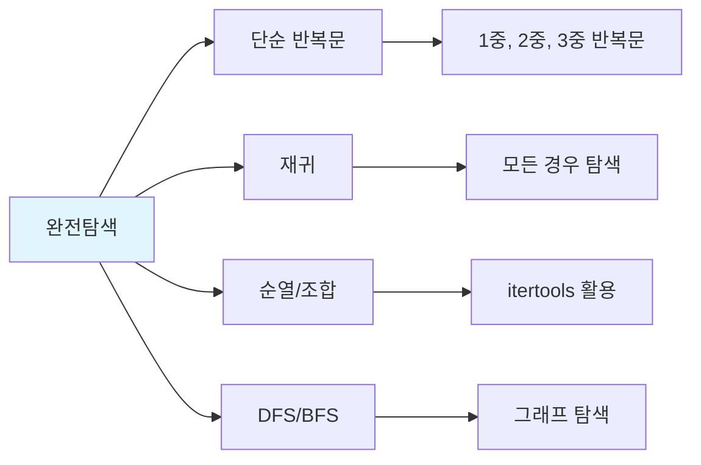

# 1. 완전탐색 (Brute Force)

완전탐색은 **가능한 모든 경우의 수를 탐색**하여 정답을 찾는 방법입니다. 가장 단순하지만 확실한 방법으로, 코딩테스트에서 가장 자주 사용됩니다.

## 1.1 완전탐색이 중요한 이유

코딩테스트에서 완전탐색이 중요한 이유는 다음과 같습니다.

- **출제 비중이 높음**: 구현/시뮬레이션(33%)의 상당 부분이 완전탐색
- **기본기 평가**: 문제를 정확히 이해하고 구현하는 능력 평가
- **복잡한 알고리즘 불필요**: 최적화보다 정확한 구현이 중요한 경우 많음
- **시간 제한 내 통과 가능**: 입력 크기가 작으면 O(n²), O(n³)도 충분

:::div{.callout}
**완전탐색 문제 판별법**

1. 입력 크기를 확인하세요
   - n ≤ 20: O(2^n) 가능 (지수 시간)
   - n ≤ 100: O(n³) 가능
   - n ≤ 1,000: O(n²) 가능
   - n ≤ 100,000: O(n log n) 또는 O(n) 필요

2. "모든", "가능한", "경우의 수" 같은 키워드 확인
:::

## 1.2 완전탐색의 유형



# 2. 단순 반복문

가장 기본적인 완전탐색으로, 반복문을 사용해 모든 경우를 확인합니다.

## 2.1 1중 반복문

```python
# 예제: 리스트에서 특정 값 찾기
def find_value(arr, target):
    for i in range(len(arr)):
        if arr[i] == target:
            return i
    return -1

# 예제: 최댓값 찾기
def find_max(arr):
    max_val = arr[0]
    for num in arr:
        if num > max_val:
            max_val = num
    return max_val

# 실행
numbers = [3, 1, 4, 1, 5, 9, 2, 6]
print(find_value(numbers, 5))  # 4
print(find_max(numbers))       # 9
```

## 2.2 2중 반복문

```python
# 예제: 두 수의 합이 target인 쌍 찾기
def two_sum(arr, target):
    n = len(arr)
    result = []
    for i in range(n):
        for j in range(i + 1, n):  # i 이후부터 탐색 (중복 방지)
            if arr[i] + arr[j] == target:
                result.append((arr[i], arr[j]))
    return result

# 실행
numbers = [2, 7, 11, 15, 3, 6]
print(two_sum(numbers, 9))  # [(2, 7), (3, 6)]
```

## 2.3 3중 반복문

```python
# 예제: 세 수의 합이 target인 조합 찾기
def three_sum(arr, target):
    n = len(arr)
    result = []
    for i in range(n):
        for j in range(i + 1, n):
            for k in range(j + 1, n):
                if arr[i] + arr[j] + arr[k] == target:
                    result.append((arr[i], arr[j], arr[k]))
    return result

# 실행
numbers = [1, 2, 3, 4, 5, 6]
print(three_sum(numbers, 10))  # [(1, 3, 6), (1, 4, 5), (2, 3, 5)]
```

# 3. 순열과 조합

순열과 조합은 코딩테스트에서 매우 자주 사용되는 완전탐색 기법입니다. Python의 `itertools` 모듈을 사용하면 쉽게 구현할 수 있습니다.

## 3.1 순열 (Permutation)

순열은 **순서가 중요한** 경우의 수입니다. n개 중 r개를 선택하여 나열하는 경우의 수는 nPr = n! / (n-r)! 입니다.

```python
from itertools import permutations

# 기본 사용법
arr = [1, 2, 3]

# 모든 순열 (3개 모두 선택)
for perm in permutations(arr):
    print(perm)
# (1, 2, 3), (1, 3, 2), (2, 1, 3), (2, 3, 1), (3, 1, 2), (3, 2, 1)

# 2개 선택 순열
for perm in permutations(arr, 2):
    print(perm)
# (1, 2), (1, 3), (2, 1), (2, 3), (3, 1), (3, 2)

# 리스트로 변환
all_perms = list(permutations(arr))
print(len(all_perms))  # 6 (3! = 6)
```

**순열 활용 예제: 숫자 카드로 만들 수 있는 가장 큰 수**

```python
from itertools import permutations

def largest_number(cards):
    """숫자 카드로 만들 수 있는 가장 큰 수"""
    max_num = 0

    for perm in permutations(cards):
        # 튜플을 문자열로 변환 후 정수로
        num = int(''.join(map(str, perm)))
        max_num = max(max_num, num)

    return max_num

cards = [3, 1, 4, 1, 5]
print(largest_number(cards))  # 54311
```

## 3.2 조합 (Combination)

조합은 **순서가 중요하지 않은** 경우의 수입니다. n개 중 r개를 선택하는 경우의 수는 nCr = n! / (r! × (n-r)!) 입니다.

```python
from itertools import combinations

# 기본 사용법
arr = [1, 2, 3, 4]

# 2개 선택 조합
for comb in combinations(arr, 2):
    print(comb)
# (1, 2), (1, 3), (1, 4), (2, 3), (2, 4), (3, 4)

# 3개 선택 조합
for comb in combinations(arr, 3):
    print(comb)
# (1, 2, 3), (1, 2, 4), (1, 3, 4), (2, 3, 4)

# 경우의 수 계산
from math import comb
print(comb(4, 2))  # 6 (4C2 = 6)
```

**조합 활용 예제: 팀 나누기**

```python
from itertools import combinations

def team_difference(abilities):
    """
    n명을 두 팀으로 나눌 때 능력치 차이의 최솟값
    (n은 짝수)
    """
    n = len(abilities)
    total = sum(abilities)
    min_diff = float('inf')

    # n/2명을 뽑는 모든 조합
    for team1 in combinations(range(n), n // 2):
        team1_sum = sum(abilities[i] for i in team1)
        team2_sum = total - team1_sum
        diff = abs(team1_sum - team2_sum)
        min_diff = min(min_diff, diff)

    return min_diff

abilities = [1, 2, 3, 4, 5, 6]
print(team_difference(abilities))  # 1 ([1,4,6] vs [2,3,5])
```

## 3.3 중복 순열과 중복 조합

```python
from itertools import product, combinations_with_replacement

# 중복 순열 (product)
# 같은 요소를 여러 번 선택 가능, 순서 O
arr = [1, 2, 3]
for prod in product(arr, repeat=2):
    print(prod)
# (1, 1), (1, 2), (1, 3), (2, 1), (2, 2), (2, 3), (3, 1), (3, 2), (3, 3)

# 중복 조합 (combinations_with_replacement)
# 같은 요소를 여러 번 선택 가능, 순서 X
for comb in combinations_with_replacement(arr, 2):
    print(comb)
# (1, 1), (1, 2), (1, 3), (2, 2), (2, 3), (3, 3)
```

## 3.4 순열/조합 비교 정리

| 구분 | 순서 | 중복 | 함수 | 경우의 수 |
|------|------|------|------|-----------|
| 순열 | O | X | `permutations(arr, r)` | nPr |
| 조합 | X | X | `combinations(arr, r)` | nCr |
| 중복 순열 | O | O | `product(arr, repeat=r)` | n^r |
| 중복 조합 | X | O | `combinations_with_replacement(arr, r)` | n+r-1Cr |

# 4. 재귀를 이용한 완전탐색

재귀는 자기 자신을 호출하는 함수로, 복잡한 완전탐색 문제를 직관적으로 해결할 수 있습니다.

## 4.1 부분집합 생성

```python
def generate_subsets(arr):
    """모든 부분집합 생성"""
    result = []
    n = len(arr)

    def backtrack(index, current):
        # 모든 요소를 고려했으면 결과에 추가
        if index == n:
            result.append(current[:])  # 복사본 추가
            return

        # 현재 요소를 포함하지 않는 경우
        backtrack(index + 1, current)

        # 현재 요소를 포함하는 경우
        current.append(arr[index])
        backtrack(index + 1, current)
        current.pop()  # 백트래킹

    backtrack(0, [])
    return result

arr = [1, 2, 3]
subsets = generate_subsets(arr)
print(subsets)
# [[], [3], [2], [2, 3], [1], [1, 3], [1, 2], [1, 2, 3]]
```

## 4.2 순열 직접 구현

```python
def generate_permutations(arr):
    """순열 직접 구현 (재귀)"""
    result = []
    n = len(arr)
    used = [False] * n

    def backtrack(current):
        if len(current) == n:
            result.append(current[:])
            return

        for i in range(n):
            if not used[i]:
                used[i] = True
                current.append(arr[i])
                backtrack(current)
                current.pop()
                used[i] = False

    backtrack([])
    return result

arr = [1, 2, 3]
perms = generate_permutations(arr)
print(perms)
# [[1, 2, 3], [1, 3, 2], [2, 1, 3], [2, 3, 1], [3, 1, 2], [3, 2, 1]]
```

## 4.3 N과 M 문제 (백준 스타일)

```python
def n_and_m(n, m):
    """1부터 n까지 숫자 중 m개를 고르는 모든 순열"""
    result = []
    used = [False] * (n + 1)

    def backtrack(current):
        if len(current) == m:
            result.append(current[:])
            return

        for i in range(1, n + 1):
            if not used[i]:
                used[i] = True
                current.append(i)
                backtrack(current)
                current.pop()
                used[i] = False

    backtrack([])
    return result

# 1~4 중에서 2개 선택 순열
for perm in n_and_m(4, 2):
    print(*perm)
```

# 5. 완전탐색 실전 문제

## 5.1 소수 찾기 (프로그래머스 스타일)

```python
from itertools import permutations

def count_primes(numbers):
    """
    숫자 문자열로 만들 수 있는 모든 소수의 개수
    예: "17" -> 7, 1, 17, 71 중 소수는 7, 17, 71 -> 3개
    """
    def is_prime(n):
        if n < 2:
            return False
        for i in range(2, int(n ** 0.5) + 1):
            if n % i == 0:
                return False
        return True

    # 모든 길이의 순열 생성
    candidates = set()
    for length in range(1, len(numbers) + 1):
        for perm in permutations(numbers, length):
            num = int(''.join(perm))
            candidates.add(num)

    # 소수 개수 세기
    count = 0
    for num in candidates:
        if is_prime(num):
            count += 1

    return count

print(count_primes("17"))   # 3
print(count_primes("011"))  # 2
```

## 5.2 모의고사 (프로그래머스 스타일)

```python
def mock_exam(answers):
    """
    수포자 3명의 찍는 패턴으로 가장 많이 맞힌 사람 찾기
    """
    # 수포자들의 찍기 패턴
    patterns = [
        [1, 2, 3, 4, 5],                    # 1번 수포자
        [2, 1, 2, 3, 2, 4, 2, 5],           # 2번 수포자
        [3, 3, 1, 1, 2, 2, 4, 4, 5, 5]      # 3번 수포자
    ]

    # 각 수포자의 점수 계산
    scores = [0, 0, 0]
    for i, answer in enumerate(answers):
        for j, pattern in enumerate(patterns):
            if answer == pattern[i % len(pattern)]:
                scores[j] += 1

    # 가장 높은 점수와 해당 수포자 찾기
    max_score = max(scores)
    result = [i + 1 for i, score in enumerate(scores) if score == max_score]

    return result

answers = [1, 2, 3, 4, 5]
print(mock_exam(answers))  # [1]

answers = [1, 3, 2, 4, 2]
print(mock_exam(answers))  # [1, 2, 3]
```

## 5.3 카펫 (프로그래머스 스타일)

```python
def carpet(brown, yellow):
    """
    갈색 격자와 노란색 격자 개수가 주어질 때
    카펫의 가로, 세로 크기 찾기
    """
    total = brown + yellow

    # 가로가 세로보다 크거나 같음
    # 세로는 최소 3 이상 (노란색이 있으려면)
    for height in range(3, int(total ** 0.5) + 1):
        if total % height == 0:
            width = total // height

            # 노란색 영역: (가로-2) * (세로-2)
            if (width - 2) * (height - 2) == yellow:
                return [width, height]

    return []

print(carpet(10, 2))   # [4, 3]
print(carpet(24, 24))  # [8, 6]
```

# 6. 완전탐색 팁

:::div{.callout}
**완전탐색 문제 풀이 전략**

1. **입력 크기 확인**: n ≤ 20이면 O(2^n), n ≤ 10이면 O(n!)도 가능
2. **itertools 적극 활용**: `permutations`, `combinations`, `product`
3. **중복 제거**: set을 활용하여 중복 결과 방지
4. **조기 종료**: 답을 찾으면 바로 return
5. **가지치기**: 불필요한 경우는 탐색하지 않음 (백트래킹)
:::

# 7. 연습문제

* (완전탐색) 2인자 선발: https://pyalgo.co.kr/?page=16
* (완전탐색) 알리는 포케가 좋아: https://pyalgo.co.kr/?page=10
* (완전탐색) 특정 숫자 조합 찾기: https://100.pyalgo.co.kr/?page=69
* (완전탐색) 특정 범위 조합 찾기: https://100.pyalgo.co.kr/?page=70
* (완전탐색) 부분 수열의 합: https://100.pyalgo.co.kr/?page=99
