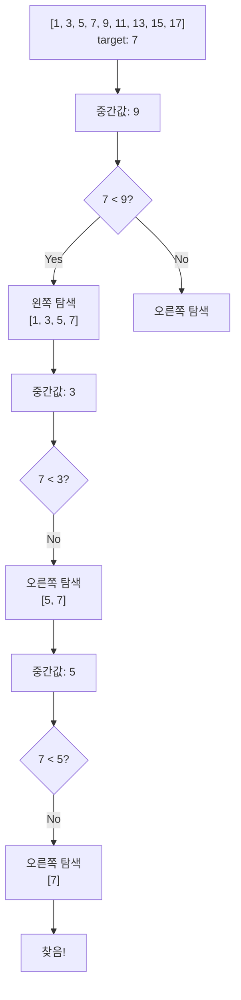
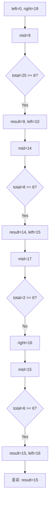

# 1. 탐색 알고리즘이란?

탐색(Search)은 많은 데이터 중에서 원하는 데이터를 찾는 과정입니다. 코딩 테스트에서 매우 자주 출제되는 주제이며, 효율적인 탐색 방법을 알면 문제 해결 시간을 크게 단축할 수 있습니다.

:::div{.callout}
**탐색 알고리즘의 중요성**

- 데이터베이스 검색, 파일 시스템 탐색 등 실생활 응용
- 시간 복잡도에 따라 성능이 크게 달라짐
- 다양한 알고리즘 문제의 기반이 되는 기술
:::

# 2. 선형 탐색 (Linear Search)

## 2.1 개념

배열의 처음부터 끝까지 순차적으로 찾는 가장 기본적인 탐색 방법입니다.

```python
def linear_search(arr, target):
    """선형 탐색: 배열에서 target을 찾아 인덱스 반환"""
    for i in range(len(arr)):
        if arr[i] == target:
            return i
    return -1  # 찾지 못한 경우

# 3. 사용 예시
data = [5, 7, 9, 0, 3, 1, 6, 2, 4, 8]
result = linear_search(data, 3)
print(f"3은 인덱스 {result}에 있습니다")  # 3은 인덱스 4에 있습니다
```

**시간 복잡도**: O(n)
**공간 복잡도**: O(1)

## 3.1 선형 탐색의 활용

```python
# 4. 예제 1: 조건을 만족하는 모든 원소 찾기
def find_all(arr, condition):
    """조건을 만족하는 모든 원소의 인덱스 반환"""
    result = []
    for i, value in enumerate(arr):
        if condition(value):
            result.append(i)
    return result

# 5. 사용 예시
data = [1, 2, 3, 4, 5, 6, 7, 8, 9, 10]
# 6. 짝수인 원소의 인덱스 찾기
even_indices = find_all(data, lambda x: x % 2 == 0)
print(even_indices)  # [1, 3, 5, 7, 9]

# 7. 예제 2: 최솟값 찾기
def find_min(arr):
    """배열에서 최솟값과 그 인덱스 반환"""
    if not arr:
        return None, -1

    min_value = arr[0]
    min_index = 0

    for i in range(1, len(arr)):
        if arr[i] < min_value:
            min_value = arr[i]
            min_index = i

    return min_value, min_index

data = [5, 2, 8, 1, 9]
value, index = find_min(data)
print(f"최솟값: {value}, 인덱스: {index}")  # 최솟값: 1, 인덱스: 3
```

# 8. 이진 탐색 (Binary Search)

## 8.1 개념

정렬된 배열에서 탐색 범위를 절반씩 줄여가며 찾는 효율적인 탐색 방법입니다.



## 8.2 반복문 구현

```python
def binary_search(arr, target):
    """이진 탐색: 정렬된 배열에서 target의 인덱스 반환"""
    left, right = 0, len(arr) - 1

    while left <= right:
        mid = (left + right) // 2

        if arr[mid] == target:
            return mid
        elif arr[mid] < target:
            left = mid + 1  # 오른쪽 절반 탐색
        else:
            right = mid - 1  # 왼쪽 절반 탐색

    return -1  # 찾지 못한 경우

# 9. 사용 예시
data = [1, 3, 5, 7, 9, 11, 13, 15, 17]
result = binary_search(data, 7)
print(f"7은 인덱스 {result}에 있습니다")  # 7은 인덱스 3에 있습니다
```

**시간 복잡도**: O(log n)
**공간 복잡도**: O(1)

## 9.1 재귀 구현

```python
def binary_search_recursive(arr, target, left, right):
    """재귀를 이용한 이진 탐색"""
    if left > right:
        return -1

    mid = (left + right) // 2

    if arr[mid] == target:
        return mid
    elif arr[mid] < target:
        return binary_search_recursive(arr, target, mid + 1, right)
    else:
        return binary_search_recursive(arr, target, left, mid - 1)

# 10. 사용 예시
data = [1, 3, 5, 7, 9, 11, 13, 15, 17]
result = binary_search_recursive(data, 11, 0, len(data) - 1)
print(f"11은 인덱스 {result}에 있습니다")  # 11은 인덱스 5에 있습니다
```

## 10.1 이진 탐색 변형

### 10.1.1 하한(Lower Bound) 찾기

target 이상의 값이 처음 나타나는 위치를 찾습니다.

```python
def lower_bound(arr, target):
    """target 이상의 값이 처음 나타나는 인덱스 반환"""
    left, right = 0, len(arr)

    while left < right:
        mid = (left + right) // 2
        if arr[mid] < target:
            left = mid + 1
        else:
            right = mid

    return left

# 11. 사용 예시
data = [1, 2, 2, 2, 3, 3, 4, 5]
print(lower_bound(data, 2))  # 1 (2가 처음 나타나는 인덱스)
print(lower_bound(data, 3))  # 4 (3이 처음 나타나는 인덱스)
```

### 11.0.1 상한(Upper Bound) 찾기

target 초과의 값이 처음 나타나는 위치를 찾습니다.

```python
def upper_bound(arr, target):
    """target 초과의 값이 처음 나타나는 인덱스 반환"""
    left, right = 0, len(arr)

    while left < right:
        mid = (left + right) // 2
        if arr[mid] <= target:
            left = mid + 1
        else:
            right = mid

    return left

# 12. 사용 예시
data = [1, 2, 2, 2, 3, 3, 4, 5]
print(upper_bound(data, 2))  # 4 (2 초과 값이 처음 나타나는 인덱스)
print(upper_bound(data, 3))  # 6 (3 초과 값이 처음 나타나는 인덱스)
```

# 13. Python bisect 모듈

Python의 bisect 모듈은 이진 탐색을 간편하게 수행할 수 있는 함수들을 제공합니다.

## 13.1 기본 함수

```python
import bisect

data = [1, 2, 4, 4, 8]

# 14. bisect_left: lower bound
print(bisect.bisect_left(data, 4))  # 2 (4가 처음 나타나는 위치)

# 15. bisect_right (bisect): upper bound
print(bisect.bisect_right(data, 4))  # 4 (4 초과 값이 처음 나타나는 위치)
print(bisect.bisect(data, 4))  # 4 (bisect_right와 동일)

# 16. insort_left: 정렬 상태 유지하며 삽입
bisect.insort_left(data, 3)
print(data)  # [1, 2, 3, 4, 4, 8]

# 17. insort_right: 정렬 상태 유지하며 삽입 (같은 값의 오른쪽에)
bisect.insort_right(data, 4)
print(data)  # [1, 2, 3, 4, 4, 4, 8]
```

## 17.1 실전 활용

### 17.1.1 예제 1: 특정 범위에 속하는 원소 개수 세기

```python
import bisect

def count_by_range(arr, left_value, right_value):
    """arr에서 [left_value, right_value] 범위의 원소 개수 반환"""
    left_index = bisect.bisect_left(arr, left_value)
    right_index = bisect.bisect_right(arr, right_value)
    return right_index - left_index

# 18. 사용 예시
data = [1, 2, 3, 3, 3, 3, 4, 4, 8, 9]
print(count_by_range(data, 3, 4))  # 6 (3과 4의 개수 합)
print(count_by_range(data, -1, 3))  # 7 (3 이하의 개수)
```

### 18.0.1 예제 2: 정렬된 점수에서 등수 찾기

```python
import bisect

def find_rank(scores, my_score):
    """정렬된 점수 목록에서 내 등수 찾기 (높은 점수가 좋음)"""
    # 내림차순으로 정렬된 경우
    # bisect는 오름차순 가정이므로 음수로 변환
    negative_scores = [-s for s in scores]
    rank = bisect.bisect_left(negative_scores, -my_score) + 1
    return rank

# 19. 사용 예시
scores = [95, 90, 85, 80, 75, 70]  # 내림차순 정렬
print(find_rank(scores, 88))  # 3등
print(find_rank(scores, 95))  # 1등
```

### 19.0.1 예제 3: 예산 배분 문제

```python
import bisect

def max_budget(budgets, total):
    """
    예산 배분: 모든 요청이 배정될 수 있는 최대 상한액 찾기
    budgets: 각 부서의 예산 요청 (오름차순 정렬 필요)
    total: 총 예산
    """
    budgets.sort()
    left, right = 0, budgets[-1]
    result = 0

    while left <= right:
        mid = (left + right) // 2
        # mid를 상한액으로 했을 때 총 배정액 계산
        current_total = sum(min(b, mid) for b in budgets)

        if current_total <= total:
            result = mid
            left = mid + 1
        else:
            right = mid - 1

    return result

# 20. 사용 예시
budgets = [120, 110, 140, 150]
total = 485
print(max_budget(budgets, total))  # 127
```

# 21. 매개변수 탐색 (Parametric Search)

이진 탐색을 응용하여 최적화 문제를 결정 문제로 바꾸어 해결하는 기법입니다.

## 21.1 개념

"X라는 조건을 만족하는 최댓값/최솟값은?"을 "X가 Y일 때 조건을 만족하는가?"로 바꾸어 이진 탐색을 수행합니다.

## 21.2 예제: 떡볶이 떡 자르기

```python
def cut_tteok(tteok, target):
    """
    떡의 높이를 자를 때, 원하는 길이를 얻을 수 있는 최대 절단기 높이
    tteok: 각 떡의 높이 리스트
    target: 가져가려는 떡의 길이
    """
    left, right = 0, max(tteok)
    result = 0

    while left <= right:
        mid = (left + right) // 2

        # mid 높이로 잘랐을 때 얻는 떡의 총 길이
        total = sum(t - mid for t in tteok if t > mid)

        if total >= target:
            result = mid  # 조건 만족: 더 높게 자를 수 있는지 확인
            left = mid + 1
        else:
            right = mid - 1  # 조건 불만족: 더 낮게 자르기

    return result

# 22. 사용 예시
tteok = [19, 15, 10, 17]
target = 6
print(cut_tteok(tteok, target))  # 15
# 23. 15로 자르면: (19-15) + (17-15) = 4 + 2 = 6
```



## 23.1 예제: 공유기 설치

```python
def install_routers(houses, c):
    """
    집에 공유기를 c개 설치할 때, 가장 인접한 두 공유기 사이의 최대 거리
    houses: 집의 좌표 리스트
    c: 공유기 개수
    """
    houses.sort()

    def can_install(distance):
        """distance 간격으로 c개 설치 가능한지 확인"""
        count = 1  # 첫 번째 집에 설치
        last_install = houses[0]

        for i in range(1, len(houses)):
            if houses[i] - last_install >= distance:
                count += 1
                last_install = houses[i]

        return count >= c

    left, right = 1, houses[-1] - houses[0]
    result = 0

    while left <= right:
        mid = (left + right) // 2

        if can_install(mid):
            result = mid
            left = mid + 1  # 더 큰 거리 시도
        else:
            right = mid - 1  # 더 작은 거리 시도

    return result

# 24. 사용 예시
houses = [1, 2, 8, 4, 9]
c = 3
print(install_routers(houses, c))  # 3
# 25. 위치 1, 4, 8 또는 1, 4, 9에 설치 (최소 거리 3)
```

# 26. 탐색 알고리즘 비교

| 알고리즘 | 시간 복잡도 | 공간 복잡도 | 전제 조건 | 사용 시기 |
|---------|-----------|-----------|----------|---------|
| 선형 탐색 | O(n) | O(1) | 없음 | 작은 데이터, 정렬 불필요 |
| 이진 탐색 | O(log n) | O(1) | 정렬된 배열 | 큰 데이터, 정렬 가능 |
| bisect | O(log n) | O(1) | 정렬된 배열 | Python에서 간편한 이진 탐색 |

# 27. 코딩 테스트 팁

<highlight>탐색 알고리즘 선택 가이드</highlight>

1. **데이터가 정렬되어 있는가?**
   - Yes → 이진 탐색 고려
   - No → 선형 탐색 또는 정렬 후 이진 탐색

2. **범위를 줄여가며 최적값을 찾는가?**
   - Yes → 매개변수 탐색 (Parametric Search)

3. **Python bisect 모듈 활용**
   - 직접 구현보다 bisect 사용 권장
   - lower_bound, upper_bound 개념 숙지

4. **이진 탐색 구현 주의사항**

```python
# 28. 주의 1: 무한 루프 방지
# 29. left <= right (올바름)
# 30. left < right (경우에 따라 요소 놓칠 수 있음)

# 31. 주의 2: mid 계산 오버플로우 방지
mid = left + (right - left) // 2  # 안전
# 32. mid = (left + right) // 2  큰 값에서 오버플로우 가능

# 33. 주의 3: 종료 조건 명확히
while left <= right:  # 찾는 값이 정확히 있을 때
while left < right:   # 범위를 좁혀가며 조건 만족하는 값 찾을 때
```

# 34. 실전 문제

## 34.1 문제 1: 정렬된 배열에서 특정 수의 개수 구하기

```python
import bisect

def count_occurrences(arr, target):
    """정렬된 배열에서 target의 개수 구하기"""
    left_idx = bisect.bisect_left(arr, target)
    right_idx = bisect.bisect_right(arr, target)
    return right_idx - left_idx

# 35. 테스트
arr = [1, 1, 2, 2, 2, 2, 3]
print(count_occurrences(arr, 2))  # 4
print(count_occurrences(arr, 4))  # 0
```

## 35.1 문제 2: 나무 자르기

```python
def cut_trees(trees, m):
    """
    나무를 잘라서 m미터의 나무를 가져가려 할 때,
    절단기에 설정할 수 있는 최대 높이
    """
    left, right = 0, max(trees)
    result = 0

    while left <= right:
        mid = (left + right) // 2
        total = sum(tree - mid for tree in trees if tree > mid)

        if total >= m:
            result = mid
            left = mid + 1
        else:
            right = mid - 1

    return result

# 36. 테스트
trees = [20, 15, 10, 17]
m = 7
print(cut_trees(trees, m))  # 15
```

# 37. 정리

- 선형 탐색: O(n), 단순하지만 느림
- 이진 탐색: O(log n), 정렬된 데이터에서 매우 효율적
- bisect 모듈: Python에서 이진 탐색 간편하게 수행
- 매개변수 탐색: 최적화 문제를 결정 문제로 변환
- 코딩 테스트에서 정렬과 탐색은 가장 기본적이면서도 중요한 기법
