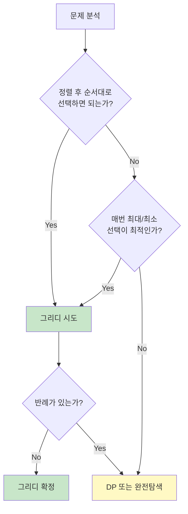

# 1. 그리디 알고리즘이란?

그리디(Greedy) 알고리즘은 **매 순간 최선의 선택**을 하는 알고리즘입니다. 현재 상황에서 가장 좋아 보이는 선택을 반복하여 최종 해답에 도달합니다.

## 1.1 그리디 알고리즘의 특징

- **지역 최적해(Local Optimum)**: 각 단계에서 최선의 선택
- **되돌아가지 않음**: 한 번 선택하면 번복하지 않음
- **빠른 속도**: 대부분 O(n) 또는 O(n log n)
- **최적해 보장 안 됨**: 항상 최적해를 보장하지는 않음

:::div{.callout}
**그리디 알고리즘이 최적해를 보장하는 경우**

그리디 알고리즘이 최적해를 보장하려면 두 가지 조건을 만족해야 합니다.

1. **그리디 선택 속성**: 각 단계의 최선 선택이 전체 최적해로 이어짐
2. **최적 부분 구조**: 부분 문제의 최적해가 전체 최적해에 포함됨

하지만 코딩테스트에서는 이 조건을 증명하기보다, **직관적으로 그리디가 맞는지 판단**하는 것이 중요합니다.
:::

## 1.2 그리디 vs 다른 알고리즘

| 특징 | 그리디 | 동적 프로그래밍 | 완전탐색 |
|------|--------|----------------|----------|
| 선택 방식 | 현재 최선 | 모든 부분 문제 고려 | 모든 경우 탐색 |
| 속도 | 빠름 | 보통 | 느림 |
| 최적해 보장 | 조건부 | 항상 | 항상 |
| 구현 난이도 | 쉬움 | 중간~어려움 | 쉬움 |

# 2. 그리디 알고리즘 기본 패턴

## 2.1 정렬 후 그리디

많은 그리디 문제는 **정렬** 후에 순서대로 선택하는 패턴을 따릅니다.

```python
# 패턴: 정렬 → 순서대로 선택
def greedy_with_sort(items):
    items.sort()  # 또는 key 기준으로 정렬
    result = 0

    for item in items:
        # 조건에 맞으면 선택
        if can_select(item):
            result += item  # 또는 다른 처리

    return result
```

## 2.2 가장 큰/작은 값 선택

현재 상황에서 가장 크거나 작은 값을 선택하는 패턴입니다.

```python
# 패턴: 매번 최대/최소 선택
def greedy_select_extreme(items):
    result = []

    while items:
        # 가장 큰 값 선택
        max_item = max(items)
        result.append(max_item)
        items.remove(max_item)

        # 또는 heapq 사용
        # import heapq
        # max_item = -heapq.heappop(items)

    return result
```

# 3. 그리디 대표 문제

## 3.1 거스름돈 문제

가장 대표적인 그리디 문제로, 가장 큰 단위부터 거슬러 줍니다.

```python
def min_coins(change):
    """
    거스름돈을 최소 동전 개수로 반환
    (동전: 500, 100, 50, 10원)
    """
    coins = [500, 100, 50, 10]
    count = 0

    for coin in coins:
        count += change // coin  # 해당 동전으로 거슬러 줄 수 있는 개수
        change %= coin           # 남은 금액

    return count

print(min_coins(1260))  # 6 (500*2 + 100*2 + 50*1 + 10*1)
print(min_coins(3780))  # 11
```

:::div{.callout}
**주의**: 동전의 단위가 서로 배수 관계가 아닌 경우 그리디가 최적해를 보장하지 않습니다.
예: 동전이 [1, 3, 4]이고 거스름돈이 6원인 경우
- 그리디: 4 + 1 + 1 = 3개
- 최적해: 3 + 3 = 2개
:::

## 3.2 체육복 문제 (프로그래머스)

```python
def solution(n, lost, reserve):
    """
    체육복을 빌려주어 수업을 들을 수 있는 최대 학생 수
    - 여벌이 있는 학생은 앞번호나 뒷번호에게만 빌려줄 수 있음
    - 여벌이 있어도 도난당하면 빌려줄 수 없음
    """
    # 여벌이 있지만 도난당한 학생 제외
    reserve_set = set(reserve) - set(lost)
    lost_set = set(lost) - set(reserve)

    # 앞 번호부터 빌려주기 (그리디)
    for r in sorted(reserve_set):
        # 앞 번호 먼저 확인 (작은 번호 우선)
        if r - 1 in lost_set:
            lost_set.remove(r - 1)
        elif r + 1 in lost_set:
            lost_set.remove(r + 1)

    # 전체 학생 - 못 빌린 학생
    return n - len(lost_set)

print(solution(5, [2, 4], [1, 3, 5]))  # 5
print(solution(5, [2, 4], [3]))        # 4
```

## 3.3 큰 수 만들기 (프로그래머스)

```python
def solution(number, k):
    """
    숫자에서 k개를 제거하여 가장 큰 수 만들기
    """
    stack = []
    remove_count = 0

    for digit in number:
        # 스택 top보다 현재 숫자가 크면 제거
        while stack and remove_count < k and stack[-1] < digit:
            stack.pop()
            remove_count += 1

        stack.append(digit)

    # 아직 제거할 개수가 남았으면 뒤에서 제거
    if remove_count < k:
        stack = stack[:-(k - remove_count)]

    return ''.join(stack)

print(solution("1924", 2))       # "94"
print(solution("1231234", 3))    # "3234"
print(solution("4177252841", 4)) # "775841"
```

## 3.4 조이스틱 문제 (프로그래머스)

```python
def solution(name):
    """
    조이스틱으로 이름 완성하기
    - 위: 다음 알파벳
    - 아래: 이전 알파벳
    - 왼쪽/오른쪽: 커서 이동
    """
    # 각 문자를 만들기 위한 최소 조작 횟수
    def char_cost(c):
        # A에서 시작, 위로 가거나 Z에서 아래로 가기
        return min(ord(c) - ord('A'), ord('Z') - ord(c) + 1)

    n = len(name)

    # 모든 문자 변경 비용
    total = sum(char_cost(c) for c in name)

    # 커서 이동 최소 비용 (기본: 오른쪽으로 쭉)
    min_move = n - 1

    for i in range(n):
        # i 위치에서 연속된 A의 끝 찾기
        next_i = i + 1
        while next_i < n and name[next_i] == 'A':
            next_i += 1

        # 왼쪽으로 갔다가 오른쪽으로, 또는 오른쪽으로 갔다가 왼쪽으로
        # 1. 오른쪽으로 i까지 갔다가 돌아와서 왼쪽 끝으로
        move1 = i + i + (n - next_i)
        # 2. 왼쪽으로 (n - next_i)만큼 갔다가 돌아와서 오른쪽으로
        move2 = (n - next_i) * 2 + i

        min_move = min(min_move, move1, move2)

    return total + min_move

print(solution("JEROEN"))  # 56
print(solution("JAN"))     # 23
```

## 3.5 구명보트 (프로그래머스)

```python
def solution(people, limit):
    """
    구명보트에 최대 2명씩 태울 때 필요한 최소 보트 수
    """
    people.sort()  # 몸무게 순 정렬

    count = 0
    left, right = 0, len(people) - 1

    while left <= right:
        # 가장 무거운 사람은 무조건 태움
        # 가장 가벼운 사람과 함께 탈 수 있는지 확인
        if people[left] + people[right] <= limit:
            left += 1  # 가벼운 사람도 태움

        right -= 1  # 무거운 사람 태움
        count += 1

    return count

print(solution([70, 50, 80, 50], 100))  # 3
print(solution([70, 80, 50], 100))      # 3
```

## 3.6 회의실 배정 문제 (백준 스타일)

```python
def meeting_room(meetings):
    """
    회의실에서 최대 몇 개의 회의를 할 수 있는지
    meetings: [(시작시간, 종료시간), ...]
    """
    # 종료 시간 기준 정렬 (핵심!)
    meetings.sort(key=lambda x: (x[1], x[0]))

    count = 0
    end_time = 0

    for start, end in meetings:
        # 이전 회의가 끝난 후에 시작하는 회의만 선택
        if start >= end_time:
            count += 1
            end_time = end

    return count

meetings = [(1, 4), (3, 5), (0, 6), (5, 7), (3, 8), (5, 9), (6, 10), (8, 11), (8, 12), (2, 13), (12, 14)]
print(meeting_room(meetings))  # 4
```

# 4. 그리디 문제 접근법

## 4.1 그리디 문제 판별



## 4.2 그리디 체크리스트

1. **정렬 기준 찾기**: 어떤 기준으로 정렬해야 하는가?
2. **선택 기준 찾기**: 매번 무엇을 기준으로 선택하는가?
3. **반례 확인**: 그리디가 최적해를 보장하는가?
4. **구현**: 정렬 후 순차 처리

:::div{.callout}
**그리디 문제 키워드**

- "최소 개수", "최대 개수"
- "가장 큰", "가장 작은"
- "최소 비용", "최대 이익"
- "가능한 많이", "가능한 적게"

이런 키워드가 있으면 그리디를 먼저 시도해보세요!
:::

# 5. 흔한 그리디 패턴

## 5.1 가장 작은 것 먼저

```python
# 예: 최소 동전 개수
# 예: 최소 회의 시간으로 최대 회의 수

items.sort()  # 오름차순
for item in items:
    if can_select(item):
        select(item)
```

## 5.2 가장 큰 것 먼저

```python
# 예: 가장 큰 수 만들기
# 예: 최대 이익

items.sort(reverse=True)  # 내림차순
for item in items:
    if can_select(item):
        select(item)
```

## 5.3 종료 시간 기준 정렬

```python
# 예: 회의실 배정
# 예: 작업 스케줄링

intervals.sort(key=lambda x: x[1])  # 종료 시간 기준
for start, end in intervals:
    if start >= last_end:
        select()
        last_end = end
```

## 5.4 양 끝에서 접근

```python
# 예: 구명보트
# 예: 두 수의 합

items.sort()
left, right = 0, len(items) - 1
while left <= right:
    # 양 끝의 값을 활용
    process(items[left], items[right])
```

# 6. 연습문제

* (그리디) 비행정 탑승: https://pyalgo.co.kr/?page=13
* (그리디) 리치: https://pyalgo.co.kr/?page=19
* (그리디) 빙키: https://pyalgo.co.kr/?page=20
* (그리디) 최소 동전: https://100.pyalgo.co.kr/?page=51
* (그리디) 잔돈: https://100.pyalgo.co.kr/?page=52
