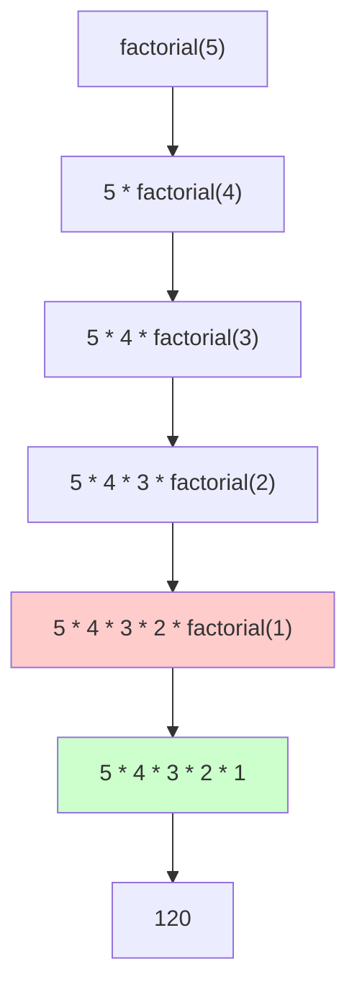
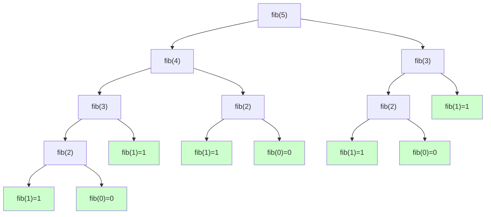
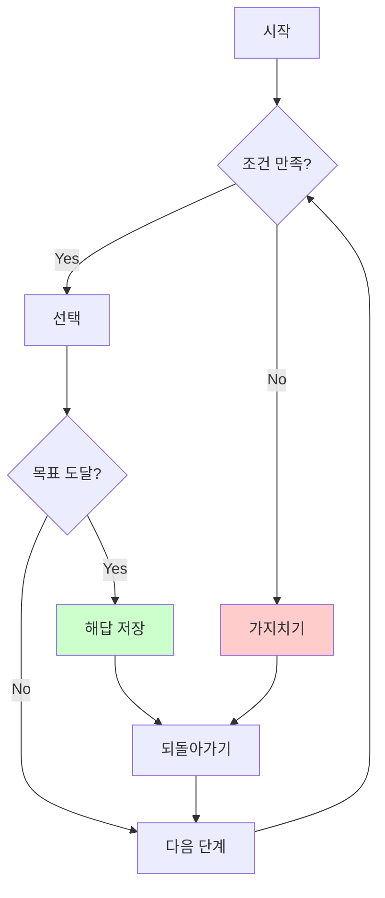
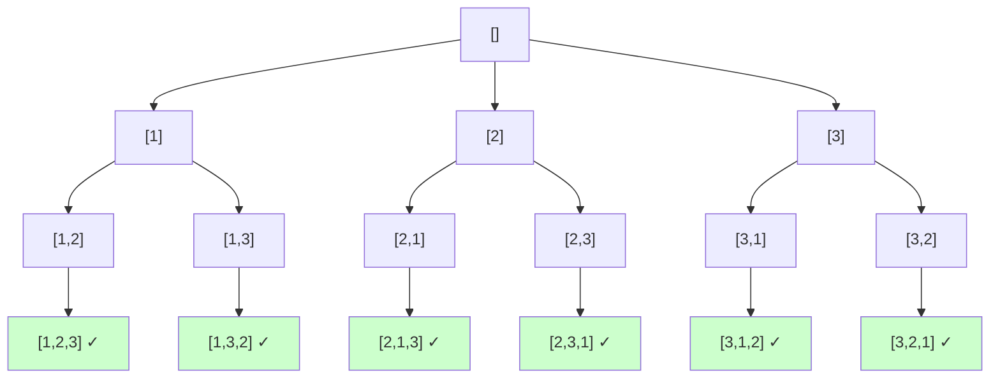

# 1. 재귀 함수란?

재귀(Recursion)는 함수가 자기 자신을 호출하는 프로그래밍 기법입니다. 복잡한 문제를 작은 부분 문제로 나누어 해결할 때 유용합니다.

:::div{.callout}
**재귀의 핵심 개념**

1. **Base Case (기저 조건)**: 재귀를 멈추는 조건
2. **Recursive Case (재귀 조건)**: 자기 자신을 호출하는 부분
3. **문제를 작게 만들기**: 매 호출마다 문제 크기가 감소해야 함
:::

# 2. 재귀 함수 기본

## 2.1 팩토리얼

가장 기본적인 재귀 함수 예제입니다.

```python
def factorial(n):
    # Base Case: 재귀 종료 조건
    if n <= 1:
        return 1

    # Recursive Case: 자기 자신을 호출
    return n * factorial(n - 1)

# 3. 사용 예시
print(factorial(5))  # 120 (5 * 4 * 3 * 2 * 1)
```



## 3.1 피보나치 수열

```python
def fibonacci(n):
    """n번째 피보나치 수 반환"""
    # Base Case
    if n <= 1:
        return n

    # Recursive Case
    return fibonacci(n - 1) + fibonacci(n - 2)

# 4. 사용 예시
print(fibonacci(6))  # 8 (0, 1, 1, 2, 3, 5, 8)
```

:::div{.callout}
**주의: 단순 재귀의 문제점**

위의 피보나치 구현은 O(2^n)의 시간 복잡도를 가집니다. 같은 값을 중복 계산하기 때문입니다. 이는 나중에 배울 동적 프로그래밍으로 해결할 수 있습니다.
:::

## 4.1 재귀 호출 트리



## 4.2 유클리드 호제법 (GCD)

최대공약수를 재귀로 구하는 알고리즘입니다.

```python
def gcd(a, b):
    """유클리드 호제법으로 최대공약수 구하기"""
    # Base Case
    if b == 0:
        return a

    # Recursive Case
    return gcd(b, a % b)

# 5. 사용 예시
print(gcd(48, 18))  # 6
print(gcd(100, 35))  # 5
```

# 6. 재귀 vs 반복문

## 6.1 비교

```python
# 7. 재귀 버전
def sum_recursive(n):
    if n <= 0:
        return 0
    return n + sum_recursive(n - 1)

# 8. 반복문 버전
def sum_iterative(n):
    result = 0
    for i in range(1, n + 1):
        result += i
    return result

print(sum_recursive(100))  # 5050
print(sum_iterative(100))  # 5050
```

| 비교 항목 | 재귀 | 반복문 |
|---------|------|--------|
| 가독성 | 높음 (문제를 자연스럽게 표현) | 보통 |
| 성능 | 함수 호출 오버헤드 있음 | 빠름 |
| 메모리 | 호출 스택 사용 (스택 오버플로우 위험) | 적음 |
| 적용 | 트리, 그래프, 분할정복 | 단순 반복 |

## 8.1 재귀 깊이 제한

Python에서는 재귀 깊이에 제한이 있습니다.

```python
import sys

# 9. 기본 재귀 깊이 확인
print(sys.getrecursionlimit())  # 기본값: 1000

# 10. 재귀 깊이 설정 (필요시)
sys.setrecursionlimit(10000)
```

# 11. 백트래킹 (Backtracking)

백트래킹은 모든 경우의 수를 탐색하되, 조건을 만족하지 않으면 즉시 중단(가지치기)하여 효율성을 높이는 기법입니다.

## 11.1 개념



## 11.2 N-Queen 문제

N×N 체스판에 N개의 퀸을 서로 공격할 수 없게 배치하는 문제입니다.

```python
def n_queens(n):
    """N-Queen 문제 해결"""
    def is_safe(board, row, col):
        """(row, col) 위치에 퀸을 놓을 수 있는지 확인"""
        # 같은 열 확인
        for i in range(row):
            if board[i] == col:
                return False

        # 왼쪽 대각선 확인
        for i in range(row):
            if abs(board[i] - col) == abs(i - row):
                return False

        return True

    def solve(board, row):
        """row번째 행에 퀸 배치"""
        # Base Case: 모든 행에 퀸을 배치했으면 해답 추가
        if row == n:
            result.append(board[:])
            return

        # 각 열에 대해 시도
        for col in range(n):
            if is_safe(board, row, col):
                board[row] = col  # 퀸 배치
                solve(board, row + 1)  # 다음 행으로
                # 백트래킹: 자동으로 되돌아감 (board[row]는 다음 col 시도)

    result = []
    solve([-1] * n, 0)
    return result

# 12. 4-Queen 해답 찾기
solutions = n_queens(4)
print(f"4-Queen 해답 개수: {len(solutions)}")

# 13. 첫 번째 해답 출력
for i, col in enumerate(solutions[0]):
    row = ['.' for _ in range(4)]
    row[col] = 'Q'
    print(' '.join(row))
# 14. . Q . .
# 15. . . . Q
# 16. Q . . .
# 17. . . Q .
```

## 17.1 순열 생성

모든 순열을 생성하는 백트래킹 예제입니다.

```python
def permutations(arr):
    """배열의 모든 순열 생성"""
    result = []

    def backtrack(path, remaining):
        # Base Case: 남은 원소가 없으면 순열 완성
        if not remaining:
            result.append(path[:])
            return

        # 각 원소를 선택
        for i in range(len(remaining)):
            # 선택
            path.append(remaining[i])
            # 재귀 호출 (선택한 원소 제외)
            backtrack(path, remaining[:i] + remaining[i+1:])
            # 백트래킹
            path.pop()

    backtrack([], arr)
    return result

# 18. 사용 예시
arr = [1, 2, 3]
result = permutations(arr)
print(f"순열 개수: {len(result)}")  # 6
for perm in result:
    print(perm)
# 19. [1, 2, 3]
# 20. [1, 3, 2]
# 21. [2, 1, 3]
# 22. [2, 3, 1]
# 23. [3, 1, 2]
# 24. [3, 2, 1]
```



## 24.1 조합 생성

n개 중 r개를 선택하는 조합을 생성합니다.

```python
def combinations(arr, r):
    """arr에서 r개를 선택하는 모든 조합"""
    result = []

    def backtrack(start, path):
        # Base Case: r개를 선택했으면 조합 완성
        if len(path) == r:
            result.append(path[:])
            return

        # start부터 끝까지 선택 시도
        for i in range(start, len(arr)):
            # 선택
            path.append(arr[i])
            # 재귀 호출 (다음 인덱스부터)
            backtrack(i + 1, path)
            # 백트래킹
            path.pop()

    backtrack(0, [])
    return result

# 25. 사용 예시
arr = [1, 2, 3, 4]
result = combinations(arr, 2)
print(f"조합 개수: {len(result)}")  # 6
for comb in result:
    print(comb)
# 26. [1, 2]
# 27. [1, 3]
# 28. [1, 4]
# 29. [2, 3]
# 30. [2, 4]
# 31. [3, 4]
```

## 31.1 부분집합 생성

모든 부분집합을 생성합니다.

```python
def subsets(arr):
    """배열의 모든 부분집합 생성"""
    result = []

    def backtrack(start, path):
        # 현재 경로를 결과에 추가
        result.append(path[:])

        # 각 원소를 선택/미선택
        for i in range(start, len(arr)):
            path.append(arr[i])
            backtrack(i + 1, path)
            path.pop()

    backtrack(0, [])
    return result

# 32. 사용 예시
arr = [1, 2, 3]
result = subsets(arr)
print(f"부분집합 개수: {len(result)}")  # 8
for subset in result:
    print(subset)
# 33. []
# 34. [1]
# 35. [1, 2]
# 36. [1, 2, 3]
# 37. [1, 3]
# 38. [2]
# 39. [2, 3]
# 40. [3]
```

# 41. Python itertools 활용

Python의 itertools 모듈로 순열과 조합을 간단히 생성할 수 있습니다.

```python
from itertools import permutations, combinations, product, combinations_with_replacement

arr = [1, 2, 3]

# 42. 순열 (nPr)
print("순열:", list(permutations(arr, 2)))
# 43. [(1, 2), (1, 3), (2, 1), (2, 3), (3, 1), (3, 2)]

# 44. 조합 (nCr)
print("조합:", list(combinations(arr, 2)))
# 45. [(1, 2), (1, 3), (2, 3)]

# 46. 중복 순열
print("중복 순열:", list(product(arr, repeat=2)))
# 47. [(1, 1), (1, 2), (1, 3), (2, 1), (2, 2), (2, 3), (3, 1), (3, 2), (3, 3)]

# 48. 중복 조합
print("중복 조합:", list(combinations_with_replacement(arr, 2)))
# 49. [(1, 1), (1, 2), (1, 3), (2, 2), (2, 3), (3, 3)]
```

# 50. 실전 문제

## 50.1 문제 1: 타겟 넘버

주어진 숫자를 더하거나 빼서 타겟 넘버를 만드는 경우의 수를 구하세요.

```python
def target_number(numbers, target):
    """numbers의 원소를 +/- 하여 target을 만드는 경우의 수"""
    count = 0

    def dfs(index, current_sum):
        nonlocal count

        # Base Case: 모든 숫자를 사용했을 때
        if index == len(numbers):
            if current_sum == target:
                count += 1
            return

        # + 선택
        dfs(index + 1, current_sum + numbers[index])
        # - 선택
        dfs(index + 1, current_sum - numbers[index])

    dfs(0, 0)
    return count

# 51. 테스트
numbers = [1, 1, 1, 1, 1]
target = 3
print(target_number(numbers, target))  # 5
# 52. +1+1+1+1+1 = 5
# 53. +1+1+1+1-1 = 3 ✓
# 54. +1+1+1-1+1 = 3 ✓
# 55. +1+1-1+1+1 = 3 ✓
# 56. +1-1+1+1+1 = 3 ✓
# 57. -1+1+1+1+1 = 3 ✓
```

## 57.1 문제 2: 스도쿠 풀이

9×9 스도쿠를 백트래킹으로 풀이합니다.

```python
def solve_sudoku(board):
    """스도쿠 풀이"""
    def is_valid(row, col, num):
        """(row, col)에 num을 놓을 수 있는지 확인"""
        # 행 확인
        if num in board[row]:
            return False

        # 열 확인
        if num in [board[i][col] for i in range(9)]:
            return False

        # 3×3 박스 확인
        box_row, box_col = 3 * (row // 3), 3 * (col // 3)
        for i in range(box_row, box_row + 3):
            for j in range(box_col, box_col + 3):
                if board[i][j] == num:
                    return False

        return True

    def solve():
        """빈 칸을 찾아 숫자 채우기"""
        for i in range(9):
            for j in range(9):
                if board[i][j] == 0:
                    for num in range(1, 10):
                        if is_valid(i, j, num):
                            board[i][j] = num  # 선택

                            if solve():  # 재귀
                                return True

                            board[i][j] = 0  # 백트래킹

                    return False  # 1~9 모두 불가능
        return True  # 모든 칸을 채움

    solve()
    return board

# 58. 테스트 (0은 빈 칸)
board = [
    [5,3,0,0,7,0,0,0,0],
    [6,0,0,1,9,5,0,0,0],
    [0,9,8,0,0,0,0,6,0],
    [8,0,0,0,6,0,0,0,3],
    [4,0,0,8,0,3,0,0,1],
    [7,0,0,0,2,0,0,0,6],
    [0,6,0,0,0,0,2,8,0],
    [0,0,0,4,1,9,0,0,5],
    [0,0,0,0,8,0,0,7,9]
]

result = solve_sudoku([row[:] for row in board])
for row in result:
    print(row)
```

# 59. 백트래킹 최적화

## 59.1 가지치기 (Pruning)

조건을 만족하지 않는 경로를 조기에 차단합니다.

```python
def combination_sum(candidates, target):
    """숫자를 중복 사용하여 target을 만드는 조합 찾기"""
    result = []

    def backtrack(start, path, current_sum):
        # 목표 달성
        if current_sum == target:
            result.append(path[:])
            return

        # 가지치기: target 초과하면 중단
        if current_sum > target:
            return

        for i in range(start, len(candidates)):
            path.append(candidates[i])
            # 같은 숫자 재사용 가능하므로 i부터 시작
            backtrack(i, path, current_sum + candidates[i])
            path.pop()

    candidates.sort()  # 정렬로 가지치기 효과 증대
    backtrack(0, [], 0)
    return result

# 60. 테스트
candidates = [2, 3, 6, 7]
target = 7
print(combination_sum(candidates, target))
# 61. [[2, 2, 3], [7]]
```

# 62. 코딩 테스트 팁

<highlight>재귀와 백트래킹 활용 전략</highlight>

1. **재귀 사용 시기**
   - 문제를 부분 문제로 나눌 수 있을 때
   - 트리, 그래프 탐색
   - 분할 정복 (Divide and Conquer)

2. **백트래킹 사용 시기**
   - 모든 경우의 수 탐색 (완전 탐색)
   - 순열, 조합, 부분집합
   - 제약 조건이 있는 최적화 문제

3. **성능 개선 방법**
   - 가지치기로 불필요한 탐색 제거
   - 메모이제이션으로 중복 계산 방지
   - itertools 활용 (순열/조합)

4. **주의사항**

```python
# 63. 주의 1: Base Case 명확히
def factorial(n):
    if n <= 1:  # Base Case 필수!
        return 1
    return n * factorial(n - 1)

# 64. 주의 2: 재귀 깊이 제한
import sys
sys.setrecursionlimit(10000)

# 65. 주의 3: 리스트 복사
def backtrack(path):
    result.append(path[:])  # 복사 필수!
    # result.append(path)  # 잘못됨 (참조만 추가)
```

# 66. 정리

- 재귀: 자기 자신을 호출하는 함수 (Base Case 필수)
- 백트래킹: 조건 불만족 시 되돌아가는 탐색 기법
- N-Queen, 순열, 조합 등 다양한 문제에 적용
- Python itertools로 순열/조합 간편하게 생성
- 가지치기와 메모이제이션으로 성능 최적화
