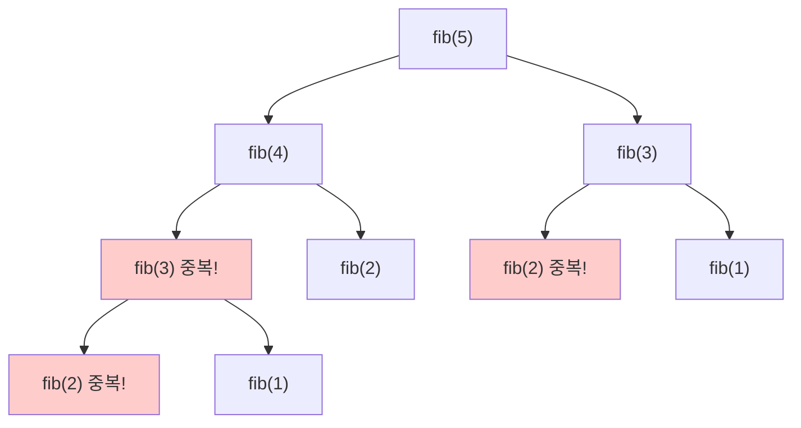
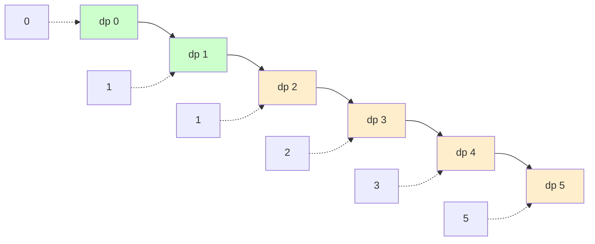
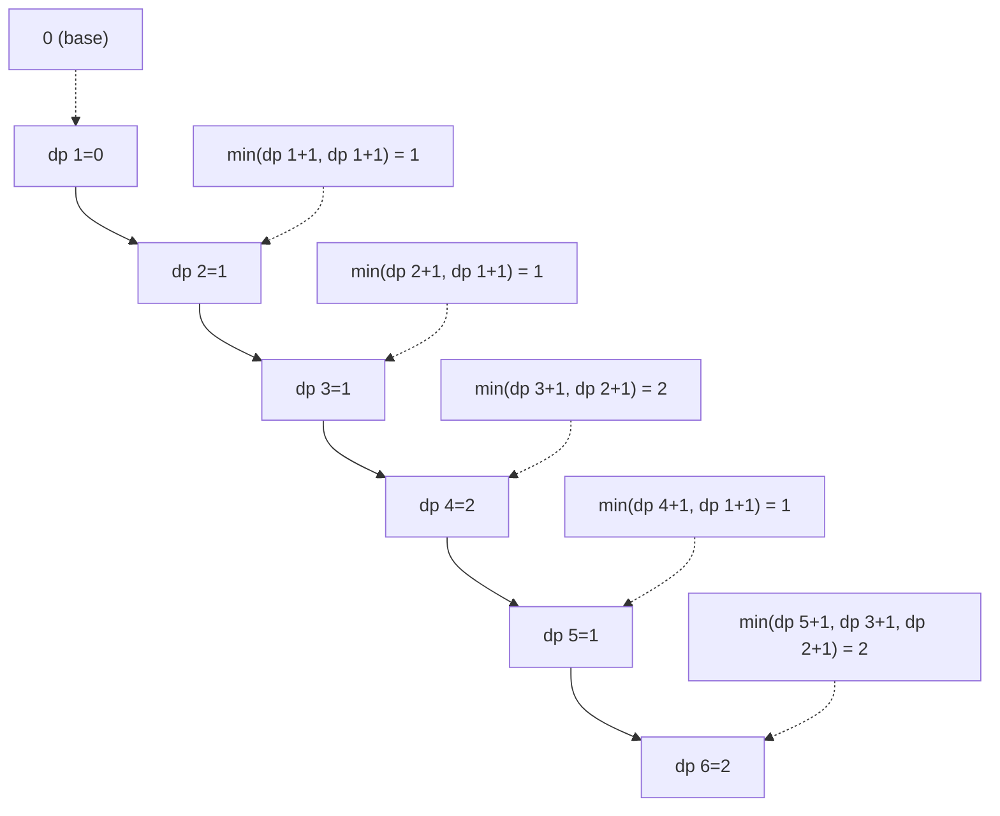
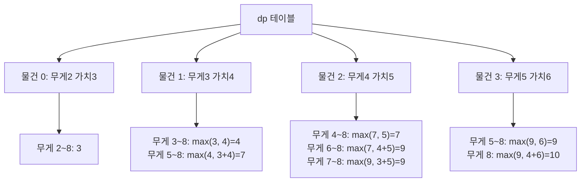

# 1. 동적 프로그래밍이란?

동적 프로그래밍(Dynamic Programming, DP)은 큰 문제를 작은 부분 문제로 나누어 해결하고, 그 결과를 저장하여 재사용함으로써 효율성을 높이는 알고리즘 기법입니다.

:::div{.callout}
**DP의 조건**

1. **최적 부분 구조(Optimal Substructure)**: 큰 문제의 최적 해가 작은 문제의 최적 해로 구성
2. **중복되는 부분 문제(Overlapping Subproblems)**: 같은 부분 문제가 여러 번 계산됨

이 두 조건을 만족하면 DP를 적용할 수 있습니다!
:::

# 2. DP의 필요성

## 2.1 피보나치 수열로 보는 DP

```python
# 3. 단순 재귀 (비효율적)
def fib_recursive(n):
    if n <= 1:
        return n
    return fib_recursive(n-1) + fib_recursive(n-2)

# 4. fib(5) 호출 시 중복 계산
# 5. fib(5)
# 6. ├── fib(4)
# 7. │   ├── fib(3)  ← 중복
# 8. │   │   ├── fib(2)  ← 중복
# 9. │   │   └── fib(1)
# 10. │   └── fib(2)  ← 중복
# 11. └── fib(3)  ← 중복
# 12. ├── fib(2)  ← 중복
# 13. └── fib(1)

print(fib_recursive(10))  # 55 (177번 함수 호출!)
```

**시간 복잡도**: O(2^n) - 매우 비효율적



# 14. 메모이제이션 (Memoization)

Top-down 방식: 재귀를 사용하되, 계산 결과를 저장하여 재사용합니다.

## 14.1 딕셔너리를 이용한 메모이제이션

```python
def fib_memo(n, memo={}):
    """메모이제이션을 사용한 피보나치"""
    # 이미 계산한 값이면 바로 반환
    if n in memo:
        return memo[n]

    # Base Case
    if n <= 1:
        return n

    # 계산 후 저장
    memo[n] = fib_memo(n-1, memo) + fib_memo(n-2, memo)
    return memo[n]

print(fib_memo(10))  # 55 (19번 함수 호출)
print(fib_memo(100))  # 354224848179261915075 (빠르게 계산!)
```

**시간 복잡도**: O(n)
**공간 복잡도**: O(n)

## 14.2 데코레이터를 이용한 메모이제이션

```python
from functools import lru_cache

@lru_cache(maxsize=None)
def fib_cache(n):
    """lru_cache를 사용한 피보나치"""
    if n <= 1:
        return n
    return fib_cache(n-1) + fib_cache(n-2)

print(fib_cache(100))  # 354224848179261915075
print(fib_cache.cache_info())  # 캐시 정보 확인
```

# 15. 타뷸레이션 (Tabulation)

Bottom-up 방식: 작은 문제부터 차례대로 해결하여 테이블을 채워나갑니다.

## 15.1 피보나치 타뷸레이션

```python
def fib_dp(n):
    """타뷸레이션을 사용한 피보나치"""
    if n <= 1:
        return n

    # DP 테이블 초기화
    dp = [0] * (n + 1)
    dp[1] = 1

    # 작은 문제부터 해결
    for i in range(2, n + 1):
        dp[i] = dp[i-1] + dp[i-2]

    return dp[n]

print(fib_dp(10))  # 55
```

**시간 복잡도**: O(n)
**공간 복잡도**: O(n)



## 15.2 공간 최적화

```python
def fib_optimized(n):
    """공간 최적화된 피보나치"""
    if n <= 1:
        return n

    # 이전 두 값만 저장
    prev2, prev1 = 0, 1

    for _ in range(2, n + 1):
        current = prev1 + prev2
        prev2, prev1 = prev1, current

    return prev1

print(fib_optimized(10))  # 55
```

**시간 복잡도**: O(n)
**공간 복잡도**: O(1)

# 16. DP 대표 문제

## 16.1 1로 만들기

정수 X에 대해 다음 연산 중 선택하여 1을 만들 때, 최소 연산 횟수는?
- X가 5로 나누어떨어지면 5로 나누기
- X가 3으로 나누어떨어지면 3으로 나누기
- X가 2로 나누어떨어지면 2로 나누기
- X에서 1 빼기

```python
def make_one(x):
    """정수 x를 1로 만드는 최소 연산 횟수"""
    # DP 테이블: dp[i] = i를 1로 만드는 최소 연산 횟수
    dp = [0] * (x + 1)

    for i in range(2, x + 1):
        # 1을 빼는 경우
        dp[i] = dp[i - 1] + 1

        # 2로 나누는 경우
        if i % 2 == 0:
            dp[i] = min(dp[i], dp[i // 2] + 1)

        # 3으로 나누는 경우
        if i % 3 == 0:
            dp[i] = min(dp[i], dp[i // 3] + 1)

        # 5로 나누는 경우
        if i % 5 == 0:
            dp[i] = min(dp[i], dp[i // 5] + 1)

    return dp[x]

# 17. 테스트
print(make_one(26))  # 3
# 18. 26 → 25 (1 빼기) → 5 (5로 나누기) → 1 (5로 나누기)
```



## 18.1 개미 전사

일직선상의 마을에 식량창고가 있고, 인접한 식량창고는 약탈할 수 없을 때, 최대로 약탈할 수 있는 식량은?

```python
def ant_warrior(food):
    """개미 전사 문제 - 인접하지 않은 식량의 최대 합"""
    n = len(food)
    if n == 0:
        return 0
    if n == 1:
        return food[0]

    # dp[i] = i번째까지 식량창고를 고려했을 때 최대 식량
    dp = [0] * n
    dp[0] = food[0]
    dp[1] = max(food[0], food[1])

    for i in range(2, n):
        # i번째 선택 vs 선택 안함
        dp[i] = max(dp[i-1], dp[i-2] + food[i])

    return dp[n-1]

# 19. 테스트
food = [1, 3, 1, 5]
print(ant_warrior(food))  # 8 (3 + 5)
```

**점화식**: `dp[i] = max(dp[i-1], dp[i-2] + food[i])`

## 19.1 바닥 공사

가로 길이 N, 세로 길이 2인 바닥을 1×2, 2×1, 2×2 타일로 채우는 경우의 수는?

```python
def tile_floor(n):
    """바닥 공사 - 타일 채우는 경우의 수"""
    # dp[i] = 가로 길이 i일 때 경우의 수
    dp = [0] * (n + 1)
    dp[1] = 1  # 2×1 타일 1개
    dp[2] = 3  # (2×1 두 개) 또는 (1×2 두 개) 또는 (2×2 한 개)

    for i in range(3, n + 1):
        # 왼쪽에 2×1 타일 or 왼쪽에 1×2 두 개 or 2×2 타일
        dp[i] = (dp[i-1] + 2 * dp[i-2]) % 796796

    return dp[n]

# 20. 테스트
print(tile_floor(3))  # 5
print(tile_floor(4))  # 11
```

**점화식**: `dp[i] = dp[i-1] + 2 * dp[i-2]`

## 20.1 효율적인 화폐 구성

N원을 만들기 위한 최소 화폐 개수는?

```python
def min_coins(coins, amount):
    """최소 화폐 개수로 amount 만들기"""
    # dp[i] = i원을 만드는 최소 화폐 개수
    dp = [float('inf')] * (amount + 1)
    dp[0] = 0  # 0원을 만드는 방법은 0개

    for coin in coins:
        for i in range(coin, amount + 1):
            dp[i] = min(dp[i], dp[i - coin] + 1)

    return dp[amount] if dp[amount] != float('inf') else -1

# 21. 테스트
coins = [2, 3, 5]
print(min_coins(coins, 8))  # 2 (3 + 5)
print(min_coins(coins, 7))  # 2 (2 + 5)
```

# 22. 2차원 DP

## 22.1 0-1 배낭 문제 (Knapsack)

무게 제한이 있는 배낭에 물건을 넣을 때, 가치의 최댓값은?

```python
def knapsack(weights, values, capacity):
    """
    0-1 배낭 문제
    weights: 각 물건의 무게
    values: 각 물건의 가치
    capacity: 배낭 용량
    """
    n = len(weights)
    # dp[i][w] = i번째까지 물건을 고려하고 무게 w일 때 최대 가치
    dp = [[0] * (capacity + 1) for _ in range(n + 1)]

    for i in range(1, n + 1):
        for w in range(1, capacity + 1):
            # i번째 물건을 선택하지 않는 경우
            dp[i][w] = dp[i-1][w]

            # i번째 물건을 선택하는 경우
            if weights[i-1] <= w:
                dp[i][w] = max(dp[i][w],
                               dp[i-1][w - weights[i-1]] + values[i-1])

    return dp[n][capacity]

# 23. 테스트
weights = [2, 3, 4, 5]
values = [3, 4, 5, 6]
capacity = 8
print(knapsack(weights, values, capacity))  # 10 (3kg 4가치 + 5kg 6가치)
```

**DP 테이블 예시** (capacity=8):



## 23.1 최장 공통 부분 수열 (LCS)

두 문자열의 최장 공통 부분 수열의 길이는?

```python
def lcs(str1, str2):
    """최장 공통 부분 수열 길이"""
    m, n = len(str1), len(str2)
    # dp[i][j] = str1[:i]와 str2[:j]의 LCS 길이
    dp = [[0] * (n + 1) for _ in range(m + 1)]

    for i in range(1, m + 1):
        for j in range(1, n + 1):
            if str1[i-1] == str2[j-1]:
                # 문자가 같으면 이전 LCS + 1
                dp[i][j] = dp[i-1][j-1] + 1
            else:
                # 문자가 다르면 이전 중 최댓값
                dp[i][j] = max(dp[i-1][j], dp[i][j-1])

    return dp[m][n]

# 24. 테스트
print(lcs("ABCBDAB", "BDCAB"))  # 4 (BDAB 또는 BCAB)
print(lcs("AGGTAB", "GXTXAYB"))  # 4 (GTAB)
```

## 24.1 편집 거리 (Edit Distance)

두 문자열의 편집 거리(삽입, 삭제, 교체 연산의 최소 횟수)는?

```python
def edit_distance(str1, str2):
    """편집 거리 (Levenshtein Distance)"""
    m, n = len(str1), len(str2)
    # dp[i][j] = str1[:i]를 str2[:j]로 만드는 최소 연산 수
    dp = [[0] * (n + 1) for _ in range(m + 1)]

    # 초기화
    for i in range(m + 1):
        dp[i][0] = i  # str1[:i]를 빈 문자열로 (i번 삭제)
    for j in range(n + 1):
        dp[0][j] = j  # 빈 문자열을 str2[:j]로 (j번 삽입)

    for i in range(1, m + 1):
        for j in range(1, n + 1):
            if str1[i-1] == str2[j-1]:
                # 문자가 같으면 연산 불필요
                dp[i][j] = dp[i-1][j-1]
            else:
                # 삽입, 삭제, 교체 중 최소
                dp[i][j] = min(
                    dp[i-1][j] + 1,    # 삭제
                    dp[i][j-1] + 1,    # 삽입
                    dp[i-1][j-1] + 1   # 교체
                )

    return dp[m][n]

# 25. 테스트
print(edit_distance("sunday", "saturday"))  # 3
# 26. sunday → saturday
# 27. s 삽입: sunday → ssunday
# 28. u → a: ssunday → ssanday
# 29. n → t: ssanday → ssatday
# 30. 또는 다른 경로
```

# 31. Top-down vs Bottom-up

| 비교 항목 | Top-down (메모이제이션) | Bottom-up (타뷸레이션) |
|---------|-------------------|-------------------|
| 방식 | 재귀 + 메모 | 반복문 + 테이블 |
| 구현 | 직관적 | 다소 복잡 |
| 공간 효율 | 필요한 부분만 계산 | 모든 테이블 채움 |
| 시간 효율 | 함수 호출 오버헤드 | 빠름 |
| 스택 오버플로우 | 위험 있음 | 없음 |

# 32. DP 문제 해결 전략

<highlight>DP 문제 접근 방법</highlight>

1. **DP로 풀 수 있는지 판단**
   - 최적 부분 구조가 있는가?
   - 중복되는 부분 문제가 있는가?

2. **점화식 세우기**
   - 작은 문제의 해로 큰 문제를 표현
   - `dp[i] = f(dp[i-1], dp[i-2], ...)`

3. **Base Case 정의**
   - 가장 작은 문제의 답은?
   - `dp[0]`, `dp[1]` 등

4. **구현 방식 선택**
   - Top-down: 재귀가 자연스러운 경우
   - Bottom-up: 반복문이 명확한 경우

5. **공간 최적화 고려**
   - 이전 몇 개의 값만 필요한가?
   - 1차원 배열로 줄일 수 있는가?

```python
# 33. DP 문제 풀이 템플릿

# 34. DP 테이블 정의
# 35. dp[i] = i번째 문제의 최적 해

# 36. Base Case
# 37. dp[0] = ...
# 38. dp[1] = ...

# 39. 점화식
# 40. for i in range(2, n+1):
# 41. dp[i] = f(dp[i-1], dp[i-2], ...)

# 42. 답 반환
# 43. return dp[n]
```

# 44. 실전 문제

## 44.1 문제 1: 정수 삼각형

```python
def triangle_path(triangle):
    """정수 삼각형의 최대 합 경로"""
    n = len(triangle)
    # dp[i][j] = (i, j) 위치까지의 최대 합
    dp = [row[:] for row in triangle]

    for i in range(1, n):
        for j in range(len(triangle[i])):
            # 왼쪽 위에서 오는 경우
            if j == 0:
                dp[i][j] += dp[i-1][j]
            # 오른쪽 위에서 오는 경우
            elif j == len(triangle[i]) - 1:
                dp[i][j] += dp[i-1][j-1]
            # 둘 중 최댓값
            else:
                dp[i][j] += max(dp[i-1][j-1], dp[i-1][j])

    return max(dp[n-1])

# 45. 테스트
triangle = [
    [7],
    [3, 8],
    [8, 1, 0],
    [2, 7, 4, 4],
    [4, 5, 2, 6, 5]
]
print(triangle_path(triangle))  # 30
```

## 45.1 문제 2: 계단 오르기

```python
def climb_stairs(n, stairs):
    """
    계단 오르기 - 최대 점수
    규칙: 한 계단 또는 두 계단, 연속 3개 계단 불가
    """
    if n == 1:
        return stairs[0]

    # dp[i] = i번째 계단까지의 최대 점수
    dp = [0] * n
    dp[0] = stairs[0]
    dp[1] = stairs[0] + stairs[1]

    for i in range(2, n):
        # i-2에서 두 계단 또는 i-3에서 i-1 거쳐 오기
        dp[i] = max(
            dp[i-2] + stairs[i],
            dp[i-3] + stairs[i-1] + stairs[i]
        )

    return dp[n-1]

# 46. 테스트
stairs = [10, 20, 15, 25, 10, 20]
print(climb_stairs(len(stairs), stairs))  # 75
```

# 47. 정리

- DP: 부분 문제를 해결하고 결과를 저장하여 재사용
- 메모이제이션: Top-down (재귀 + 메모)
- 타뷸레이션: Bottom-up (반복문 + 테이블)
- 핵심: 점화식 세우기와 Base Case 정의
- 대표 문제: 피보나치, 배낭, LCS, 편집 거리
- 시간 복잡도를 O(2^n) → O(n)으로 개선 가능
