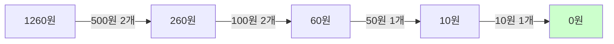

# 1. 그리디 알고리즘이란?

그리디(Greedy, 탐욕) 알고리즘은 현재 상황에서 가장 좋아 보이는 것만 선택하는 알고리즘입니다. 매 선택이 그 순간에는 최적이지만, 항상 전체 최적해를 보장하지는 않습니다.

:::div{.callout}
**그리디 알고리즘의 특징**

1. **현재 최선의 선택**: 매 단계에서 가장 좋은 것을 선택
2. **선택의 되돌림 없음**: 한 번 선택하면 바꾸지 않음
3. **빠른 속도**: 대부분 O(n) 또는 O(n log n)
4. **정당성 증명 필요**: 그리디로 최적해를 얻을 수 있는지 증명 필요

**주의**: 모든 문제에 그리디를 적용할 수 없습니다!
:::

# 2. 그리디 알고리즘 기본 예제

## 2.1 거스름돈 문제

거슬러 줄 동전의 최소 개수를 구하세요.

```python
def min_coins_greedy(change):
    """
    거스름돈 문제 - 그리디 접근
    동전 종류: 500원, 100원, 50원, 10원
    """
    coins = [500, 100, 50, 10]
    count = 0

    for coin in coins:
        count += change // coin  # 해당 동전 개수
        change %= coin  # 남은 거스름돈

    return count

# 3. 테스트
print(min_coins_greedy(1260))  # 6 (500*2 + 100*2 + 50*1 + 10*1)
print(min_coins_greedy(1370))  # 8
```

**시간 복잡도**: O(k) (k는 동전 종류 개수)



:::div{.callout}
**그리디가 성립하는 이유**

큰 동전이 작은 동전의 배수 관계일 때만 그리디로 최적해를 얻을 수 있습니다.
예: 500은 100의 배수, 100은 50의 배수, 50은 10의 배수

만약 동전이 [400, 300, 100]이고 800원을 거슬러주면?
- 그리디: 400 + 300 + 100 = 3개
- 최적: 400 + 400 = 2개
:::

## 3.1 큰 수의 법칙

배열에서 M번 더하되, 특정 인덱스의 수를 K번 초과하여 더할 수 없을 때 최댓값은?

```python
def max_number_law(arr, m, k):
    """
    큰 수의 법칙
    arr: 숫자 배열
    m: 더하는 횟수
    k: 특정 수를 연속으로 더할 수 있는 최대 횟수
    """
    arr.sort(reverse=True)  # 내림차순 정렬
    first = arr[0]   # 가장 큰 수
    second = arr[1]  # 두 번째로 큰 수

    # 가장 큰 수를 더하는 횟수
    count = (m // (k + 1)) * k + (m % (k + 1))

    result = count * first + (m - count) * second
    return result

# 4. 테스트
arr = [2, 4, 5, 4, 6]
print(max_number_law(arr, 8, 3))  # 46
# 5. 6 + 6 + 6 + 5 + 6 + 6 + 6 + 5 = 46
```

# 6. 그리디 대표 문제

## 6.1 회의실 배정

회의실을 사용하고자 하는 N개의 회의에 대해 최대 몇 개의 회의를 진행할 수 있는가?

```python
def max_meetings(meetings):
    """
    회의실 배정 - 최대 회의 개수
    meetings: [(시작 시간, 종료 시간), ...]
    """
    # 종료 시간 기준 정렬 (종료 시간이 같으면 시작 시간 기준)
    meetings.sort(key=lambda x: (x[1], x[0]))

    count = 0
    end_time = 0

    for start, end in meetings:
        # 현재 회의가 이전 회의 종료 후 시작 가능하면
        if start >= end_time:
            count += 1
            end_time = end

    return count

# 7. 테스트
meetings = [
    (1, 4), (3, 5), (0, 6),
    (5, 7), (3, 8), (5, 9),
    (6, 10), (8, 11), (8, 12), (2, 13), (12, 14)
]
print(max_meetings(meetings))  # 4
# 8. (1,4), (5,7), (8,11), (12,14)
```

**그리디 전략**: 종료 시간이 빠른 회의부터 선택

```mermaid
gantt
    title 회의실 배정
    dateFormat HH:mm
    axisFormat %H

    section 선택됨
    회의1    :done, 01:00, 3h
    회의2    :done, 05:00, 2h
    회의3    :done, 08:00, 3h
    회의4    :done, 12:00, 2h

    section 제외됨
    회의X    :crit, 03:00, 2h
    회의Y    :crit, 03:00, 5h
    회의Z    :crit, 05:00, 4h
```



## 8.1 ATM 인출 순서

N명이 ATM을 사용하려 할 때, 각자 인출 시간이 주어지면 모든 사람의 대기 시간 합의 최솟값은?

```python
def min_waiting_time(times):
    """
    ATM 인출 순서 - 최소 대기 시간
    times: 각 사람의 인출 시간
    """
    times.sort()  # 인출 시간이 짧은 사람부터

    total = 0
    cumulative = 0

    for time in times:
        cumulative += time
        total += cumulative

    return total

# 9. 테스트
times = [3, 1, 4, 3, 2]
print(min_waiting_time(times))  # 32
# 10. 정렬: [1, 2, 3, 3, 4]
# 11. 1번째: 1 (1)
# 12. 2번째: 1+2 (3)
# 13. 3번째: 1+2+3 (6)
# 14. 4번째: 1+2+3+3 (9)
# 15. 5번째: 1+2+3+3+4 (13)
# 16. 합: 1+3+6+9+13 = 32
```

**그리디 전략**: 시간이 짧은 사람부터 처리

## 16.1 문자열 뒤집기

0과 1로만 이루어진 문자열에서 모든 숫자를 같게 만들기 위한 최소 뒤집기 횟수는?

```python
def flip_string(s):
    """
    문자열 뒤집기 - 최소 뒤집기 횟수
    연속된 같은 숫자를 하나의 그룹으로 뒤집을 수 있음
    """
    # 0으로 만드는 경우와 1로 만드는 경우 중 최소
    count0 = 0  # 0 그룹 개수
    count1 = 0  # 1 그룹 개수

    # 첫 문자 확인
    if s[0] == '0':
        count0 = 1
    else:
        count1 = 1

    # 그룹 개수 세기
    for i in range(1, len(s)):
        if s[i] != s[i-1]:
            if s[i] == '0':
                count0 += 1
            else:
                count1 += 1

    return min(count0, count1)

# 17. 테스트
print(flip_string("0001100"))  # 1 (0을 1로 또는 1을 0으로)
print(flip_string("11011000"))  # 2
```

## 17.1 모험가 길드

N명의 모험가가 있고, 각자 공포도가 주어질 때, 최대로 구성할 수 있는 그룹 수는?
(그룹의 인원 수는 공포도의 최댓값 이상이어야 함)

```python
def max_adventure_groups(fears):
    """
    모험가 길드 - 최대 그룹 수
    fears: 각 모험가의 공포도
    """
    fears.sort()  # 공포도 오름차순 정렬

    count = 0  # 그룹 수
    current_group = 0  # 현재 그룹 인원

    for fear in fears:
        current_group += 1

        # 현재 그룹 인원이 공포도 이상이면 그룹 구성
        if current_group >= fear:
            count += 1
            current_group = 0

    return count

# 18. 테스트
fears = [2, 3, 1, 2, 2]
print(max_adventure_groups(fears))  # 2
# 19. 정렬: [1, 2, 2, 2, 3]
# 20. 그룹1: [1, 2] (2명, 최대 공포도 2)
# 21. 그룹2: [2, 2, 3] (3명, 최대 공포도 3)
```

# 22. 그리디 vs DP

어떤 문제는 그리디로, 어떤 문제는 DP로 풀어야 합니다.

## 22.1 그리디로 풀 수 있는 경우

```python
# 23. 예: 동전 개수 최소화 (동전이 배수 관계)
coins = [500, 100, 50, 10]
change = 1260

# 24. 그리디 OK!
count = 0
for coin in coins:
    count += change // coin
    change %= coin
print(count)  # 6
```

## 24.1 DP로 풀어야 하는 경우

```python
# 25. 예: 동전 개수 최소화 (동전이 배수 관계 아님)
coins = [1, 4, 5]
amount = 8

# 26. 그리디로 풀면: 5 + 1 + 1 + 1 = 4개 (틀림!)
# 27. DP로 풀면: 4 + 4 = 2개 (정답!)

dp = [float('inf')] * (amount + 1)
dp[0] = 0

for i in range(1, amount + 1):
    for coin in coins:
        if i >= coin:
            dp[i] = min(dp[i], dp[i - coin] + 1)

print(dp[amount])  # 2
```

| 비교 항목 | 그리디 | DP |
|---------|--------|-----|
| 접근 방식 | 현재 최선 선택 | 모든 경우 고려 |
| 최적성 | 항상 보장 안됨 | 보장됨 |
| 시간 복잡도 | 빠름 (O(n) ~ O(n log n)) | 느림 (O(n²) ~ O(n³)) |
| 적용 조건 | 정당성 증명 필요 | 최적 부분 구조 + 중복 부분 문제 |
| 대표 문제 | 회의실 배정, 거스름돈 | 배낭, LCS, 편집 거리 |

# 28. 그리디 문제 판별법

<highlight>그리디를 적용할 수 있는지 확인하는 방법</highlight>

1. **정렬 후 순서대로 선택**
   - 회의실 배정: 종료 시간 순 정렬
   - ATM: 인출 시간 순 정렬

2. **현재 최선이 전체 최선인가?**
   - 반례를 찾아보기
   - 수학적 귀납법으로 증명

3. **교환 논법(Exchange Argument)**
   - 최적해가 그리디 선택과 다르다고 가정
   - 교환해도 더 나아지지 않음을 증명

```python
# 29. 그리디 판별 예시: 활동 선택 문제
# 30. "종료 시간이 빠른 활동을 선택하는 것이 항상 최선인가?"
#
# 31. 증명:
# 32. 최적해가 다른 활동을 선택한다고 가정
# 33. 그 활동을 종료 시간이 가장 빠른 활동으로 교환
# 34. 교환 후에도 여전히 최적해 (더 많은 시간 확보 가능)
# 35. 따라서 그리디 선택이 최적
```

# 36. 실전 문제

## 36.1 문제 1: 큰 수 만들기

숫자로 이루어진 문자열에서 k개의 수를 제거했을 때 가장 큰 수는?

```python
def make_largest_number(number, k):
    """
    큰 수 만들기 - k개 제거
    number: 숫자 문자열
    k: 제거할 개수
    """
    stack = []
    remove_count = 0

    for num in number:
        # 스택의 마지막 숫자가 현재 숫자보다 작으면 제거
        while stack and stack[-1] < num and remove_count < k:
            stack.pop()
            remove_count += 1
        stack.append(num)

    # k개를 다 제거하지 못한 경우 (예: 내림차순 숫자)
    if remove_count < k:
        stack = stack[:-(k - remove_count)]

    return ''.join(stack)

# 37. 테스트
print(make_largest_number("1924", 2))  # "94"
print(make_largest_number("1231234", 3))  # "3234"
print(make_largest_number("4177252841", 4))  # "775841"
```

## 37.1 문제 2: 조이스틱

조이스틱으로 이름을 만들 때 최소 조작 횟수는?
- 위/아래: 알파벳 변경 (A ↔ Z 순환)
- 좌/우: 커서 이동

```python
def joystick(name):
    """
    조이스틱 - 최소 조작 횟수
    name: 만들려는 이름
    """
    # 각 알파벳을 변경하는 최소 횟수
    change = 0
    for char in name:
        # A부터 위로 가는 경우 vs Z부터 아래로 가는 경우
        change += min(ord(char) - ord('A'), ord('Z') - ord(char) + 1)

    # 좌우 이동 최소 횟수
    min_move = len(name) - 1  # 기본: 오른쪽으로만 이동

    for i in range(len(name)):
        # 현재 위치에서 연속된 A 찾기
        next_idx = i + 1
        while next_idx < len(name) and name[next_idx] == 'A':
            next_idx += 1

        # 오른쪽으로 갔다가 왼쪽으로 vs 왼쪽으로 갔다가 오른쪽으로
        move = i + len(name) - next_idx + min(i, len(name) - next_idx)
        min_move = min(min_move, move)

    return change + min_move

# 38. 테스트
print(joystick("JEROEN"))  # 56
print(joystick("JAN"))  # 23
```

## 38.1 문제 3: 무지의 먹방 라이브

회전판에 N개의 음식이 있고, 1번부터 순서대로 1초씩 먹는다. k초 후 다음에 먹어야 할 음식 번호는?

```python
import heapq

def find_next_food(food_times, k):
    """
    무지의 먹방 라이브
    food_times: 각 음식을 먹는 시간
    k: 방송 중단 시간
    """
    if sum(food_times) <= k:
        return -1  # 더 먹을 음식 없음

    # (시간, 음식 번호) 힙
    heap = []
    for i, time in enumerate(food_times):
        heapq.heappush(heap, (time, i + 1))

    total_time = 0
    previous = 0
    length = len(food_times)

    # 시간이 적게 걸리는 음식부터 제거
    while total_time + (heap[0][0] - previous) * length <= k:
        now_time, _ = heapq.heappop(heap)
        total_time += (now_time - previous) * length
        length -= 1
        previous = now_time

    # 남은 음식 정렬
    result = sorted(heap, key=lambda x: x[1])
    return result[(k - total_time) % length][1]

# 39. 테스트
print(find_next_food([3, 1, 2], 5))  # 1
# 40. 1초: 1번 음식(남은 시간 2)
# 41. 2초: 2번 음식(남은 시간 0) - 제거
# 42. 3초: 3번 음식(남은 시간 1)
# 43. 4초: 1번 음식(남은 시간 1)
# 44. 5초: 3번 음식(남은 시간 0) - 제거
# 45. 다음: 1번 음식
```

# 46. 코딩 테스트 팁

<highlight>그리디 문제 해결 전략</highlight>

1. **정렬이 핵심**
   - 대부분의 그리디 문제는 정렬로 시작
   - 어떤 기준으로 정렬할지 고민

2. **반례 찾기**
   - 그리디로 풀 수 있는지 확인
   - 간단한 반례로 검증

3. **증명 시도**
   - 현재 선택이 최선임을 논리적으로 설명
   - 교환 논법 활용

4. **구현 주의사항**

```python
# 47. 주의 1: 정렬 기준 명확히
meetings.sort(key=lambda x: (x[1], x[0]))  # 종료 시간, 시작 시간

# 48. 주의 2: 엣지 케이스
if not arr or k <= 0:  # 빈 배열, 잘못된 k
    return 0

# 49. 주의 3: 스택/힙 활용
# 50. 그리디 문제에서 자주 사용됨
stack = []
heap = []
```

# 51. 정리

- 그리디: 현재 상황에서 최선의 선택을 반복
- 빠른 속도 (O(n) ~ O(n log n))
- 항상 최적해를 보장하지 않음 (정당성 증명 필요)
- 대표 문제: 회의실 배정, ATM, 거스름돈
- 정렬과 함께 자주 사용됨
- DP와 비교하여 적절한 알고리즘 선택
