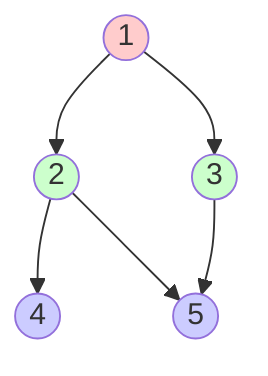
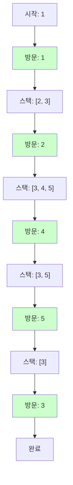
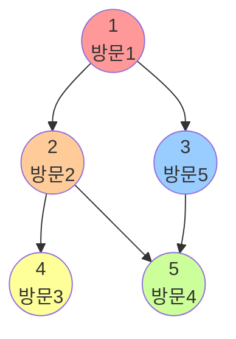
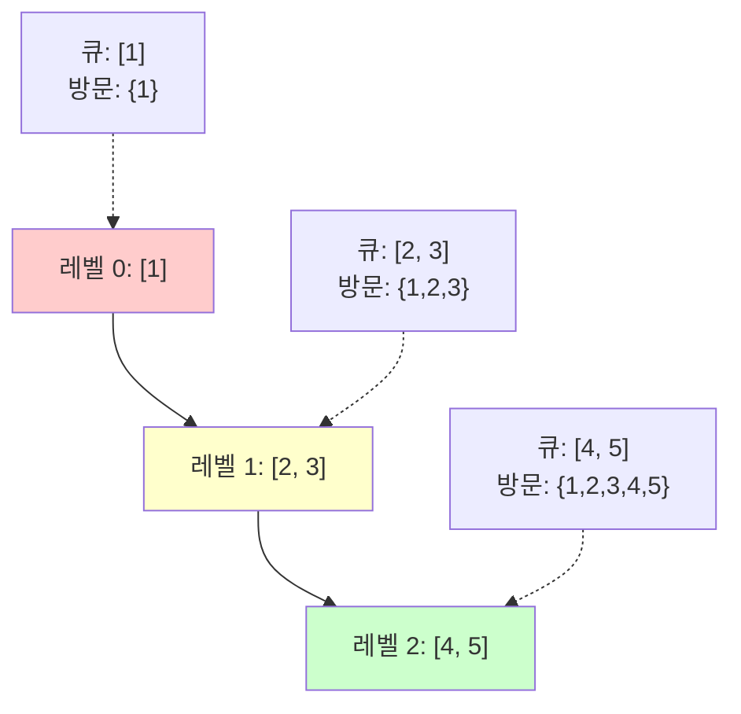
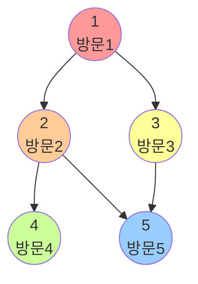

# 1. 그래프 탐색이란?

그래프 탐색은 그래프의 모든 노드를 방문하는 과정입니다. DFS(깊이 우선 탐색)와 BFS(너비 우선 탐색)는 가장 기본적이면서도 중요한 탐색 알고리즘입니다.

:::div{.callout}
**그래프 표현 방법**

1. **인접 행렬**: 2차원 배열로 연결 관계 표현
2. **인접 리스트**: 리스트로 연결된 노드만 저장

코딩 테스트에서는 대부분 **인접 리스트**를 사용합니다. (메모리 효율적)
:::

# 2. 그래프 표현

## 2.1 인접 행렬

```python
# 3. 노드 개수: 5, 간선 개수: 5
# 4. 간선: (1,2), (1,3), (2,4), (2,5), (3,5)

# 5. 인접 행렬 (2차원 리스트)
graph_matrix = [
    [0, 0, 0, 0, 0, 0],  # 0번 노드 (미사용)
    [0, 0, 1, 1, 0, 0],  # 1번 노드
    [0, 1, 0, 0, 1, 1],  # 2번 노드
    [0, 1, 0, 0, 0, 1],  # 3번 노드
    [0, 0, 1, 0, 0, 0],  # 4번 노드
    [0, 0, 1, 1, 0, 0]   # 5번 노드
]

# 6. 연결 확인
print(graph_matrix[1][2])  # 1 (연결됨)
print(graph_matrix[1][4])  # 0 (연결 안됨)
```

**장점**: O(1)로 연결 여부 확인
**단점**: O(V²) 메모리 사용 (V는 노드 수)

## 6.1 인접 리스트

```python
# 7. 인접 리스트 (딕셔너리 또는 리스트의 리스트)
graph_list = {
    1: [2, 3],
    2: [1, 4, 5],
    3: [1, 5],
    4: [2],
    5: [2, 3]
}

# 8. 또는 리스트로
graph = [
    [],        # 0번 노드 (미사용)
    [2, 3],    # 1번 노드
    [1, 4, 5], # 2번 노드
    [1, 5],    # 3번 노드
    [2],       # 4번 노드
    [2, 3]     # 5번 노드
]

# 9. 연결된 노드 확인
print(graph[1])  # [2, 3]
```

**장점**: O(E) 메모리 사용 (E는 간선 수)
**단점**: 연결 여부 확인에 O(V) 시간



# 10. DFS (깊이 우선 탐색)

## 10.1 개념

한 방향으로 끝까지 탐색한 후, 되돌아와서 다른 방향을 탐색하는 방식입니다.

**특징**:
- **스택** 또는 **재귀** 사용
- 모든 경로를 탐색하기 좋음
- 백트래킹에 적합

## 10.2 재귀 구현

```python
def dfs_recursive(graph, start, visited=None):
    """DFS 재귀 구현"""
    if visited is None:
        visited = set()

    visited.add(start)
    print(start, end=' ')

    # 인접 노드 방문
    for neighbor in graph[start]:
        if neighbor not in visited:
            dfs_recursive(graph, neighbor, visited)

    return visited

# 11. 사용 예시
graph = {
    1: [2, 3],
    2: [1, 4, 5],
    3: [1, 5],
    4: [2],
    5: [2, 3]
}

print("DFS 재귀:", end=' ')
dfs_recursive(graph, 1)  # DFS 재귀: 1 2 4 5 3
```

## 11.1 스택 구현

```python
def dfs_stack(graph, start):
    """DFS 스택 구현"""
    visited = set()
    stack = [start]

    while stack:
        node = stack.pop()

        if node not in visited:
            visited.add(node)
            print(node, end=' ')

            # 인접 노드를 스택에 추가 (역순으로 추가)
            for neighbor in reversed(graph[node]):
                if neighbor not in visited:
                    stack.append(neighbor)

    return visited

# 12. 사용 예시
print("\nDFS 스택:", end=' ')
dfs_stack(graph, 1)  # DFS 스택: 1 2 4 5 3
```



## 12.1 DFS 탐색 순서



# 13. BFS (너비 우선 탐색)

## 13.1 개념

가까운 노드부터 차례대로 탐색하는 방식입니다.

**특징**:
- **큐** 사용
- 최단 경로 탐색에 적합
- 레벨별 탐색 가능

## 13.2 큐 구현

```python
from collections import deque

def bfs(graph, start):
    """BFS 구현"""
    visited = set()
    queue = deque([start])
    visited.add(start)

    while queue:
        node = queue.popleft()
        print(node, end=' ')

        # 인접 노드를 큐에 추가
        for neighbor in graph[node]:
            if neighbor not in visited:
                visited.add(neighbor)
                queue.append(neighbor)

    return visited

# 14. 사용 예시
print("\nBFS:", end=' ')
bfs(graph, 1)  # BFS: 1 2 3 4 5
```

## 14.1 레벨별 BFS

```python
def bfs_level(graph, start):
    """레벨별 BFS (거리 정보 포함)"""
    visited = {start: 0}  # {노드: 거리}
    queue = deque([start])

    while queue:
        node = queue.popleft()
        current_level = visited[node]

        for neighbor in graph[node]:
            if neighbor not in visited:
                visited[neighbor] = current_level + 1
                queue.append(neighbor)

    return visited

# 15. 사용 예시
distances = bfs_level(graph, 1)
print("\n거리 정보:", distances)
# 16. {1: 0, 2: 1, 3: 1, 4: 2, 5: 2}
```



## 16.1 BFS 탐색 순서



# 17. DFS vs BFS 비교

| 비교 항목 | DFS | BFS |
|---------|-----|-----|
| 자료구조 | 스택 (재귀) | 큐 |
| 탐색 방식 | 깊이 우선 | 너비 우선 |
| 메모리 | 상대적으로 적음 | 상대적으로 많음 |
| 최단 경로 | 보장 안됨 | 보장됨 (가중치 없는 그래프) |
| 적용 | 모든 경로 탐색, 백트래킹 | 최단 경로, 레벨별 탐색 |
| 시간 복잡도 | O(V + E) | O(V + E) |

# 18. 실전 문제

## 18.1 미로 탈출 (BFS)

N×M 크기의 미로에서 (1,1)에서 (N,M)까지 최단 거리는?

```python
from collections import deque

def maze_escape(maze):
    """
    미로 탈출 - 최단 거리
    maze: 2차원 리스트 (1: 이동 가능, 0: 벽)
    """
    n, m = len(maze), len(maze[0])
    # 상하좌우 이동
    dx = [-1, 1, 0, 0]
    dy = [0, 0, -1, 1]

    queue = deque([(0, 0)])  # (행, 열)
    visited = [[False] * m for _ in range(n)]
    visited[0][0] = True

    while queue:
        x, y = queue.popleft()

        # 도착
        if x == n - 1 and y == m - 1:
            return maze[x][y]

        # 상하좌우 탐색
        for i in range(4):
            nx, ny = x + dx[i], y + dy[i]

            # 범위 내이고, 이동 가능하고, 미방문
            if 0 <= nx < n and 0 <= ny < m and maze[nx][ny] == 1 and not visited[nx][ny]:
                visited[nx][ny] = True
                maze[nx][ny] = maze[x][y] + 1  # 거리 갱신
                queue.append((nx, ny))

    return -1  # 도달 불가

# 19. 테스트
maze = [
    [1, 0, 1, 1, 1],
    [1, 0, 1, 0, 1],
    [1, 0, 1, 1, 1],
    [1, 1, 1, 0, 1]
]
print(maze_escape(maze))  # 9
```

## 19.1 음료수 얼려 먹기 (DFS)

N×M 크기의 얼음틀에서 구멍이 뚫린 부분(0)끼리 상하좌우로 붙어 있으면 하나의 아이스크림이 됩니다. 아이스크림 개수는?

```python
def count_ice_cream(ice):
    """
    음료수 얼려 먹기 - 아이스크림 개수
    ice: 2차원 리스트 (0: 구멍, 1: 벽)
    """
    n, m = len(ice), len(ice[0])

    def dfs(x, y):
        """DFS로 연결된 구멍 탐색"""
        # 범위 벗어나면 종료
        if x < 0 or x >= n or y < 0 or y >= m:
            return False

        # 구멍이면
        if ice[x][y] == 0:
            ice[x][y] = 1  # 방문 처리

            # 상하좌우 탐색
            dfs(x - 1, y)
            dfs(x + 1, y)
            dfs(x, y - 1)
            dfs(x, y + 1)
            return True

        return False

    count = 0
    for i in range(n):
        for j in range(m):
            if dfs(i, j):
                count += 1

    return count

# 20. 테스트
ice = [
    [0, 0, 1, 1, 0],
    [0, 0, 0, 1, 1],
    [1, 1, 1, 1, 1],
    [0, 0, 0, 0, 0]
]
print(count_ice_cream(ice))  # 3
```

## 20.1 섬의 개수 (DFS/BFS)

2차원 그리드에서 1로 이루어진 섬의 개수를 세세요. (대각선도 연결로 간주)

```python
def count_islands(grid):
    """
    섬의 개수
    grid: 2차원 리스트 (1: 땅, 0: 바다)
    """
    if not grid:
        return 0

    n, m = len(grid), len(grid[0])
    count = 0

    def dfs(x, y):
        """DFS로 섬 탐색 (8방향)"""
        if x < 0 or x >= n or y < 0 or y >= m or grid[x][y] == 0:
            return

        grid[x][y] = 0  # 방문 처리

        # 8방향 탐색
        for dx in [-1, 0, 1]:
            for dy in [-1, 0, 1]:
                if dx == 0 and dy == 0:
                    continue
                dfs(x + dx, y + dy)

    for i in range(n):
        for j in range(m):
            if grid[i][j] == 1:
                dfs(i, j)
                count += 1

    return count

# 21. 테스트
grid = [
    [1, 1, 0, 0, 0],
    [1, 1, 0, 0, 0],
    [0, 0, 1, 0, 0],
    [0, 0, 0, 1, 1]
]
print(count_islands(grid))  # 3
```

## 21.1 타겟 넘버 (DFS)

숫자를 +/- 하여 타겟을 만드는 경우의 수는?

```python
def target_number(numbers, target):
    """
    타겟 넘버
    numbers: 숫자 배열
    target: 목표 값
    """
    count = 0

    def dfs(index, current_sum):
        nonlocal count

        # 모든 숫자를 사용했을 때
        if index == len(numbers):
            if current_sum == target:
                count += 1
            return

        # + 선택
        dfs(index + 1, current_sum + numbers[index])
        # - 선택
        dfs(index + 1, current_sum - numbers[index])

    dfs(0, 0)
    return count

# 22. 테스트
numbers = [1, 1, 1, 1, 1]
target = 3
print(target_number(numbers, target))  # 5
```

## 22.1 네트워크 (DFS/BFS)

컴퓨터 n대가 있고, 연결 정보가 주어질 때 네트워크 개수는?

```python
def count_networks(n, computers):
    """
    네트워크 개수
    n: 컴퓨터 개수
    computers: 연결 정보 (인접 행렬)
    """
    visited = [False] * n
    count = 0

    def dfs(node):
        """DFS로 연결된 컴퓨터 탐색"""
        visited[node] = True

        for i in range(n):
            # 연결되어 있고 미방문
            if computers[node][i] == 1 and not visited[i]:
                dfs(i)

    for i in range(n):
        if not visited[i]:
            dfs(i)
            count += 1

    return count

# 23. 테스트
n = 3
computers = [
    [1, 1, 0],
    [1, 1, 0],
    [0, 0, 1]
]
print(count_networks(n, computers))  # 2
```

## 23.1 단어 변환 (BFS)

한 번에 한 글자만 바꿔가며 begin에서 target으로 변환할 때, 최소 단계는?

```python
from collections import deque

def word_ladder(begin, target, words):
    """
    단어 변환 - 최소 단계
    begin: 시작 단어
    target: 목표 단어
    words: 변환 가능한 단어 목록
    """
    if target not in words:
        return 0

    def is_one_diff(word1, word2):
        """두 단어가 한 글자만 다른지 확인"""
        diff = 0
        for c1, c2 in zip(word1, word2):
            if c1 != c2:
                diff += 1
        return diff == 1

    queue = deque([(begin, 0)])  # (단어, 단계)
    visited = {begin}

    while queue:
        word, step = queue.popleft()

        if word == target:
            return step

        for next_word in words:
            if next_word not in visited and is_one_diff(word, next_word):
                visited.add(next_word)
                queue.append((next_word, step + 1))

    return 0  # 변환 불가

# 24. 테스트
begin = "hit"
target = "cog"
words = ["hot", "dot", "dog", "lot", "log", "cog"]
print(word_ladder(begin, target, words))  # 4
# 25. hit → hot → dot → dog → cog
```

# 26. 코딩 테스트 팁

<highlight>DFS/BFS 문제 해결 전략</highlight>

1. **문제 유형 판별**
   - 최단 경로 → BFS
   - 모든 경로 탐색 → DFS
   - 백트래킹 → DFS
   - 레벨별 탐색 → BFS

2. **방문 처리 방법**
   ```python
   # 방법 1: set 사용
   visited = set()
   visited.add(node)

   # 방법 2: 리스트 사용
   visited = [False] * n
   visited[node] = True

   # 방법 3: 원본 수정 (가능한 경우)
   graph[x][y] = -1  # 방문 표시
   ```

3. **2차원 그리드 탐색**
   ```python
   # 4방향 이동
   dx = [-1, 1, 0, 0]
   dy = [0, 0, -1, 1]

   # 8방향 이동
   for dx in [-1, 0, 1]:
       for dy in [-1, 0, 1]:
           if dx == 0 and dy == 0:
               continue
           nx, ny = x + dx, y + dy
   ```

4. **주의사항**
   ```python
   # 주의 1: 범위 체크
   if 0 <= nx < n and 0 <= ny < m:
       # 탐색

   # 주의 2: 방문 체크 시점 (BFS)
   visited.add(node)  # 큐에 넣을 때 방문 처리!
   queue.append(node)

   # 주의 3: 재귀 깊이 (DFS)
   import sys
   sys.setrecursionlimit(10000)
   ```

# 27. DFS/BFS 템플릿

```python
# 28. DFS 재귀 템플릿
def dfs(graph, node, visited):
    visited.add(node)
    # 노드 처리
    for neighbor in graph[node]:
        if neighbor not in visited:
            dfs(graph, neighbor, visited)

# 29. BFS 템플릿
from collections import deque

def bfs(graph, start):
    visited = {start}
    queue = deque([start])

    while queue:
        node = queue.popleft()
        # 노드 처리

        for neighbor in graph[node]:
            if neighbor not in visited:
                visited.add(neighbor)
                queue.append(neighbor)

# 30. 2D 그리드 DFS 템플릿
def grid_dfs(grid, x, y, visited):
    if x < 0 or x >= len(grid) or y < 0 or y >= len(grid[0]):
        return
    if visited[x][y] or grid[x][y] == 0:
        return

    visited[x][y] = True
    # 처리

    # 4방향 탐색
    for dx, dy in [(-1,0), (1,0), (0,-1), (0,1)]:
        grid_dfs(grid, x+dx, y+dy, visited)

# 31. 2D 그리드 BFS 템플릿
from collections import deque

def grid_bfs(grid, start_x, start_y):
    n, m = len(grid), len(grid[0])
    visited = [[False] * m for _ in range(n)]
    queue = deque([(start_x, start_y)])
    visited[start_x][start_y] = True

    while queue:
        x, y = queue.popleft()
        # 처리

        for dx, dy in [(-1,0), (1,0), (0,-1), (0,1)]:
            nx, ny = x + dx, y + dy
            if 0 <= nx < n and 0 <= ny < m and not visited[nx][ny] and grid[nx][ny] != 0:
                visited[nx][ny] = True
                queue.append((nx, ny))
```

# 32. 정리

- DFS: 깊이 우선 탐색 (스택/재귀)
- BFS: 너비 우선 탐색 (큐)
- 최단 경로: BFS, 모든 경로: DFS
- 시간 복잡도: O(V + E)
- 2차원 그리드에서 자주 사용
- 방문 처리와 범위 체크 필수
