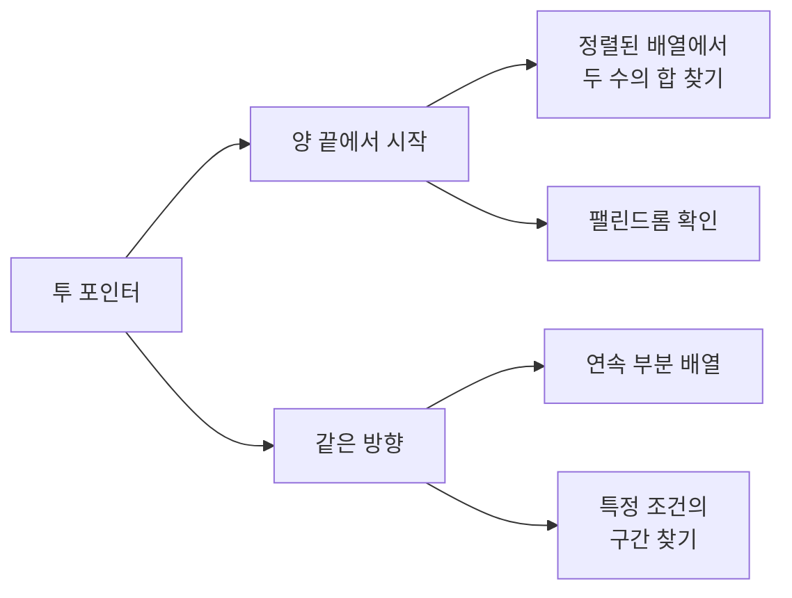
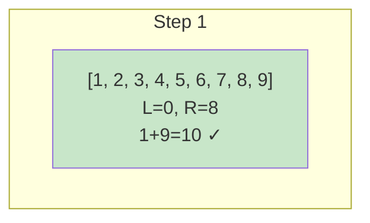
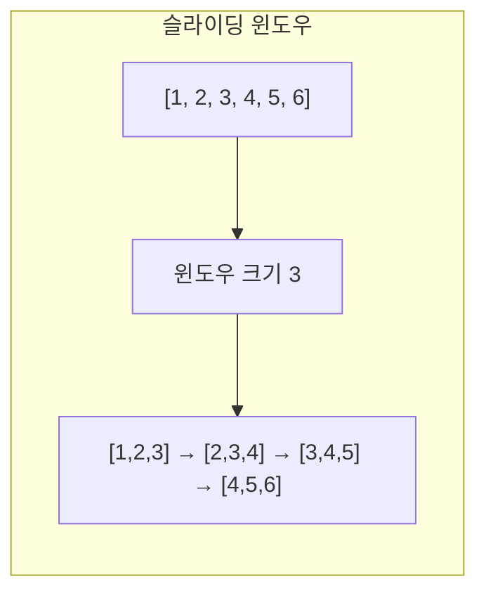

# 1. 투 포인터 (Two Pointers)

투 포인터는 **두 개의 포인터를 사용**하여 배열이나 리스트를 탐색하는 기법입니다. 보통 O(n²)을 O(n)으로 최적화할 수 있습니다.

## 1.1 투 포인터의 유형



## 1.2 양 끝에서 시작하는 투 포인터

가장 일반적인 형태로, 정렬된 배열에서 두 값의 합을 찾을 때 사용합니다.

```python
def two_sum_sorted(arr, target):
    """
    정렬된 배열에서 합이 target인 두 수의 인덱스 찾기
    O(n) 시간복잡도
    """
    left, right = 0, len(arr) - 1

    while left < right:
        current_sum = arr[left] + arr[right]

        if current_sum == target:
            return [left, right]
        elif current_sum < target:
            left += 1   # 합이 작으면 왼쪽 포인터 증가
        else:
            right -= 1  # 합이 크면 오른쪽 포인터 감소

    return []


arr = [1, 2, 3, 4, 5, 6, 7, 8, 9]
print(two_sum_sorted(arr, 10))  # [0, 8] (1 + 9 = 10)
print(two_sum_sorted(arr, 15))  # [5, 8] (6 + 9 = 15)
```

### 동작 과정 시각화



## 1.3 같은 방향 투 포인터

두 포인터가 같은 방향으로 이동하며 구간을 관리합니다.

```python
def min_subarray_length(arr, target):
    """
    합이 target 이상인 가장 짧은 연속 부분 배열의 길이
    """
    n = len(arr)
    left = 0
    current_sum = 0
    min_length = float('inf')

    for right in range(n):
        current_sum += arr[right]

        # 조건을 만족하면 왼쪽 포인터 이동
        while current_sum >= target:
            min_length = min(min_length, right - left + 1)
            current_sum -= arr[left]
            left += 1

    return min_length if min_length != float('inf') else 0


arr = [2, 3, 1, 2, 4, 3]
print(min_subarray_length(arr, 7))  # 2 ([4, 3])
```

## 1.4 세 수의 합 (3Sum)

```python
def three_sum(arr):
    """
    세 수의 합이 0인 모든 조합 찾기 (중복 제거)
    """
    arr.sort()
    result = []
    n = len(arr)

    for i in range(n - 2):
        # 중복 건너뛰기
        if i > 0 and arr[i] == arr[i - 1]:
            continue

        # 투 포인터로 나머지 두 수 찾기
        left, right = i + 1, n - 1
        target = -arr[i]

        while left < right:
            current_sum = arr[left] + arr[right]

            if current_sum == target:
                result.append([arr[i], arr[left], arr[right]])

                # 중복 건너뛰기
                while left < right and arr[left] == arr[left + 1]:
                    left += 1
                while left < right and arr[right] == arr[right - 1]:
                    right -= 1

                left += 1
                right -= 1
            elif current_sum < target:
                left += 1
            else:
                right -= 1

    return result


print(three_sum([-1, 0, 1, 2, -1, -4]))
# [[-1, -1, 2], [-1, 0, 1]]
```

# 2. 슬라이딩 윈도우 (Sliding Window)

슬라이딩 윈도우는 **고정 크기의 윈도우**를 이동시키며 배열을 탐색하는 기법입니다.

## 2.1 슬라이딩 윈도우의 핵심

- 윈도우 크기가 고정된 경우
- 연속된 부분 배열/문자열 처리
- 새로 들어오는 요소 추가, 빠지는 요소 제거



## 2.2 고정 크기 윈도우

```python
def max_sum_subarray(arr, k):
    """
    크기 k인 연속 부분 배열의 최대 합
    """
    n = len(arr)
    if n < k:
        return None

    # 첫 윈도우의 합
    window_sum = sum(arr[:k])
    max_sum = window_sum

    # 윈도우 이동
    for i in range(k, n):
        # 새 요소 추가, 이전 요소 제거
        window_sum += arr[i] - arr[i - k]
        max_sum = max(max_sum, window_sum)

    return max_sum


arr = [1, 4, 2, 10, 2, 3, 1, 0, 20]
print(max_sum_subarray(arr, 4))  # 24 ([2, 10, 2, 3])
```

### 동작 과정

```
배열: [1, 4, 2, 10, 2, 3, 1, 0, 20]
k = 4

Step 1: [1, 4, 2, 10] = 17
Step 2: [4, 2, 10, 2] = 18
Step 3: [2, 10, 2, 3] = 17
Step 4: [10, 2, 3, 1] = 16
Step 5: [2, 3, 1, 0] = 6
Step 6: [3, 1, 0, 20] = 24 ← 최대
```

## 2.3 가변 크기 윈도우

조건에 따라 윈도우 크기가 변하는 경우입니다.

```python
def longest_substring_k_distinct(s, k):
    """
    최대 k개의 서로 다른 문자를 포함하는 가장 긴 부분 문자열
    """
    from collections import defaultdict

    char_count = defaultdict(int)
    left = 0
    max_length = 0

    for right in range(len(s)):
        # 오른쪽 문자 추가
        char_count[s[right]] += 1

        # 서로 다른 문자가 k개 초과하면 왼쪽 축소
        while len(char_count) > k:
            char_count[s[left]] -= 1
            if char_count[s[left]] == 0:
                del char_count[s[left]]
            left += 1

        max_length = max(max_length, right - left + 1)

    return max_length


print(longest_substring_k_distinct("eceba", 2))    # 3 ("ece")
print(longest_substring_k_distinct("aabbcc", 2))   # 4 ("aabb" 또는 "bbcc")
```

## 2.4 중복 없는 가장 긴 부분 문자열

```python
def longest_substring_without_repeating(s):
    """
    중복 문자 없는 가장 긴 부분 문자열의 길이
    """
    char_index = {}  # 문자: 마지막 등장 인덱스
    left = 0
    max_length = 0

    for right, char in enumerate(s):
        # 중복 문자가 있고, 윈도우 내에 있으면
        if char in char_index and char_index[char] >= left:
            left = char_index[char] + 1

        char_index[char] = right
        max_length = max(max_length, right - left + 1)

    return max_length


print(longest_substring_without_repeating("abcabcbb"))  # 3 ("abc")
print(longest_substring_without_repeating("bbbbb"))     # 1 ("b")
print(longest_substring_without_repeating("pwwkew"))    # 3 ("wke")
```

# 3. 프로그래머스 문제

## 3.1 보석 쇼핑 (카카오)

```python
def solution(gems):
    """
    모든 종류의 보석을 포함하는 가장 짧은 구간
    """
    from collections import defaultdict

    gem_types = len(set(gems))
    gem_count = defaultdict(int)

    left = 0
    answer = [0, len(gems) - 1]
    count = 0

    for right in range(len(gems)):
        # 새 보석 추가
        if gem_count[gems[right]] == 0:
            count += 1
        gem_count[gems[right]] += 1

        # 모든 종류를 포함하면 왼쪽 축소 시도
        while count == gem_types:
            # 더 짧은 구간이면 업데이트
            if right - left < answer[1] - answer[0]:
                answer = [left, right]

            # 왼쪽 보석 제거
            gem_count[gems[left]] -= 1
            if gem_count[gems[left]] == 0:
                count -= 1
            left += 1

    return [answer[0] + 1, answer[1] + 1]  # 1-indexed


print(solution(["DIA", "RUBY", "RUBY", "DIA", "DIA", "EMERALD", "SAPPHIRE", "DIA"]))
# [3, 7]
```

## 3.2 연속 부분 수열 합의 개수 (프로그래머스)

```python
def solution(elements):
    """
    원형 배열에서 연속 부분 수열의 합으로 만들 수 있는 수의 개수
    """
    n = len(elements)
    sums = set()

    # 길이 1부터 n까지
    for length in range(1, n + 1):
        # 첫 윈도우
        window_sum = sum(elements[:length])
        sums.add(window_sum)

        # 슬라이딩
        for start in range(1, n):
            # 이전 요소 빼고 새 요소 더하기 (원형)
            window_sum -= elements[start - 1]
            window_sum += elements[(start + length - 1) % n]
            sums.add(window_sum)

    return len(sums)


print(solution([7, 9, 1, 1, 4]))  # 18
```

## 3.3 주차 요금 계산 (카카오)

```python
import math
from collections import defaultdict

def solution(fees, records):
    """
    주차 요금 계산
    fees: [기본시간, 기본요금, 단위시간, 단위요금]
    """
    base_time, base_fee, unit_time, unit_fee = fees

    # 차량별 입출차 기록
    parking = {}  # 현재 주차 중인 차량
    total_time = defaultdict(int)  # 차량별 총 주차 시간

    for record in records:
        time, car_num, action = record.split()
        h, m = map(int, time.split(':'))
        minutes = h * 60 + m

        if action == 'IN':
            parking[car_num] = minutes
        else:  # OUT
            total_time[car_num] += minutes - parking[car_num]
            del parking[car_num]

    # 출차 기록 없는 차량 (23:59 출차로 계산)
    last_time = 23 * 60 + 59
    for car_num, in_time in parking.items():
        total_time[car_num] += last_time - in_time

    # 요금 계산
    result = []
    for car_num in sorted(total_time.keys()):
        time = total_time[car_num]

        if time <= base_time:
            fee = base_fee
        else:
            fee = base_fee + math.ceil((time - base_time) / unit_time) * unit_fee

        result.append(fee)

    return result


fees = [180, 5000, 10, 600]
records = [
    "05:34 5961 IN", "06:00 0000 IN", "06:34 0000 OUT",
    "07:59 5961 OUT", "07:59 0148 IN", "18:59 0000 IN",
    "19:09 0148 OUT", "22:59 5961 IN", "23:00 5961 OUT"
]
print(solution(fees, records))  # [14600, 34400, 5000]
```

# 4. 투 포인터 vs 슬라이딩 윈도우

| 특성 | 투 포인터 | 슬라이딩 윈도우 |
|------|----------|----------------|
| 포인터 이동 | 양 끝에서 또는 같은 방향 | 항상 같은 방향 |
| 윈도우 크기 | 가변적 | 고정 또는 가변 |
| 주요 용도 | 두 수의 합, 정렬된 배열 | 연속 부분 배열/문자열 |
| 시간복잡도 | O(n) | O(n) |

# 5. 문제 유형별 접근법

## 5.1 투 포인터를 사용하는 경우

- 정렬된 배열에서 두 수의 합/차
- 팰린드롬 확인
- 정렬된 배열 병합
- 물 채우기 문제 (Container With Most Water)

## 5.2 슬라이딩 윈도우를 사용하는 경우

- 고정 크기 구간의 최대/최소/평균
- 연속된 k개의 합이 조건을 만족
- 조건을 만족하는 가장 긴/짧은 구간
- 문자열에서 특정 패턴 찾기

:::div{.callout}
**투 포인터/슬라이딩 윈도우 키워드**

- "연속된", "부분 배열", "구간"
- "최대/최소 길이"
- "합이 X인", "조건을 만족하는"
- "정렬된 배열에서"
- "중복 없는"
:::

# 6. 연습문제

* (투 포인터) 두 수의 합: https://pyalgo.co.kr/?page=7
* (투 포인터) 구간 합 가우스: https://pyalgo.co.kr/?page=9
* (투 포인터) 두 수의 합 찾기: https://100.pyalgo.co.kr/?page=26
* (슬라이딩 윈도우) 연속 부분 수열의 합: https://100.pyalgo.co.kr/?page=27
* (슬라이딩 윈도우) 구간 최대합: https://100.pyalgo.co.kr/?page=28
