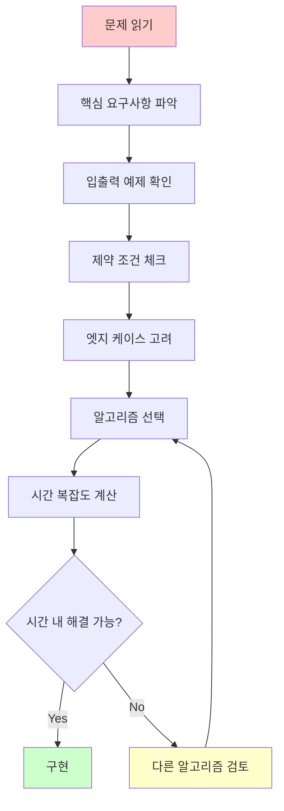
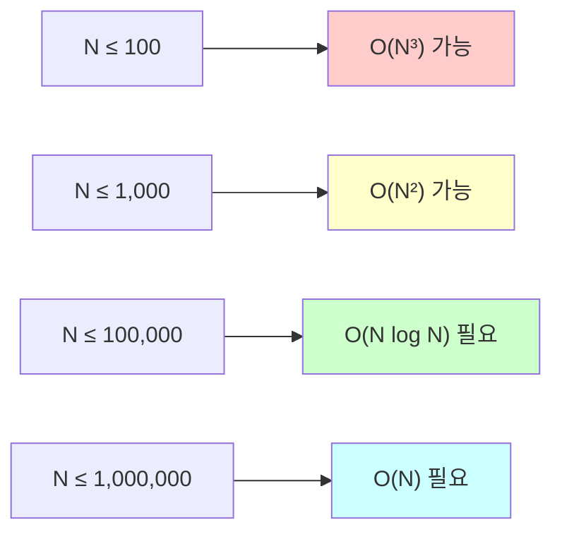
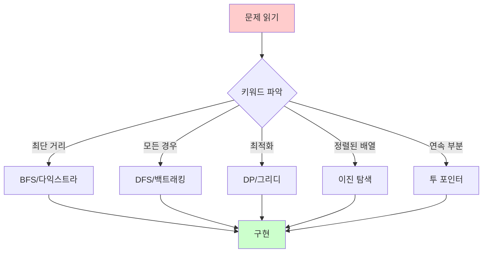
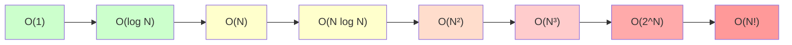
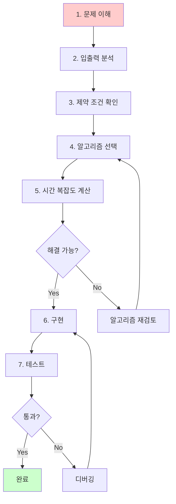

# 1. 문제 분석의 중요성

코딩 테스트에서 문제를 제대로 이해하지 못하면 아무리 뛰어난 알고리즘 실력도 소용이 없습니다. 체계적인 문제 분석 방법을 익히면 정확하고 빠르게 문제를 해결할 수 있습니다.

:::div{.callout}
**문제 분석의 핵심**

1. 문제를 정확히 이해하기
2. 입출력 형식 파악하기
3. 제약 조건 확인하기
4. 적절한 알고리즘 선택하기
5. 시간 복잡도 계산하기
:::

# 2. 문제 이해하기

## 2.1 문제 읽기 전략



## 2.2 문제 분해하기

<highlight>문제를 단계별로 분해하는 방법</highlight>

**예시 문제**: "배열에서 두 수를 선택하여 합이 target이 되는 인덱스를 반환하세요."

1. **입력 이해**
   - 배열: 정수 리스트
   - target: 목표 합

2. **출력 이해**
   - 두 수의 인덱스 (리스트)

3. **조건 이해**
   - 같은 원소를 두 번 사용할 수 없음
   - 답은 정확히 하나만 존재

4. **접근 방법**
   - 완전 탐색: O(n²)
   - 해시맵: O(n)

```python
def two_sum(nums, target):
    """
    두 수의 합 - 해시맵 활용
    시간 복잡도: O(n)
    """
    seen = {}  # {값: 인덱스}

    for i, num in enumerate(nums):
        complement = target - num
        if complement in seen:
            return [seen[complement], i]
        seen[num] = i

    return []

# 3. 테스트
nums = [2, 7, 11, 15]
target = 9
print(two_sum(nums, target))  # [0, 1] (2 + 7 = 9)
```

# 4. 입출력 분석

## 4.1 입력 형식 이해

코딩 테스트에서는 다양한 입력 형식이 주어집니다.

### 4.1.1 표준 입력 처리

```python
# 5. 한 줄 입력
n = int(input())

# 6. 공백으로 구분된 정수
arr = list(map(int, input().split()))

# 7. 여러 줄 입력
n = int(input())
data = []
for _ in range(n):
    data.append(input())

# 8. 2차원 배열 입력
n, m = map(int, input().split())
grid = []
for _ in range(n):
    grid.append(list(map(int, input().split())))

# 9. EOF까지 입력 받기
import sys
data = sys.stdin.read().splitlines()
```

### 9.0.1 입력 예제 분석

**문제**: "N개의 정수가 주어질 때, 가장 큰 수를 출력하세요."

```
입력 예제:
5
3 1 4 1 5

출력 예제:
5
```

**분석**:
- 첫 줄: N (개수)
- 둘째 줄: N개의 정수 (공백 구분)
- 출력: 최댓값

```python
n = int(input())
numbers = list(map(int, input().split()))
print(max(numbers))
```

## 9.1 출력 형식 이해

### 9.1.1 출력 형식 예시

```python
# 10. 기본 출력
print(answer)

# 11. 포맷 출력
print(f"결과: {answer}")

# 12. 여러 줄 출력
for item in items:
    print(item)

# 13. 공백 구분 출력
print(*arr)  # 리스트를 공백으로 구분하여 출력

# 14. 소수점 자리수 지정
print(f"{value:.2f}")  # 소수점 2자리

# 15. 조건부 출력
print("YES" if condition else "NO")
```

# 16. 제약 조건 파악

## 16.1 입력 크기로 알고리즘 선택

제약 조건을 보고 적절한 시간 복잡도를 가진 알고리즘을 선택해야 합니다.

| 입력 크기 (N) | 시간 복잡도 | 알고리즘 예시 |
|-------------|-----------|------------|
| N ≤ 11 | O(N!) | 순열 (완전 탐색) |
| N ≤ 25 | O(2^N) | 비트마스킹, 부분집합 |
| N ≤ 100 | O(N³) | 플로이드-워셜 |
| N ≤ 1,000 | O(N²) | 버블 정렬, 2중 for문 |
| N ≤ 10,000 | O(N² log N) | 세그먼트 트리 |
| N ≤ 100,000 | O(N log N) | 병합 정렬, 이진 탐색 |
| N ≤ 1,000,000 | O(N) | 해시, DP, 투 포인터 |



## 16.2 제약 조건 예시

**예시 1**: "1 ≤ N ≤ 100,000"
- O(N log N) 알고리즘 사용 가능
- 정렬, 이진 탐색 등

**예시 2**: "시간 제한: 1초"
- 일반적으로 1억 번 연산 가능
- Python은 약 2,000만 ~ 5,000만 번

**예시 3**: "1 ≤ N ≤ 20"
- O(2^N) 알고리즘도 가능
- 백트래킹, 비트마스킹

```python
# 17. N의 크기에 따른 알고리즘 선택 예시

def solve_problem(n, data):
    """입력 크기에 따라 다른 알고리즘 사용"""

    if n <= 20:
        # 완전 탐색 가능
        return brute_force(data)

    elif n <= 1000:
        # O(N²) 알고리즘
        return quadratic_solution(data)

    else:
        # O(N log N) 또는 O(N) 알고리즘 필요
        return efficient_solution(data)
```

# 18. 문제 유형 판별

## 18.1 키워드로 유형 파악

문제에서 특정 키워드를 찾으면 어떤 알고리즘을 사용할지 힌트를 얻을 수 있습니다.

| 키워드 | 알고리즘 |
|--------|---------|
| "최단 거리", "최소 이동" | BFS, 다익스트라 |
| "모든 경우의 수" | DFS, 백트래킹 |
| "최댓값", "최솟값", "최적" | DP, 그리디 |
| "정렬된 배열에서 찾기" | 이진 탐색 |
| "연속된 부분 배열" | 투 포인터, 슬라이딩 윈도우 |
| "부분 집합", "조합" | 백트래킹, 비트마스킹 |
| "그래프", "노드", "간선" | DFS, BFS, 최단 경로 |

### 18.1.1 예시 분석

**문제 1**: "배열에서 연속된 부분 배열의 합이 K인 경우의 수를 구하세요."
- 키워드: "연속된 부분 배열"
- 알고리즘: 투 포인터 또는 누적 합

**문제 2**: "미로에서 출구까지의 최단 거리를 구하세요."
- 키워드: "최단 거리"
- 알고리즘: BFS

**문제 3**: "N개의 숫자 중 K개를 선택하는 모든 경우의 수를 구하세요."
- 키워드: "모든 경우의 수", "선택"
- 알고리즘: 조합 (백트래킹 또는 itertools)

## 18.2 문제 유형별 접근법



# 19. 시간 복잡도 계산

## 19.1 Big-O 표기법

```python
# 20. O(1) - 상수 시간
def get_first(arr):
    return arr[0]

# 21. O(log N) - 로그 시간
def binary_search(arr, target):
    left, right = 0, len(arr) - 1
    while left <= right:
        mid = (left + right) // 2
        if arr[mid] == target:
            return mid
        elif arr[mid] < target:
            left = mid + 1
        else:
            right = mid - 1
    return -1

# 22. O(N) - 선형 시간
def find_max(arr):
    max_val = arr[0]
    for num in arr:
        if num > max_val:
            max_val = num
    return max_val

# 23. O(N log N) - 선형 로그 시간
def merge_sort(arr):
    if len(arr) <= 1:
        return arr
    mid = len(arr) // 2
    left = merge_sort(arr[:mid])
    right = merge_sort(arr[mid:])
    return merge(left, right)

# 24. O(N²) - 제곱 시간
def bubble_sort(arr):
    n = len(arr)
    for i in range(n):
        for j in range(n - i - 1):
            if arr[j] > arr[j + 1]:
                arr[j], arr[j + 1] = arr[j + 1], arr[j]
    return arr

# 25. O(2^N) - 지수 시간
def fibonacci(n):
    if n <= 1:
        return n
    return fibonacci(n-1) + fibonacci(n-2)
```

## 25.1 복잡도 비교



# 26. 실전 문제 분석 예시

## 26.1 예시 1: 체계적 분석

**문제**: "N×M 크기의 얼음틀이 있습니다. 구멍이 뚫린 부분은 0, 칸막이가 존재하는 부분은 1로 표시됩니다. 구멍이 뚫린 부분끼리 상하좌우로 붙어 있는 경우 서로 연결되어 있는 것으로 간주합니다. 얼음틀의 모양이 주어졌을 때 생성되는 총 아이스크림의 개수를 구하세요."

### 26.1.1 1단계: 문제 이해
- 2차원 그리드에서 연결된 영역 찾기
- 0끼리 상하좌우로 연결되면 하나의 그룹

### 26.1.2 2단계: 입출력 분석
```
입력:
4 5
00110
00011
11111
00000

출력:
3
```

### 26.1.3 3단계: 제약 조건
- 1 ≤ N, M ≤ 1,000
- O(N×M) 알고리즘 사용 가능

### 26.1.4 4단계: 알고리즘 선택
- 연결된 영역 찾기 → DFS 또는 BFS
- 모든 위치를 확인하며 새로운 영역 발견 시 카운트 증가

### 26.1.5 5단계: 시간 복잡도
- O(N×M): 모든 칸을 한 번씩 방문

### 26.1.6 6단계: 구현

```python
def count_ice_cream(n, m, ice):
    """아이스크림 개수 세기"""
    def dfs(x, y):
        if x < 0 or x >= n or y < 0 or y >= m:
            return False
        if ice[x][y] == 1:
            return False

        ice[x][y] = 1  # 방문 처리

        # 상하좌우 탐색
        dfs(x-1, y)
        dfs(x+1, y)
        dfs(x, y-1)
        dfs(x, y+1)
        return True

    count = 0
    for i in range(n):
        for j in range(m):
            if dfs(i, j):
                count += 1

    return count

# 27. 테스트
n, m = 4, 5
ice = [
    [0, 0, 1, 1, 0],
    [0, 0, 0, 1, 1],
    [1, 1, 1, 1, 1],
    [0, 0, 0, 0, 0]
]
print(count_ice_cream(n, m, ice))  # 3
```

# 28. 문제 풀이 프로세스

<highlight>체계적인 문제 풀이 5단계</highlight>



## 28.1 실전 체크리스트

```python
"""
문제 분석 체크리스트

[ ] 1. 문제를 정확히 이해했는가?
    - 핵심 요구사항은?
    - 특수 조건은?

[ ] 2. 입출력 형식을 파악했는가?
    - 입력은 어떤 형식인가?
    - 출력은 무엇을 요구하는가?

[ ] 3. 제약 조건을 확인했는가?
    - N의 범위는?
    - 시간/메모리 제한은?

[ ] 4. 알고리즘을 선택했는가?
    - 어떤 자료구조/알고리즘을 사용할 것인가?
    - 왜 이 방법이 적절한가?

[ ] 5. 시간 복잡도를 계산했는가?
    - 예상 시간 복잡도는?
    - 제한 시간 내에 해결 가능한가?

[ ] 6. 엣지 케이스를 고려했는가?
    - 빈 입력
    - 최솟값/최댓값
    - 중복된 값
    - 음수/0
"""
```

# 29. 정리

- 문제 분석은 코딩 테스트의 시작점
- 입력 크기로 시간 복잡도 결정
- 키워드로 알고리즘 유형 파악
- 체계적인 5단계 프로세스 활용
- 제약 조건과 시간 복잡도 계산 필수
- 엣지 케이스 항상 고려
