# 1. 코딩 테스트 실전 전략

코딩 테스트는 알고리즘 지식뿐만 아니라 시간 관리, 디버깅, 코드 작성 능력이 모두 중요합니다. 실전에서 바로 활용할 수 있는 팁들을 소개합니다.

:::div{.callout}
**코딩 테스트 성공의 3요소**

1. **시간 관리**: 문제별 시간 배분 전략
2. **코드 품질**: 읽기 쉽고 디버깅하기 쉬운 코드
3. **검증**: 엣지 케이스와 테스트 케이스 확인
:::

# 2. 시간 분배 전략

## 2.1 문제 난이도별 시간 배분

일반적인 코딩 테스트는 2~3시간 동안 3~5문제를 풉니다.

| 난이도 | 예상 시간 | 전략 |
|--------|---------|------|
| 쉬움 | 10~20분 | 빠르게 해결하여 시간 확보 |
| 보통 | 30~40분 | 체계적으로 접근 |
| 어려움 | 50분 이상 | 부분 점수라도 획득 |

```mermaid
gantt
    title 3시간 코딩 테스트 시간 배분 예시
    dateFormat HH:mm
    axisFormat %H:%M

    section 문제 읽기
    전체 문제 훑기    :00:00, 10m

    section 쉬운 문제
    문제 1 풀이    :00:10, 15m

    section 보통 문제
    문제 2 풀이    :00:25, 35m
    문제 3 풀이    :01:00, 40m

    section 어려운 문제
    문제 4 풀이    :01:40, 60m

    section 검증
    전체 검증 및 수정    :02:40, 20m
```



## 2.2 시간 관리 전략

<highlight>실전 시간 관리 5원칙</highlight>

1. **처음 10분**: 모든 문제 빠르게 훑기
   - 난이도 파악
   - 풀이 순서 결정

2. **쉬운 문제 우선**: 확실한 점수 먼저 확보
   - 자신감 상승
   - 시간 여유 확보

3. **막히면 넘어가기**: 30분 이상 진척 없으면 다음 문제
   - 나중에 다시 시도
   - 부분 점수라도 작성

4. **마지막 30분**: 전체 코드 검토
   - 엣지 케이스 확인
   - 실수 수정

5. **포기 금지**: 부분 점수라도 노려라
   - 완벽한 풀이가 아니어도 제출
   - 일부 테스트 케이스라도 통과

```python
# 3. 시간 관리 예시 전략
"""
총 시간: 180분 (3시간)
문제 개수: 4문제

타임라인:
00:00-00:10 (10분) - 전체 문제 읽기
00:10-00:25 (15분) - 문제 1 (쉬움)
00:25-01:00 (35분) - 문제 2 (보통)
01:00-01:40 (40분) - 문제 3 (보통)
01:40-02:40 (60분) - 문제 4 (어려움)
02:40-03:00 (20분) - 전체 검증 및 수정

※ 막히면 다음 문제로!
"""
```

# 4. 엣지 케이스 처리

## 4.1 자주 놓치는 엣지 케이스

<highlight>반드시 확인해야 할 엣지 케이스</highlight>

```python
# 5. 빈 입력
def process_array(arr):
    if not arr:  # 빈 배열 처리
        return []
    # ...

# 6. 크기가 1인 입력
def two_sum(nums, target):
    if len(nums) < 2:  # 최소 2개 필요
        return []
    # ...

# 7. 모든 값이 동일
arr = [5, 5, 5, 5, 5]
# 8. 중복 처리 확인

# 9. 최솟값/최댓값
MAX_INT = 2**31 - 1
MIN_INT = -2**31
# 10. 오버플로우 주의

# 11. 음수와 0
arr = [-5, -3, 0, 2, 4]
# 12. 음수 처리 확인

# 13. 정렬된 입력 vs 정렬되지 않은 입력
arr1 = [1, 2, 3, 4, 5]  # 정렬됨
arr2 = [3, 1, 4, 1, 5]  # 정렬 안됨
# 14. 문제에서 정렬 여부 확인

# 15. 중복된 값
arr = [1, 2, 2, 3, 3, 3]
# 16. 중복 허용 여부 확인
```

## 16.1 엣지 케이스 테스트

```python
def test_edge_cases(solution_func):
    """엣지 케이스 테스트 예시"""

    # 빈 입력
    assert solution_func([]) == expected_result

    # 크기 1
    assert solution_func([1]) == expected_result

    # 모두 동일
    assert solution_func([5, 5, 5]) == expected_result

    # 음수 포함
    assert solution_func([-1, 0, 1]) == expected_result

    # 최댓값/최솟값
    assert solution_func([2**31-1, -2**31]) == expected_result

    # 중복 포함
    assert solution_func([1, 1, 2, 2, 3]) == expected_result

    print("모든 엣지 케이스 통과!")
```

# 17. 디버깅 기법

## 17.1 print 디버깅

가장 기본적이지만 효과적인 방법입니다.

```python
def binary_search(arr, target):
    left, right = 0, len(arr) - 1

    while left <= right:
        mid = (left + right) // 2
        print(f"left={left}, right={right}, mid={mid}, arr[mid]={arr[mid]}")  # 디버깅

        if arr[mid] == target:
            return mid
        elif arr[mid] < target:
            left = mid + 1
        else:
            right = mid - 1

    return -1

# 18. 실행 시 중간 과정 확인 가능
arr = [1, 3, 5, 7, 9]
result = binary_search(arr, 7)
# 19. left=0, right=4, mid=2, arr[mid]=5
# 20. left=3, right=4, mid=3, arr[mid]=7
```

## 20.1 단계별 확인

```python
def complex_calculation(data):
    """복잡한 계산을 단계별로 확인"""

    # 1단계: 전처리
    processed = preprocess(data)
    print(f"전처리 결과: {processed}")

    # 2단계: 계산
    result = calculate(processed)
    print(f"계산 결과: {result}")

    # 3단계: 후처리
    final = postprocess(result)
    print(f"최종 결과: {final}")

    return final
```

## 20.2 작은 테스트 케이스

```python
# 21. 큰 입력으로 디버깅하면 시간 낭비
# 22. 작은 입력으로 먼저 검증

# 23. 나쁜 예
test_data = list(range(100000))  # 너무 큼

# 24. 좋은 예
test_data = [1, 2, 3, 4, 5]  # 작고 명확

# 25. 엣지 케이스도 작게
edge_case = []
edge_case = [1]
edge_case = [1, 1, 1]
```

# 26. 코드 최적화

## 26.1 Python 속도 향상 팁

```python
# 27. 내장 함수 활용
# 28. 느림
result = []
for item in items:
    result.append(item * 2)

# 29. 빠름
result = [item * 2 for item in items]

# 30. in 연산자는 set으로
# 31. 느림 (O(n))
if item in my_list:
    pass

# 32. 빠름 (O(1))
if item in my_set:
    pass

# 33. 불필요한 복사 피하기
# 34. 느림
temp = arr[:]  # 복사
temp.sort()

# 35. 빠름
sorted_arr = sorted(arr)  # 원본 유지하며 정렬

# 36. join 사용
# 37. 느림
result = ""
for s in strings:
    result += s

# 38. 빠름
result = "".join(strings)

# 39. enumerate 활용
# 40. 느림
for i in range(len(arr)):
    print(i, arr[i])

# 41. 빠름
for i, value in enumerate(arr):
    print(i, value)
```

## 41.1 시간 복잡도 개선

```python
# 42. 예: 두 수의 합 찾기

# 43. O(n²) - 느림
def two_sum_slow(nums, target):
    for i in range(len(nums)):
        for j in range(i+1, len(nums)):
            if nums[i] + nums[j] == target:
                return [i, j]
    return []

# 44. O(n) - 빠름
def two_sum_fast(nums, target):
    seen = {}
    for i, num in enumerate(nums):
        complement = target - num
        if complement in seen:
            return [seen[complement], i]
        seen[num] = i
    return []

# 45. 성능 차이
# 46. n = 10,000일 때
# 47. O(n²): 100,000,000번 연산
# 48. O(n): 10,000번 연산
```

# 49. 코드 작성 스타일

## 49.1 읽기 쉬운 코드

```python
# 50. 나쁜 예: 변수명이 불명확
def f(a, b):
    c = []
    for i in a:
        if i > b:
            c.append(i)
    return c

# 51. 좋은 예: 변수명이 명확
def filter_greater_than(numbers, threshold):
    result = []
    for num in numbers:
        if num > threshold:
            result.append(num)
    return result

# 52. 더 좋은 예: 리스트 컴프리헨션
def filter_greater_than(numbers, threshold):
    return [num for num in numbers if num > threshold]
```

## 52.1 함수 분리

```python
# 53. 나쁜 예: 하나의 함수에 모든 로직
def solve_problem(data):
    # 전처리
    processed = []
    for item in data:
        processed.append(item * 2)

    # 정렬
    processed.sort()

    # 계산
    total = 0
    for item in processed:
        total += item

    # 후처리
    result = total / len(processed)
    return result

# 54. 좋은 예: 기능별로 함수 분리
def preprocess(data):
    return [item * 2 for item in data]

def calculate_average(numbers):
    return sum(numbers) / len(numbers)

def solve_problem(data):
    processed = preprocess(data)
    processed.sort()
    return calculate_average(processed)
```

## 54.1 주석 활용

```python
def binary_search(arr, target):
    """
    이진 탐색으로 target의 인덱스 반환

    Args:
        arr: 정렬된 정수 배열
        target: 찾을 값

    Returns:
        target의 인덱스, 없으면 -1
    """
    left, right = 0, len(arr) - 1

    while left <= right:
        mid = (left + right) // 2

        if arr[mid] == target:
            return mid
        elif arr[mid] < target:
            left = mid + 1  # 오른쪽 절반 탐색
        else:
            right = mid - 1  # 왼쪽 절반 탐색

    return -1  # 찾지 못함
```

# 55. 실전 체크리스트

<highlight>제출 전 최종 확인 사항</highlight>

```python
"""
코딩 테스트 제출 전 체크리스트

□ 문제를 정확히 이해했는가?
  - 요구사항 재확인
  - 입출력 형식 확인

□ 모든 제약 조건을 고려했는가?
  - 시간 제한
  - 메모리 제한
  - 입력 범위

□ 엣지 케이스를 처리했는가?
  - 빈 입력
  - 크기 1
  - 최댓값/최솟값
  - 중복 값
  - 음수/0

□ 시간 복잡도가 적절한가?
  - 예상 시간 복잡도 계산
  - 제한 시간 내 실행 가능 확인

□ 코드를 테스트했는가?
  - 예제 입력으로 테스트
  - 직접 만든 테스트 케이스
  - 엣지 케이스 테스트

□ 실수를 확인했는가?
  - 인덱스 범위 (off-by-one error)
  - 변수 초기화
  - 자료형 (int vs float)
  - 리턴 값

□ 코드가 깔끔한가?
  - 불필요한 코드 제거
  - 주석 추가 (필요시)
  - 변수명 명확히
"""
```

# 56. 흔한 실수 방지

## 56.1 인덱스 에러

```python
# 57. 실수 1: 범위 벗어남
arr = [1, 2, 3, 4, 5]
# 58. 잘못됨
for i in range(len(arr)):
    if arr[i+1] > arr[i]:  # 마지막에서 에러!
        pass

# 59. 올바름
for i in range(len(arr) - 1):
    if arr[i+1] > arr[i]:
        pass

# 60. 실수 2: 음수 인덱스 의도치 않게 사용
i = 0
arr[i-1]  # -1 인덱스 접근 (의도치 않음)
```

## 60.1 자료형 실수

```python
# 61. 실수 1: 정수 나눗셈
result = 5 / 2  # 2.5 (float)
result = 5 // 2  # 2 (int)

# 62. 실수 2: 문자열과 숫자
num = input()  # "123" (문자열!)
# 63. 잘못됨
if num > 100:  # TypeError

# 64. 올바름
if int(num) > 100:
    pass

# 65. 실수 3: 리스트 복사
arr1 = [1, 2, 3]
arr2 = arr1  # 참조 복사!
arr2[0] = 999
print(arr1)  # [999, 2, 3] (arr1도 변경됨)

# 66. 올바름
arr2 = arr1[:]  # 값 복사
arr2 = arr1.copy()
```

## 66.1 초기화 실수

```python
# 67. 실수 1: 2차원 배열 초기화
# 68. 잘못됨
grid = [[0] * 3] * 3  # 같은 리스트 참조!
grid[0][0] = 1
print(grid)  # [[1, 0, 0], [1, 0, 0], [1, 0, 0]]

# 69. 올바름
grid = [[0] * 3 for _ in range(3)]
grid[0][0] = 1
print(grid)  # [[1, 0, 0], [0, 0, 0], [0, 0, 0]]

# 70. 실수 2: 기본 인자 사용
# 71. 잘못됨
def add_item(item, lst=[]):
    lst.append(item)
    return lst

print(add_item(1))  # [1]
print(add_item(2))  # [1, 2] (의도치 않음!)

# 72. 올바름
def add_item(item, lst=None):
    if lst is None:
        lst = []
    lst.append(item)
    return lst
```

# 73. 빠른 입출력

Python은 입출력이 느릴 수 있어 대량 입력 시 최적화가 필요합니다.

```python
import sys

# 74. 방법 1: sys.stdin 사용
input = sys.stdin.readline

n = int(input())
arr = list(map(int, input().split()))

# 75. 방법 2: 한 번에 읽기
data = sys.stdin.read().splitlines()
n = int(data[0])
arr = list(map(int, data[1].split()))

# 76. 방법 3: 빠른 출력
# 77. 느림
for i in range(n):
    print(i)

# 78. 빠름
print('\n'.join(map(str, range(n))))
```

# 79. 실전 팁 정리

<highlight>코딩 테스트 꿀팁 10가지</highlight>

1. **모든 문제 먼저 읽기**: 난이도 파악 후 순서 정하기
2. **쉬운 문제 먼저**: 확실한 점수 확보
3. **30분 룰**: 30분 이상 막히면 다음 문제로
4. **부분 점수**: 완벽하지 않아도 제출
5. **엣지 케이스**: 빈 입력, 크기 1, 최댓값 항상 확인
6. **print 디버깅**: 중간 결과 출력으로 확인
7. **작은 테스트**: 큰 입력보다 작은 입력으로 먼저 검증
8. **내장 함수 활용**: sorted(), set(), Counter() 등
9. **시간 복잡도**: 제출 전 반드시 계산
10. **마지막 30분**: 전체 코드 리뷰 및 수정

```python
# 80. 실전 코드 템플릿
import sys
input = sys.stdin.readline

def solve():
    """
    1. 입력 받기
    2. 전처리
    3. 알고리즘 적용
    4. 결과 출력
    """
    # 입력
    n = int(input())
    arr = list(map(int, input().split()))

    # 엣지 케이스
    if n == 0:
        print(0)
        return

    # 알고리즘 적용
    result = algorithm(arr)

    # 출력
    print(result)

def algorithm(arr):
    """핵심 알고리즘"""
    # TODO: 구현
    pass

# 81. 실행
solve()
```

# 82. 정리

- 시간 관리: 쉬운 문제 먼저, 막히면 넘어가기
- 엣지 케이스: 빈 입력, 크기 1, 최댓값/최솟값 확인
- 디버깅: print로 중간 과정 확인, 작은 테스트 케이스 활용
- 최적화: 내장 함수 활용, 시간 복잡도 개선
- 코드 스타일: 명확한 변수명, 함수 분리
- 제출 전: 체크리스트로 최종 확인
- 흔한 실수: 인덱스, 자료형, 초기화 주의
