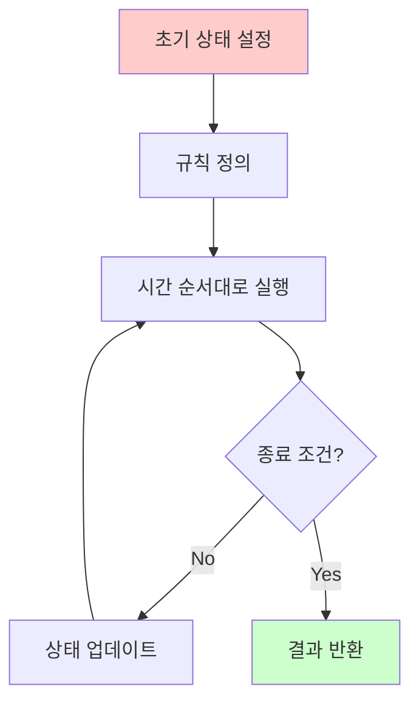
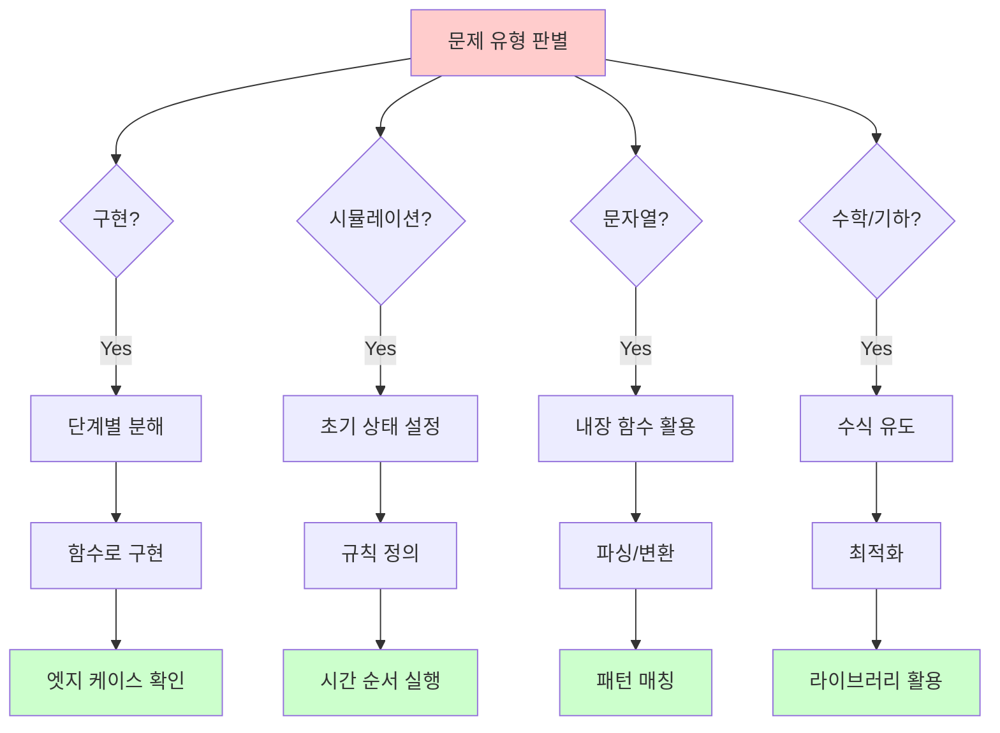

# 1. 문제 유형별 전략

코딩 테스트 문제는 여러 유형으로 분류할 수 있으며, 각 유형마다 효과적인 접근 방법이 있습니다. 유형을 빠르게 파악하고 적절한 전략을 적용하면 문제 해결이 쉬워집니다.

:::div{.callout}
**주요 문제 유형**

1. **구현**: 시뮬레이션, 완전 탐색
2. **시뮬레이션**: 주어진 규칙대로 구현
3. **문자열**: 파싱, 변환, 패턴 매칭
4. **수학/기하**: 수식, 최적화, 기하학
:::

# 2. 구현 문제

## 2.1 특징

- 복잡한 조건을 코드로 구현
- 알고리즘보다는 구현 능력 테스트
- 실수하기 쉬운 조건 처리가 핵심

## 2.2 접근 전략

<highlight>구현 문제 해결 4단계</highlight>

1. **문제를 단계별로 분해**
2. **각 단계를 함수로 구현**
3. **엣지 케이스 철저히 확인**
4. **작은 입력으로 먼저 테스트**

## 2.3 예제: 상하좌우 이동

```python
def simulate_movement(n, moves):
    """
    N×N 격자에서 시작점 (1,1)에서 이동
    L: 왼쪽, R: 오른쪽, U: 위, D: 아래
    격자를 벗어나는 이동은 무시
    """
    x, y = 1, 1  # 시작 위치

    # 이동 방향 정의
    directions = {
        'L': (0, -1),
        'R': (0, 1),
        'U': (-1, 0),
        'D': (1, 0)
    }

    for move in moves:
        dx, dy = directions[move]
        nx, ny = x + dx, y + dy

        # 범위 확인
        if 1 <= nx <= n and 1 <= ny <= n:
            x, y = nx, ny

    return x, y

# 3. 테스트
n = 5
moves = ['R', 'R', 'R', 'U', 'D', 'D']
print(simulate_movement(n, moves))  # (2, 4)
```

## 3.1 예제: 시각

```python
def count_3_in_time(n):
    """
    00시 00분 00초 ~ N시 59분 59초까지
    3이 하나라도 포함되는 경우의 수
    """
    count = 0

    for hour in range(n + 1):
        for minute in range(60):
            for second in range(60):
                # 시각을 문자열로 변환하여 3 포함 확인
                time_str = f"{hour:02d}{minute:02d}{second:02d}"
                if '3' in time_str:
                    count += 1

    return count

# 4. 테스트
print(count_3_in_time(5))  # 11475
```

## 4.1 구현 문제 체크리스트

```python
"""
구현 문제 체크리스트

□ 조건을 정확히 이해했는가?
  - 복잡한 조건을 단계별로 분해
  - 각 조건의 우선순위 파악

□ 좌표계를 정확히 이해했는가?
  - (행, 열) vs (x, y)
  - 0-based vs 1-based
  - 상하좌우 방향 정의

□ 범위를 확인했는가?
  - 격자 벗어남 체크
  - 배열 인덱스 범위

□ 특수한 경우를 고려했는가?
  - 시작/끝 위치
  - 대각선 이동
  - 회전/반전
"""
```

# 5. 시뮬레이션 문제

## 5.1 특징

- 주어진 규칙을 그대로 구현
- 시간 순서대로 상태 변화 추적
- 복잡한 로직의 정확한 구현이 중요

## 5.2 접근 전략



## 5.3 예제: 로봇 청소기

```python
def robot_cleaner(room, robot_pos, direction):
    """
    로봇 청소기 시뮬레이션
    room: 2차원 격자 (0: 청소 안됨, 1: 벽)
    robot_pos: 로봇 위치 (r, c)
    direction: 방향 (0:북, 1:동, 2:남, 3:서)
    """
    n, m = len(room), len(room[0])
    r, c = robot_pos
    d = direction

    # 방향: 북(0), 동(1), 남(2), 서(3)
    dr = [-1, 0, 1, 0]
    dc = [0, 1, 0, -1]

    cleaned = [[False] * m for _ in range(n)]
    count = 0

    while True:
        # 1. 현재 위치 청소
        if not cleaned[r][c] and room[r][c] == 0:
            cleaned[r][c] = True
            count += 1

        # 2. 왼쪽 방향부터 차례대로 탐색
        moved = False
        for _ in range(4):
            d = (d + 3) % 4  # 왼쪽으로 회전
            nr = r + dr[d]
            nc = c + dc[d]

            # 청소하지 않은 빈 칸이면 이동
            if 0 <= nr < n and 0 <= nc < m:
                if room[nr][nc] == 0 and not cleaned[nr][nc]:
                    r, c = nr, nc
                    moved = True
                    break

        # 3. 네 방향 모두 청소되어 있거나 벽이면
        if not moved:
            # 후진
            back_d = (d + 2) % 4
            nr = r + dr[back_d]
            nc = c + dc[back_d]

            if 0 <= nr < n and 0 <= nc < m and room[nr][nc] == 0:
                r, c = nr, nc
            else:
                break  # 후진 불가능하면 종료

    return count

# 6. 테스트
room = [
    [1, 1, 1, 1],
    [1, 0, 0, 1],
    [1, 0, 0, 1],
    [1, 1, 1, 1]
]
print(robot_cleaner(room, (1, 1), 0))  # 4
```

## 6.1 예제: 뱀 게임

```python
from collections import deque

def snake_game(n, apples, moves):
    """
    뱀 게임 시뮬레이션
    n: 보드 크기
    apples: 사과 위치 리스트
    moves: (시간, 방향) 리스트
    """
    # 방향: 우(0), 하(1), 좌(2), 상(3)
    dx = [0, 1, 0, -1]
    dy = [1, 0, -1, 0]

    # 뱀의 위치 (덱으로 관리)
    snake = deque([(0, 0)])
    direction = 0  # 처음엔 오른쪽
    time = 0

    # 사과 위치 (집합으로 관리)
    apple_set = set(apples)

    # 방향 전환 정보
    move_dict = {t: d for t, d in moves}

    while True:
        time += 1

        # 머리 이동
        head_x, head_y = snake[0]
        nx = head_x + dx[direction]
        ny = head_y + dy[direction]

        # 벽에 부딪힘
        if nx < 0 or nx >= n or ny < 0 or ny >= n:
            break

        # 자기 몸에 부딪힘
        if (nx, ny) in snake:
            break

        # 머리 추가
        snake.appendleft((nx, ny))

        # 사과 먹기
        if (nx, ny) in apple_set:
            apple_set.remove((nx, ny))
        else:
            # 사과 없으면 꼬리 제거
            snake.pop()

        # 방향 전환
        if time in move_dict:
            if move_dict[time] == 'L':  # 왼쪽
                direction = (direction + 3) % 4
            else:  # 오른쪽
                direction = (direction + 1) % 4

    return time

# 7. 테스트
n = 6
apples = [(3, 4), (2, 5), (5, 3)]
moves = [(3, 'D'), (15, 'L'), (17, 'D')]
print(snake_game(n, apples, moves))  # 9
```

# 8. 문자열 처리

## 8.1 특징

- 문자열 파싱, 변환, 비교
- 정규 표현식 활용
- 부분 문자열, 패턴 매칭

## 8.2 자주 사용하는 문자열 함수

```python
# 9. 기본 연산
s = "Hello World"
print(s.upper())  # "HELLO WORLD"
print(s.lower())  # "hello world"
print(s.split())  # ['Hello', 'World']
print(s.replace('o', '0'))  # "Hell0 W0rld"

# 10. 검색
print(s.find('o'))  # 4 (첫 번째 위치)
print(s.count('o'))  # 2 (개수)
print(s.startswith('Hello'))  # True
print(s.endswith('World'))  # True

# 11. 변환
print(s.strip())  # 공백 제거
print(s.zfill(20))  # 왼쪽 0 채우기
print(''.join(['a', 'b', 'c']))  # "abc"

# 12. 확인
print(s.isalpha())  # False (공백 포함)
print(s.isdigit())  # False
print('123'.isdigit())  # True
```

## 12.1 예제: 문자열 압축

```python
def compress_string(s):
    """
    문자열 압축: 연속된 같은 문자를 개수와 함께 표현
    aabbaccc → a2b2a1c3
    가장 짧은 길이 반환
    """
    if not s:
        return 0

    min_len = len(s)

    # 단위를 1부터 len(s)//2까지 시도
    for unit in range(1, len(s) // 2 + 1):
        compressed = ""
        prev = s[:unit]
        count = 1

        for i in range(unit, len(s), unit):
            current = s[i:i+unit]

            if current == prev:
                count += 1
            else:
                compressed += prev + str(count)
                prev = current
                count = 1

        # 마지막 그룹 추가
        compressed += prev + str(count)
        min_len = min(min_len, len(compressed))

    return min_len

# 13. 테스트
print(compress_string("aabbaccc"))  # 7 (a2b2a1c3)
print(compress_string("ababcdcdababcdcd"))  # 9 (ab2cd2ab2cd2)
print(compress_string("abcabcdede"))  # 8 (2ab2cd2de)
print(compress_string("abcabcabcabcdededededede"))  # 14
```

## 13.1 예제: 문자열 재정렬

```python
def reorder_string(s):
    """
    문자열에서 알파벳은 사전순, 숫자는 합계로 재정렬
    K1KA5CB7 → ABCKK13
    """
    letters = []
    numbers = []

    for char in s:
        if char.isalpha():
            letters.append(char)
        else:
            numbers.append(int(char))

    letters.sort()
    result = ''.join(letters)

    if numbers:
        result += str(sum(numbers))

    return result

# 14. 테스트
print(reorder_string("K1KA5CB7"))  # "ABCKK13"
print(reorder_string("AJKDLSI412K4JSJ9D"))  # "ADDIJJJKKLSS20"
```

## 14.1 예제: 괄호 변환

```python
def is_balanced(s):
    """올바른 괄호 문자열인지 확인"""
    count = 0
    for char in s:
        if char == '(':
            count += 1
        else:
            count -= 1
        if count < 0:
            return False
    return count == 0

def split_uv(p):
    """균형잡힌 괄호 문자열을 u, v로 분리"""
    count = 0
    for i, char in enumerate(p):
        if char == '(':
            count += 1
        else:
            count -= 1
        if count == 0:
            return p[:i+1], p[i+1:]

def convert(p):
    """괄호 변환 알고리즘"""
    if not p:
        return ""

    u, v = split_uv(p)

    if is_balanced(u):
        return u + convert(v)
    else:
        result = '(' + convert(v) + ')'
        # u의 첫/마지막 제거하고 나머지 뒤집기
        for char in u[1:-1]:
            if char == '(':
                result += ')'
            else:
                result += '('
        return result

# 15. 테스트
print(convert("(()())()"))  # "(()())()"
print(convert(")("))  # "()"
print(convert("()))((()"))  # "()(())()"
```

# 16. 수학 및 기하 문제

## 16.1 수학 문제 유형

### 16.1.1 소수 판별

```python
def is_prime(n):
    """소수 판별 - O(√n)"""
    if n < 2:
        return False

    for i in range(2, int(n**0.5) + 1):
        if n % i == 0:
            return False

    return True

# 17. 에라토스테네스의 체 - O(n log log n)
def sieve_of_eratosthenes(n):
    """n 이하의 모든 소수 찾기"""
    is_prime = [True] * (n + 1)
    is_prime[0] = is_prime[1] = False

    for i in range(2, int(n**0.5) + 1):
        if is_prime[i]:
            for j in range(i*i, n + 1, i):
                is_prime[j] = False

    return [i for i in range(n + 1) if is_prime[i]]

# 18. 테스트
print(is_prime(17))  # True
print(sieve_of_eratosthenes(20))  # [2, 3, 5, 7, 11, 13, 17, 19]
```

### 18.0.1 최대공약수와 최소공배수

```python
def gcd(a, b):
    """최대공약수 (유클리드 호제법)"""
    while b:
        a, b = b, a % b
    return a

def lcm(a, b):
    """최소공배수"""
    return a * b // gcd(a, b)

# 19. Python 3.5+에서는 math 모듈 사용
import math
print(math.gcd(12, 18))  # 6
```

### 19.0.1 조합과 순열

```python
def factorial(n):
    """팩토리얼"""
    if n <= 1:
        return 1
    return n * factorial(n - 1)

def permutation(n, r):
    """순열 nPr"""
    return factorial(n) // factorial(n - r)

def combination(n, r):
    """조합 nCr"""
    return factorial(n) // (factorial(r) * factorial(n - r))

# 20. Python에서는 math 모듈 사용
import math
print(math.perm(5, 3))  # 60 (5P3)
print(math.comb(5, 3))  # 10 (5C3)
```

## 20.1 기하 문제

### 20.1.1 거리 계산

```python
def manhattan_distance(p1, p2):
    """맨해튼 거리"""
    return abs(p1[0] - p2[0]) + abs(p1[1] - p2[1])

def euclidean_distance(p1, p2):
    """유클리드 거리"""
    return ((p1[0] - p2[0])**2 + (p1[1] - p2[1])**2)**0.5

# 21. 테스트
print(manhattan_distance((0, 0), (3, 4)))  # 7
print(euclidean_distance((0, 0), (3, 4)))  # 5.0
```

### 21.0.1 직선 및 도형

```python
def is_point_in_rectangle(point, rect):
    """점이 직사각형 내부에 있는지 확인"""
    x, y = point
    x1, y1, x2, y2 = rect
    return x1 <= x <= x2 and y1 <= y <= y2

def is_point_in_circle(point, center, radius):
    """점이 원 내부에 있는지 확인"""
    distance = euclidean_distance(point, center)
    return distance <= radius

# 22. 테스트
print(is_point_in_rectangle((2, 3), (0, 0, 5, 5)))  # True
print(is_point_in_circle((3, 4), (0, 0), 5))  # True
```

## 22.1 예제: 소수 찾기 (순열)

```python
from itertools import permutations

def count_primes_from_digits(numbers):
    """
    숫자로 만들 수 있는 모든 조합 중 소수 개수
    numbers: "17"
    """
    def is_prime(n):
        if n < 2:
            return False
        for i in range(2, int(n**0.5) + 1):
            if n % i == 0:
                return False
        return True

    # 가능한 모든 조합
    candidates = set()
    for i in range(1, len(numbers) + 1):
        for perm in permutations(numbers, i):
            num = int(''.join(perm))
            candidates.add(num)

    # 소수 개수
    return sum(1 for num in candidates if is_prime(num))

# 23. 테스트
print(count_primes_from_digits("17"))  # 3 (7, 17, 71)
print(count_primes_from_digits("011"))  # 2 (11, 101)
```

# 24. 유형별 전략 정리



# 25. 유형별 핵심 팁

<highlight>문제 유형별 핵심 전략</highlight>

## 25.1 구현 문제
- 조건을 정확히 이해하고 단계별로 분해
- 좌표계와 방향 정의 명확히
- 엣지 케이스 철저히 확인

## 25.2 시뮬레이션
- 초기 상태를 정확히 설정
- 규칙을 코드로 정확히 구현
- 종료 조건 명확히

## 25.3 문자열 처리
- 내장 함수 최대한 활용
- 정규 표현식 고려
- 문자열 불변성 주의

## 25.4 수학/기하
- 공식 유도 시도
- 라이브러리 활용 (math, itertools)
- 오버플로우 주의

```python
# 26. 유형별 템플릿 예시

# 27. 구현
def implementation(grid, commands):
    """구현 문제 템플릿"""
    # 1. 초기 상태
    state = initialize()

    # 2. 명령 수행
    for cmd in commands:
        state = execute(state, cmd)

    # 3. 결과 반환
    return get_result(state)

# 28. 시뮬레이션
def simulation(initial_state, rules, time_limit):
    """시뮬레이션 템플릿"""
    state = initial_state
    time = 0

    while time < time_limit:
        state = apply_rules(state, rules)
        time += 1

        if is_finished(state):
            break

    return state

# 29. 문자열
def string_processing(s):
    """문자열 처리 템플릿"""
    # 1. 파싱
    parsed = parse(s)

    # 2. 변환
    transformed = transform(parsed)

    # 3. 결과 생성
    return generate_result(transformed)

# 30. 수학/기하
def math_problem(n):
    """수학 문제 템플릿"""
    # 1. 공식 유도
    formula = derive_formula(n)

    # 2. 계산
    result = calculate(formula)

    # 3. 최적화 (필요시)
    return optimize(result)
```

# 31. 정리

- 구현: 조건 분해, 함수화, 엣지 케이스 확인
- 시뮬레이션: 초기 상태, 규칙 정의, 순차 실행
- 문자열: 내장 함수, 파싱, 패턴 매칭
- 수학/기하: 공식 유도, 라이브러리 활용
- 유형 파악이 문제 해결의 시작
- 각 유형별 템플릿 숙지
