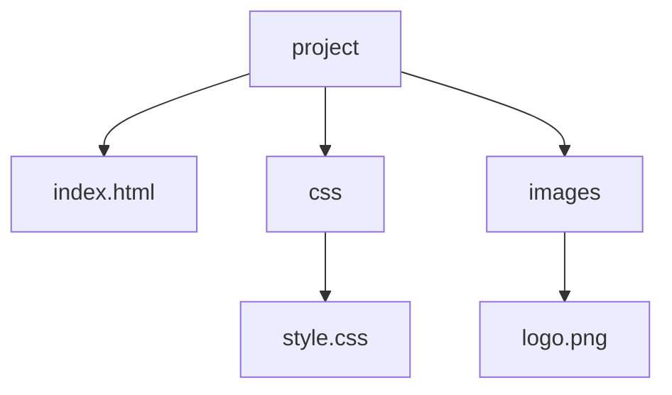

# 1. 웹 브라우저: Chrome

<highlight>수업에서 사용하는 웹 브라우저는 Chrome입니다. Chrome은 가장 많은 사용자를 보유하고 있으며, 개발자 도구가 가장 잘 구성되어 있습니다.</highlight> 개발자 도구를 통해 웹 페이지의 HTML, CSS, JavaScript를 확인하고 수정할 수 있습니다.

::a[Chrome 웹브라우저]{class="btn-link" href="https://www.google.co.kr/chrome/?brand=IBEF&gclid=CjwKCAiAuOieBhAIEiwAgjCvcrLkFa-fE5W5vcZtak-KGqw6lqvwuSpha8iOdULeM9PJgdOf5EhliBoCsgEQAvD_BwE&gclsrc=aw.ds" target="\_blank"}

## 1.1 확장 프로그램

1. HeadingsMap

   브라우저에서 제목 태그들을 모아놓고 목차처럼 볼 수 있게 해주는 확장프로그램 입니다.
   ::a[HeadingsMap]{class="btn-link" href="https://chrome.google.com/webstore/detail/headingsmap/flbjommegcjonpdmenkdiocclhjacmbi/related?hl=ko" target="\_blank"}

2. OpenWAX

   웹 페이지의 접근성 진단을 쉽게 할 수 있도록 제작된 도구입니다.
   ::a[OpenWAX]{class="btn-link" href="https://chrome.google.com/webstore/detail/openwax/bfahpbmaknaeohgdklfbobogpdngngoe/related?hl=ko" target="\_blank"}

# 2. 폴더 및 파일 이름 규칙

웹 개발에서 파일과 폴더 이름을 올바르게 작성하는 것은 오류를 방지하고 SEO에도 도움이 됩니다.

## 2.1 기본 규칙

- **공백 없이 영문 소문자를 사용**합니다.
  - 컴퓨터와 웹 서버가 영문 대소문자를 구분하기 때문에, 소문자로 일관되게 작성하면 오류를 줄일 수 있습니다.
  - 브라우저, 웹 서버, 프로그래밍 언어들은 공백을 일관되게 처리하지 않기 때문에 공백 사용을 피해야 합니다.

- **언더바**(`_`) 대신 **하이픈**(`-`)을 사용하는 것이 좋습니다.
  - 구글 검색 엔진은 하이픈을 단어 구분자로 인식하기 때문입니다.
  - 예: `lion_resting_on_the_road.png` → `lion-resting-on-the-road.png`

:::div{.callout}
폴더 및 파일 이름을 올바르게 작성하면 SEO(검색 엔진 최적화)에도 도움이 됩니다.
:::

# 3. 파일 구조 및 파일 경로

웹 프로젝트에서 파일을 체계적으로 관리하는 것은 매우 중요합니다.

## 3.1 상대 경로

현재 열린 파일을 기준으로 상대적인 경로를 의미합니다.

| 표기법 | 의미 |
| --- | --- |
| `./` | 현재 폴더 |
| `../` | 상위 폴더 |
| `./폴더명/` | 하위 폴더 |

**예시**
- **index.html** 기준으로 style.css 파일: `./css/style.css` 또는 `/css/style.css`
- **style.css** 기준으로 logo.png 파일: `../images/logo.png`

## 3.2 절대 경로

`http://`, `https://`로 시작하는 도메인 네임이 포함된 인터넷상의 유일한 절대적인 경로(URL)를 의미합니다.

# 4. 개발자 도구

<highlight>개발자 도구는 웹 페이지의 HTML, CSS, JavaScript를 확인하고 수정할 수 있는 도구입니다.</highlight> Chrome에서는 **F12** 키를 눌러 개발자 도구를 열 수 있습니다. 개발자 도구를 통해 웹 페이지의 요소를 확인하고 수정할 수 있으며, 네트워크, 콘솔, 소스, 성능 등 다양한 탭을 통해 웹 페이지의 동작을 확인할 수 있습니다.

| 운영체제 | 단축키 |
| --- | --- |
| Windows | `Ctrl + Shift + I` 또는 `F12` |
| macOS | `Cmd + Option + I` 또는 `F12` |

개발자 도구의 주요 탭은 다음과 같습니다.

| 탭 | 설명 |
| --- | --- |
| Elements | HTML 구조와 CSS 스타일 확인 및 수정 |
| Console | JavaScript 실행 및 오류 확인 |
| Network | 네트워크 요청 및 응답 확인 |
| Sources | JavaScript 디버깅 |
| Application | 쿠키, 로컬 스토리지 등 저장소 확인 |
