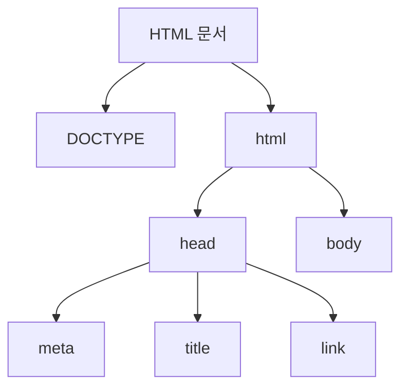
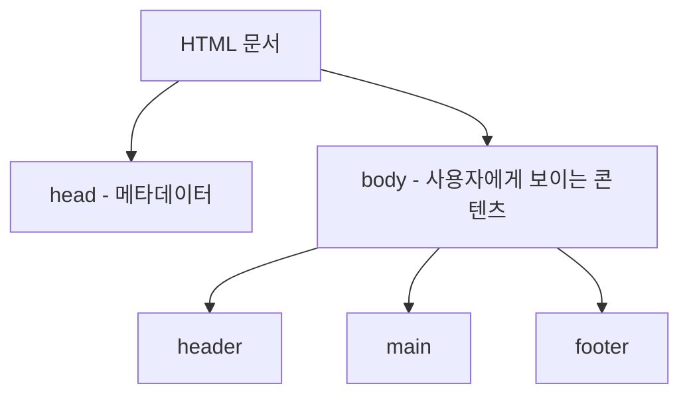

<highlight>HTML의 기본 구조에 대해 알아보겠습니다.</highlight> 여러분 컴퓨터에서 VS Code를 열어 새로운 HTML 파일을 생성해보세요. `Ctrl` + `N` (Windows) 또는 `Cmd` + `N` (Mac) 단축키를 사용하면 새로운 파일을 생성할 수 있습니다. 이 파일을 `index.html`이라는 이름으로 저장해주세요. `Ctrl` + `S` (Windows) 또는 `Cmd` + `S` (Mac) 단축키를 사용하면 파일을 저장할 수 있습니다. 저장을 다 했다면 `!` + `tab` 을 눌러 보세요. 기본 템플릿이 생성됩니다.

```html
<!DOCTYPE html>
<html lang="ko-KR">
  <head>
    <meta charset="utf-8" />
    <meta http-equiv="X-UA-Compatible" content="IE=edge" />
    <meta name="viewport" content="width=device-width, initial-scale=1.0" />
    <title>My test page</title>
  </head>
  <body>
    
    <script src="./script.js"></script>
  </body>
</html>
```

:::div{.callout}

**왜 `index.html`일까요?**

`index.html` 파일 이름은 웹 개발에서 매우 특별한 의미를 가지고 있습니다. 이 이름은 전통적으로 웹사이트나 웹 어플리케이션의 진입점 또는 시작 페이지로 사용되는 HTML 파일을 지칭합니다.

1. **웹 서버의 기본 설정**: 대부분의 웹 서버는 특정 디렉토리에 대한 HTTP 요청을 받을 때 기본적으로 `index.html` 파일을 찾습니다. 즉, 사용자가 웹사이트의 루트 디렉토리(예: `http://example.com/`)에 접근하려고 할 때, 웹 서버는 자동으로 `http://example.com/index.html`을 제공합니다. 이는 웹 서버의 기본 구성이며, 별도의 설정 없이도 작동합니다.

2. **관례와 편의성**: `index.html`은 웹 개발 커뮤니티에서 널리 받아들여진 관례입니다. 이 관례를 따르면 새로운 개발자나 팀원이 프로젝트에 참여할 때 프로젝트의 구조를 더 쉽게 이해할 수 있습니다. 또한, 사용자와 개발자 모두가 웹사이트의 메인 페이지를 찾기 쉽게 만들어줍니다.

3. **역사적인 이유**: 초기 웹 개발 단계에서 `index.html` 파일을 사용하는 관례가 생겨났습니다. 초기 웹 사이트들은 파일 구조가 단순했고, `index.html`은 디렉토리의 주요 내용을 나타내는 인덱스 역할을 했습니다. 이 관례는 시간이 지남에 따라 유지되어 왔습니다.

:::

# 1. DOCTYPE



`<!DOCTYPE html>`은 HTML Living Standard 문서라는 의미의 선언문입니다. 이 선언문을 통해 브라우저가 어떤 모드로 페이지를 렌더링할지 결정하며, 작성 시 완전 표준 모드로 렌더링됩니다.

- 현재는 매우 간단해졌습니다. `<!DOCTYPE html>` 이것만 써주면 됩니다. "이 문서는 최신 HTML 표준을 사용합니다"라고 브라우저에게 알려주는 것과 같습니다.
- 예전에는 복잡했습니다. HTML의 여러 버전과 종류가 있었기 때문에, 긴 코드로 정확히 어떤 버전을 사용하는지 명시해야 했습니다.

  ```html
  <!-- HTML 4.01 Strict -->
  <!DOCTYPE html PUBLIC "-//W3C//DTD HTML 4.01//EN" "http://www.w3.org/TR/html4/strict.dtd">

  <!-- HTML 4.01 Transitional -->
  <!DOCTYPE html PUBLIC "-//W3C//DTD HTML 4.01 Transitional//EN" "http://www.w3.org/TR/html4/loose.dtd">
  ```

  - 이것을 DTD (Document type Definition) 라고 부르며 다양한 DTD를 사용하여 문서 유형을 지정했습니다.
  - 만약 DOCTYPE을 제거하면 브라우저는 오래된 웹 페이지로 간주하고, 쿼크 모드(quirks mode : 하위 호환성 모드)로 html을 렌더링하게 됩니다.
    - 쿼크 모드는 브라우저마다 페이지 렌더링 방식이 다를 수 있고 최신 웹 표준을 완전히 지원하지 않을 수 있으며 예상치 못한 레이아웃이나 스타일 문제가 발생할 수 있습니다.
  - 그렇기에 DOCTYPE을 반드시 **문서 최상단에 선언해야 합니다.**

::a[표준 모드와 호환 모드]{class='btn-link' href="https://developer.mozilla.org/ko/docs/Web/HTML/Quirks_Mode_and_Standards_Mode" target="\_blank"}

# 2. html 태그

`<html>` 태그는 HTML 문서의 루트(최상위) 태그입니다.

- 시작 태그는 HTML 문서의 시작을, 닫는 태그는 HTML 문서의 끝을 나타냅니다.
- 모든 HTML 요소는 `<html>` 태그 내에 포함되어야 합니다.

## 2.1 lang 속성

`lang` 속성을 통해 해당 페이지의 주 언어를 설정할 수 있습니다.

```html
<html lang="ko-KR">
```

**lang 속성의 역할**
- 검색 엔진이 언어별로 검색 결과를 제공하는 데 활용
- 스크린리더가 음성 표현에 사용할 언어를 선택
- 브라우저의 번역 기능 제공에 영향
- 언어별 기본 서체 적용 (macOS에서 `en`으로 설정하고 한글을 작성하면 궁서체로 표시될 수 있음)

**언어코드 형식**: 언어코드(소문자)-국가코드(대문자)

| 언어코드 | 언어 | 국가코드(국가) |
| --- | --- | --- |
| ko | 한국어 | KR(대한민국), KP(북한) |
| en | 영어 | US(미국), GB(영국), PH(필리핀) |
| zh | 중국어 | CN(중국), HK(홍콩), TW(대만), Hans(간체), Hant(번체) |
| ja | 일본어 | - |
| de | 독일어 | - |

# 3. head 태그

<highlight>`<head>` 태그는 문서의 메타데이터를 담는 영역입니다.</highlight>

- 문자 인코딩, 타이틀, 설명, 스타일시트, 스크립트 등 기계가 식별할 수 있는 문서 정보(메타데이터)를 담습니다.
- 검색 엔진을 위한 다양한 정보들이 담기는 곳입니다.
- 사용자에게는 제목(title), 파비콘(favicon), 뷰포트(viewport) 정보 등이 보이게 됩니다.

## 3.1 meta 태그

메타데이터란 "**어떤 목적을 위해 만들어진 데이터**"를 의미합니다. 검색 엔진은 메타 정보를 살펴보고 페이지의 다양한 정보를 가져갑니다.

**charset**

```html
<meta charset="utf-8" />
```

- 문자 깨짐 오류가 발생할 수 있으므로 문자 코드의 종류를 설정해 줍니다.
- `utf-8`은 전 세계적인 언어들을 지원하도록 합니다. 그래서 어떤 언어로 작성하더라도 웹페이지를 읽을 수 있습니다. 국제적인 코드 규약입니다.
- 과거에는 한국어 인코딩을 위해 `euc-kr` 를 사용하기도 했었습니다. 영어 이외의 외국어를 표현하기에는 어려움이 있으므로 권장하지 않습니다.

**http-equiv="X-UA-Compatible" content="IE=edge"**

```html
<meta http-equiv="X-UA-Compatible" content="IE=edge" />
```

- 브라우저 호환성을 위해 작성해줍니다. IE의 최신 표준 모드를 보여주겠다는 의미입니다.
- IE의 다양한 버전(6-11) 때문에 같은 페이지도 다르게 보여지는 경우가 있었습니다. 그러한 문제를 해결하기 위해 작성해주는 코드입니다

**name=”” content=””**

```html
<meta
  name="description"
  content="Google 지도에서 지역정보를 검색하고 지도를 살펴보거나 운전경로 정보를 검색합니다."
/>
```

- `name`과 `content` 특성을 함께 사용하면 문서의 메타데이터를 이름-값 쌍으로 제공합니다.
- `name`은 화면 전체 페이지에 적용되는 "문서 레벨 메타데이터”를 제공합니다. 어떤 형태의 정보(viewport, description, author…)를 가졌는지를 의미합니다.
- `content`는 실제 메타데이터의 요소입니다.

**viewport**

```html
<meta name="viewport" content="width=device-width, initial-scale=1.0" />
```

이 코드는 모바일 장치와 같은 다양한 디바이스에서 웹 페이지의 표시 방식을 제어합니다

- `width`: 뷰포트의 너비를 제어합니다. `width=600` 과 같이 픽셀값으로 지정할 수도 있습니다.
- `height`: 뷰포트의 높이를 제어합니다.
- `initial-scale` : 페이지가 처음 로드될 때 확대/축소 수준을 제어합니다. 최소 0.1 - 기본 1 - 최대 10
- `minimum-scale`: 축소 정도를 제어합니다.
- `maximum-scale`: 페이지에 허용되는 확대 정도를 제어합니다. 3보다 작은 값은 접근성에 맞지 않습니다
- `user-scalable=no` 과 속성을 주어 사용자가 화면크기를 제어 못하게 하는 경우도 있습니다. 하지만 다양한 디바이스 크기, 노안, 저시력 등의 다양한 상황을 고려해야 하므로 특수한 상황이 아니라면 사용하지 않는 게 좋습니다. 해당 속성을 사용해도 접근성을 위해서 무시하는 브라우저도 있습니다.

## 3.2 title 태그

`<title>` 태그는 브라우저의 제목 표시줄이나 페이지 탭에 보이는 문서 제목을 정의합니다.

- 특수문자는 제외하고 텍스트만 포함하세요.
- 검색 엔진은 이 제목을 보고 사용자가 탐색할 페이지를 선택합니다.
- 페이지마다 적당한 제목이 노출되도록 개발하는 것이 중요합니다.
- **약 60자를 넘지 않아야 합니다.** 그보다 길어지면 브라우저에서 노출되는 제목이 축소되어 보일 수 있습니다.
  :::figure
  ::img{width="400" alt="" src="/images/html-css/chapter02/Untitled.png"}
  ::figcaption[서울시청 홈페이지 title]
  :::

## 3.3 link 태그

`<link>` 태그는 현재 문서와 외부 리소스의 관계를 명시합니다.

- 외부 스타일 시트, 폰트, 파비콘을 연결할 때 사용합니다.
- 빈 태그로, 속성만을 포함합니다.
- `head` 요소 내부에만 위치할 수 있습니다.

| 속성 | 설명 |
| --- | --- |
| `rel` | relations(관계). 대상 파일의 속성을 나타냅니다 |
| `href` | hyper-references(경로). 연결 시 참조할 파일의 위치를 나타냅니다 |

```html
<html>
  <head>
    <!-- 스타일 시트 링크 -->
    <link rel="stylesheet" href="style.css" />

    <!-- 폰트 링크 -->
    <link rel="stylesheet" href="font.ttf" />

    <!-- 파비콘 링크 -->
    <link rel="shortcut icon" href="favicon.ico" />
  </head>
  <body></body>
</html>
```

# 4. body 태그

<highlight>`<body>` 태그는 사용자에게 보이는 영역입니다.</highlight>

이 영역에 작성하는 모든 콘텐츠(텍스트, 이미지, 비디오, 링크 등)가 웹 브라우저에 표시됩니다. 본격적으로 우리가 작성할 영역입니다.


