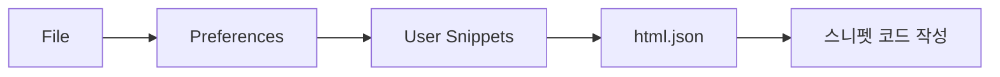

# 1. 스니펫(Snippet)이란?

<highlight>스니펫은 자주 사용하는 코드 조각을 미리 저장해두고 짧은 키워드로 불러와 사용할 수 있게 해주는 기능입니다.</highlight>

개발 시 반복적으로 작성하는 코드 패턴(예: HTML 기본 구조, 함수 템플릿, 자주 쓰는 CSS 속성 세트 등)을 매번 직접 타이핑하는 대신, 몇 글자만 입력하고 Tab 키를 누르면 미리 정의해둔 전체 코드가 자동으로 삽입됩니다.

**스니펫 사용의 장점**
- 반복 작업 감소로 개발 속도 향상
- 오타 방지
- 일관된 코드 스타일 유지

# 2. 스니펫 설정하기



`!!` 을 입력하면 한국어 Snippet이 나오게 직접 설정해봅시다.

1.  VSCode에서 `File` > `Preferences` > `User Snippets` 메뉴를 클릭합니다.
2.  드롭다운 목록에서 `html.json`을 선택합니다.

:::figure
![[한글] 설정 - 사용자 코드 조각](/images/html-css/chapter02/Frame_56.png)
::figcaption[[한글] 설정 - 사용자 코드 조각]
:::

<toggle> 만약 아래에 자동 완성 `html.json` 리스트가 뜨지 않는다면? ::
최초 스니펫 설정 시 자동 완성이 뜨지 않을 수 있습니다.
그럴 땐 `html`만 입력하여 항목을 클릭하면 동일하게 적용할 수 있습니다.
</toggle>

3. Snippet Generator 사이트에 들어가 원하는 코드 조각을 정의합니다. 이때 `$1`, `$2` 등을 통해 Tab 키로 이동 가능한 커서 위치를 지정할 수 있습니다.

::a[Snippet Generator]{class='btn-link' href="https://snippet-generator.app/" target="\_blank"}

```html
<!DOCTYPE html>
<html lang="ko-KR">
  <head>
    <meta charset="UTF-8" />
    <meta name="viewport" content="width=device-width, initial-scale=1.0" />
    <title>$1</title>
  </head>
  <body>
    $2
  </body>
</html>
```

4. `{ }` 중괄호 안에 복사한 스니펫을 붙여넣습니다.

---

**vscode에서 제공하는 변수**

::a[vscode에서 제공하는 스니펫]{class='btn-link' href="https://code.visualstudio.com/docs/editor/userdefinedsnippets#_variables/" target="\_blank"}
