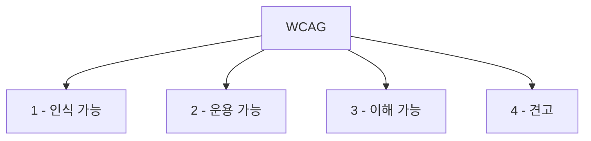

# 1. 웹 접근성이란?

<highlight>어떠한 사용자(장애인, 고령자, 저시력, 저속 네트워크, 키보드 사용자 등)라도 웹에서 제공하는 정보와 기능에 동등하게 접근할 수 있도록 보장하는 것을 말합니다.</highlight>

::a[웹접근성이란? > WA : 한국웹접근성인증평가원]{class='btn-link' href="http://www.wa.or.kr/m1/sub1.asp" target="\_blank"}

:::div{.callout}
💡 접근성(accessibility)이란?

“얼마나 쉽게, 누구나 이용할 수 있는가”에 대한 특성입니다.
장애 유무뿐 아니라, 일시적인 상황(깁스, 소음, 밝은 햇빛, 느린 인터넷)도 모두 포함해서 생각할 수 있습니다.

::a[접근성 - 위키백과, 우리 모두의 백과사전]{class='btn-link' href="https://ko.wikipedia.org/wiki/%EC%A0%91%EA%B7%BC%EC%84%B1" target="\_blank"}

:::

# 2. 왜 웹 접근성을 신경 써야 할까?

::a[불평등에 관한 원숭이 실험]{class='btn-link' href="https://www.youtube.com/watch?v=XwXO40qNMzE" target="\_blank"}

인간은 본능적으로 불평등에 대한 저항의식을 가지고 있습니다. 웹의 창시자 팀 버너스-리는 이렇게 말했습니다.

> **'웹의 힘은 그것의 보편성에 있다. 장애에 구애없이 모든 사람이 접근할 수 있어야 한다.'** (The power of the Web is in its universality, Access by everyone regardless of disability is an essential aspect.)

WHO에 따르면, 전 세계 약 13억 명(전체 인구의 약 16%, 6명 중 1명) 이 유의미한 장애를 경험하고 있습니다.

::a[한국웹접근성평가센터]{class='btn-link' href="https://www.who.int/news-room/fact-sheets/detail/disability-and-health?utm_source=chatgpt.com" target="\_blank"}

이들은 종종 다음과 같은 불공정한 조건에 직면합니다.

1. 교육·고용에서의 배제
2. 의료·정보 서비스 접근 장벽
3. 디지털 환경에서의 구조적 차별

**장애 그 자체보다, 우리가 만든 환경이 장애를 더 어렵게 만들고 있을 수도 있습니다.**

웹 접근성에 대해 공부해보는 것.
그것은 단순히 기술적으로 필요하거나 법을 지켜야 해서가 아닌, 원하지 않는 차별에 슬퍼하고 분노하고 있을 다른 사람들을 조금이라도 더 이해하고 도와주려는 노력의 일환으로 바라봤으면 좋겠습니다.

# 3. 법적 근거(대한민국 기준)

- 장애인차별금지 및 권리구제 등에 관한 법률
- 정보통신접근성 향상 관련 고시 및 지침
  ::a[한국웹접근성평가센터]{class='btn-link' href="http://www.kwacc.or.kr/Accessibility/Law" target="\_blank"}
- 장애는 전맹, 저시력, 색맹, 난청 등 우리가 흔히 알고 있는 장애뿐만 아니라 브라우저에 따른 정보 접근 제한, 네트워크에 따른 접속 불안정도 포함이 됩니다.

# 4. 정보에 접근하는 다양한 방법

우리는 “모니터 + 마우스”만 떠올리기 쉽지만, 실제 사용자 환경은 다양합니다.

- 시각장애(전맹) → 스크린 리더
- 시각장애(전맹/저시력)·청각장애 → 점자 정보 단말기
  

- 저시력 → 화면 확대, 고대비 모드
  

- 색각 이상 → 색상 조합에 민감 (색만으로 정보 전달 X)
- 신체적 장애 → 키보드만 사용, 헤드 포인터, 특수 키보드, 스위치 등
  

→ 우리가 올바른 마크업과 키보드 접근, 명확한 대비를 지키면, 이 다양한 사용자들이 “같은 서비스”를 사용할 수 있게 됩니다.

# 5. WCAG

**WCAG(Web Content Accessibility Guidelines)란??**
WCAG는 W3C에서 만든 국제 웹 접근성 지침으로, "어떤 것을 지켜야 '접근 가능한 웹'이라 할 수 있는가"를 기준으로 정리한 문서입니다.

WCAG는 네 가지 원칙으로 구성됩니다.

1. Perceivable (인식 가능)
   텍스트가 아니어도 인식 가능한 대체 수단 제공 (대체 텍스트, 자막 등)

2. Operable (운용 가능)
   키보드만으로 조작 가능, 충분한 시간 제공, 발작 유발 요소 금지

3. Understandable (이해 가능)
   예측 가능한 UI, 명확한 라벨과 안내, 이해하기 쉬운 콘텐츠

4. Robust (견고)
   다양한 브라우저, 보조기술(스크린리더 등)과 호환되도록 마크업을 올바르게 작성

## 5.1 WCAG 규정 준수 수준

::a[WCAG 2.2]{class='btn-link' href="https://www.w3.org/TR/WCAG22/?utm_source=chatgpt.com" target="\_blank"}
현재는 WCAG 2.2가 최신 권고안이며,
2025년 ISO/IEC 40500:2025 국제 표준으로도 채택되었습니다.
대부분의 나라·기관에서 “WCAG 2.1 또는 2.2, Level AA” 를 실무 기준으로 채택하고 있습니다

**WCAG 2.0 레벨 A: 최소 준수**

A레벨 적합성 요구 사항은 본질적으로 웹사이트에 액세스할 수 없게 만드는 요소를 금지합니다. 최소한 WCAG 2.0 A를 충족하지 않는 웹사이트는 장애가 있는 사람들이 사용하는 것이 불가능하거나 매우 어렵습니다.

**WCAG 2.0 레벨 AA: 허용 가능한 보편적인 규정 준수**

AA레벨 적합성 수준은 전 세계 대부분의 접근성 규칙 및 규정에서 사용됩니다. WCAG 2.0 레벨 AA 를 충족하는 웹사이트는 장애가 있거나 경미한 대다수의 사람들이 사용하고 이해할 수 있습니다.

**WCAG 레벨 AAA: 최적의 규정 준수**

AAA레벨 적합성 규정을 준수하면 거의 모든 사용자가 사이트에 접속하여 모든 기능을 경험하는데 무리가 없습니다. 이 수준의 적합성은 웹 경험을 모든 사용자들을 진정으로 평등하게 만드는 이상적인 수준이라고 봐도 좋습니다.

# 6. 한국형 웹 콘텐츠 접근성 지침 (KWCAG)

KWCAG는 WCAG를 기반으로, 한국 웹 환경과 법 체계를 반영해 정리한 지침입니다.

- 공공기관, 공공 서비스 웹사이트는 KWCAG를 기준으로 품질·접근성을 평가받습니다.
- 웹 접근성 인증 마크(WA 마크)도 이 기준을 기반으로 부여됩니다.
  ::a[관련자료 > 자료실 : 한국웹접근성인증평가원 (읽기) > 한국형 웹 콘텐츠 접근성 지침 2.2]{class='btn-link' href="https://www.wa.or.kr/board/view.asp?sn=22592&page=1&search=&SearchString=&BoardID=0004&cate=" target="\_blank"}

## 6.1 KWCAG 중요 검사 항목

**웹 접근성 인증 마크**
::a[정보통신접근성(WA) 인증]{class='btn-link' href="http://www.webwatch.or.kr/Situation/WA_Situation.html?MenuCD=110" target="\_blank"}

# 7. 개발자가 바로 해볼 수 있는 접근성 셀프 체크

## 7.1 Tab 키로만 서비스 돌아보기

구현한 모든 버튼과 앵커, 인풋 요소가 탭으로 탐색 가능한지 확인해봅니다.
탭을 통해서 푸터까지 탐색이 가능해야 합니다. 인피니티 스크롤의 경우 주의해야 합니다.

::a[에어비앤비]{class='btn-link' href="https://www.airbnb.co.kr/" target="\_blank"}

## 7.2 포커싱 확인

- 버튼과 앵커, 인풋 요소에 현재 포커싱이 되어 있다는 표시가 확실히 보여져야 합니다.
- 포커싱 상태의 스타일을 삭제해서는 안 됩니다. 사용자가 현재 자신의 위치를 알 수 없게 됩니다.

## 7.3 색에만 의존하지 않기

에러, 선택 상태 등을 "색만"으로 구분하지 말고 아이콘, 텍스트, 밑줄, 패턴 등을 함께 사용합니다.

## 7.4 접근성 관련 툴 사용하기

| 도구 | 설명 |
| --- | --- |
| Lighthouse | 접근성 항목을 체크하여 검사. 90~100점을 목표로 만들어보기 |
| Siteimprove Accessibility Checker | 여러 필터링을 통해 검사 항목을 선택할 수 있으며, 유형별 색맹 체험이 가능 |

::a[Lighthouse]{class='btn-link' href="https://chromewebstore.google.com/detail/lighthouse/blipmdconlkpinefehnmjammfjpmpbjk?hl=ko" target="\_blank"}
::a[Siteimprove Accessibility Checker]{class='btn-link' href="https://chromewebstore.google.com/detail/siteimprove-accessibility/djcglbmbegflehmbfleechkjhmedcopn" target="\_blank"}

---

**추천 컨텐츠**
::a[인프런 - 아는 만큼 보이는 웹 접근성]{class='btn-link' href="https://www.inflearn.com/course/%EC%95%84%EB%8A%94%EB%A7%8C%ED%81%BC-%EB%B3%B4%EC%9D%B4%EB%8A%94-%EC%9B%B9%EC%A0%91%EA%B7%BC%EC%84%B1-wcag" target="\_blank"}
::a[위니북스 - 아는 만큼 보이는 웹 접근성]{class='btn-link' href="https://www.books.weniv.co.kr/accessibility" target="\_blank"}
::a[네이버 접근성 가이드 페이지]{class='btn-link' href="https://accessibility.naver.com/accessibility" target="\_blank"}
