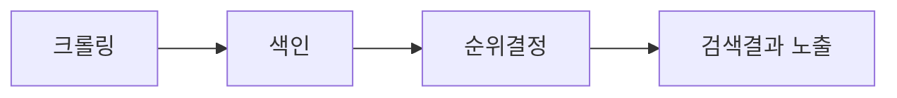

# 1. 검색 엔진이란?

<highlight>검색엔진은 웹에 존재하는 방대한 정보를 수집·분석하여 사용자의 '의도(intent)'에 맞는 결과를 제공하는 시스템입니다.</highlight> 대표적인 검색엔진에는 **Google, Naver, Daum** 등이 있으며, 최근에는 **ChatGPT, Perplexity** 같은 생성형 AI 기반 검색 플랫폼도 빠르게 확산되고 있습니다.

검색엔진은 크롤링(Crawling) → 색인(Indexing) → 순위결정(Ranking)의 과정을 거쳐 웹페이지를 보여줍니다.



::a[Google 검색 개발자 가이드]{class='btn-link' href="https://developers.google.com/search/docs/beginner/seo-starter-guide?hl=ko" target="\_blank"}
::a[Naver Search Advisor]{class='btn-link' href="https://searchadvisor.naver.com/guide/" target="\_blank"}
::a[Daum SEO 가이드]{class='btn-link' href="https://cs.daum.net/faq/15/15649.html#31070" target="\_blank"}

# 2. 검색 엔진 최적화(SEO)란?

**SEO(Search Engine Optimization)** 는 검색 결과에서 웹사이트의 노출도를 높이기 위해 구조, 콘텐츠, 기술을 최적화하는 일련의 전략입니다.
예전에는 “키워드를 얼마나 많이 넣느냐”가 중요했지만, 이제는 **사용자의 검색 의도에 맞는 고품질 콘텐츠와 경험 중심의 설계(UX/Performance)** 가 핵심입니다.

인터넷과 웹기술이 발전하면서 수 많은 정보가 웹서버에 저장되고 있기 때문에 정보의 양 보다는 좋은 정보를 얼마나 빨리 찾을 수 있는가가 중요한 시대가 되었습니다.
:::figure
::img{width="600" alt="" src="/images/html-css/chapter08/Untitled.png"}
::figcaption[구글에 강아지 사료를 검색했을때 나오는 화면. 노출되는 순서에 따라 SEO가 얼마나 잘되어 있는지 파악할 수 있습니다.]
:::

:::figure
::img{width="600" alt="" src="/images/html-css/chapter08/Untitled%201.png"}
::figcaption[2005년 아이트레킹 기술을 이용한 google heat map. 사용자가 먼저 보는곳일 수록 색이 붉습니다. 참고 :https://www.forbes.com/sites/roberthof/2015/03/03/how-do-you-google-new-eye-tracking-study-reveals-huge-changes/?sh=59c8b0373828]
:::

:::figure
::img{width="600" alt="" src="/images/html-css/chapter08/eye.png"}
::figcaption[2015년의 아이트레킹. 사용자의 디바이스 환경 변화로 황금삼각형이 사라진 모습을 확인할 수 있습니다. 참고 :https://www.forbes.com/sites/roberthof/2015/03/03/how-do-you-google-new-eye-tracking-study-reveals-huge-changes/?sh=59c8b0373828]
:::

## 2.1 SEO의 중요성

- **트래픽 확보**: 상위 노출 시 더 많은 방문자 유입
- **신뢰도 상승**: 상위 노출은 브랜드의 권위로 연결
- **비용 효율성**: 유료 광고 대비 장기적인 효과
- **AI 검색 대응**: 생성형 검색(예: Google Gemini, ChatGPT)에서 인용될 수 있는 신뢰도 높은 콘텐츠 확보

# 3. 2025년 SEO 트렌드 요약

:::div{.callout}

AI 검색이 바꾼 검색 환경

최근 검색 환경에서는 생성형 검색 엔진 최적화(GEO) 라는 새로운 개념이 등장하고 있습니다.
구글의 AI Overview, 네이버의 Cue와 같은 기능은 사용자의 질문에 대해 단순히 페이지 목록을 보여주는 것이 아니라, 여러 웹페이지를 읽고 직접 답변을 생성하는 방식으로 정보를 제공합니다.

이 때문에 예전처럼 검색 결과 1위에 올랐더라도, 사용자가 굳이 페이지를 클릭하지 않고 AI가 생성한 답변만 보고 검색을 끝내는 상황이 점점 더 많아지고 있습니다.

:::

## 3.1 검색 방식의 진화 — Generative Search (생성형 검색)와 GEO

기존 검색엔진이 단순히 링크를 보여주는 방식에서 벗어나, AI가 여러 웹페이지를 읽고 요약한 답변을 직접 제공합니다. ChatGPT, Perplexity, Google Gemini 등이 대표적인 예입니다. 사용자가 추가 정보를 얻기 위해 클릭하지 않아도 검색결과에서 바로 답을 볼 수 있습니다. 이를 Zero-Click Search 라고도 부릅니다.

- **개발 포인트**
  - 한 페이지에 하나의 주제를 명확하게 담기
  - 시맨틱 마크업(h1~h6, article, section)으로 구조화
  - FAQ 및 요약문 작성
  - Schema.org 구조화 데이터로 의미 명확히 전달

## 3.2 품질 신호 강화 - E-E-A-T

| 항목                  | 의미                 | 예시                             |
| --------------------- | -------------------- | -------------------------------- |
| **Experience**        | 실제 경험이 담겼는가 | 직접 다녀온 후기, 실제 사용 사진 |
| **Expertise**         | 전문지식이 있는가    | 관련 분야 전문가의 글            |
| **Authoritativeness** | 권위 있는 출처인가   | 공식기관, 언론, 인증된 블로거    |
| **Trustworthiness**   | 신뢰할 수 있는가     | HTTPS, 개인정보 정책, 실명 저자  |

- **개발 포인트**
  - 저자 정보(`author`, `address`, `cite`) 명시
  - 후기·리뷰·사진을 구조화 데이터로 추가
  - HTTPS 적용 및 정책 페이지 구축

## 3.3 토픽 클러스터

과거의 SEO는 특정 키워드 하나를 집중적으로 공략하여 상위 노출을 목표로 했습니다. 그러나 현재는 **사용자의 검색 의도(Topic Intent)** 를 중심으로 정보를 체계적으로 묶어 제공하는 방향으로 발전하고 있습니다.
이러한 방식은 여러 개의 개별 페이지를 하나의 **주제(Topic)** 아래에 묶어, 사용자가 하나의 사이트 안에서 관련된 정보를 연속적으로 탐색할 수 있도록 돕습니다. 이를 **토픽 클러스터(Topic Cluster)** 라고 부릅니다.

```
[메인 토픽] 제주 여행 가이드
├─ [하위1] 제주 숙소 추천
├─ [하위2] 제주 카페 지도
├─ [하위3] 렌터카 팁
└─ [하위4] 여행 경비 계산기
```

이와 같은 구조는 검색엔진이 사이트의 전체 맥락을 더 명확히 이해하도록 도우며, 결과적으로 “이 사이트는 해당 주제에 전문성이 있다”고 판단하도록 만듭니다. 즉, 페이지 하나의 성능이 아니라 **사이트 전체의 신뢰도와 주제 권위성(Topic Authority)** 이 높아집니다.

- **개발 포인트**
  - 내부 링크(Internal Link)와 Breadcrumb을 체계적으로 설계합니다.
  - sitemap.xml을 통해 페이지 관계를 명시합니다.
  - URL 구조를 주제 중심으로 구성합니다. (예: `/travel/jeju/cafe`)

## 3.4 브랜드·저자 신뢰 - 엔터티(Entity) 기반 SEO

검색엔진은 단순히 ‘페이지의 내용’뿐 아니라, 그 콘텐츠를 작성한 **사람(Person)** 과 **조직(Organization)** 을 하나의 **엔터티(Entity, 개체)** 로 인식합니다.

즉, “이 글을 누가 썼는가?”, “이 브랜드는 어떤 주제에 강한가?”를 함께 평가합니다.
Google은 엔터티 간의 관계를 파악하여 특정 브랜드가 특정 주제에 대해 얼마나 권위(Authority)를 가지고 있는지 판단합니다.

- **개발 포인트**
  - `Organization`, `Person` 스키마를 활용하여 구조화 데이터를 제공합니다.
  - 공식 SNS, GitHub, LinkedIn 등 외부 채널을 웹사이트와 연결합니다.
  - 로고, 회사 소개, 저자 프로필 등의 정보를 일관성 있게 유지합니다.

## 3.5 멀티모달 검색 — 이미지·음성·비디오 중심의 확장

검색 환경은 더 이상 텍스트에 한정되지 않고 **이미지**, **음성**, **비디오**를 통해서도 직접 정보를 탐색하는 시대에 접어들었습니다. Google Lens, TikTok, YouTube, Instagram과 같은 플랫폼이 검색 과정에 적극적으로 통합되면서, 검색엔진은 시각적·청각적 요소를 함께 인식하고 평가합니다.

- **개발 포인트**
  - 모든 `` 태그에 의미 있는 `alt` 속성을 제공합니다.
  - 이미지 파일명을 키워드 기반으로 명확히 작성합니다. (예: `jeju-cafe-interior.jpg`)
  - 영상에는 썸네일, 자막, 캡션 등의 메타데이터를 포함시킵니다.
  - OG 태그를 활용하여 소셜 공유 시 시각 정보를 통일성 있게 노출합니다.

## 3.6 Core Web Vitals 2.0 — 사용자 경험의 기준

Google은 웹페이지의 기술적 성능을 단순한 로딩 속도 중심에서 **사용자 경험(User Experience)** 중심으로 확장하여 평가하고 있습니다. 이를 대표하는 것이 바로 **Core Web Vitals(핵심 웹 지표)** 입니다.

| 지표                                | 의미                               | 권장 기준  |
| ----------------------------------- | ---------------------------------- | ---------- |
| **LCP** (Largest Contentful Paint)  | 주요 콘텐츠가 화면에 표시되는 시간 | 2.5초 이하 |
| **CLS** (Cumulative Layout Shift)   | 레이아웃의 시각적 안정성           | 0.1 이하   |
| **INP** (Interaction to Next Paint) | 사용자 입력 이후의 반응 속도       | 200ms 이하 |

이 지표들은 단순히 SEO 점수를 위한 수치가 아니라, 사용자 만족도를 높이는 실질적인 품질 기준으로 활용됩니다. 개발자는 다음과 같은 점검 사항을 주기적으로 수행해야 합니다.

- **개발 포인트**
  - 이미지 및 비디오의 지연 로딩(Lazy Loading)을 적용합니다.
  - 외부 리소스는 `preconnect`, `prefetch` 등으로 최적화합니다.
  - 불필요한 JavaScript를 최소화하고, 코드 분할(Code Splitting)을 수행합니다.
  - Lighthouse 또는 PageSpeed Insights를 통해 Core Web Vitals를 정기적으로 측정합니다.

## 3.7 개인정보 및 데이터 변화 — 퍼스트파티 데이터의 시대

최근 몇 년간 브라우저와 플랫폼은 개인정보 보호를 강화하기 위해 **제3자 쿠키(Third-Party Cookie)** 의 사용을 제한하고 있습니다. 이에 따라 SEO와 마케팅 전략은 **퍼스트파티 데이터(First-Party Data)** 중심으로 재편되고 있습니다. 퍼스트파티 데이터란 사용자가 웹사이트를 직접 이용하면서 자발적으로 생성되는 데이터로, 회원 가입 정보, 페이지 체류 시간, 클릭 로그, 구매 내역, 설문 응답 등이 이에 해당합니다.

- **개발 포인트**
  - Google Analytics 4(GA4) 또는 자체 분석 시스템을 구축하여 데이터 수집 및 분석 환경을 개선합니다.
  - 로그인 기반의 맞춤 콘텐츠나 추천 기능을 설계합니다.
  - 쿠키 사용에 대한 명확한 안내와 동의 절차를 구현합니다.
  - 개인정보 처리방침 페이지를 별도로 구성하여 투명성을 확보합니다.

# 4. SEO 실무 가이드

## 4.1 URL 구조 최적화

URL은 사이트의 주소이자, 검색엔진이 구조를 이해하는 중요한 단서입니다.

- URL은 짧고, 의미가 명확해야 합니다.
- **URL 깊이(Depth)** 는 2~4단계로 유지합니다. 너무 깊은 구조는 크롤링 효율을 떨어뜨립니다.
- **대표 URL 지정 (Canonical Tag)**
  - 중복 콘텐츠가 존재할 경우, 대표 페이지를 명시해야 합니다.

```html
<link rel="canonical" href="https://example.com/" />
```

### 4.1.1 url 최적화 방법

1. 파일명은 의미 있게 작성하기 (ex `page.html` -> `jeju-travel.html`)
2. 이미지 파일명도 키워드 기반으로 작성
3. 폴더 구조를 너무 깊게 만들지 않기
4. 링크 작성할 때도 의미 있는 URL 사용

```html
<!-- 비추천 -->
<a href="/page1.html">자세히 보기</a>

<!-- 추천 -->
<a href="/jeju-cafe-guide.html">제주 카페 가이드 보기</a>
```

5. 이미지 alt 속성 작성

## 4.2 페이지 제목과 메타태그 설정

### 4.2.1 `<title>` 태그

- 각 페이지의 주제를 정확하게 전달하는 **고유한 제목**을 작성합니다.
- 50~60자 이내로 작성하며, 특수문자·중복 문구는 피합니다.

```html
<title>제주 ICT 코딩 컴퓨터학원|위니브</title>
```

### 4.2.2 `<meta name="description">` 태그

- 페이지의 내용을 150~160자 내외로 요약합니다.
- 클릭을 유도할 수 있는 문구(Call to Action)를 포함하면 좋습니다.
- 키워드 과다 반복은 스팸으로 인식될 수 있습니다.

```html
<meta
  name="description"
  content="위니브는 ICT 전문가로 성장하기 위해 필요한 모든 지식과 서비스를 제공하는 ICT 교육 콘텐츠 기업입니다."
/>
```

### 4.2.3 Open Graph (OG) 프로토콜

SNS나 메신저 등에서 공유될 때 페이지의 **썸네일, 제목, 설명**을 지정합니다.

::img{width="300" alt="구글의 공유 화면" src="/images/html-css/chapter08/Untitled%203.png"}
::img{width="300" alt="다음의 공유 화면" src="/images/html-css/chapter08/Untitled%204.png"}
::img{width="300" alt="네이버의 공유 화면" src="/images/html-css/chapter08/Untitled%205.png"}

```html
<meta property="og:title" content="WENIV" />
<meta
  property="og:description"
  content="코딩 교육부터 출판, 연구까지 함께하는 ICT 전문기관"
/>
<meta property="og:image" content="https://weniv.co.kr/thumbnail.png" />
<meta property="og:url" content="https://weniv.co.kr/" />
```

### 4.2.4 `<meta name="author">`

문서의 작성자나 기관을 명시하여 검색엔진이 출처를 인식할 수 있게 합니다.

```html
<meta name="author" content="weniv" />
```

> E-E-A-T의 Expertise(전문지식) 및 Trustworthiness(신뢰도) 평가에 도움을 줍니다.

# 5. 마크업(HTML 구조)과 접근성

- `<h1> ~ <h6>` 제목 태그로 계층 구조를 명확히 하기
- `` 태그에 **alt 속성** 작성
- 중요한 키워드에는 `<strong>` 또는 `<em>` 사용
- “여기를 클릭” 대신 구체적인 링크 텍스트 사용

```html
<p>
  위니브의 영상들이 궁금하다면
  <a href="https://www.youtube.com/channel/UC4GnvNKtuJ4cqWsYjxNxAEQ">
    여기를 클릭하세요
  </a>
</p>
<p>
  위니브의 영상들이 궁금하다면
  <a href="https://www.youtube.com/channel/UC4GnvNKtuJ4cqWsYjxNxAEQ">
    제주코딩베이스캠프 유튜브
  </a>
  를 확인하세요!
</p>
```

# 6. robot.txt

robot.txt 는 **검색 크롤러의 접근 권한을 제어하는 파일**입니다. 민감한 페이지, 관리자 페이지, 비공개 폴더 등을 크롤링에서 제외할 수 있습니다.

```
User-agent: Googlebot
Disallow: /nogooglebot/
User-agent: *
Allow: /
Sitemap: https://www.example.com/sitemap.xml
```

::a[네이버 robots.txt 가이드]{class='btn-link' href="https://searchadvisor.naver.com/guide/seo-basic-robots" target="\_blank"}

# 7. sitemap.xml 파일 작성

사이트맵은 검색엔진에게 “내 사이트의 전체 구조”를 알려주는 **목차 파일**입니다. 특히 자주 업데이트되는 블로그나 쇼핑몰에는 필수적입니다.

```xml
<?xml version="1.0" encoding="UTF-8"?>
<urlset xmlns="http://www.sitemaps.org/schemas/sitemap/0.9">
  <url>
    <loc>https://example.com/</loc>
    <lastmod>2025-01-01</lastmod>
    <priority>1.00</priority>
  </url>
</urlset>

```

::a[사이트맵 제작 및 제출하기 | Google 검색 센터  |  문서  |  Google Developers]{class='btn-link' href="https://developers.google.com/search/docs/advanced/sitemaps/build-sitemap?hl=ko" target="\_blank"}

::a[사이트맵 파일 만들기]{class='btn-link' href="https://www.xml-sitemaps.com/" target="\_blank"}

# **8. 성능 및 품질 측정**

## 8.1 Mobile-First Indexing

2021년 3월부터 구글은 모든 웹사이트에 대해 모바일 버전을 기준으로 색인을 생성하고 순위를 결정합니다.

- 모바일 페이지의 콘텐츠가 데스크톱과 동일해야 함
- 모바일에서도 모든 중요한 콘텐츠가 접근 가능해야 함
- 구조화된 데이터도 모바일 페이지에 포함되어야 함

## 8.2 Core Web Vitals

| 지표 | 의미                  | 권장 기준  |
| ---- | --------------------- | ---------- |
| LCP  | 주요 콘텐츠 표시 시간 | 2.5초 이하 |
| CLS  | 레이아웃 안정성       | 0.1 이하   |
| INP  | 클릭/입력 반응성      | 200ms 이하 |

## 8.3 Lighthouse

Google이 제공하는 자동 분석 도구로 성능, 접근성, SEO, PWA 호환성 등을 진단합니다.
