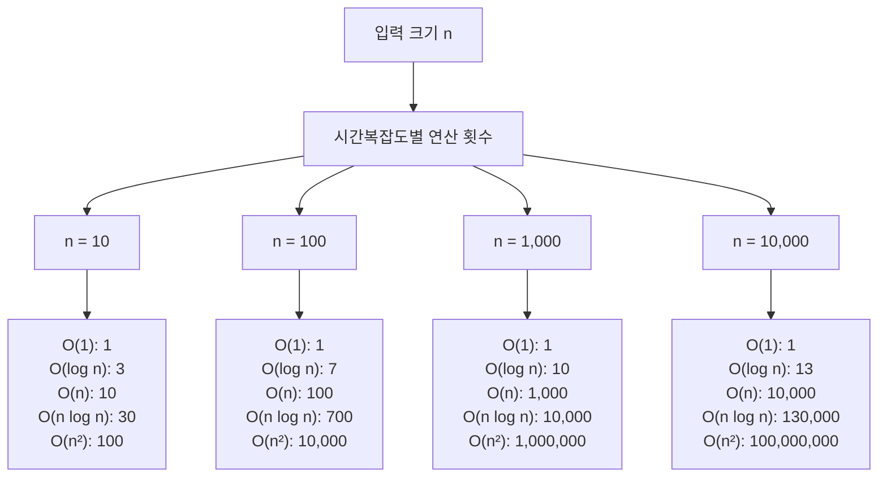

# 1. 시간복잡도, 왜 중요할까요?

요즘 코딩테스트에서는 시간복잡도를 고려하지 않아도 되는 문제들이 주로 출제되곤 합니다. 하지만 시간복잡도를 이해하고 있으면 더 효율적인 코드를 작성할 수 있으며, 더 이해하기 좋은 코드를 만들 수 있기도 합니다.

* 시간 복잡도: 얼마나 많은 시간이 걸리는가?
* 공간 복잡도: 얼마나 많은 공간(메모리)을 사용하는가?

# 2. 시간복잡도란?

**시간복잡도**(Time Complexity)는 입력 크기 n에 따라 알고리즘이 실행되는 데 필요한 연산 횟수를 나타냅니다. 보통 최악의 경우(Worst Case)를 기준으로 계산합니다. 아래 코드를 보며 시간 복잡도를 이해해봅시다.

```javascript
// 배열에서 특정 값 찾기
function findValue(arr, target) {
    for (let i = 0; i < arr.length; i++) {
        if (arr[i] === target) {
            return i;
        }
    }
    return -1;
}

// 최선의 경우: 첫 번째 원소가 target → 1번 비교
// 평균의 경우: 중간쯤에서 발견 → n/2번 비교
// 최악의 경우: 마지막 원소가 target 또는 없음 → n번 비교
```

최악의 경우에도 시간 내에 실행되어야 하므로, 최악의 경우를 기준으로 시간복잡도를 계산하는 것이 일반적입니다.

:::div{.callout}
* **빅오(O, Big-O) 표기법**: 최악의 상황에서 알고리즘이 얼마나 느려질 수 있는지를 나타내며, 실무에서 가장 많이 사용됩니다.
* **빅세타(Θ, Big-Theta) 표기법**: 알고리즘의 평균적인 실행 시간을 나타내며, 최선과 최악이 비슷할 때 사용합니다.
* **빅오메가(Ω, Big-Omega) 표기법**: 최선의 상황에서 알고리즘이 최소한 얼마나 빠른지를 나타내며, 성능의 하한선을 표현합니다.
:::

# 3. Big-O 표기법

Big-O 표기법은 시간복잡도를 표현하는 가장 일반적인 방법입니다. 입력 크기 n이 커질수록 어떤 속도로 증가하는지를 나타냅니다.

## 3.1 Big-O 표기법의 특징

1. **상수는 무시**: O(2n) → O(n)
2. **최고차항만 표시**: O(n² + n) → O(n²)
3. **계수는 무시**: O(3n²) → O(n²)

```javascript
// 예시 1: O(2n) → O(n)
function example1(n) {
    for (let i = 0; i < n; i++) {
        console.log(i);
    }
    for (let i = 0; i < n; i++) {  // 두 번 반복해도 O(n)
        console.log(i);
    }
}

// 예시 2: O(n² + n) → O(n²)
function example2(n) {
    for (let i = 0; i < n; i++) {
        for (let j = 0; j < n; j++) {
            console.log(i, j);  // O(n²)
        }
    }
    for (let i = 0; i < n; i++) {
        console.log(i);  // O(n)
    }
    // 최종: O(n² + n) = O(n²)
}
```

<highlight>
Big-O 표기법은 알고리즘의 효율성을 비교할 때 사용됩니다. 정확한 실행 시간이 아니라, 입력 크기가 커질 때의 성장 추세를 나타냅니다.
</highlight>

# 4. 주요 시간복잡도 비교

대표적인 시간복잡도를 빠른 순서대로 정리하면 다음과 같습니다.

```
O(1) < O(log n) < O(n) < O(n log n) < O(n²) < O(n³) < O(2ⁿ) < O(n!)
```


## 4.1 시간복잡도별 특징

### 4.1.1 O(1) - 상수 시간

입력 크기와 무관하게 항상 일정한 시간이 걸립니다. 가장 빠른 알고리즘이며, 입력 크기가 커져도 실행 시간이 변하지 않습니다.

```javascript
// 예시: 배열의 첫 번째 원소 접근
function getFirst(arr) {
    return arr[0];  // O(1)
}

// 예시: 객체에서 값 찾기
function getValue(hashMap, key) {
    return hashMap[key];  // O(1)
}

// 예시: 수학 공식 활용
function sum1ToN(n) {
    return n * (n + 1) / 2;  // O(1)
}
```

### 4.1.2 O(log n) - 로그 시간

입력 크기가 2배가 되어도 실행 시간은 +1만 증가합니다. 이진 탐색, 트리 탐색 등에서 자주 나타납니다. 역시나 빠른 알고리즘에 속합니다.

```javascript
// 예시: 이진 탐색
function binarySearch(arr, target) {
    let left = 0;
    let right = arr.length - 1;

    while (left <= right) {
        const mid = Math.floor((left + right) / 2);

        if (arr[mid] === target) {
            return mid;
        } else if (arr[mid] < target) {
            left = mid + 1;
        } else {
            right = mid - 1;
        }
    }

    return -1;
}

// n = 1,000 → 약 10번 비교
// n = 1,000,000 → 약 20번 비교
```

### 4.1.3 O(n) - 선형 시간

입력 크기에 비례하여 실행 시간이 증가합니다. 배열 순회, 리스트 합계 등에서 자주 나타납니다. 일반적인 시간복잡도입니다.

```javascript
// 예시 1: 배열 순회
function printAll(arr) {
    for (const item of arr) {  // n번 반복
        console.log(item);
    }
}

// 예시 2: 배열 합계
function sumArray(arr) {
    let total = 0;
    for (const item of arr) {  // n번 반복
        total += item;
    }
    return total;
}
```

### 4.1.4 O(n log n) - 선형 로그 시간

효율적인 정렬 알고리즘의 시간복잡도입니다. 대부분의 경우에는 충분히 빠릅니다. 정렬은 이 시간복잡도보다 빠르게 하기 힘듭니다.

```javascript
// 예시 1: 병합 정렬
function mergeSort(arr) {
    if (arr.length <= 1) {
        return arr;
    }

    const mid = Math.floor(arr.length / 2);
    const left = mergeSort(arr.slice(0, mid));  // log n번 분할
    const right = mergeSort(arr.slice(mid));

    return merge(left, right);  // n번 병합
}

// 예시 2: JavaScript 내장 정렬
const arr = [5, 2, 8, 1, 9];
arr.sort((a, b) => a - b);  // O(n log n) - Timsort 알고리즘 사용
```

### 4.1.5 O(n²) - 이차 시간

중첩 반복문에서 자주 나타납니다. 입력 크기가 커지면 급격히 느려집니다. 따라서 n이 작을 때만 사용해야 합니다. 코딩테스트에서는 n이 10,000 이상이면 시간 초과가 날 가능성이 높습니다.

```javascript
// 예시 1: 이중 반복문
function printPairs(arr) {
    for (let i = 0; i < arr.length; i++) {  // n번
        for (let j = 0; j < arr.length; j++) {  // n번
            console.log(arr[i], arr[j]);  // n × n = n²
        }
    }
}

// 예시 2: 모든 쌍의 합 구하기
function allPairSum(arr) {
    const result = [];
    for (let i = 0; i < arr.length; i++) {  // n번
        for (let j = i + 1; j < arr.length; j++) {  // n번
            result.push(arr[i] + arr[j]);
        }
    }
    return result;
}
```

### 4.1.6 O(n³) - 삼차 시간

삼중 반복문에서 나타납니다. 매우 느립니다. n이 1,000 이상이면 시간 초과가 날 가능성이 높습니다.

```javascript
// 예시: 삼중 반복문
function printTriples(arr) {
    for (let i = 0; i < arr.length; i++) {  // n번
        for (let j = 0; j < arr.length; j++) {  // n번
            for (let k = 0; k < arr.length; k++) {  // n번
                console.log(arr[i], arr[j], arr[k]);  // n × n × n = n³
            }
        }
    }
}
```

### 4.1.7 O(2ⁿ) - 지수 시간

재귀적으로 모든 경우를 탐색할 때 나타납니다. 매우 매우 느립니다. n이 20 이상이면 거의 실행 불가능합니다.

```javascript
// 예시: 피보나치 (재귀)
function fibonacci(n) {
    if (n <= 1) {
        return n;
    }
    return fibonacci(n - 1) + fibonacci(n - 2);  // O(2ⁿ)
}

// n = 5 → 15번 호출
// n = 10 → 177번 호출
// n = 30 → 2,692,537번 호출
```

### 4.1.8 O(n!) - 팩토리얼 시간

모든 순열을 생성할 때 나타납니다. 가장 느립니다. n이 10 이상이면 거의 실행 불가능합니다.

```javascript
// 예시: 모든 순열 생성
function allPermutations(arr) {
    const result = [];

    function permute(current, remaining) {
        if (remaining.length === 0) {
            result.push([...current]);
            return;
        }
        for (let i = 0; i < remaining.length; i++) {
            current.push(remaining[i]);
            permute(current, [...remaining.slice(0, i), ...remaining.slice(i + 1)]);
            current.pop();
        }
    }

    permute([], arr);
    return result;  // O(n!)
}

// n = 5 → 120개
// n = 10 → 3,628,800개
// n = 13 → 6,227,020,800개
```

# 5. 시간복잡도 비교

입력 크기 n에 따른 연산 횟수를 비교해봅시다.



## 5.1 실제 실행 시간 예측

일반적으로 컴퓨터는 1초에 약 1억(10⁸) 번의 연산을 수행할 수 있습니다.

| 시간복잡도 | n = 100 | n = 1,000 | n = 10,000 | n = 100,000 | n = 1,000,000 |
|-----------|---------|-----------|------------|-------------|---------------|
| O(1) | 0.00001ms | 0.00001ms | 0.00001ms | 0.00001ms | 0.00001ms |
| O(log n) | 0.00007ms | 0.0001ms | 0.00013ms | 0.00017ms | 0.0002ms |
| O(n) | 0.001ms | 0.01ms | 0.1ms | 1ms | 10ms |
| O(n log n) | 0.007ms | 0.1ms | 1.3ms | 17ms | 200ms |
| O(n²) | 0.1ms | 10ms | 1초 | 100초 | 2.7시간 |
| O(n³) | 10ms | 1초 | 16.7분 | 11.6일 | 31.7년 |

**코딩테스트의 시간 제한은 보통 1~5초**입니다. 만약 효율성 테스트가 있는 문제라면 시간 복잡도를 낮출 수 있는 방법을 고민해야 합니다.

# 6. 걸린 시간을 측정하는 방법

JavaScript에서는 여러 방법으로 코드 실행 시간을 측정할 수 있습니다.

## 6.1 console.time 사용

가장 기본적인 방법입니다.
```javascript
console.time('측정');
// 측정할 코드
for (let i = 0; i < 1000000; i++) {
    // 작업
}
console.timeEnd('측정');  // 측정: 2.345ms
```

## 6.2 performance.now() 사용

더 정밀한 측정이 가능합니다.
```javascript
const start = performance.now();
// 측정할 코드
for (let i = 0; i < 1000000; i++) {
    // 작업
}
const end = performance.now();
console.log(`걸린 시간: ${end - start}ms`);
```

## 6.3 Date.now() 사용

간단한 측정에 사용합니다.
```javascript
const start = Date.now();
// 측정할 코드
const end = Date.now();
console.log(`걸린 시간: ${end - start}ms`);
```

## 6.4 함수로 래핑하여 측정

재사용 가능한 방법입니다.
```javascript
function measureTime(fn, ...args) {
    const start = performance.now();
    const result = fn(...args);
    const end = performance.now();
    console.log(`${fn.name} 실행 시간: ${(end - start).toFixed(6)}ms`);
    return result;
}

function slowFunction() {
    let total = 0;
    for (let i = 0; i < 1000000; i++) {
        total += i;
    }
    return total;
}

measureTime(slowFunction);  // 실행 시간이 자동으로 출력됨
```

:::div{.callout}
**측정 방법 선택 가이드**
* 간단한 측정: `console.time()` / `console.timeEnd()`
* 정확한 성능 비교: `performance.now()`
* 함수 성능 모니터링: 래퍼 함수 패턴
* 브라우저 개발자 도구의 Performance 탭 활용
:::
