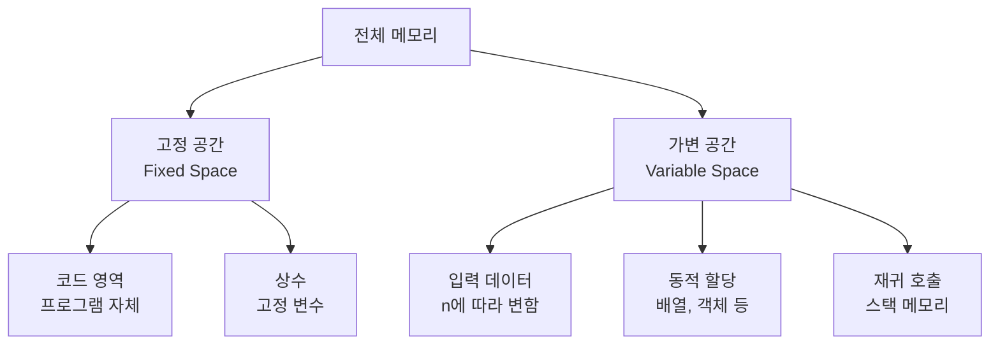

# 1. 공간복잡도, 왜 중요할까요?

시간 제한만큼이나 중요한 것이 메모리 제한입니다. 아무리 빠른 알고리즘이라도 메모리를 너무 많이 사용하면 **메모리 초과**가 발생할 수 있습니다. 공간복잡도(Space Complexity)는 알고리즘이 실행되는 동안 사용하는 메모리 공간을 나타냅니다. 효율적인 알고리즘은 시간과 공간을 모두 고려해야 합니다.

# 2. 공간복잡도란?

공간복잡도는 프로그램이 실행되는 동안 사용하는 메모리 공간의 양을 나타냅니다.

## 2.1 메모리 사용 구성 요소



**공간복잡도 = 고정 공간 + 가변 공간**

하지만 일반적으로 고정 공간은 상수이므로 무시하고, 가변 공간만 고려합니다.<highlight> 공간복잡도는 입력 크기 n에 따라 필요한 메모리 공간이 어떻게 증가하는지를 나타냅니다. 시간복잡도와 마찬가지로 Big-O 표기법을 사용합니다.</highlight>

# 3. 기본 자료형의 메모리 크기

JavaScript에서 기본 자료형이 차지하는 메모리 크기를 알아봅시다.

## 3.1 JavaScript 자료형 메모리 특성

JavaScript는 동적 타입 언어이므로 정확한 메모리 크기를 알기 어렵지만, 일반적인 기준은 다음과 같습니다.

```javascript
// 숫자형 (Number)
// JavaScript의 모든 숫자는 64비트 부동소수점 (8 bytes)
const num = 42;
const float = 3.14;

// 문자열 (String)
// 각 문자는 2 bytes (UTF-16)
const str = "hello";  // 약 10 bytes

// 불리언 (Boolean)
const bool = true;  // 4 bytes

// 배열 (Array)
// 배열 자체의 오버헤드 + 각 요소의 메모리
const arr = [1, 2, 3];  // 배열 오버헤드 + 요소들

// 객체 (Object)
// 객체 오버헤드 + 키-값 쌍들의 메모리
const obj = { a: 1, b: 2 };
```

## 3.2 일반적인 메모리 제한

일반적인 가상환경의 메모리 제한은 다음과 같습니다.

- **128 MB**: 가장 일반적인 제한
- **256 MB**: 여유있는 제한
- **512 MB**: 매우 여유로운 제한

**128 MB로 저장 가능한 데이터** 는 아래와 같습니다.
- int 배열: 약 3,200만 개
- float 배열: 약 1,600만 개
- 이차원 배열(n×n): n ≈ 5,600

# 4. 공간복잡도 계산

## 4.1 O(1) - 상수 공간

입력 크기와 무관하게 고정된 메모리만 사용합니다.

```javascript
// 예시 1: 변수만 사용
function sumArray(arr) {
    let total = 0;  // 8 bytes
    for (const num of arr) {
        total += num;
    }
    return total;
}

// 공간복잡도: O(1)
// 추가 메모리: total 변수 하나만 사용
```

```javascript
// 예시 2: 스왑
function swap(arr, i, j) {
    const temp = arr[i];  // 임시 변수
    arr[i] = arr[j];
    arr[j] = temp;
}

// 공간복잡도: O(1)
// 추가 메모리: temp 변수 하나만 사용
```

## 4.2 O(n) - 선형 공간

입력 크기에 비례하여 메모리를 사용합니다.

```javascript
// 예시 1: 배열 복사
function copyArray(arr) {
    const newArr = [];
    for (const item of arr) {
        newArr.push(item);
    }
    return newArr;
}

// 공간복잡도: O(n)
// 추가 메모리: newArr (크기 n)
```

```javascript
// 예시 2: 해시맵 사용
function countFrequency(arr) {
    const freq = {};
    for (const item of arr) {
        freq[item] = (freq[item] || 0) + 1;
    }
    return freq;
}

// 공간복잡도: O(n)
// 최악의 경우 모든 원소가 다르면 객체 크기가 n
```

## 4.3 O(n²) - 이차 공간

이차원 배열을 사용할 때 나타납니다.

```javascript
// 예시 1: 이차원 배열 생성
function createMatrix(n) {
    const matrix = [];
    for (let i = 0; i < n; i++) {
        matrix.push(new Array(n).fill(0));
    }
    return matrix;
}

// 공간복잡도: O(n²)
// 메모리: n × n = n²
```

## 4.4 O(log n) - 로그 공간

이진 탐색 등에서 재귀 깊이가 log n인 경우입니다.

```javascript
// 예시: 이진 탐색 (재귀)
function binarySearchRecursive(arr, target, left, right) {
    if (left > right) {
        return -1;
    }

    const mid = Math.floor((left + right) / 2);

    if (arr[mid] === target) {
        return mid;
    } else if (arr[mid] < target) {
        return binarySearchRecursive(arr, target, mid + 1, right);
    } else {
        return binarySearchRecursive(arr, target, left, mid - 1);
    }
}

// 공간복잡도: O(log n)
// 재귀 깊이가 log n
```

# 5. 메모리 사용 최적화

효율적인 메모리 사용을 위한 기법들을 알아봅시다.

## 5.1 제자리 알고리즘 (In-place Algorithm)

추가 메모리를 거의 사용하지 않고 입력 자료 구조 내에서 처리합니다.

다만 메모리 사용은 최적화 될지 몰라도 시간복잡도가 더 나빠질 수 있으니 주의하세요. 요즘 코딩 테스트에서는 둘 다 고려하지 않는 경우가 더 많습니다.

:::div{.callout}
시간복잡도와 공간복잡도가 모두 좋은 알고리즘은 매우 드뭅니다. 보통 하나를 희생해야 다른 하나를 최적화할 수 있습니다. 이를 '시간-공간 트레이드오프'라고 합니다.
:::

### 5.1.1 배열 뒤집기

```javascript
// 비효율적 방법: O(n) 공간
function reverseInefficient(arr) {
    return arr.slice().reverse();  // 새로운 배열 생성
}

// 효율적 방법: O(1) 공간
function reverseInplace(arr) {
    let left = 0;
    let right = arr.length - 1;
    while (left < right) {
        [arr[left], arr[right]] = [arr[right], arr[left]];
        left++;
        right--;
    }
    return arr;
}

// 공간복잡도: O(1)
// 추가 메모리: left, right 변수만 사용
```

### 5.1.2 중복 제거

```javascript
// 비효율적 방법: O(n) 공간
function removeDuplicatesInefficient(arr) {
    return [...new Set(arr)];  // 새로운 배열 생성
}

// 효율적 방법: O(1) 공간 (정렬된 배열)
function removeDuplicatesInplace(arr) {
    if (arr.length === 0) return 0;

    arr.sort((a, b) => a - b);  // 제자리 정렬
    let i = 0;
    for (let j = 1; j < arr.length; j++) {
        if (arr[j] !== arr[i]) {
            i++;
            arr[i] = arr[j];
        }
    }

    return i + 1;  // 고유한 원소의 개수
}
```

## 5.2 재귀를 반복문으로 변환

재귀 호출은 스택 메모리를 사용하므로, 반복문으로 바꾸면 메모리를 절약할 수 있습니다.

### 5.2.1 팩토리얼

```javascript
// 재귀: O(n) 공간
function factorialRecursive(n) {
    if (n <= 1) return 1;
    return n * factorialRecursive(n - 1);
}

// 반복문: O(1) 공간
function factorialIterative(n) {
    let result = 1;
    for (let i = 2; i <= n; i++) {
        result *= i;
    }
    return result;
}
```

### 5.2.2 피보나치

```javascript
// 재귀 + 메모이제이션: O(n) 공간
function fibonacciRecursive(n, memo = {}) {
    if (n in memo) return memo[n];
    if (n <= 1) return n;
    memo[n] = fibonacciRecursive(n - 1, memo) + fibonacciRecursive(n - 2, memo);
    return memo[n];
}

// 반복문: O(1) 공간
function fibonacciIterative(n) {
    if (n <= 1) return n;

    let prev = 0;
    let curr = 1;
    for (let i = 2; i <= n; i++) {
        [prev, curr] = [curr, prev + curr];
    }

    return curr;
}
```
