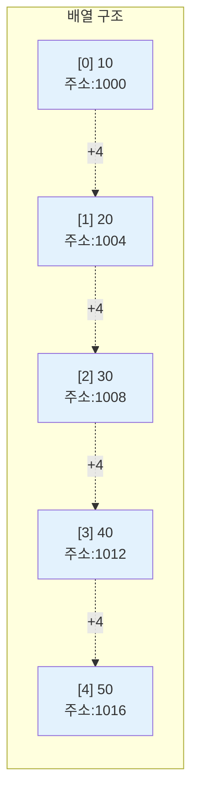
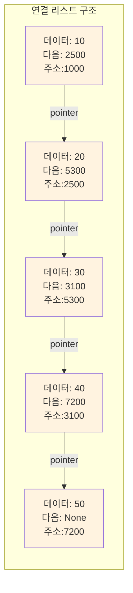
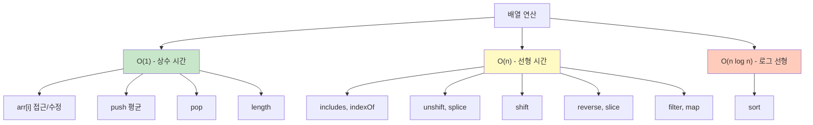

# 1. 배열과 리스트의 메모리 구조

배열과 리스트는 통상 같은 개념으로 사용되기도 하지만, 엄밀히 말하면 다릅니다. 배열과 리스트는 메모리 상에서 전혀 다른 방식으로 데이터를 저장합니다.

## 1.1 배열의 메모리 구조

배열(Array)은 **연속된 메모리 공간**에 데이터를 저장합니다. 마치 아파트 동호수처럼 1000번지, 1004번지, 1008번지와 같은 식으로 **붙어있는 주소**에 데이터가 차례대로 저장됩니다.



## 1.2 연결 리스트의 메모리 구조

반면 연결 리스트(Linked List)는 **메모리 상 이어져 있지 않습니다**. 각 데이터(노드)가 메모리의 여기저기 흩어져 있고, **다음 데이터의 주소를 가리키는 포인터**로 연결되어 있습니다.



## 1.3 차이점이 왜 중요한가?

이러한 메모리 구조의 차이는 각 자료구조의 성능 특성을 결정합니다.

| 특성 | 배열 (연속된 메모리) | 연결 리스트 (흩어진 메모리) |
|------|---------------------|---------------------------|
| **인덱스 접근** | O(1) - 주소 계산으로 즉시 접근 | O(n) - 처음부터 순차 탐색 |
| **중간 삽입/삭제** | O(n) - 뒤 요소들을 모두 이동 | O(1) - 포인터만 변경 (위치를 안다면) |
| **메모리 효율** | 높음 (데이터만 저장) | 낮음 (포인터도 함께 저장) |
| **캐시 효율** | 높음 (연속된 메모리 접근) | 낮음 (메모리 주소가 흩어짐) |

:::div{.callout}
**핵심 개념**

- **배열**: 메모리가 연속 → 인덱스로 빠른 접근 가능 → 하지만 중간 삽입/삭제는 느림
- **연결 리스트**: 메모리가 비연속 → 순차 탐색 필요 → 하지만 삽입/삭제는 포인터만 조작

JavaScript의 `Array`는 동적 배열로 구현되어 있습니다. 동적 배열은 내부적으로 포인터들을 연속된 메모리 공간에 저장하는 방식으로 구현되어 있습니다. 포인터 배열 자체는 연속되어 있어서 인덱스 접근이 O(1)이지만, 중간 삽입/삭제 시에는 뒤의 포인터들을 모두 이동시켜야 하므로 O(n)입니다. 용량이 부족하면 더 큰 메모리를 새로 할당받아 기존 데이터를 복사하는 방식으로 크기를 동적으로 조절합니다.
:::

# 2. JavaScript 배열

JavaScript의 배열은 동적 배열(Dynamic Array)로 구현되어 있으며, 크기가 가변적이고 다양한 타입의 데이터를 저장할 수 있습니다.

## 2.1 배열 생성과 초기화

```javascript
// 빈 배열 생성
const emptyArray = [];
const emptyArray2 = new Array();

// 값을 가진 배열 생성
const numbers = [1, 2, 3, 4, 5];
const mixed = [1, "hello", 3.14, true];

// 특정 크기의 배열 초기화
const zeros = new Array(5).fill(0);  // [0, 0, 0, 0, 0]
const matrix = Array.from({ length: 2 }, () => new Array(3).fill(0));  // 2x3 행렬 [[0,0,0], [0,0,0]]

// 배열 메서드로 생성
const squares = Array.from({ length: 5 }, (_, i) => (i + 1) ** 2);  // [1, 4, 9, 16, 25]
const evens = Array.from({ length: 10 }, (_, i) => i).filter(i => i % 2 === 0);  // [0, 2, 4, 6, 8]
```

## 2.2 배열 접근과 슬라이싱

```javascript
const arr = [10, 20, 30, 40, 50];

// 인덱스 접근
console.log(arr[0]);       // 10 (첫 번째 요소)
console.log(arr[arr.length - 1]);  // 50 (마지막 요소)
console.log(arr.at(-1));   // 50 (마지막 요소, ES2022)
console.log(arr.at(-2));   // 40 (뒤에서 두 번째 요소)

// 슬라이싱 slice(시작, 끝)
console.log(arr.slice(1, 4));  // [20, 30, 40] - 인덱스 1부터 3까지
console.log(arr.slice(0, 3));  // [10, 20, 30] - 처음부터 인덱스 2까지
console.log(arr.slice(2));     // [30, 40, 50] - 인덱스 2부터 끝까지
console.log(arr.slice().reverse());  // [50, 40, 30, 20, 10] - 역순
```

## 2.3 배열 수정 메서드

### 2.3.1 요소 추가

```javascript
let arr = [1, 2, 3];

// push(): 끝에 요소 하나 추가 - O(1)
arr.push(4);              // [1, 2, 3, 4]

// unshift(): 앞에 요소 삽입 - O(n)
arr.unshift(0);           // [0, 1, 2, 3, 4]

// splice(): 특정 위치에 요소 삽입 - O(n)
arr.splice(2, 0, 1.5);    // [0, 1, 1.5, 2, 3, 4]

// concat(): 여러 요소 추가 (새 배열 반환) - O(n+m)
const newArr = arr.concat([5, 6, 7]);  // 원본은 변경 안 됨

// 스프레드 연산자
const combined = [...arr, 5, 6];
```

### 2.3.2 요소 삭제

```javascript
let arr = [10, 20, 30, 40, 50, 30];

// pop(): 마지막 요소 제거하고 반환 - O(1)
const last = arr.pop();     // 30 반환, 마지막 요소 제거

// shift(): 첫 번째 요소 제거 - O(n)
const first = arr.shift();  // 10 반환, 첫 번째 요소 제거

// splice(): 인덱스로 삭제
arr.splice(1, 1);           // 인덱스 1 요소 제거 - O(n)
arr.splice(1, 2);           // 인덱스 1부터 2개 요소 제거 - O(n)

// filter()로 값으로 삭제 (새 배열 반환)
arr = arr.filter(x => x !== 30);  // 30 모두 제거
```

### 2.3.3 요소 수정

```javascript
let arr = [1, 2, 3, 4, 5];

// 단일 요소 수정
arr[0] = 10;              // [10, 2, 3, 4, 5] - O(1)

// splice로 수정
arr.splice(1, 3, 20, 30); // [10, 20, 30, 5] - O(n)
```

## 2.4 배열 검색 메서드

```javascript
const arr = [10, 20, 30, 20, 40];

// indexOf(): 값의 인덱스 찾기 - O(n)
const idx = arr.indexOf(20);        // 1 (첫 번째 20의 인덱스)
const idx2 = arr.indexOf(20, 2);    // 3 (인덱스 2부터 찾기)

// lastIndexOf(): 뒤에서부터 찾기
const lastIdx = arr.lastIndexOf(20); // 3

// filter()로 개수 세기 - O(n)
const count = arr.filter(x => x === 20).length;  // 2

// includes(): 값 존재 여부 - O(n)
if (arr.includes(30)) {
    console.log("30이 있습니다");
}

// find(): 조건에 맞는 첫 요소
const found = arr.find(x => x > 25);  // 30

// findIndex(): 조건에 맞는 첫 인덱스
const foundIdx = arr.findIndex(x => x > 25);  // 2

// Math.min, Math.max
console.log(Math.min(...arr));  // 10 - O(n)
console.log(Math.max(...arr));  // 40 - O(n)

// reduce로 합계
const sum = arr.reduce((a, b) => a + b, 0);  // 120 - O(n)
```

## 2.5 배열 정렬 메서드

```javascript
let numbers = [5, 2, 8, 1, 9];

// sort(): 원본 배열을 정렬 - O(n log n)
numbers.sort((a, b) => a - b);        // [1, 2, 5, 8, 9] 오름차순
numbers.sort((a, b) => b - a);        // [9, 8, 5, 2, 1] 내림차순

// 정렬된 새 배열 (원본 유지) - toSorted() ES2023
const original = [5, 2, 8, 1, 9];
const sortedNums = [...original].sort((a, b) => a - b);  // [1, 2, 5, 8, 9]
// original은 그대로 [5, 2, 8, 1, 9]

// key로 정렬 기준 지정
const words = ["apple", "pie", "zoo", "a"];
words.sort((a, b) => a.length - b.length);  // 길이 순: ['a', 'pie', 'zoo', 'apple']

// reverse(): 배열 뒤집기 - O(n)
numbers.reverse();                    // [1, 8, 5, 2, 9]
```

## 2.6 기타 유용한 메서드

```javascript
const arr = [1, 2, 3, 4, 5];

// length: 배열 길이 - O(1)
console.log(arr.length);  // 5

// slice(): 얕은 복사 - O(n)
const arrCopy = arr.slice();
const arrCopy2 = [...arr];

// 깊은 복사 (중첩 배열용)
const nested = [[1, 2], [3, 4]];
const deep = JSON.parse(JSON.stringify(nested));
// 또는 structuredClone(nested)

// forEach(): 인덱스와 값 함께 순회
arr.forEach((val, i) => {
    console.log(`인덱스 ${i}: 값 ${val}`);
});

// entries(): 인덱스와 값 쌍
for (const [i, val] of arr.entries()) {
    console.log(`${i + 1}번째: ${val}`);
}

// map(): 변환된 새 배열
const doubled = arr.map(x => x * 2);  // [2, 4, 6, 8, 10]
```

# 3. 시간복잡도 정리

배열의 주요 연산별 시간복잡도를 이해하는 것은 효율적인 알고리즘 설계에 필수적입니다.

## 3.1 시간복잡도 표

| 연산 | 시간복잡도 | 설명 |
|------|-----------|------|
| **접근/수정** | | |
| `arr[i]` | O(1) | 인덱스로 직접 계산하여 접근 |
| `arr[i] = x` | O(1) | 인덱스로 직접 수정 |
| `arr.slice(i, j)` | O(k) | k는 슬라이스 길이 (j-i) |
| **검색** | | |
| `arr.includes(x)` | O(n) | 처음부터 순차 탐색 |
| `arr.indexOf(x)` | O(n) | 첫 번째 일치 항목까지 순차 탐색 |
| `arr.filter()` | O(n) | 전체 배열 순회 |
| `Math.min(...arr)`, `Math.max(...arr)` | O(n) | 전체 배열 순회 |
| **추가** | | |
| `arr.push(x)` | O(1) 평균 | 공간이 있으면 즉시 추가, 공간 부족 시 O(n) |
| `arr.unshift(x)` | O(n) | 모든 요소를 한 칸씩 이동 |
| `arr.splice(i, 0, x)` | O(n) | i 이후 요소들을 모두 한 칸씩 이동 |
| `arr.concat(other)` | O(n+m) | 새 배열 생성 및 복사 |
| **삭제** | | |
| `arr.pop()` | O(1) | 마지막 요소만 제거 |
| `arr.shift()` | O(n) | 모든 요소를 한 칸씩 이동 |
| `arr.splice(i, 1)` | O(n) | i 이후 요소들을 모두 한 칸씩 이동 |
| **정렬** | | |
| `arr.sort()` | O(n log n) | Timsort 알고리즘 사용 |
| `arr.reverse()` | O(n) | 양 끝에서 스왑하며 진행 |
| **기타** | | |
| `arr.length` | O(1) | 길이는 내부에 저장되어 있음 |
| `arr.slice()` | O(n) | 모든 요소 복사 |

## 3.2 시간복잡도 시각화



:::div{.callout}
**코딩테스트 팁: 시간복잡도를 고려한 설계**

- **빈번한 앞 삽입/삭제**: 배열보다는 연결 리스트 구조 또는 다른 접근 방식 고려
- **빈번한 검색**: 배열보다는 `Set` (검색 O(1)) 또는 `Map` 사용
- **정렬된 상태 유지**: 매번 정렬하지 말고 이진 탐색으로 정렬된 상태 유지
- **중복 제거**: `new Set(arr)`로 변환 (O(n))
- **최대/최소 유지**: 직접 힙 구현 또는 정렬 활용
:::

# 4. 연습문제

* (정렬) 업무 우선순위: https://100.jsalgo.co.kr/?page=7
* (최솟값) 두 점 사이의 거리: https://100.jsalgo.co.kr/?page=8
* (최댓값) 수학은 내가 1등: https://100.jsalgo.co.kr/?page=9
* (탐색) 게임 밸런스 조절: https://100.jsalgo.co.kr/?page=10
* (탐색) 평균 점수 카운팅: https://100.jsalgo.co.kr/?page=11
* (정렬) 도서관 책 연도별 정렬: https://100.jsalgo.co.kr/?page=13
