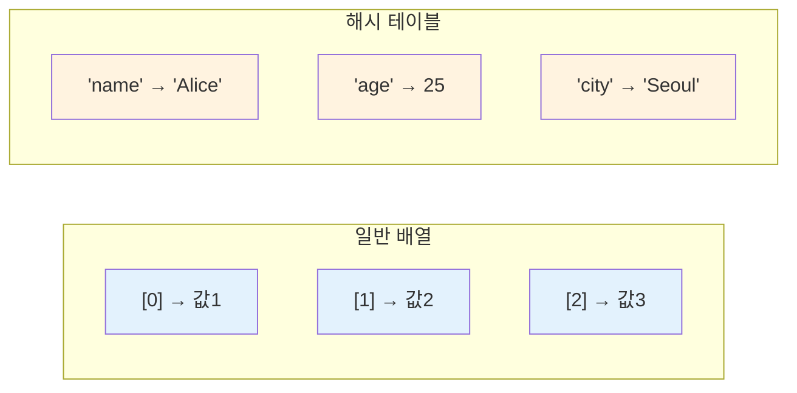
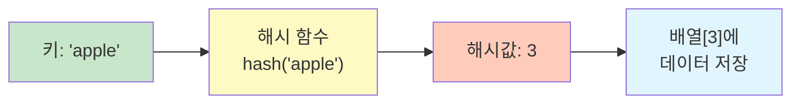
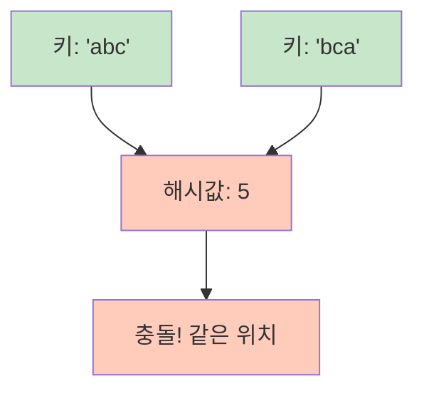

# 1. 해시 테이블 (Hash Table)

해시 테이블은 **키(key)와 값(value)의 쌍**으로 데이터를 저장하는 자료구조입니다. 해시 함수를 사용하여 키를 해시값으로 변환하고, 이 해시값을 인덱스로 사용하여 데이터를 저장합니다. JavaScript에서는 객체(Object)와 Map으로 구현되어 있습니다.

## 1.1 해시 테이블의 개념

일반적인 배열은 인덱스(0, 1, 2, ...)로 데이터에 접근하지만, 해시 테이블은 **의미있는 키**로 데이터에 접근할 수 있습니다.



## 1.2 해시 함수의 동작 원리

해시 함수는 키를 입력받아 고정된 범위의 해시값(정수)으로 변환합니다. 이 해시값이 데이터가 저장될 위치(인덱스)가 됩니다.



**예시: 간단한 해시 함수**

```javascript
function simpleHash(key, tableSize) {
    // 문자열 키를 해시값으로 변환
    let hashValue = 0;
    for (const char of key) {
        hashValue += char.charCodeAt(0);  // 각 문자의 ASCII 값을 더함
    }
    return hashValue % tableSize;  // 테이블 크기로 나눈 나머지
}

// 테이블 크기가 10인 경우
console.log(simpleHash("apple", 10));   // 예: 2
console.log(simpleHash("banana", 10));  // 예: 6
console.log(simpleHash("cherry", 10));  // 예: 3
```

## 1.3 해시 충돌 (Hash Collision)

서로 다른 키가 같은 해시값을 가질 때 **해시 충돌**이 발생합니다.



## 1.4 해시 테이블의 시간복잡도

| 연산 | 평균 | 최악 |
|------|------|------|
| **삽입** | O(1) | O(n) |
| **삭제** | O(1) | O(n) |
| **검색** | O(1) | O(n) |

- **평균 O(1)**: 충돌이 적을 때
- **최악 O(n)**: 모든 키가 같은 해시값으로 충돌할 때

:::div{.callout}
**해시 테이블의 핵심**

- **장점**: 키로 데이터를 빠르게 검색/삽입/삭제 (평균 O(1))
- **단점**: 순서 보장 안 됨 (Object), 해시 충돌 가능성, 메모리 오버헤드
- **활용**: 데이터베이스 인덱싱, 캐시, 중복 검사, 빈도 계산
:::

# 2. JavaScript 객체 (Object)

JavaScript의 `Object`는 해시 테이블로 구현된 자료구조입니다.

## 2.1 객체 생성

```javascript
// 빈 객체 생성
const emptyObj = {};
const emptyObj2 = new Object();

// 값을 가진 객체 생성
const student = {
    name: "Alice",
    age: 20,
    major: "CS"
};

// 동적으로 키-값 추가
const student2 = {};
student2.name = "Bob";
student2["age"] = 22;
student2.major = "Math";

// Object.fromEntries로 생성
const pairs = [["a", 1], ["b", 2], ["c", 3]];
const objFromPairs = Object.fromEntries(pairs);  // {a: 1, b: 2, c: 3}
```

## 2.2 객체 접근과 수정

### 2.2.1 값 접근

```javascript
const student = { name: "Alice", age: 20, major: "CS" };

// 점 표기법으로 접근
console.log(student.name);      // "Alice"

// 대괄호 표기법으로 접근
console.log(student["name"]);   // "Alice"

// 존재하지 않는 키 접근
console.log(student.gender);    // undefined

// 기본값 설정
const gender = student.gender || "미지정";  // "미지정"
const gender2 = student.gender ?? "미지정"; // "미지정" (nullish coalescing)
```

### 2.2.2 값 수정과 추가

```javascript
const student = { name: "Alice", age: 20 };

// 기존 키의 값 수정
student.age = 21;         // { name: "Alice", age: 21 }

// 새로운 키-값 추가
student.major = "CS";     // { name: "Alice", age: 21, major: "CS" }

// Object.assign(): 여러 키-값 한번에 추가/수정
Object.assign(student, { age: 22, city: "Seoul" });
// { name: "Alice", age: 22, major: "CS", city: "Seoul" }

// 스프레드 연산자로 병합 (새 객체 생성)
const updated = { ...student, phone: "010" };
```

### 2.2.3 값 삭제

```javascript
const student = { name: "Alice", age: 20, major: "CS" };

// delete: 키로 삭제
delete student.age;       // { name: "Alice", major: "CS" }

// 구조 분해로 특정 키 제외한 새 객체 생성
const { major, ...rest } = student;
console.log(rest);        // { name: "Alice" }
```

## 2.3 객체 순회

```javascript
const student = { name: "Alice", age: 20, major: "CS" };

// 키만 순회
for (const key in student) {
    console.log(key);              // name, age, major
}

for (const key of Object.keys(student)) {
    console.log(key);              // name, age, major
}

// 값만 순회
for (const value of Object.values(student)) {
    console.log(value);            // Alice, 20, CS
}

// 키-값 쌍 순회
for (const [key, value] of Object.entries(student)) {
    console.log(`${key}: ${value}`);
}
// name: Alice
// age: 20
// major: CS
```

## 2.4 객체 메서드

### 2.4.1 검색 메서드

```javascript
const student = { name: "Alice", age: 20, major: "CS" };

// in 연산자: 키 존재 여부 확인 - O(1)
if ("name" in student) {
    console.log("이름이 있습니다");
}

// hasOwnProperty: 자체 속성인지 확인
if (student.hasOwnProperty("age")) {
    console.log("나이가 있습니다");
}

// Object.keys(), Object.values(), Object.entries()
const keys = Object.keys(student);      // ['name', 'age', 'major']
const values = Object.values(student);  // ['Alice', 20, 'CS']
const entries = Object.entries(student); // [['name', 'Alice'], ['age', 20], ['major', 'CS']]
```

## 2.5 객체 활용 패턴

### 2.5.1 빈도 계산

```javascript
// 문자열에서 각 문자의 빈도 계산
const text = "hello world";
const freq = {};
for (const char of text) {
    if (char !== " ") {
        freq[char] = (freq[char] || 0) + 1;
    }
}

console.log(freq);  // {h: 1, e: 1, l: 3, o: 2, w: 1, r: 1, d: 1}
```

### 2.5.2 그룹화

```javascript
// 학생들을 전공별로 그룹화
const students = [
    { name: "Alice", major: "CS" },
    { name: "Bob", major: "Math" },
    { name: "Charlie", major: "CS" },
    { name: "David", major: "Physics" }
];

const grouped = {};
for (const student of students) {
    const major = student.major;
    if (!(major in grouped)) {
        grouped[major] = [];
    }
    grouped[major].push(student.name);
}

console.log(grouped);
// {CS: ['Alice', 'Charlie'], Math: ['Bob'], Physics: ['David']}

// reduce 사용
const grouped2 = students.reduce((acc, student) => {
    const major = student.major;
    acc[major] = acc[major] || [];
    acc[major].push(student.name);
    return acc;
}, {});
```

### 2.5.3 캐싱 (메모이제이션)

```javascript
// 피보나치 수열을 캐싱으로 최적화
const cache = {};

function fibonacci(n) {
    if (n in cache) {
        return cache[n];
    }

    if (n <= 1) {
        return n;
    }

    const result = fibonacci(n - 1) + fibonacci(n - 2);
    cache[n] = result;
    return result;
}

console.log(fibonacci(100));  // 빠르게 계산됨
```

# 3. Map과 Set

## 3.1 Map

Map은 키-값 쌍을 저장하며, 객체와 달리 **모든 타입의 키**를 사용할 수 있고 **삽입 순서가 보장**됩니다.

```javascript
// Map 생성
const map = new Map();

// 값 설정
map.set("name", "Alice");
map.set("age", 20);
map.set(1, "one");  // 숫자 키
map.set({ key: 1 }, "object key");  // 객체 키

// 값 가져오기
console.log(map.get("name"));  // "Alice"
console.log(map.get(1));       // "one"

// 키 존재 여부
console.log(map.has("name"));  // true

// 삭제
map.delete("age");

// 크기
console.log(map.size);  // 3

// 순회
for (const [key, value] of map) {
    console.log(`${key}: ${value}`);
}

// 모든 키/값
console.log([...map.keys()]);    // ["name", 1, {key: 1}]
console.log([...map.values()]);  // ["Alice", "one", "object key"]
```

## 3.2 Set

집합은 **중복을 허용하지 않는** 해시 테이블 기반 자료구조입니다.

```javascript
// Set 생성
const emptySet = new Set();

// 값을 가진 Set 생성
const numbers = new Set([1, 2, 3, 4, 5]);
const fruits = new Set(["apple", "banana", "cherry"]);

// 배열로부터 생성 (중복 자동 제거)
const numbersList = [1, 2, 2, 3, 3, 3, 4, 5];
const uniqueNumbers = new Set(numbersList);  // Set(5) {1, 2, 3, 4, 5}

// 문자열로부터 생성
const chars = new Set("hello");  // Set(4) {'h', 'e', 'l', 'o'}
```

### 3.2.1 Set 연산

```javascript
const fruits = new Set(["apple", "banana"]);

// add(): 요소 하나 추가 - O(1)
fruits.add("cherry");         // Set(3) {"apple", "banana", "cherry"}

// delete(): 요소 제거 - O(1)
fruits.delete("banana");      // Set(2) {"apple", "cherry"}

// has(): 요소 존재 여부 - O(1)
console.log(fruits.has("apple"));  // true

// size: 크기
console.log(fruits.size);     // 2

// clear(): 모든 요소 제거
// fruits.clear();

// 배열로 변환
const arr = [...fruits];      // ["apple", "cherry"]
const arr2 = Array.from(fruits);
```

### 3.2.2 집합 연산

```javascript
const a = new Set([1, 2, 3, 4, 5]);
const b = new Set([4, 5, 6, 7, 8]);

// 합집합 (Union)
const union = new Set([...a, ...b]);
console.log(union);  // Set(8) {1, 2, 3, 4, 5, 6, 7, 8}

// 교집합 (Intersection)
const intersection = new Set([...a].filter(x => b.has(x)));
console.log(intersection);  // Set(2) {4, 5}

// 차집합 (Difference)
const difference = new Set([...a].filter(x => !b.has(x)));
console.log(difference);  // Set(3) {1, 2, 3}

// 대칭 차집합 (Symmetric Difference)
const symmetricDiff = new Set([...a].filter(x => !b.has(x)).concat([...b].filter(x => !a.has(x))));
console.log(symmetricDiff);  // Set(6) {1, 2, 3, 6, 7, 8}
```

### 3.2.3 Set 활용 패턴

```javascript
// 중복 제거
const numbers = [1, 2, 2, 3, 3, 3, 4, 5, 5];
const unique = [...new Set(numbers)];  // [1, 2, 3, 4, 5]

// 빠른 멤버십 테스트
const largeSet = new Set(Array.from({ length: 1000000 }, (_, i) => i));
console.log(largeSet.has(999999));  // true (O(1))

// 두 배열의 공통 요소
const list1 = [1, 2, 3, 4, 5];
const list2 = [4, 5, 6, 7, 8];
const set2 = new Set(list2);
const common = list1.filter(x => set2.has(x));  // [4, 5]
```

# 4. Object vs Map vs Set 비교

| 특징 | Object | Map | Set |
|------|--------|-----|-----|
| **저장 방식** | 키-값 쌍 | 키-값 쌍 | 값만 |
| **키 타입** | 문자열, Symbol만 | 모든 타입 | - |
| **중복** | 키 중복 불가 | 키 중복 불가 | 중복 불가 |
| **순서** | 보장 안 됨 | 삽입 순서 보장 | 삽입 순서 보장 |
| **크기** | Object.keys().length | map.size | set.size |
| **순회** | for...in, Object.keys() | for...of | for...of |
| **사용 예** | 일반 데이터, JSON | 복잡한 키 필요 시 | 중복 제거, 집합 연산 |

:::div{.callout}
**Object, Map, Set 선택 가이드**

**Object를 사용할 때:**
- 간단한 키-값 매핑
- JSON 데이터 처리
- 프로토타입 상속 필요 시

**Map을 사용할 때:**
- 키가 문자열이 아닌 경우 (객체, 함수 등)
- 삽입 순서가 중요할 때
- 빈번한 추가/삭제 시

**Set을 사용할 때:**
- 중복 제거가 필요할 때
- 멤버십 테스트가 빈번할 때 (배열의 `includes()`보다 훨씬 빠름)
- 합집합, 교집합 등 집합 연산이 필요할 때
:::

# 5. 연습문제

* (해시) 중복 제거하기: https://100.jsalgo.co.kr/?page=101
* (해시) 가장 많이 등장하는 문자: https://100.jsalgo.co.kr/?page=102
* (해시) 완주하지 못한 선수: https://100.jsalgo.co.kr/?page=103
* (해시) 디스코드 채팅방: https://100.jsalgo.co.kr/?page=104
