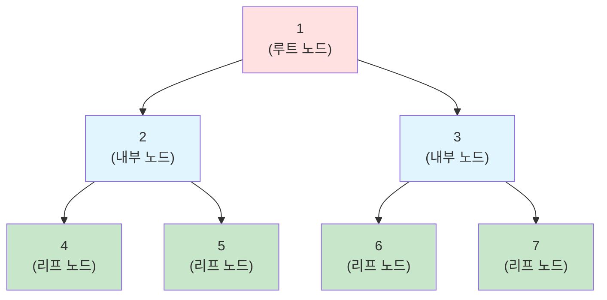
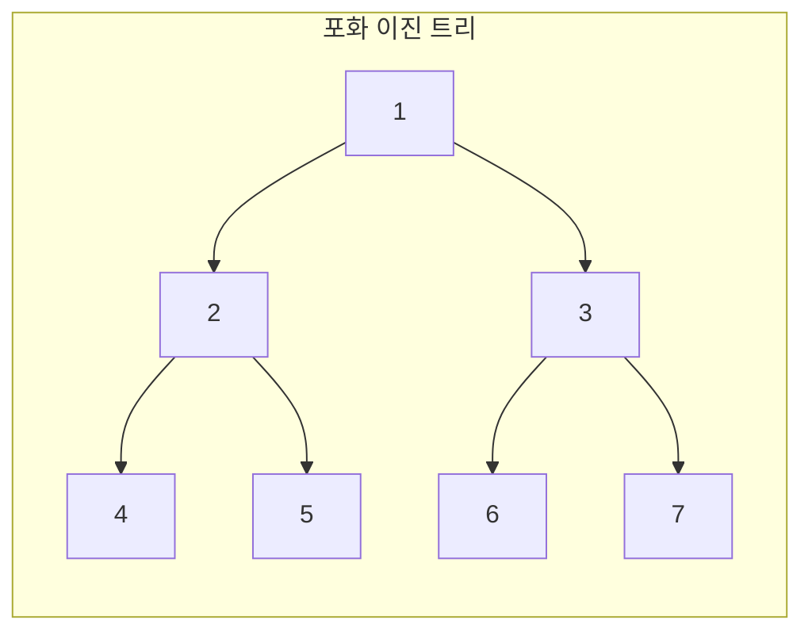
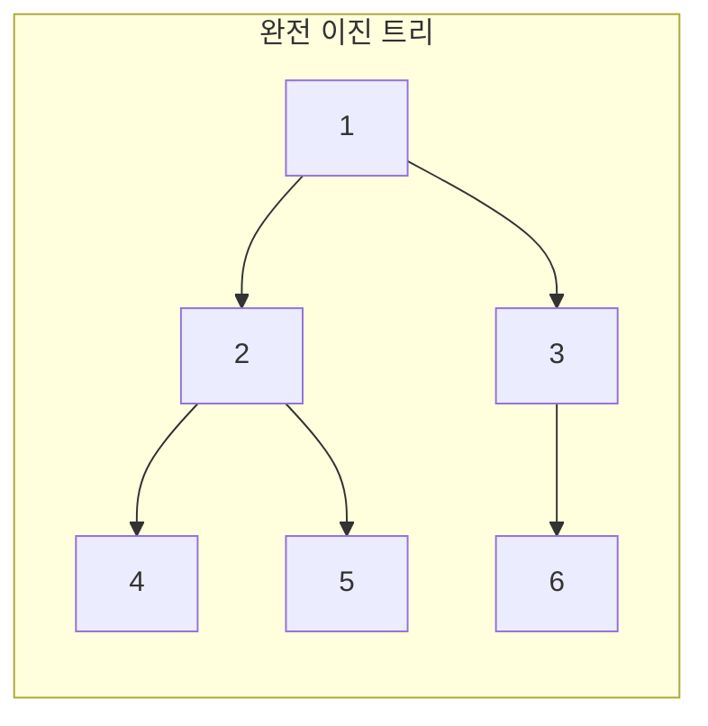
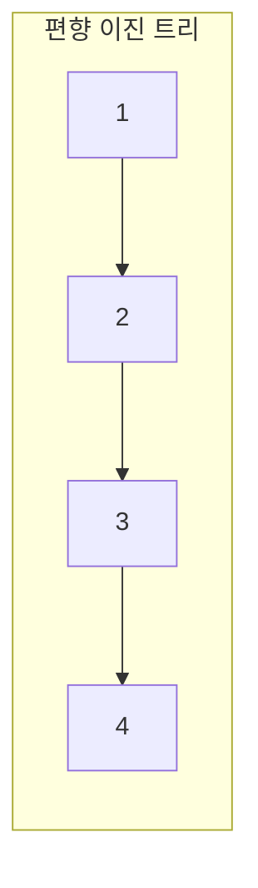

:::div{.callout}
넓이 우선 탐색, 깊이 우선 탐색은 자료구조가 아니라 알고리즘 파트로 가야 하지만, 트리 자료구조를 탐색하는 대표적인 방법이기에 이 챕터에서 다룹니다.
:::

# 1. 트리 (Tree)

트리는 **노드들이 계층적으로 연결된 자료구조**입니다. 하나의 루트 노드에서 시작하여 자식 노드들로 뻗어나가는 형태로, 사이클이 없는 연결 그래프입니다.

## 1.1 트리의 기본 용어



- **노드(Node)**: 트리의 구성 요소
- **루트(Root)**: 최상위 노드 (노드 1)
- **부모(Parent)**: 특정 노드의 상위 노드 (2의 부모는 1)
- **자식(Child)**: 특정 노드의 하위 노드 (1의 자식은 2, 3)
- **형제(Sibling)**: 같은 부모를 가진 노드 (2와 3)
- **리프(Leaf)**: 자식이 없는 노드 (4, 5, 6, 7)
- **내부 노드(Internal Node)**: 자식이 있는 노드 (1, 2, 3)
- **깊이(Depth)**: 루트에서 특정 노드까지의 경로 길이 (4의 깊이: 2)
- **높이(Height)**: 트리의 최대 깊이 (이 트리의 높이: 2)
- **레벨(Level)**: 루트를 0 또는 1로 시작하는 깊이

## 1.2 트리의 특징

- **계층 구조**: 부모-자식 관계로 연결
- **사이클 없음**: 순환 구조가 없음
- **하나의 경로**: 두 노드 사이에는 정확히 하나의 경로만 존재
- **N개 노드, N-1개 간선**: N개의 노드는 N-1개의 간선으로 연결

# 2. 이진 트리 (Binary Tree)

이진 트리는 **각 노드가 최대 2개의 자식을 가지는 트리**입니다.

## 2.1 이진 트리의 종류

- **포화 이진 트리 (Full Binary Tree)**: 모든 레벨이 노드로 꽉 차있음




- **완전 이진 트리 (Complete Binary Tree)**: 마지막 레벨을 제외하고 모든 레벨이 꽉 차있고, 마지막 레벨은 왼쪽부터 채워짐


- **편향 이진 트리 (Skewed Binary Tree)**: 한쪽으로만 자식이 있는 트리



## 2.2 이진 트리 구현

```javascript
class TreeNode {
    constructor(value) {
        this.value = value;
        this.left = null;
        this.right = null;
    }
}

// 트리 생성
//     1
//    / \
//   2   3
//  / \
// 4   5

const root = new TreeNode(1);
root.left = new TreeNode(2);
root.right = new TreeNode(3);
root.left.left = new TreeNode(4);
root.left.right = new TreeNode(5);
```

:::div{.callout}
만약 위 문법이 어렵다면 다음과 같이 객체와 배열로도 구현할 수 있습니다. 함께 공부하기 좋은 개념으로는 링크드 리스트가 있습니다. 여기서는 링크드 리스트를 다루지는 않습니다. 스택과 마찬가지로 '개념'이기 때문에 다양한 방식으로 구현할 수 있습니다.

1. 객체 활용: 객체에서 'value'는 노드의 값, 'left'는 왼쪽 자식, 'right'는 오른쪽 자식을 의미합니다.

```javascript
const tree = {
    value: 1,
    left: {
        value: 2,
        left: { value: 4, left: null, right: null },
        right: { value: 5, left: null, right: null }
    },
    right: {
        value: 3,
        left: null,
        right: null
    }
};
```
2. 배열 활용 (완전 이진 트리의 경우) : 배열에서 0번째 값은 값이고, 1번째 값은 왼쪽 자식, 2번째 값은 오른쪽 자식을 의미합니다.

```javascript
const tree = [1,
    [2,
        [4, null, null],
        [5, null, null]
    ],
    [3, null, null]
];
```
:::

## 2.3 이진 트리 순회

트리 순회는 트리의 모든 노드를 체계적으로 방문하는 과정입니다. 재귀로 구현이 되어 있습니다. 가볍게만 훑어봐주세요. 이 부분은 깊이우선탐색, 넓이우선탐색을 제외하고 코딩테스트에서는 잘 출제되지 않습니다.

### 2.3.1 전위 순회 (Preorder)

**루트 → 왼쪽 → 오른쪽** 순서로 방문합니다.

```javascript
function preorder(node) {
    // 전위 순회: Root → Left → Right
    if (node === null) return;

    console.log(node.value);  // 루트 방문
    preorder(node.left);      // 왼쪽 서브트리
    preorder(node.right);     // 오른쪽 서브트리
}

// 결과: 1 2 4 5 3
```

### 2.3.2 중위 순회 (Inorder)

**왼쪽 → 루트 → 오른쪽** 순서로 방문합니다.

```javascript
function inorder(node) {
    // 중위 순회: Left → Root → Right
    if (node === null) return;

    inorder(node.left);       // 왼쪽 서브트리
    console.log(node.value);  // 루트 방문
    inorder(node.right);      // 오른쪽 서브트리
}

// 결과: 4 2 5 1 3
```

### 2.3.3 후위 순회 (Postorder)

**왼쪽 → 오른쪽 → 루트** 순서로 방문합니다.

```javascript
function postorder(node) {
    // 후위 순회: Left → Right → Root
    if (node === null) return;

    postorder(node.left);     // 왼쪽 서브트리
    postorder(node.right);    // 오른쪽 서브트리
    console.log(node.value);  // 루트 방문
}

// 결과: 4 5 2 3 1
```

## 2.4 깊이 우선 탐색 (DFS)과 넓이 우선 탐색 (BFS)

트리 순회는 깊이 우선 탐색(DFS)과 넓이 우선 탐색(BFS)으로 나눌 수 있습니다. DFS는 스택을 사용하고, BFS는 큐를 사용합니다. 예제를 간소화 하기 위해서 트리는 클래스로 구현하지 않고, 객체로 표현하였습니다.

### 2.4.1 깊이 우선 탐색의 개념

깊이 우선 탐색(DFS, Depth-First Search)은 **한 방향으로 끝까지 탐색한 후 다시 돌아와서 다른 방향을 탐색**하는 방법입니다. 스택(Stack) 자료구조를 사용하거나 재귀 함수로 구현합니다.

**DFS 탐색 순서**: A → B → D → E → C → F (깊이 우선으로 탐색)

### 2.4.2 깊이 우선 탐색 구현

```javascript
function dfs(graph, start) {
    // 객체 그래프에서 DFS 수행
    const visited = [];
    const stack = [start];

    while (stack.length > 0) {
        // 스택에서 노드 꺼내기
        const current = stack.pop();

        // 아직 방문하지 않았다면
        if (!visited.includes(current)) {
            visited.push(current);
            console.log(`방문: ${current}`);

            // 자식 노드들을 스택에 추가 (역순으로)
            if (graph[current]) {
                // 역순으로 추가해야 올바른 순서로 방문
                for (let i = graph[current].length - 1; i >= 0; i--) {
                    const neighbor = graph[current][i];
                    if (!visited.includes(neighbor)) {
                        stack.push(neighbor);
                    }
                }
            }
        }
    }

    return visited;
}

// 그래프 정의 (객체)
const graph = {
    'A': ['B', 'C'],
    'B': ['D', 'E'],
    'C': ['F'],
    'D': [],
    'E': [],
    'F': []
};

// DFS 실행
const result = dfs(graph, 'A');
console.log(`DFS 탐색 순서: ${result.join(' → ')}`);
// 출력: DFS 탐색 순서: A → B → D → E → C → F
```

### 2.4.3 넓이 우선 탐색의 개념

넓이 우선 탐색(BFS, Breadth-First Search)은 **같은 레벨의 노드들을 먼저 모두 탐색한 후 다음 레벨로 이동**하는 방법입니다. 큐(Queue) 자료구조를 사용합니다.

**BFS 탐색 순서**: A → B → C → D → E → F (레벨별로 탐색)

### 2.4.4 넓이 우선 탐색 구현

```javascript
function bfs(graph, start) {
    // 객체 그래프에서 BFS 수행
    const visited = [];
    const queue = [start];

    while (queue.length > 0) {
        // 큐에서 노드 꺼내기 (앞에서 꺼냄)
        const current = queue.shift();

        // 아직 방문하지 않았다면
        if (!visited.includes(current)) {
            visited.push(current);
            console.log(`방문: ${current}`);

            // 자식 노드들을 큐에 추가 (순서대로)
            if (graph[current]) {
                for (const neighbor of graph[current]) {
                    if (!visited.includes(neighbor) && !queue.includes(neighbor)) {
                        queue.push(neighbor);
                    }
                }
            }
        }
    }

    return visited;
}

// 그래프 정의 (객체)
const graph = {
    'A': ['B', 'C'],
    'B': ['D', 'E'],
    'C': ['F'],
    'D': [],
    'E': [],
    'F': []
};

// BFS 실행
const result = bfs(graph, 'A');
console.log(`BFS 탐색 순서: ${result.join(' → ')}`);
// 출력: BFS 탐색 순서: A → B → C → D → E → F
```

### 2.4.5 DFS vs BFS 비교

| 특성 | DFS (깊이 우선) | BFS (넓이 우선) |
|------|----------------|----------------|
| 자료구조 | 스택 (Stack) | 큐 (Queue) |
| 탐색 방식 | 한 방향 끝까지 | 레벨별로 |
| 메모리 | 적게 사용 | 많이 사용 |
| 최단 경로 | 보장 안 됨 | 보장됨 |
| 구현 | 재귀/반복문 | 반복문 주로 사용 |
| 적용 사례 | 미로 탐색, 백트래킹 | 최단 경로, 레벨 순회 |

# 5. 연습문제

* (DFS/BFS) (라이캣의 꿈-1) 출항 준비!: https://jsalgo.co.kr/?page=14
* (DFS/BFS) 제주에 남겨진 단서: https://to.jsalgo.co.kr/?page=5
* 간단하게 아래 문제를 DFS와 BFS로 풀어보세요.
```javascript
// 객체로 표현한 트리 (인접 리스트 방식)
const tree = {
    'A': ['B', 'C'],
    'B': ['D', 'E'],
    'C': ['F', 'G'],
    'D': [],
    'E': [],
    'F': [],
    'G': []
};
//         A
//        / \
//       B   C
//      / \ / \
//     D  E F  G
```
