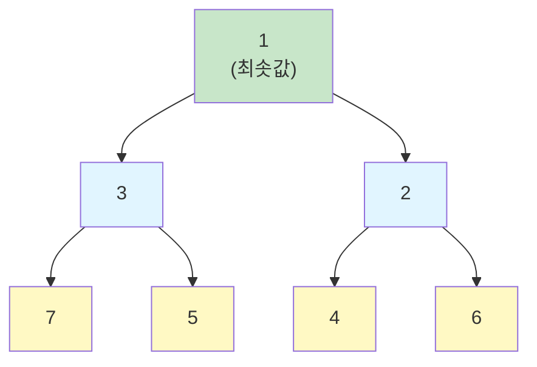
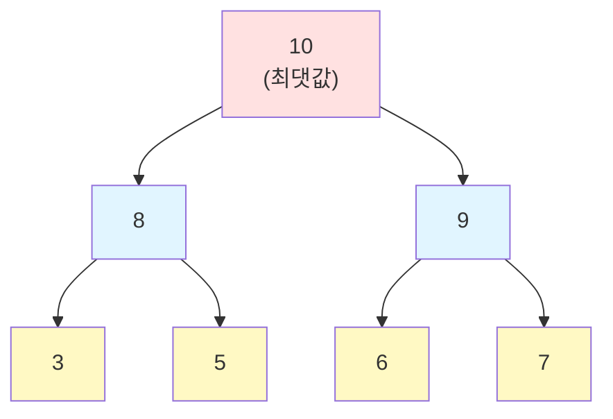

:::div{.callout}
힙 문제는 JavaScript에서는 직접 구현해야 하는 경우가 많습니다. 따라서 해당 문제는 형평성 때문에 정렬문제로만 출제되는 경향이 강합니다. 연습문제는 별도로 없으니, 정렬 문제를 참고해주세요.

* JavaScript에서는 힙을 직접 구현하거나 배열 정렬을 활용해야 합니다.
:::

# 1. 힙 (Heap)

힙은 **완전 이진 트리 기반의 자료구조**로, 부모 노드와 자식 노드 간에 특정한 순서 관계가 있습니다. 주로 **우선순위 큐**를 구현하는 데 사용됩니다.

## 1.1 힙의 특징

- **완전 이진 트리**: 마지막 레벨을 제외하고 모든 레벨이 채워져 있고, 마지막 레벨은 왼쪽부터 채워짐
- **힙 속성**: 부모 노드가 자식 노드보다 항상 크거나(최대 힙) 작음(최소 힙)
- **최댓값/최솟값 빠른 접근**: O(1) 시간에 최댓값 또는 최솟값 조회
- **효율적인 삽입/삭제**: O(log n) 시간에 삽입과 삭제

## 1.2 최소 힙 vs 최대 힙

### 1.2.1 최소 힙 (Min Heap)

부모 노드가 자식 노드보다 항상 작거나 같은 힙입니다.



**특징**: 루트 노드가 전체 힙에서 가장 작은 값

### 1.2.2 최대 힙 (Max Heap)

부모 노드가 자식 노드보다 항상 크거나 같은 힙입니다.



**특징**: 루트 노드가 전체 힙에서 가장 큰 값

## 1.3 힙의 배열 표현

힙은 완전 이진 트리이므로 배열로 효율적으로 표현할 수 있습니다.

```javascript
// 최소 힙: [1, 3, 2, 7, 5, 4, 6]
// 인덱스:   0  1  2  3  4  5  6

// 인덱스 i인 노드의:
// - 부모 인덱스: Math.floor((i - 1) / 2)
// - 왼쪽 자식 인덱스: 2 * i + 1
// - 오른쪽 자식 인덱스: 2 * i + 2

// 예시: 인덱스 1 (값: 3)
const parent = Math.floor((1 - 1) / 2);  // 0 (값: 1)
const leftChild = 2 * 1 + 1;              // 3 (값: 7)
const rightChild = 2 * 1 + 2;             // 4 (값: 5)
```

**배열**: `[1, 3, 2, 7, 5, 4, 6]`

**트리**:
```
       1 (i=0)
      / \
     3   2 (i=1,2)
    / \ / \
   7  5 4  6 (i=3,4,5,6)
```

# 2. JavaScript에서 힙 구현

JavaScript에는 내장 힙이 없으므로 직접 구현해야 합니다.

## 2.1 최소 힙 클래스

```javascript
class MinHeap {
    constructor() {
        this.heap = [];
    }

    // 부모 인덱스
    getParentIndex(i) {
        return Math.floor((i - 1) / 2);
    }

    // 왼쪽 자식 인덱스
    getLeftChildIndex(i) {
        return 2 * i + 1;
    }

    // 오른쪽 자식 인덱스
    getRightChildIndex(i) {
        return 2 * i + 2;
    }

    // 두 요소 교환
    swap(i, j) {
        [this.heap[i], this.heap[j]] = [this.heap[j], this.heap[i]];
    }

    // 삽입 - O(log n)
    push(value) {
        this.heap.push(value);
        this.heapifyUp();
    }

    // 위로 힙 정렬
    heapifyUp() {
        let index = this.heap.length - 1;

        while (index > 0) {
            const parentIndex = this.getParentIndex(index);

            if (this.heap[parentIndex] <= this.heap[index]) break;

            this.swap(parentIndex, index);
            index = parentIndex;
        }
    }

    // 최솟값 제거 및 반환 - O(log n)
    pop() {
        if (this.heap.length === 0) return undefined;
        if (this.heap.length === 1) return this.heap.pop();

        const min = this.heap[0];
        this.heap[0] = this.heap.pop();
        this.heapifyDown();

        return min;
    }

    // 아래로 힙 정렬
    heapifyDown() {
        let index = 0;

        while (this.getLeftChildIndex(index) < this.heap.length) {
            let smallerChildIndex = this.getLeftChildIndex(index);
            const rightChildIndex = this.getRightChildIndex(index);

            if (rightChildIndex < this.heap.length &&
                this.heap[rightChildIndex] < this.heap[smallerChildIndex]) {
                smallerChildIndex = rightChildIndex;
            }

            if (this.heap[index] <= this.heap[smallerChildIndex]) break;

            this.swap(index, smallerChildIndex);
            index = smallerChildIndex;
        }
    }

    // 최솟값 조회 (제거 안 함) - O(1)
    peek() {
        return this.heap[0];
    }

    // 힙 크기
    size() {
        return this.heap.length;
    }

    // 힙이 비어있는지 확인
    isEmpty() {
        return this.heap.length === 0;
    }
}

// 사용 예제
const minHeap = new MinHeap();
minHeap.push(5);
minHeap.push(3);
minHeap.push(7);
minHeap.push(1);

console.log(minHeap.peek());  // 1
console.log(minHeap.pop());   // 1
console.log(minHeap.pop());   // 3
console.log(minHeap.pop());   // 5
```

## 2.2 최대 힙 클래스

```javascript
class MaxHeap {
    constructor() {
        this.heap = [];
    }

    getParentIndex(i) {
        return Math.floor((i - 1) / 2);
    }

    getLeftChildIndex(i) {
        return 2 * i + 1;
    }

    getRightChildIndex(i) {
        return 2 * i + 2;
    }

    swap(i, j) {
        [this.heap[i], this.heap[j]] = [this.heap[j], this.heap[i]];
    }

    push(value) {
        this.heap.push(value);
        this.heapifyUp();
    }

    heapifyUp() {
        let index = this.heap.length - 1;

        while (index > 0) {
            const parentIndex = this.getParentIndex(index);

            if (this.heap[parentIndex] >= this.heap[index]) break;

            this.swap(parentIndex, index);
            index = parentIndex;
        }
    }

    pop() {
        if (this.heap.length === 0) return undefined;
        if (this.heap.length === 1) return this.heap.pop();

        const max = this.heap[0];
        this.heap[0] = this.heap.pop();
        this.heapifyDown();

        return max;
    }

    heapifyDown() {
        let index = 0;

        while (this.getLeftChildIndex(index) < this.heap.length) {
            let largerChildIndex = this.getLeftChildIndex(index);
            const rightChildIndex = this.getRightChildIndex(index);

            if (rightChildIndex < this.heap.length &&
                this.heap[rightChildIndex] > this.heap[largerChildIndex]) {
                largerChildIndex = rightChildIndex;
            }

            if (this.heap[index] >= this.heap[largerChildIndex]) break;

            this.swap(index, largerChildIndex);
            index = largerChildIndex;
        }
    }

    peek() {
        return this.heap[0];
    }

    size() {
        return this.heap.length;
    }

    isEmpty() {
        return this.heap.length === 0;
    }
}

// 사용 예제
const maxHeap = new MaxHeap();
maxHeap.push(5);
maxHeap.push(3);
maxHeap.push(7);
maxHeap.push(1);

console.log(maxHeap.peek());  // 7
console.log(maxHeap.pop());   // 7
console.log(maxHeap.pop());   // 5
```

# 3. 우선순위 큐 (Priority Queue)

우선순위 큐는 **각 요소가 우선순위를 가지며, 우선순위가 높은 요소가 먼저 나가는 자료구조**입니다. 힙으로 구현하면 효율적입니다.

## 3.1 우선순위 큐 구현

```javascript
class PriorityQueue {
    constructor() {
        this.heap = [];
        this.counter = 0;  // 같은 우선순위일 때 삽입 순서 보장
    }

    push(item, priority) {
        // 우선순위와 함께 요소 추가 (낮은 값이 높은 우선순위)
        // [우선순위, 삽입순서, 값] 배열로 저장
        this.heap.push([priority, this.counter, item]);
        this.counter++;
        this.heapifyUp();
    }

    heapifyUp() {
        let index = this.heap.length - 1;

        while (index > 0) {
            const parentIndex = Math.floor((index - 1) / 2);

            // 우선순위 비교 (같으면 삽입 순서로)
            if (this.compare(this.heap[parentIndex], this.heap[index]) <= 0) break;

            [this.heap[parentIndex], this.heap[index]] = [this.heap[index], this.heap[parentIndex]];
            index = parentIndex;
        }
    }

    pop() {
        if (this.heap.length === 0) return undefined;
        if (this.heap.length === 1) return this.heap.pop()[2];

        const min = this.heap[0][2];
        this.heap[0] = this.heap.pop();
        this.heapifyDown();

        return min;
    }

    heapifyDown() {
        let index = 0;

        while (2 * index + 1 < this.heap.length) {
            let smallerChildIndex = 2 * index + 1;
            const rightChildIndex = 2 * index + 2;

            if (rightChildIndex < this.heap.length &&
                this.compare(this.heap[rightChildIndex], this.heap[smallerChildIndex]) < 0) {
                smallerChildIndex = rightChildIndex;
            }

            if (this.compare(this.heap[index], this.heap[smallerChildIndex]) <= 0) break;

            [this.heap[index], this.heap[smallerChildIndex]] = [this.heap[smallerChildIndex], this.heap[index]];
            index = smallerChildIndex;
        }
    }

    compare(a, b) {
        // 우선순위 비교, 같으면 삽입 순서로
        if (a[0] !== b[0]) return a[0] - b[0];
        return a[1] - b[1];
    }

    peek() {
        return this.heap.length > 0 ? this.heap[0][2] : undefined;
    }

    isEmpty() {
        return this.heap.length === 0;
    }

    size() {
        return this.heap.length;
    }
}

// 사용 예제
const pq = new PriorityQueue();
pq.push("작업 A", 3);
pq.push("작업 B", 1);  // 가장 높은 우선순위
pq.push("작업 C", 2);

console.log(pq.pop());  // "작업 B" (우선순위 1)
console.log(pq.pop());  // "작업 C" (우선순위 2)
console.log(pq.pop());  // "작업 A" (우선순위 3)
```

# 4. 힙 사용 시나리오

## 4.1 힙이 적합한 경우

- **최댓값/최솟값을 자주 찾을 때**
  - K번째로 큰/작은 요소 찾기
  - 중간값 유지

- **우선순위 기반 처리**
  - 작업 스케줄링
  - 이벤트 관리

- **정렬이 필요하지만 전체 정렬은 비효율적일 때**
  - 상위 K개만 필요한 경우
  - 힙 정렬 (Heap Sort)

- **다익스트라 알고리즘**
  - 최단 경로 찾기

## 4.2 힙이 부적합한 경우

- **임의의 요소 검색**
  - O(n) 시간 소요, 해시 테이블이 더 적합

- **모든 요소 정렬 필요**
  - 일반 정렬 알고리즘 사용

- **FIFO/LIFO 순서 필요**
  - 큐/스택 사용

# 5. 힙의 시간복잡도

| 연산 | 시간복잡도 | 설명 |
|------|-----------|------|
| **최댓값/최솟값 조회** | O(1) | 루트 노드 접근 |
| **삽입 (push)** | O(log n) | 트리 높이만큼 이동 |
| **삭제 (pop)** | O(log n) | 트리 높이만큼 이동 |
| **힙 생성 (heapify)** | O(n) | 상향식 힙 구성 |
| **K개 최댓값/최솟값** | O(n log k) | 크기 k인 힙 유지 |
