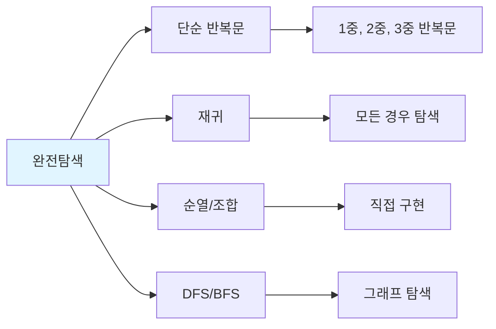

# 1. 완전탐색 (Brute Force)

완전탐색은 **가능한 모든 경우의 수를 탐색**하여 정답을 찾는 방법입니다. 가장 단순하지만 확실한 방법으로, 코딩테스트에서 가장 자주 사용됩니다.

## 1.1 완전탐색이 중요한 이유

코딩테스트에서 완전탐색이 중요한 이유는 다음과 같습니다.

- **출제 비중이 높음**: 구현/시뮬레이션(33%)의 상당 부분이 완전탐색
- **기본기 평가**: 문제를 정확히 이해하고 구현하는 능력 평가
- **복잡한 알고리즘 불필요**: 최적화보다 정확한 구현이 중요한 경우 많음
- **시간 제한 내 통과 가능**: 입력 크기가 작으면 O(n²), O(n³)도 충분

:::div{.callout}
**완전탐색 문제 판별법**

1. 입력 크기를 확인하세요
   - n ≤ 20: O(2^n) 가능 (지수 시간)
   - n ≤ 100: O(n³) 가능
   - n ≤ 1,000: O(n²) 가능
   - n ≤ 100,000: O(n log n) 또는 O(n) 필요

2. "모든", "가능한", "경우의 수" 같은 키워드 확인
:::

## 1.2 완전탐색의 유형



# 2. 단순 반복문

가장 기본적인 완전탐색으로, 반복문을 사용해 모든 경우를 확인합니다.

## 2.1 1중 반복문

```javascript
// 예제: 배열에서 특정 값 찾기
function findValue(arr, target) {
    for (let i = 0; i < arr.length; i++) {
        if (arr[i] === target) {
            return i;
        }
    }
    return -1;
}

// 예제: 최댓값 찾기
function findMax(arr) {
    let maxVal = arr[0];
    for (const num of arr) {
        if (num > maxVal) {
            maxVal = num;
        }
    }
    return maxVal;
}

// 실행
const numbers = [3, 1, 4, 1, 5, 9, 2, 6];
console.log(findValue(numbers, 5));  // 4
console.log(findMax(numbers));       // 9
```

## 2.2 2중 반복문

```javascript
// 예제: 두 수의 합이 target인 쌍 찾기
function twoSum(arr, target) {
    const n = arr.length;
    const result = [];
    for (let i = 0; i < n; i++) {
        for (let j = i + 1; j < n; j++) {  // i 이후부터 탐색 (중복 방지)
            if (arr[i] + arr[j] === target) {
                result.push([arr[i], arr[j]]);
            }
        }
    }
    return result;
}

// 실행
const numbers = [2, 7, 11, 15, 3, 6];
console.log(twoSum(numbers, 9));  // [[2, 7], [3, 6]]
```

## 2.3 3중 반복문

```javascript
// 예제: 세 수의 합이 target인 조합 찾기
function threeSum(arr, target) {
    const n = arr.length;
    const result = [];
    for (let i = 0; i < n; i++) {
        for (let j = i + 1; j < n; j++) {
            for (let k = j + 1; k < n; k++) {
                if (arr[i] + arr[j] + arr[k] === target) {
                    result.push([arr[i], arr[j], arr[k]]);
                }
            }
        }
    }
    return result;
}

// 실행
const numbers = [1, 2, 3, 4, 5, 6];
console.log(threeSum(numbers, 10));  // [[1, 3, 6], [1, 4, 5], [2, 3, 5]]
```

# 3. 순열과 조합

순열과 조합은 코딩테스트에서 매우 자주 사용되는 완전탐색 기법입니다. JavaScript에는 내장 함수가 없으므로 직접 구현해야 합니다.

## 3.1 순열 (Permutation)

순열은 **순서가 중요한** 경우의 수입니다. n개 중 r개를 선택하여 나열하는 경우의 수는 nPr = n! / (n-r)! 입니다.

```javascript
// 순열 생성 함수
function* permutations(arr, r = arr.length) {
    if (r === 1) {
        for (const item of arr) {
            yield [item];
        }
        return;
    }

    for (let i = 0; i < arr.length; i++) {
        const rest = [...arr.slice(0, i), ...arr.slice(i + 1)];
        for (const perm of permutations(rest, r - 1)) {
            yield [arr[i], ...perm];
        }
    }
}

// 기본 사용법
const arr = [1, 2, 3];

// 모든 순열 (3개 모두 선택)
for (const perm of permutations(arr)) {
    console.log(perm);
}
// [1, 2, 3], [1, 3, 2], [2, 1, 3], [2, 3, 1], [3, 1, 2], [3, 2, 1]

// 2개 선택 순열
for (const perm of permutations(arr, 2)) {
    console.log(perm);
}
// [1, 2], [1, 3], [2, 1], [2, 3], [3, 1], [3, 2]

// 배열로 변환
const allPerms = [...permutations(arr)];
console.log(allPerms.length);  // 6 (3! = 6)
```

**순열 활용 예제: 숫자 카드로 만들 수 있는 가장 큰 수**

```javascript
function* permutations(arr, r = arr.length) {
    if (r === 1) {
        for (const item of arr) yield [item];
        return;
    }
    for (let i = 0; i < arr.length; i++) {
        const rest = [...arr.slice(0, i), ...arr.slice(i + 1)];
        for (const perm of permutations(rest, r - 1)) {
            yield [arr[i], ...perm];
        }
    }
}

function largestNumber(cards) {
    // 숫자 카드로 만들 수 있는 가장 큰 수
    let maxNum = 0;

    for (const perm of permutations(cards)) {
        // 배열을 문자열로 변환 후 정수로
        const num = parseInt(perm.join(''), 10);
        maxNum = Math.max(maxNum, num);
    }

    return maxNum;
}

const cards = [3, 1, 4, 1, 5];
console.log(largestNumber(cards));  // 54311
```

## 3.2 조합 (Combination)

조합은 **순서가 중요하지 않은** 경우의 수입니다. n개 중 r개를 선택하는 경우의 수는 nCr = n! / (r! × (n-r)!) 입니다.

```javascript
// 조합 생성 함수
function* combinations(arr, r) {
    if (r === 1) {
        for (const item of arr) {
            yield [item];
        }
        return;
    }

    for (let i = 0; i <= arr.length - r; i++) {
        for (const comb of combinations(arr.slice(i + 1), r - 1)) {
            yield [arr[i], ...comb];
        }
    }
}

// 기본 사용법
const arr = [1, 2, 3, 4];

// 2개 선택 조합
for (const comb of combinations(arr, 2)) {
    console.log(comb);
}
// [1, 2], [1, 3], [1, 4], [2, 3], [2, 4], [3, 4]

// 3개 선택 조합
for (const comb of combinations(arr, 3)) {
    console.log(comb);
}
// [1, 2, 3], [1, 2, 4], [1, 3, 4], [2, 3, 4]
```

**조합 활용 예제: 팀 나누기**

```javascript
function* combinations(arr, r) {
    if (r === 1) {
        for (const item of arr) yield [item];
        return;
    }
    for (let i = 0; i <= arr.length - r; i++) {
        for (const comb of combinations(arr.slice(i + 1), r - 1)) {
            yield [arr[i], ...comb];
        }
    }
}

function teamDifference(abilities) {
    // n명을 두 팀으로 나눌 때 능력치 차이의 최솟값 (n은 짝수)
    const n = abilities.length;
    const total = abilities.reduce((a, b) => a + b, 0);
    let minDiff = Infinity;

    // n/2명을 뽑는 모든 조합
    const indices = Array.from({ length: n }, (_, i) => i);
    for (const team1 of combinations(indices, n / 2)) {
        const team1Sum = team1.reduce((sum, i) => sum + abilities[i], 0);
        const team2Sum = total - team1Sum;
        const diff = Math.abs(team1Sum - team2Sum);
        minDiff = Math.min(minDiff, diff);
    }

    return minDiff;
}

const abilities = [1, 2, 3, 4, 5, 6];
console.log(teamDifference(abilities));  // 1 ([1,4,6] vs [2,3,5])
```

## 3.3 중복 순열과 중복 조합

```javascript
// 중복 순열 (product)
// 같은 요소를 여러 번 선택 가능, 순서 O
function* product(arr, repeat) {
    if (repeat === 1) {
        for (const item of arr) yield [item];
        return;
    }
    for (const item of arr) {
        for (const rest of product(arr, repeat - 1)) {
            yield [item, ...rest];
        }
    }
}

const arr = [1, 2, 3];
for (const prod of product(arr, 2)) {
    console.log(prod);
}
// [1, 1], [1, 2], [1, 3], [2, 1], [2, 2], [2, 3], [3, 1], [3, 2], [3, 3]

// 중복 조합 (combinations_with_replacement)
// 같은 요소를 여러 번 선택 가능, 순서 X
function* combinationsWithReplacement(arr, r) {
    if (r === 1) {
        for (const item of arr) yield [item];
        return;
    }
    for (let i = 0; i < arr.length; i++) {
        for (const comb of combinationsWithReplacement(arr.slice(i), r - 1)) {
            yield [arr[i], ...comb];
        }
    }
}

for (const comb of combinationsWithReplacement(arr, 2)) {
    console.log(comb);
}
// [1, 1], [1, 2], [1, 3], [2, 2], [2, 3], [3, 3]
```

## 3.4 순열/조합 비교 정리

| 구분 | 순서 | 중복 | 함수 | 경우의 수 |
|------|------|------|------|-----------|
| 순열 | O | X | `permutations(arr, r)` | nPr |
| 조합 | X | X | `combinations(arr, r)` | nCr |
| 중복 순열 | O | O | `product(arr, repeat)` | n^r |
| 중복 조합 | X | O | `combinationsWithReplacement(arr, r)` | n+r-1Cr |

# 4. 재귀를 이용한 완전탐색

재귀는 자기 자신을 호출하는 함수로, 복잡한 완전탐색 문제를 직관적으로 해결할 수 있습니다.

## 4.1 부분집합 생성

```javascript
function generateSubsets(arr) {
    // 모든 부분집합 생성
    const result = [];
    const n = arr.length;

    function backtrack(index, current) {
        // 모든 요소를 고려했으면 결과에 추가
        if (index === n) {
            result.push([...current]);  // 복사본 추가
            return;
        }

        // 현재 요소를 포함하지 않는 경우
        backtrack(index + 1, current);

        // 현재 요소를 포함하는 경우
        current.push(arr[index]);
        backtrack(index + 1, current);
        current.pop();  // 백트래킹
    }

    backtrack(0, []);
    return result;
}

const arr = [1, 2, 3];
const subsets = generateSubsets(arr);
console.log(subsets);
// [[], [3], [2], [2, 3], [1], [1, 3], [1, 2], [1, 2, 3]]
```

## 4.2 순열 직접 구현

```javascript
function generatePermutations(arr) {
    // 순열 직접 구현 (재귀)
    const result = [];
    const n = arr.length;
    const used = new Array(n).fill(false);

    function backtrack(current) {
        if (current.length === n) {
            result.push([...current]);
            return;
        }

        for (let i = 0; i < n; i++) {
            if (!used[i]) {
                used[i] = true;
                current.push(arr[i]);
                backtrack(current);
                current.pop();
                used[i] = false;
            }
        }
    }

    backtrack([]);
    return result;
}

const arr = [1, 2, 3];
const perms = generatePermutations(arr);
console.log(perms);
// [[1, 2, 3], [1, 3, 2], [2, 1, 3], [2, 3, 1], [3, 1, 2], [3, 2, 1]]
```

## 4.3 순열 생성 문제

```javascript
function nAndM(n, m) {
    // 1부터 n까지 숫자 중 m개를 고르는 모든 순열
    const result = [];
    const used = new Array(n + 1).fill(false);

    function backtrack(current) {
        if (current.length === m) {
            result.push([...current]);
            return;
        }

        for (let i = 1; i <= n; i++) {
            if (!used[i]) {
                used[i] = true;
                current.push(i);
                backtrack(current);
                current.pop();
                used[i] = false;
            }
        }
    }

    backtrack([]);
    return result;
}

// 1~4 중에서 2개 선택 순열
for (const perm of nAndM(4, 2)) {
    console.log(perm.join(' '));
}
```

# 5. 완전탐색 실전 문제

## 5.1 숫자 조합으로 소수 찾기

```javascript
function* permutations(arr, r = arr.length) {
    if (r === 1) {
        for (const item of arr) yield [item];
        return;
    }
    for (let i = 0; i < arr.length; i++) {
        const rest = [...arr.slice(0, i), ...arr.slice(i + 1)];
        for (const perm of permutations(rest, r - 1)) {
            yield [arr[i], ...perm];
        }
    }
}

function countPrimes(numbers) {
    // 숫자 문자열로 만들 수 있는 모든 소수의 개수
    // 예: "17" -> 7, 1, 17, 71 중 소수는 7, 17, 71 -> 3개

    function isPrime(n) {
        if (n < 2) return false;
        for (let i = 2; i <= Math.sqrt(n); i++) {
            if (n % i === 0) return false;
        }
        return true;
    }

    // 모든 길이의 순열 생성
    const candidates = new Set();
    const numArr = numbers.split('');

    for (let length = 1; length <= numArr.length; length++) {
        for (const perm of permutations(numArr, length)) {
            const num = parseInt(perm.join(''), 10);
            candidates.add(num);
        }
    }

    // 소수 개수 세기
    let count = 0;
    for (const num of candidates) {
        if (isPrime(num)) {
            count++;
        }
    }

    return count;
}

console.log(countPrimes("17"));   // 3
console.log(countPrimes("011"));  // 2
```

## 5.2 패턴 매칭으로 점수 계산

```javascript
function mockExam(answers) {
    // 수포자 3명의 찍는 패턴으로 가장 많이 맞힌 사람 찾기

    // 수포자들의 찍기 패턴
    const patterns = [
        [1, 2, 3, 4, 5],                    // 1번 수포자
        [2, 1, 2, 3, 2, 4, 2, 5],           // 2번 수포자
        [3, 3, 1, 1, 2, 2, 4, 4, 5, 5]      // 3번 수포자
    ];

    // 각 수포자의 점수 계산
    const scores = [0, 0, 0];
    answers.forEach((answer, i) => {
        patterns.forEach((pattern, j) => {
            if (answer === pattern[i % pattern.length]) {
                scores[j]++;
            }
        });
    });

    // 가장 높은 점수와 해당 수포자 찾기
    const maxScore = Math.max(...scores);
    const result = scores
        .map((score, i) => score === maxScore ? i + 1 : null)
        .filter(v => v !== null);

    return result;
}

let answers = [1, 2, 3, 4, 5];
console.log(mockExam(answers));  // [1]

answers = [1, 3, 2, 4, 2];
console.log(mockExam(answers));  // [1, 2, 3]
```

## 5.3 격자 크기 찾기

```javascript
function carpet(brown, yellow) {
    // 갈색 격자와 노란색 격자 개수가 주어질 때
    // 카펫의 가로, 세로 크기 찾기

    const total = brown + yellow;

    // 가로가 세로보다 크거나 같음
    // 세로는 최소 3 이상 (노란색이 있으려면)
    for (let height = 3; height <= Math.sqrt(total); height++) {
        if (total % height === 0) {
            const width = total / height;

            // 노란색 영역: (가로-2) * (세로-2)
            if ((width - 2) * (height - 2) === yellow) {
                return [width, height];
            }
        }
    }

    return [];
}

console.log(carpet(10, 2));   // [4, 3]
console.log(carpet(24, 24));  // [8, 6]
```

# 6. 완전탐색 팁

:::div{.callout}
**완전탐색 문제 풀이 전략**

1. **입력 크기 확인**: n ≤ 20이면 O(2^n), n ≤ 10이면 O(n!)도 가능
2. **순열/조합 함수 준비**: 미리 구현해두고 사용
3. **중복 제거**: Set을 활용하여 중복 결과 방지
4. **조기 종료**: 답을 찾으면 바로 return
5. **가지치기**: 불필요한 경우는 탐색하지 않음 (백트래킹)
:::

# 7. 연습문제

* (완전탐색) 2인자 선발: https://jsalgo.co.kr/?page=16
* (완전탐색) 알리는 포케가 좋아: https://jsalgo.co.kr/?page=10
* (완전탐색) 특정 숫자 조합 찾기: https://100.jsalgo.co.kr/?page=69
* (완전탐색) 특정 범위 조합 찾기: https://100.jsalgo.co.kr/?page=70
* (완전탐색) 부분 수열의 합: https://100.jsalgo.co.kr/?page=99
