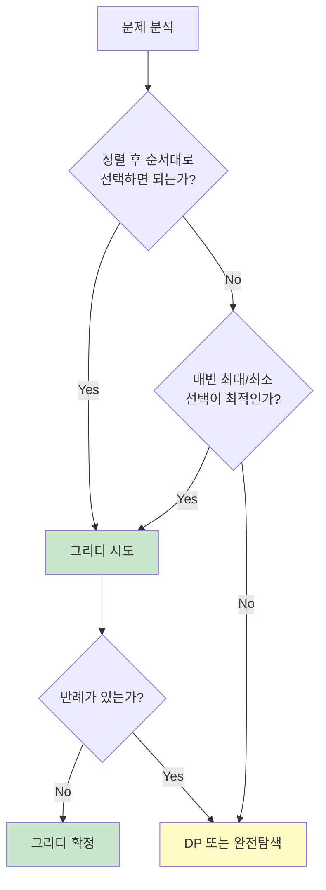

# 1. 그리디 알고리즘이란?

그리디(Greedy) 알고리즘은 **매 순간 최선의 선택**을 하는 알고리즘입니다. 현재 상황에서 가장 좋아 보이는 선택을 반복하여 최종 해답에 도달합니다.

## 1.1 그리디 알고리즘의 특징

- **지역 최적해(Local Optimum)**: 각 단계에서 최선의 선택
- **되돌아가지 않음**: 한 번 선택하면 번복하지 않음
- **빠른 속도**: 대부분 O(n) 또는 O(n log n)
- **최적해 보장 안 됨**: 항상 최적해를 보장하지는 않음

:::div{.callout}
**그리디 알고리즘이 최적해를 보장하는 경우**

그리디 알고리즘이 최적해를 보장하려면 두 가지 조건을 만족해야 합니다.

1. **그리디 선택 속성**: 각 단계의 최선 선택이 전체 최적해로 이어짐
2. **최적 부분 구조**: 부분 문제의 최적해가 전체 최적해에 포함됨

하지만 코딩테스트에서는 이 조건을 증명하기보다, **직관적으로 그리디가 맞는지 판단**하는 것이 중요합니다.
:::

## 1.2 그리디 vs 다른 알고리즘

| 특징 | 그리디 | 동적 프로그래밍 | 완전탐색 |
|------|--------|----------------|----------|
| 선택 방식 | 현재 최선 | 모든 부분 문제 고려 | 모든 경우 탐색 |
| 속도 | 빠름 | 보통 | 느림 |
| 최적해 보장 | 조건부 | 항상 | 항상 |
| 구현 난이도 | 쉬움 | 중간~어려움 | 쉬움 |

# 2. 그리디 알고리즘 기본 패턴

## 2.1 정렬 후 그리디

많은 그리디 문제는 **정렬** 후에 순서대로 선택하는 패턴을 따릅니다.

```javascript
// 패턴: 정렬 → 순서대로 선택
function greedyWithSort(items) {
    items.sort((a, b) => a - b);  // 또는 특정 기준으로 정렬
    let result = 0;

    for (const item of items) {
        // 조건에 맞으면 선택
        if (canSelect(item)) {
            result += item;  // 또는 다른 처리
        }
    }

    return result;
}
```

## 2.2 가장 큰/작은 값 선택

현재 상황에서 가장 크거나 작은 값을 선택하는 패턴입니다.

```javascript
// 패턴: 매번 최대/최소 선택
function greedySelectExtreme(items) {
    const result = [];
    const arr = [...items];

    while (arr.length > 0) {
        // 가장 큰 값 선택
        const maxIdx = arr.indexOf(Math.max(...arr));
        result.push(arr[maxIdx]);
        arr.splice(maxIdx, 1);
    }

    return result;
}
```

# 3. 그리디 대표 문제

## 3.1 거스름돈 문제

가장 대표적인 그리디 문제로, 가장 큰 단위부터 거슬러 줍니다.

```javascript
function minCoins(change) {
    // 거스름돈을 최소 동전 개수로 반환
    // (동전: 500, 100, 50, 10원)

    const coins = [500, 100, 50, 10];
    let count = 0;

    for (const coin of coins) {
        count += Math.floor(change / coin);  // 해당 동전으로 거슬러 줄 수 있는 개수
        change %= coin;                       // 남은 금액
    }

    return count;
}

console.log(minCoins(1260));  // 6 (500*2 + 100*2 + 50*1 + 10*1)
console.log(minCoins(3780));  // 11
```

:::div{.callout}
**주의**: 동전의 단위가 서로 배수 관계가 아닌 경우 그리디가 최적해를 보장하지 않습니다.
예: 동전이 [1, 3, 4]이고 거스름돈이 6원인 경우
- 그리디: 4 + 1 + 1 = 3개
- 최적해: 3 + 3 = 2개
:::

## 3.2 물품 대여 문제

```javascript
function lendItems(n, broken, spare) {
    // n명의 사원이 있고, 일부 사원은 장비가 고장났습니다(broken).
    // 여분의 장비를 가진 사원(spare)은 자신의 바로 앞이나 뒤 번호의
    // 사원에게만 장비를 빌려줄 수 있습니다.
    // 여분이 있어도 자신의 장비가 고장나면 빌려줄 수 없습니다.
    // 업무를 수행할 수 있는 최대 사원 수를 반환하세요.

    // 여분이 있지만 본인 장비가 고장난 사원 제외
    const brokenSet = new Set(broken);
    const spareSet = new Set(spare);

    // 본인 장비가 고장난 사원은 여분이 있어도 빌려줄 수 없음
    for (const b of broken) {
        spareSet.delete(b);
    }
    for (const s of spare) {
        brokenSet.delete(s);
    }

    // 앞 번호부터 빌려주기 (그리디)
    const sortedSpare = [...spareSet].sort((a, b) => a - b);
    for (const s of sortedSpare) {
        // 앞 번호 먼저 확인 (작은 번호 우선)
        if (brokenSet.has(s - 1)) {
            brokenSet.delete(s - 1);
        } else if (brokenSet.has(s + 1)) {
            brokenSet.delete(s + 1);
        }
    }

    // 전체 사원 - 장비 없는 사원
    return n - brokenSet.size;
}

console.log(lendItems(5, [2, 4], [1, 3, 5]));  // 5
console.log(lendItems(5, [2, 4], [3]));        // 4
```

## 3.3 숫자 제거하여 최댓값 만들기

```javascript
function makeLargestNumber(number, k) {
    // 숫자 문자열에서 k개의 숫자를 제거하여 가장 큰 수를 만듭니다.
    // 순서는 유지해야 합니다.
    //
    // 예: "1924"에서 2개 제거 → "94" (1, 2 제거)

    const stack = [];
    let removeCount = 0;

    for (const digit of number) {
        // 스택 top보다 현재 숫자가 크면 제거
        while (stack.length > 0 && removeCount < k && stack[stack.length - 1] < digit) {
            stack.pop();
            removeCount++;
        }

        stack.push(digit);
    }

    // 아직 제거할 개수가 남았으면 뒤에서 제거
    while (removeCount < k) {
        stack.pop();
        removeCount++;
    }

    return stack.join('');
}

console.log(makeLargestNumber("1924", 2));       // "94"
console.log(makeLargestNumber("1231234", 3));    // "3234"
console.log(makeLargestNumber("4177252841", 4)); // "775841"
```

## 3.4 문자열 조작 최소 비용

```javascript
function minOperations(target) {
    // 초기 문자열 "AAA...A"에서 목표 문자열을 만들기 위한 최소 조작 횟수
    //
    // 조작 규칙:
    // - 위/아래: 현재 위치의 문자를 다음/이전 알파벳으로 변경 (A→B 또는 A→Z)
    // - 좌/우: 커서를 이동
    //
    // 커서는 처음에 맨 왼쪽에 있습니다.

    // 각 문자를 만들기 위한 최소 조작 횟수
    function charCost(c) {
        // A에서 시작, 위로 가거나 Z에서 아래로 가기
        const upCost = c.charCodeAt(0) - 'A'.charCodeAt(0);
        const downCost = 'Z'.charCodeAt(0) - c.charCodeAt(0) + 1;
        return Math.min(upCost, downCost);
    }

    const n = target.length;

    // 모든 문자 변경 비용
    let total = 0;
    for (const c of target) {
        total += charCost(c);
    }

    // 커서 이동 최소 비용 (기본: 오른쪽으로 쭉)
    let minMove = n - 1;

    for (let i = 0; i < n; i++) {
        // i 위치에서 연속된 A의 끝 찾기
        let nextI = i + 1;
        while (nextI < n && target[nextI] === 'A') {
            nextI++;
        }

        // 왼쪽으로 갔다가 오른쪽으로, 또는 오른쪽으로 갔다가 왼쪽으로
        // 1. 오른쪽으로 i까지 갔다가 돌아와서 왼쪽 끝으로
        const move1 = i + i + (n - nextI);
        // 2. 왼쪽으로 (n - nextI)만큼 갔다가 돌아와서 오른쪽으로
        const move2 = (n - nextI) * 2 + i;

        minMove = Math.min(minMove, move1, move2);
    }

    return total + minMove;
}

console.log(minOperations("JEROEN"));  // 56
console.log(minOperations("JAN"));     // 23
```

## 3.5 택시 최소 배차

```javascript
function minTaxis(weights, limit) {
    // 여러 사람이 택시를 타려고 합니다.
    // 한 택시에는 최대 2명까지 탈 수 있고, 무게 제한이 있습니다.
    // 필요한 최소 택시 수를 반환하세요.
    //
    // weights: 각 사람의 무게 리스트
    // limit: 택시 무게 제한

    weights.sort((a, b) => a - b);  // 무게 순 정렬

    let count = 0;
    let left = 0;
    let right = weights.length - 1;

    while (left <= right) {
        // 가장 무거운 사람은 무조건 태움
        // 가장 가벼운 사람과 함께 탈 수 있는지 확인
        if (weights[left] + weights[right] <= limit) {
            left++;  // 가벼운 사람도 태움
        }

        right--;  // 무거운 사람 태움
        count++;
    }

    return count;
}

console.log(minTaxis([70, 50, 80, 50], 100));  // 3
console.log(minTaxis([70, 80, 50], 100));      // 3
```

## 3.6 회의실 최대 배정

```javascript
function meetingRoom(meetings) {
    // 회의실에서 최대 몇 개의 회의를 할 수 있는지
    // meetings: [[시작시간, 종료시간], ...]

    // 종료 시간 기준 정렬 (핵심!)
    meetings.sort((a, b) => {
        if (a[1] !== b[1]) return a[1] - b[1];
        return a[0] - b[0];
    });

    let count = 0;
    let endTime = 0;

    for (const [start, end] of meetings) {
        // 이전 회의가 끝난 후에 시작하는 회의만 선택
        if (start >= endTime) {
            count++;
            endTime = end;
        }
    }

    return count;
}

const meetings = [[1, 4], [3, 5], [0, 6], [5, 7], [3, 8], [5, 9], [6, 10], [8, 11], [8, 12], [2, 13], [12, 14]];
console.log(meetingRoom(meetings));  // 4
```

# 4. 그리디 문제 접근법

## 4.1 그리디 문제 판별



## 4.2 그리디 체크리스트

1. **정렬 기준 찾기**: 어떤 기준으로 정렬해야 하는가?
2. **선택 기준 찾기**: 매번 무엇을 기준으로 선택하는가?
3. **반례 확인**: 그리디가 최적해를 보장하는가?
4. **구현**: 정렬 후 순차 처리

:::div{.callout}
**그리디 문제 키워드**

- "최소 개수", "최대 개수"
- "가장 큰", "가장 작은"
- "최소 비용", "최대 이익"
- "가능한 많이", "가능한 적게"

이런 키워드가 있으면 그리디를 먼저 시도해보세요!
:::

# 5. 흔한 그리디 패턴

## 5.1 가장 작은 것 먼저

```javascript
// 예: 최소 동전 개수
// 예: 최소 회의 시간으로 최대 회의 수

items.sort((a, b) => a - b);  // 오름차순
for (const item of items) {
    if (canSelect(item)) {
        select(item);
    }
}
```

## 5.2 가장 큰 것 먼저

```javascript
// 예: 가장 큰 수 만들기
// 예: 최대 이익

items.sort((a, b) => b - a);  // 내림차순
for (const item of items) {
    if (canSelect(item)) {
        select(item);
    }
}
```

## 5.3 종료 시간 기준 정렬

```javascript
// 예: 회의실 배정
// 예: 작업 스케줄링

intervals.sort((a, b) => a[1] - b[1]);  // 종료 시간 기준
let lastEnd = 0;
for (const [start, end] of intervals) {
    if (start >= lastEnd) {
        select();
        lastEnd = end;
    }
}
```

## 5.4 양 끝에서 접근

```javascript
// 예: 구명보트
// 예: 두 수의 합

items.sort((a, b) => a - b);
let left = 0;
let right = items.length - 1;
while (left <= right) {
    // 양 끝의 값을 활용
    process(items[left], items[right]);
}
```

# 6. 연습문제

* (그리디) 비행정 탑승: https://jsalgo.co.kr/?page=13
* (그리디) 리치: https://jsalgo.co.kr/?page=19
* (그리디) 빙키: https://jsalgo.co.kr/?page=20
* (그리디) 최소 동전: https://100.jsalgo.co.kr/?page=51
* (그리디) 잔돈: https://100.jsalgo.co.kr/?page=52
