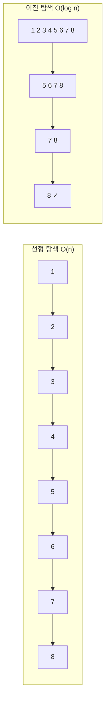
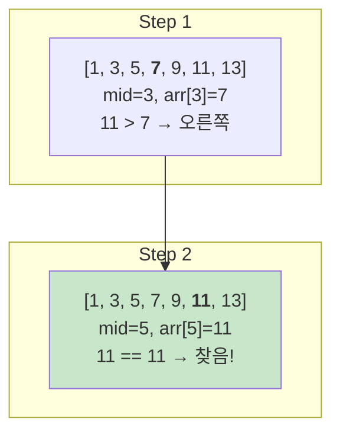
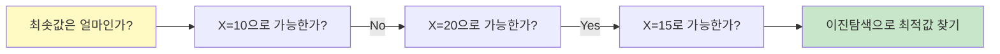

# 1. 이진탐색이란?

이진탐색(Binary Search)은 **정렬된 배열**에서 특정 값을 O(log n)에 찾는 알고리즘입니다. 배열의 중간값과 비교하여 탐색 범위를 절반씩 줄여나갑니다.

## 1.1 이진탐색 vs 선형탐색



| 특성 | 선형 탐색 | 이진 탐색 |
|------|----------|----------|
| 시간복잡도 | O(n) | O(log n) |
| 정렬 필요 | X | O (필수) |
| n = 1,000,000 | 1,000,000번 비교 | 약 20번 비교 |

## 1.2 이진탐색이 빠른 이유

n개의 데이터에서 값을 찾을 때 필요한 비교 횟수:

- **선형 탐색**: 최악 n번
- **이진 탐색**: 최악 log₂n번

```
n = 1,000 → log₂1000 ≈ 10
n = 1,000,000 → log₂1000000 ≈ 20
n = 1,000,000,000 → log₂1000000000 ≈ 30
```

# 2. 기본 이진탐색 구현

## 2.1 반복문 방식

```javascript
function binarySearch(arr, target) {
    // 정렬된 배열에서 target의 인덱스 반환
    // 없으면 -1 반환

    let left = 0;
    let right = arr.length - 1;

    while (left <= right) {
        const mid = Math.floor((left + right) / 2);

        if (arr[mid] === target) {
            return mid;
        } else if (arr[mid] < target) {
            left = mid + 1;   // 오른쪽 절반 탐색
        } else {
            right = mid - 1;  // 왼쪽 절반 탐색
        }
    }

    return -1;
}

// 테스트
const arr = [1, 3, 5, 7, 9, 11, 13, 15, 17, 19];
console.log(binarySearch(arr, 7));   // 3
console.log(binarySearch(arr, 10));  // -1
```

## 2.2 재귀 방식

```javascript
function binarySearchRecursive(arr, target, left, right) {
    // 이진탐색 재귀 구현

    if (left > right) {
        return -1;
    }

    const mid = Math.floor((left + right) / 2);

    if (arr[mid] === target) {
        return mid;
    } else if (arr[mid] < target) {
        return binarySearchRecursive(arr, target, mid + 1, right);
    } else {
        return binarySearchRecursive(arr, target, left, mid - 1);
    }
}

// 테스트
const arr = [1, 3, 5, 7, 9, 11, 13, 15, 17, 19];
console.log(binarySearchRecursive(arr, 7, 0, arr.length - 1));  // 3
```

## 2.3 단계별 동작 과정

배열 `[1, 3, 5, 7, 9, 11, 13]`에서 `11`을 찾는 과정:



# 3. Lower Bound / Upper Bound

JavaScript에는 Python의 bisect 모듈처럼 이진탐색 함수가 내장되어 있지 않으므로 직접 구현해야 합니다.

## 3.1 Lower Bound와 Upper Bound

```javascript
// lowerBound: target 이상인 첫 번째 위치
function lowerBound(arr, target) {
    let left = 0;
    let right = arr.length;

    while (left < right) {
        const mid = Math.floor((left + right) / 2);

        if (arr[mid] < target) {
            left = mid + 1;
        } else {
            right = mid;
        }
    }

    return left;
}

// upperBound: target 초과인 첫 번째 위치
function upperBound(arr, target) {
    let left = 0;
    let right = arr.length;

    while (left < right) {
        const mid = Math.floor((left + right) / 2);

        if (arr[mid] <= target) {
            left = mid + 1;
        } else {
            right = mid;
        }
    }

    return left;
}

const arr = [1, 3, 5, 7, 9, 11];

console.log(lowerBound(arr, 5));   // 2 (5가 있는 위치)
console.log(lowerBound(arr, 6));   // 3 (6이 들어갈 위치)

console.log(upperBound(arr, 5));   // 3 (5 다음 위치)

// 값이 존재하는지 확인
function binarySearchWithBound(arr, target) {
    const idx = lowerBound(arr, target);
    if (idx < arr.length && arr[idx] === target) {
        return idx;
    }
    return -1;
}

console.log(binarySearchWithBound(arr, 5));   // 2
console.log(binarySearchWithBound(arr, 6));   // -1
```

## 3.2 같은 값의 개수 세기

```javascript
function lowerBound(arr, target) {
    let left = 0, right = arr.length;
    while (left < right) {
        const mid = Math.floor((left + right) / 2);
        if (arr[mid] < target) left = mid + 1;
        else right = mid;
    }
    return left;
}

function upperBound(arr, target) {
    let left = 0, right = arr.length;
    while (left < right) {
        const mid = Math.floor((left + right) / 2);
        if (arr[mid] <= target) left = mid + 1;
        else right = mid;
    }
    return left;
}

const arr = [1, 3, 3, 3, 5, 7];

console.log(lowerBound(arr, 3));   // 1 (첫 번째 3의 위치)
console.log(upperBound(arr, 3));   // 4 (마지막 3 다음 위치)

// 특정 값의 개수 세기
function countValue(arr, target) {
    const left = lowerBound(arr, target);
    const right = upperBound(arr, target);
    return right - left;
}

console.log(countValue(arr, 3));  // 3
```

# 4. 이진탐색 응용: 파라메트릭 서치

## 4.1 파라메트릭 서치란?

파라메트릭 서치(Parametric Search)는 **최적화 문제를 결정 문제로 바꾸어** 이진탐색으로 해결하는 기법입니다.

- **최적화 문제**: "최솟값/최댓값은 얼마인가?"
- **결정 문제**: "X로 가능한가?" (Yes/No)



## 4.2 떡볶이 떡 만들기 (나무 자르기)

```javascript
function cutRiceCake(heights, m) {
    // 높이가 heights인 떡들을 절단기로 잘라서
    // 최소 m 이상의 떡을 가져가려 할 때
    // 절단기 높이의 최댓값

    let left = 0;
    let right = Math.max(...heights);
    let result = 0;

    while (left <= right) {
        const mid = Math.floor((left + right) / 2);

        // mid 높이로 잘랐을 때 얻는 떡의 양
        let total = 0;
        for (const h of heights) {
            if (h > mid) {
                total += h - mid;
            }
        }

        if (total >= m) {
            // 충분히 얻을 수 있음 → 높이를 높여봄
            result = mid;
            left = mid + 1;
        } else {
            // 부족함 → 높이를 낮춤
            right = mid - 1;
        }
    }

    return result;
}

const heights = [19, 15, 10, 17];
const m = 6;
console.log(cutRiceCake(heights, m));  // 15
// 높이 15로 자르면: 4 + 0 + 0 + 2 = 6
```

## 4.3 케이블 자르기

```javascript
function cutCables(cables, n) {
    // 길이가 각각 다른 케이블들이 있습니다.
    // 이 케이블들을 동일한 길이로 잘라 n개 이상의 케이블을 만들려고 합니다.
    // 만들 수 있는 케이블의 최대 길이를 구하세요.
    //
    // cables: 각 케이블의 길이 리스트
    // n: 필요한 케이블의 최소 개수

    let left = 1;
    let right = Math.max(...cables);
    let result = 0;

    while (left <= right) {
        const mid = Math.floor((left + right) / 2);

        // mid 길이로 만들 수 있는 케이블 개수
        let count = 0;
        for (const cable of cables) {
            count += Math.floor(cable / mid);
        }

        if (count >= n) {
            // n개 이상 만들 수 있음 → 길이를 늘려봄
            result = mid;
            left = mid + 1;
        } else {
            // n개 미만 → 길이를 줄임
            right = mid - 1;
        }
    }

    return result;
}

const cables = [802, 743, 457, 539];
const n = 11;
console.log(cutCables(cables, n));  // 200
```

## 4.4 창구 대기 시간 최소화

```javascript
function minServiceTime(n, serviceTimes) {
    // n명의 고객이 서비스를 받으려고 합니다.
    // 여러 창구가 있고, 각 창구마다 한 명을 처리하는 데 걸리는 시간이 다릅니다.
    // 모든 고객이 서비스를 받는 데 걸리는 최소 시간을 구하세요.
    //
    // n: 고객 수
    // serviceTimes: 각 창구의 처리 시간 리스트

    let left = 1;
    let right = Math.max(...serviceTimes) * n;
    let result = right;

    while (left <= right) {
        const mid = Math.floor((left + right) / 2);

        // mid 시간 동안 처리할 수 있는 최대 고객 수
        let count = 0;
        for (const time of serviceTimes) {
            count += Math.floor(mid / time);
        }

        if (count >= n) {
            // n명 이상 처리 가능 → 시간을 줄여봄
            result = mid;
            right = mid - 1;
        } else {
            // n명 미만 → 시간을 늘림
            left = mid + 1;
        }
    }

    return result;
}

console.log(minServiceTime(6, [7, 10]));  // 28
// 28분: 7분 창구가 4명, 10분 창구가 2명 = 6명
```

# 5. 이진탐색 실전 문제

## 5.1 특정 수의 개수 세기

```javascript
function lowerBound(arr, target) {
    let left = 0, right = arr.length;
    while (left < right) {
        const mid = Math.floor((left + right) / 2);
        if (arr[mid] < target) left = mid + 1;
        else right = mid;
    }
    return left;
}

function upperBound(arr, target) {
    let left = 0, right = arr.length;
    while (left < right) {
        const mid = Math.floor((left + right) / 2);
        if (arr[mid] <= target) left = mid + 1;
        else right = mid;
    }
    return left;
}

function countByRange(arr, leftValue, rightValue) {
    // 정렬된 배열에서 [leftValue, rightValue] 범위의 개수
    const rightIdx = upperBound(arr, rightValue);
    const leftIdx = lowerBound(arr, leftValue);
    return rightIdx - leftIdx;
}

const arr = [1, 2, 2, 2, 3, 3, 4, 5, 5, 5, 5];
console.log(countByRange(arr, 2, 4));  // 5 (2가 3개, 3이 2개)
console.log(countByRange(arr, 5, 5));  // 4 (5가 4개)
```

## 5.2 가장 가까운 값 찾기

```javascript
function lowerBound(arr, target) {
    let left = 0, right = arr.length;
    while (left < right) {
        const mid = Math.floor((left + right) / 2);
        if (arr[mid] < target) left = mid + 1;
        else right = mid;
    }
    return left;
}

function findClosest(arr, target) {
    // 정렬된 배열에서 target에 가장 가까운 값
    if (arr.length === 0) {
        return null;
    }

    const idx = lowerBound(arr, target);

    // 경계 처리
    if (idx === 0) {
        return arr[0];
    }
    if (idx === arr.length) {
        return arr[arr.length - 1];
    }

    // 왼쪽과 오른쪽 중 가까운 값
    const leftVal = arr[idx - 1];
    const rightVal = arr[idx];

    if (target - leftVal <= rightVal - target) {
        return leftVal;
    } else {
        return rightVal;
    }
}

const arr = [1, 3, 5, 7, 9];
console.log(findClosest(arr, 4));  // 3 또는 5 (3 반환)
console.log(findClosest(arr, 6));  // 5 또는 7 (5 반환)
```

## 5.3 K번째 수 찾기

```javascript
function kthNumber(n, k) {
    // n x n 배열에서 k번째로 작은 수 찾기
    // 배열[i][j] = i * j (1-indexed)

    let left = 1;
    let right = n * n;
    let result = 0;

    while (left <= right) {
        const mid = Math.floor((left + right) / 2);

        // mid 이하의 수 개수
        let count = 0;
        for (let i = 1; i <= n; i++) {
            count += Math.min(Math.floor(mid / i), n);
        }

        if (count >= k) {
            result = mid;
            right = mid - 1;
        } else {
            left = mid + 1;
        }
    }

    return result;
}

console.log(kthNumber(3, 7));  // 6
// 3x3 배열: [[1,2,3],[2,4,6],[3,6,9]]
// 정렬: [1,2,2,3,3,4,6,6,9] → 7번째는 6
```

# 6. 이진탐색 팁

:::div{.callout}
**이진탐색 문제 판별법**

1. **정렬된 배열**에서 특정 값을 찾는 문제
2. **"최소가 되는 최대"** 또는 **"최대가 되는 최소"** 형태의 문제
3. 탐색 범위가 매우 큰 경우 (10^9 이상)
4. "X가 가능한가?"라는 결정 문제로 바꿀 수 있는 경우
:::

## 6.1 이진탐색 구현 주의사항

```javascript
// 1. 무한 루프 방지
while (left <= right) {  // <= 사용
    const mid = Math.floor((left + right) / 2);
    if (condition) {
        left = mid + 1;   // mid가 아닌 mid+1
    } else {
        right = mid - 1;  // mid가 아닌 mid-1
    }
}

// 2. 오버플로우 방지 (JavaScript는 상관없지만 다른 언어 주의)
const mid = left + Math.floor((right - left) / 2);  // (left + right) / 2 대신

// 3. 범위 설정
// - 값을 찾는 경우: left=0, right=arr.length-1
// - 파라메트릭 서치: left=최솟값, right=최댓값
```

## 6.2 Lower/Upper Bound 비교

| 함수 | 설명 | 반환값 |
|------|------|--------|
| `lowerBound(arr, x)` | x 이상인 첫 위치 (lower bound) | x가 들어갈 가장 왼쪽 인덱스 |
| `upperBound(arr, x)` | x 초과인 첫 위치 (upper bound) | x가 들어갈 가장 오른쪽 인덱스 |

# 7. 연습문제

* (이진탐색) 숫자 배열 탐색: https://100.jsalgo.co.kr/?page=21
* (이진탐색) 이진 탐색 구현: https://100.jsalgo.co.kr/?page=22
* (이진탐색) 특정 값 찾기: https://100.jsalgo.co.kr/?page=23
