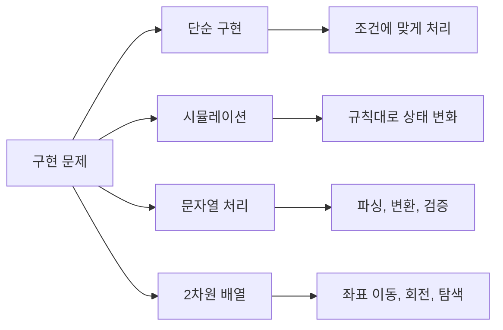

# 1. 구현 문제란?

구현(Implementation) 문제는 **문제에서 요구하는 대로 정확하게 코드를 작성**하는 문제입니다. 특별한 알고리즘보다 **코딩 능력**과 **문제 이해력**을 평가합니다.

## 1.1 구현 문제의 특징

- **출제 비중 최고**: 약 33%로 가장 많이 출제
- **알고리즘 지식보다 코딩력**: 조건문, 반복문, 배열 조작 능력
- **디테일이 중요**: 예외 처리, 경계값, 순서
- **시뮬레이션 포함**: 주어진 규칙대로 상태 변화 시키기

:::div{.callout}
**구현 문제 키워드**

- "주어진 규칙대로", "시뮬레이션"
- "게임", "로봇", "이동"
- "2차원 배열", "좌표"
- "문자열 조작", "파싱"
:::

## 1.2 구현 문제 유형



# 2. 2차원 배열 다루기

2차원 배열(격자) 문제는 구현 문제에서 매우 자주 등장합니다.

## 2.1 좌표 이동

```javascript
// 상하좌우 이동 (가장 많이 사용)
// 순서: 상, 하, 좌, 우
const dx = [-1, 1, 0, 0];
const dy = [0, 0, -1, 1];

// 또는 객체로
const directions = {
    'U': [-1, 0], 'D': [1, 0],
    'L': [0, -1], 'R': [0, 1]
};

// 8방향 이동 (대각선 포함)
const dx8 = [-1, -1, -1, 0, 0, 1, 1, 1];
const dy8 = [-1, 0, 1, -1, 1, -1, 0, 1];


function move(x, y, direction, n, m) {
    // (x, y)에서 direction 방향으로 이동
    // n x m 격자 내에 있으면 새 좌표 반환, 아니면 null

    const nx = x + dx[direction];
    const ny = y + dy[direction];

    if (0 <= nx && nx < n && 0 <= ny && ny < m) {
        return [nx, ny];
    }
    return null;
}


// 예: 5x5 격자에서 (2, 3)에서 상(0)으로 이동
console.log(move(2, 3, 0, 5, 5));  // [1, 3]
```

## 2.2 격자 범위 확인

```javascript
function isValid(x, y, n, m) {
    // 격자 범위 내인지 확인
    return 0 <= x && x < n && 0 <= y && y < m;
}


function getNeighbors(x, y, n, m) {
    // 4방향 이웃 좌표 반환
    const dx = [-1, 1, 0, 0];
    const dy = [0, 0, -1, 1];

    const neighbors = [];
    for (let i = 0; i < 4; i++) {
        const nx = x + dx[i];
        const ny = y + dy[i];
        if (isValid(nx, ny, n, m)) {
            neighbors.push([nx, ny]);
        }
    }

    return neighbors;
}


// 예: 3x3 격자에서 (1, 1)의 이웃
console.log(getNeighbors(1, 1, 3, 3));  // [[0,1], [2,1], [1,0], [1,2]]
```

## 2.3 배열 회전

```javascript
function rotate90Clockwise(matrix) {
    // 2차원 배열 90도 시계방향 회전
    const n = matrix.length;
    const m = matrix[0].length;

    // 새 배열 크기: m x n
    const rotated = Array.from({ length: m }, () => new Array(n));

    for (let i = 0; i < n; i++) {
        for (let j = 0; j < m; j++) {
            rotated[j][n - 1 - i] = matrix[i][j];
        }
    }

    return rotated;
}


function rotate90CounterClockwise(matrix) {
    // 2차원 배열 90도 반시계방향 회전
    const n = matrix.length;
    const m = matrix[0].length;

    const rotated = Array.from({ length: m }, () => new Array(n));

    for (let i = 0; i < n; i++) {
        for (let j = 0; j < m; j++) {
            rotated[m - 1 - j][i] = matrix[i][j];
        }
    }

    return rotated;
}


// 예시
const matrix = [
    [1, 2, 3],
    [4, 5, 6]
];
console.log(rotate90Clockwise(matrix));
// [[4, 1], [5, 2], [6, 3]]
```

## 2.4 간단한 회전 방법

```javascript
function rotate90ClockwiseSimple(matrix) {
    // 간단한 90도 시계방향 회전
    // 행과 열을 뒤집고 전치
    return matrix[0].map((_, colIndex) =>
        matrix.map(row => row[colIndex]).reverse()
    );
}


function rotate90CounterClockwiseSimple(matrix) {
    // 간단한 90도 반시계방향 회전
    return matrix[0].map((_, colIndex) =>
        matrix.map(row => row[row.length - 1 - colIndex])
    );
}


const matrix = [
    [1, 2, 3],
    [4, 5, 6],
    [7, 8, 9]
];
console.log(rotate90ClockwiseSimple(matrix));
// [[7, 4, 1], [8, 5, 2], [9, 6, 3]]
```

# 3. 시뮬레이션 문제

시뮬레이션은 주어진 규칙을 그대로 구현하여 상태를 변화시키는 문제입니다.

## 3.1 상하좌우 이동

```javascript
function solution(n, commands) {
    // n x n 격자에서 (0, 0)에서 시작하여
    // 명령에 따라 이동한 최종 위치

    let x = 0;
    let y = 0;

    const directions = {
        'U': [-1, 0],
        'D': [1, 0],
        'L': [0, -1],
        'R': [0, 1]
    };

    for (const cmd of commands.split(' ')) {
        const [dx, dy] = directions[cmd];
        const nx = x + dx;
        const ny = y + dy;

        // 범위 내에 있을 때만 이동
        if (0 <= nx && nx < n && 0 <= ny && ny < n) {
            x = nx;
            y = ny;
        }
    }

    return [x, y];
}


// 예: 5x5 격자, "R R D D" 명령
console.log(solution(5, "R R D D"));  // [2, 2]
```

## 3.2 로봇 청소기 (삼성 기출 스타일)

```javascript
function robotCleaner(room, startX, startY, startDir) {
    // 로봇 청소기가 청소하는 칸의 개수
    // 1. 현재 칸 청소
    // 2. 반시계 방향으로 탐색
    // 3. 빈 칸이 있으면 한 칸 전진 후 1번으로
    // 4. 빈 칸이 없으면 후진
    // 5. 후진 불가능하면 종료

    const n = room.length;
    const m = room[0].length;
    // 방향: 북(0), 동(1), 남(2), 서(3)
    const dx = [-1, 0, 1, 0];
    const dy = [0, 1, 0, -1];

    let x = startX;
    let y = startY;
    let d = startDir;
    let cleaned = 0;

    while (true) {
        // 1. 현재 칸 청소
        if (room[x][y] === 0) {
            room[x][y] = 2;  // 청소됨 표시
            cleaned++;
        }

        // 2. 주변 4칸 탐색
        let found = false;
        for (let i = 0; i < 4; i++) {
            d = (d + 3) % 4;  // 반시계 방향 회전
            const nx = x + dx[d];
            const ny = y + dy[d];

            if (0 <= nx && nx < n && 0 <= ny && ny < m && room[nx][ny] === 0) {
                x = nx;
                y = ny;
                found = true;
                break;
            }
        }

        if (!found) {
            // 3. 후진 시도
            const backX = x - dx[d];
            const backY = y - dy[d];

            if (0 <= backX && backX < n && 0 <= backY && backY < m && room[backX][backY] !== 1) {
                x = backX;
                y = backY;
            } else {
                // 후진 불가능하면 종료
                break;
            }
        }
    }

    return cleaned;
}


// 예시 (1: 벽, 0: 빈 칸)
const room = [
    [1, 1, 1, 1, 1],
    [1, 0, 0, 0, 1],
    [1, 0, 0, 0, 1],
    [1, 0, 0, 0, 1],
    [1, 1, 1, 1, 1]
];
console.log(robotCleaner(room, 1, 1, 0));  // 9
```

## 3.3 뱀 게임 (삼성 기출)

```javascript
function snakeGame(n, apples, commands) {
    // n x n 보드에서 뱀 게임
    // 게임이 끝나는 시간(초) 반환

    // 사과 위치 셋
    const appleSet = new Set(apples.map(([x, y]) => `${x},${y}`));

    // 방향 전환 딕셔너리
    const cmdDict = new Map(commands);

    // 방향: 우(0), 하(1), 좌(2), 상(3)
    const dx = [0, 1, 0, -1];
    const dy = [1, 0, -1, 0];

    // 뱀 초기 상태 (머리가 뒤, 꼬리가 앞)
    const snake = [[0, 0]];
    const snakeSet = new Set(['0,0']);
    let direction = 0;  // 처음에 오른쪽
    let time = 0;

    while (true) {
        time++;

        // 다음 머리 위치
        const [headX, headY] = snake[snake.length - 1];
        const nextX = headX + dx[direction];
        const nextY = headY + dy[direction];

        // 벽 충돌 또는 자기 자신과 충돌
        if (!(0 <= nextX && nextX < n && 0 <= nextY && nextY < n)) {
            break;
        }
        if (snakeSet.has(`${nextX},${nextY}`)) {
            break;
        }

        // 이동
        snake.push([nextX, nextY]);
        snakeSet.add(`${nextX},${nextY}`);

        // 사과 확인
        const key = `${nextX},${nextY}`;
        if (appleSet.has(key)) {
            appleSet.delete(key);  // 사과 먹음
        } else {
            // 사과 없으면 꼬리 줄임
            const [tailX, tailY] = snake.shift();
            snakeSet.delete(`${tailX},${tailY}`);
        }

        // 방향 전환 확인
        if (cmdDict.has(time)) {
            if (cmdDict.get(time) === 'L') {
                direction = (direction + 3) % 4;
            } else {  // 'D'
                direction = (direction + 1) % 4;
            }
        }
    }

    return time;
}


// 예시
const n = 6;
const apples = [[3, 4], [2, 5], [5, 3]];
const commands = new Map([[3, 'D'], [15, 'L'], [17, 'D']]);
console.log(snakeGame(n, apples, commands));
```

# 4. 실전 구현 문제

## 4.1 격자 버튼 누르기

```javascript
function pressButtons(numbers, dominantHand) {
    // 4x3 격자 형태의 버튼 패드에서 번호를 누를 때
    // 어떤 손으로 눌렀는지 반환합니다.
    //
    // 격자 배치:
    // 1 2 3
    // 4 5 6
    // 7 8 9
    // * 0 #
    //
    // 규칙:
    // - 왼쪽 열(1,4,7): 왼손으로만 누름
    // - 오른쪽 열(3,6,9): 오른손으로만 누름
    // - 가운데 열(2,5,8,0): 가까운 손으로 누름 (거리가 같으면 주 손 사용)

    // 버튼 좌표
    const buttonPos = {
        1: [0, 0], 2: [0, 1], 3: [0, 2],
        4: [1, 0], 5: [1, 1], 6: [1, 2],
        7: [2, 0], 8: [2, 1], 9: [2, 2],
        '*': [3, 0], 0: [3, 1], '#': [3, 2]
    };

    function distance(pos1, pos2) {
        return Math.abs(pos1[0] - pos2[0]) + Math.abs(pos1[1] - pos2[1]);
    }

    let leftPos = buttonPos['*'];
    let rightPos = buttonPos['#'];
    const result = [];

    for (const num of numbers) {
        const pos = buttonPos[num];

        if ([1, 4, 7].includes(num)) {
            result.push('L');
            leftPos = pos;
        } else if ([3, 6, 9].includes(num)) {
            result.push('R');
            rightPos = pos;
        } else {
            const leftDist = distance(leftPos, pos);
            const rightDist = distance(rightPos, pos);

            if (leftDist < rightDist) {
                result.push('L');
                leftPos = pos;
            } else if (rightDist < leftDist) {
                result.push('R');
                rightPos = pos;
            } else {
                if (dominantHand === 'left') {
                    result.push('L');
                    leftPos = pos;
                } else {
                    result.push('R');
                    rightPos = pos;
                }
            }
        }
    }

    return result.join('');
}


console.log(pressButtons([1, 3, 4, 5, 8, 2, 1, 4, 5, 9, 5], "right"));
// "LRLLLRLLRRL"
```

# 5. 구현 문제 팁

:::div{.callout}
**구현 문제 체크리스트**

1. **입력 조건 확인**: 범위, 예외 케이스
2. **좌표계 확인**: (x, y) vs (row, col)
3. **인덱스 확인**: 0-indexed vs 1-indexed
4. **경계 조건**: 범위를 벗어나는 경우 처리
5. **순서 확인**: 동시 처리 vs 순차 처리
6. **디버깅**: console.log로 중간 상태 확인
:::

## 5.1 자주 하는 실수

```javascript
// 1. 얕은 복사 문제
const board = new Array(3).fill(new Array(3).fill(0));  // 잘못! 같은 배열 참조
board[0][0] = 1;
console.log(board);  // [[1,0,0], [1,0,0], [1,0,0]] 모두 바뀜!

const board2 = Array.from({ length: 3 }, () => new Array(3).fill(0));  // 올바른 방법

// 2. 범위 체크 순서
if (board[x][y] === 1 && 0 <= x && x < n) {}  // 잘못! 인덱스 에러 가능
if (0 <= x && x < n && board[x][y] === 1) {}  // 올바른 방법 (단축 평가)

// 3. 동시 업데이트
// 잘못된 방법: 순차적으로 업데이트하면 이전 값이 덮어씌워짐
for (let i = 0; i < n; i++) {
    for (let j = 0; j < m; j++) {
        board[i][j] = calculate(board);  // 이미 바뀐 값 참조!
    }
}

// 올바른 방법: 임시 배열 사용
const newBoard = Array.from({ length: n }, () => new Array(m).fill(0));
for (let i = 0; i < n; i++) {
    for (let j = 0; j < m; j++) {
        newBoard[i][j] = calculate(board);
    }
}
board = newBoard;
```

# 6. 연습문제

* (구현) 369게임 박수 세기: https://jsalgo.co.kr/?page=1
* (구현) 알파벳 빈도: https://jsalgo.co.kr/?page=5
* (구현) 유효한 셀 개수 세기: https://100.jsalgo.co.kr/?page=54
* (구현) 숫자 뒤집기: https://100.jsalgo.co.kr/?page=58
* (시뮬레이션) 로봇 이동: https://100.jsalgo.co.kr/?page=59
