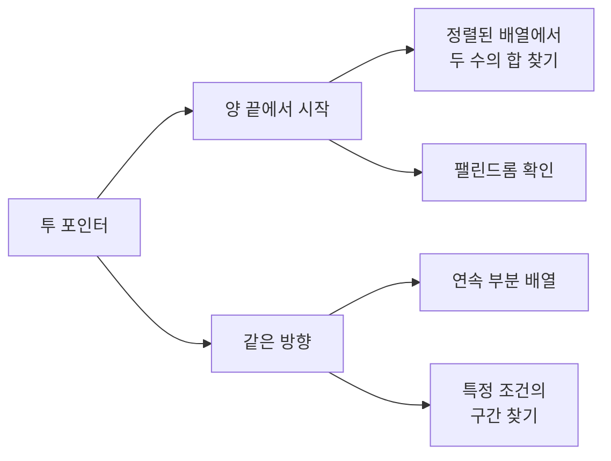
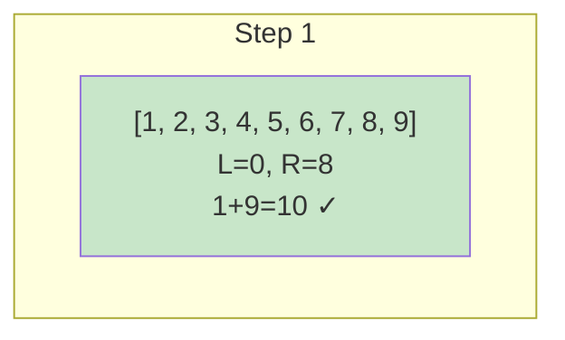
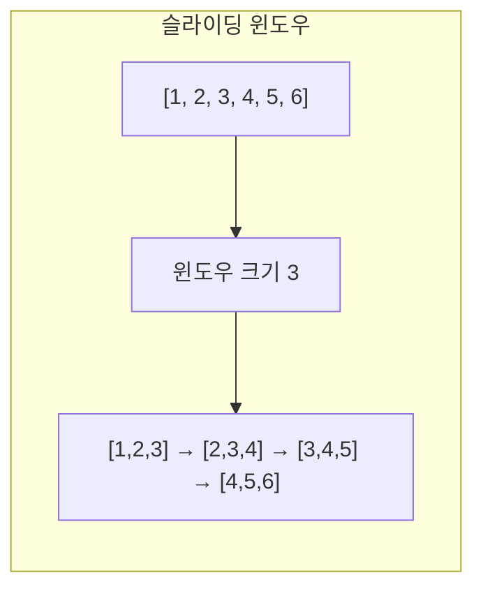

# 1. 투 포인터 (Two Pointers)

투 포인터는 **두 개의 포인터를 사용**하여 배열이나 리스트를 탐색하는 기법입니다. 보통 O(n²)을 O(n)으로 최적화할 수 있습니다.

## 1.1 투 포인터의 유형



## 1.2 양 끝에서 시작하는 투 포인터

가장 일반적인 형태로, 정렬된 배열에서 두 값의 합을 찾을 때 사용합니다.

```javascript
function twoSumSorted(arr, target) {
    // 정렬된 배열에서 합이 target인 두 수의 인덱스 찾기
    // O(n) 시간복잡도

    let left = 0;
    let right = arr.length - 1;

    while (left < right) {
        const currentSum = arr[left] + arr[right];

        if (currentSum === target) {
            return [left, right];
        } else if (currentSum < target) {
            left++;   // 합이 작으면 왼쪽 포인터 증가
        } else {
            right--;  // 합이 크면 오른쪽 포인터 감소
        }
    }

    return [];
}


const arr = [1, 2, 3, 4, 5, 6, 7, 8, 9];
console.log(twoSumSorted(arr, 10));  // [0, 8] (1 + 9 = 10)
console.log(twoSumSorted(arr, 15));  // [5, 8] (6 + 9 = 15)
```

### 동작 과정 시각화



## 1.3 같은 방향 투 포인터

두 포인터가 같은 방향으로 이동하며 구간을 관리합니다.

```javascript
function minSubarrayLength(arr, target) {
    // 합이 target 이상인 가장 짧은 연속 부분 배열의 길이

    const n = arr.length;
    let left = 0;
    let currentSum = 0;
    let minLength = Infinity;

    for (let right = 0; right < n; right++) {
        currentSum += arr[right];

        // 조건을 만족하면 왼쪽 포인터 이동
        while (currentSum >= target) {
            minLength = Math.min(minLength, right - left + 1);
            currentSum -= arr[left];
            left++;
        }
    }

    return minLength !== Infinity ? minLength : 0;
}


const arr = [2, 3, 1, 2, 4, 3];
console.log(minSubarrayLength(arr, 7));  // 2 ([4, 3])
```

## 1.4 세 수의 합 (3Sum)

```javascript
function threeSum(arr) {
    // 세 수의 합이 0인 모든 조합 찾기 (중복 제거)

    arr.sort((a, b) => a - b);
    const result = [];
    const n = arr.length;

    for (let i = 0; i < n - 2; i++) {
        // 중복 건너뛰기
        if (i > 0 && arr[i] === arr[i - 1]) {
            continue;
        }

        // 투 포인터로 나머지 두 수 찾기
        let left = i + 1;
        let right = n - 1;
        const target = -arr[i];

        while (left < right) {
            const currentSum = arr[left] + arr[right];

            if (currentSum === target) {
                result.push([arr[i], arr[left], arr[right]]);

                // 중복 건너뛰기
                while (left < right && arr[left] === arr[left + 1]) {
                    left++;
                }
                while (left < right && arr[right] === arr[right - 1]) {
                    right--;
                }

                left++;
                right--;
            } else if (currentSum < target) {
                left++;
            } else {
                right--;
            }
        }
    }

    return result;
}


console.log(threeSum([-1, 0, 1, 2, -1, -4]));
// [[-1, -1, 2], [-1, 0, 1]]
```

# 2. 슬라이딩 윈도우 (Sliding Window)

슬라이딩 윈도우는 **고정 크기의 윈도우**를 이동시키며 배열을 탐색하는 기법입니다.

## 2.1 슬라이딩 윈도우의 핵심

- 윈도우 크기가 고정된 경우
- 연속된 부분 배열/문자열 처리
- 새로 들어오는 요소 추가, 빠지는 요소 제거



## 2.2 고정 크기 윈도우

```javascript
function maxSumSubarray(arr, k) {
    // 크기 k인 연속 부분 배열의 최대 합

    const n = arr.length;
    if (n < k) {
        return null;
    }

    // 첫 윈도우의 합
    let windowSum = 0;
    for (let i = 0; i < k; i++) {
        windowSum += arr[i];
    }
    let maxSum = windowSum;

    // 윈도우 이동
    for (let i = k; i < n; i++) {
        // 새 요소 추가, 이전 요소 제거
        windowSum += arr[i] - arr[i - k];
        maxSum = Math.max(maxSum, windowSum);
    }

    return maxSum;
}


const arr = [1, 4, 2, 10, 2, 3, 1, 0, 20];
console.log(maxSumSubarray(arr, 4));  // 24 ([2, 10, 2, 3])
```

### 동작 과정

```
배열: [1, 4, 2, 10, 2, 3, 1, 0, 20]
k = 4

Step 1: [1, 4, 2, 10] = 17
Step 2: [4, 2, 10, 2] = 18
Step 3: [2, 10, 2, 3] = 17
Step 4: [10, 2, 3, 1] = 16
Step 5: [2, 3, 1, 0] = 6
Step 6: [3, 1, 0, 20] = 24 ← 최대
```

## 2.3 가변 크기 윈도우

조건에 따라 윈도우 크기가 변하는 경우입니다.

```javascript
function longestSubstringKDistinct(s, k) {
    // 최대 k개의 서로 다른 문자를 포함하는 가장 긴 부분 문자열

    const charCount = new Map();
    let left = 0;
    let maxLength = 0;

    for (let right = 0; right < s.length; right++) {
        // 오른쪽 문자 추가
        charCount.set(s[right], (charCount.get(s[right]) || 0) + 1);

        // 서로 다른 문자가 k개 초과하면 왼쪽 축소
        while (charCount.size > k) {
            charCount.set(s[left], charCount.get(s[left]) - 1);
            if (charCount.get(s[left]) === 0) {
                charCount.delete(s[left]);
            }
            left++;
        }

        maxLength = Math.max(maxLength, right - left + 1);
    }

    return maxLength;
}


console.log(longestSubstringKDistinct("eceba", 2));    // 3 ("ece")
console.log(longestSubstringKDistinct("aabbcc", 2));   // 4 ("aabb" 또는 "bbcc")
```

## 2.4 중복 없는 가장 긴 부분 문자열

```javascript
function longestSubstringWithoutRepeating(s) {
    // 중복 문자 없는 가장 긴 부분 문자열의 길이

    const charIndex = new Map();  // 문자: 마지막 등장 인덱스
    let left = 0;
    let maxLength = 0;

    for (let right = 0; right < s.length; right++) {
        const char = s[right];

        // 중복 문자가 있고, 윈도우 내에 있으면
        if (charIndex.has(char) && charIndex.get(char) >= left) {
            left = charIndex.get(char) + 1;
        }

        charIndex.set(char, right);
        maxLength = Math.max(maxLength, right - left + 1);
    }

    return maxLength;
}


console.log(longestSubstringWithoutRepeating("abcabcbb"));  // 3 ("abc")
console.log(longestSubstringWithoutRepeating("bbbbb"));     // 1 ("b")
console.log(longestSubstringWithoutRepeating("pwwkew"));    // 3 ("wke")
```

# 3. 투 포인터/슬라이딩 윈도우 실전 문제

## 3.1 모든 종류 포함 최소 구간

```javascript
function minRangeWithAllTypes(items) {
    // 여러 종류의 아이템이 있는 배열에서
    // 모든 종류의 아이템을 포함하는 가장 짧은 연속 구간을 찾습니다.
    //
    // items: 아이템 이름 리스트
    // 반환: [시작인덱스, 끝인덱스] (1-indexed)

    const itemTypes = new Set(items).size;
    const itemCount = new Map();

    let left = 0;
    let answer = [0, items.length - 1];
    let count = 0;

    for (let right = 0; right < items.length; right++) {
        // 새 아이템 추가
        if (!itemCount.has(items[right]) || itemCount.get(items[right]) === 0) {
            count++;
        }
        itemCount.set(items[right], (itemCount.get(items[right]) || 0) + 1);

        // 모든 종류를 포함하면 왼쪽 축소 시도
        while (count === itemTypes) {
            // 더 짧은 구간이면 업데이트
            if (right - left < answer[1] - answer[0]) {
                answer = [left, right];
            }

            // 왼쪽 아이템 제거
            itemCount.set(items[left], itemCount.get(items[left]) - 1);
            if (itemCount.get(items[left]) === 0) {
                count--;
            }
            left++;
        }
    }

    return [answer[0] + 1, answer[1] + 1];  // 1-indexed
}


console.log(minRangeWithAllTypes(["A", "B", "B", "A", "A", "C", "D", "A"]));
// [3, 7]
```

## 3.2 원형 배열 부분합 종류

```javascript
function countCircularSums(elements) {
    // 원형 배열에서 연속 부분 수열의 합으로 만들 수 있는 서로 다른 수의 개수를 구합니다.
    //
    // 원형 배열이므로 마지막 요소 다음은 첫 번째 요소와 연결됩니다.

    const n = elements.length;
    const sums = new Set();

    // 길이 1부터 n까지
    for (let length = 1; length <= n; length++) {
        // 첫 윈도우
        let windowSum = 0;
        for (let i = 0; i < length; i++) {
            windowSum += elements[i];
        }
        sums.add(windowSum);

        // 슬라이딩
        for (let start = 1; start < n; start++) {
            // 이전 요소 빼고 새 요소 더하기 (원형)
            windowSum -= elements[start - 1];
            windowSum += elements[(start + length - 1) % n];
            sums.add(windowSum);
        }
    }

    return sums.size;
}


console.log(countCircularSums([7, 9, 1, 1, 4]));  // 18
```

## 3.3 시간 기반 요금 계산

```javascript
function calculateParkingFee(fees, records) {
    // 주차 요금을 계산합니다.
    //
    // fees: [기본시간(분), 기본요금, 단위시간(분), 단위요금]
    // records: ["시간 차량번호 IN/OUT", ...] 형태의 기록
    //
    // 규칙:
    // - 기본시간 이하면 기본요금만 부과
    // - 초과 시간은 단위시간당 단위요금 추가 (올림 적용)
    // - 출차 기록 없으면 23:59에 출차한 것으로 계산

    const [baseTime, baseFee, unitTime, unitFee] = fees;

    // 차량별 입출차 기록
    const parking = new Map();  // 현재 주차 중인 차량
    const totalTime = new Map();  // 차량별 총 주차 시간

    for (const record of records) {
        const [time, carNum, action] = record.split(' ');
        const [h, m] = time.split(':').map(Number);
        const minutes = h * 60 + m;

        if (action === 'IN') {
            parking.set(carNum, minutes);
        } else {  // OUT
            const inTime = parking.get(carNum);
            totalTime.set(carNum, (totalTime.get(carNum) || 0) + (minutes - inTime));
            parking.delete(carNum);
        }
    }

    // 출차 기록 없는 차량 (23:59 출차로 계산)
    const lastTime = 23 * 60 + 59;
    for (const [carNum, inTime] of parking) {
        totalTime.set(carNum, (totalTime.get(carNum) || 0) + (lastTime - inTime));
    }

    // 요금 계산
    const result = [];
    const sortedCars = [...totalTime.keys()].sort();

    for (const carNum of sortedCars) {
        const time = totalTime.get(carNum);
        let fee;

        if (time <= baseTime) {
            fee = baseFee;
        } else {
            fee = baseFee + Math.ceil((time - baseTime) / unitTime) * unitFee;
        }

        result.push(fee);
    }

    return result;
}


const fees = [180, 5000, 10, 600];
const records = [
    "05:34 5961 IN", "06:00 0000 IN", "06:34 0000 OUT",
    "07:59 5961 OUT", "07:59 0148 IN", "18:59 0000 IN",
    "19:09 0148 OUT", "22:59 5961 IN", "23:00 5961 OUT"
];
console.log(calculateParkingFee(fees, records));  // [14600, 34400, 5000]
```

# 4. 투 포인터 vs 슬라이딩 윈도우

| 특성 | 투 포인터 | 슬라이딩 윈도우 |
|------|----------|----------------|
| 포인터 이동 | 양 끝에서 또는 같은 방향 | 항상 같은 방향 |
| 윈도우 크기 | 가변적 | 고정 또는 가변 |
| 주요 용도 | 두 수의 합, 정렬된 배열 | 연속 부분 배열/문자열 |
| 시간복잡도 | O(n) | O(n) |

# 5. 문제 유형별 접근법

## 5.1 투 포인터를 사용하는 경우

- 정렬된 배열에서 두 수의 합/차
- 팰린드롬 확인
- 정렬된 배열 병합
- 물 채우기 문제 (Container With Most Water)

## 5.2 슬라이딩 윈도우를 사용하는 경우

- 고정 크기 구간의 최대/최소/평균
- 연속된 k개의 합이 조건을 만족
- 조건을 만족하는 가장 긴/짧은 구간
- 문자열에서 특정 패턴 찾기

:::div{.callout}
**투 포인터/슬라이딩 윈도우 키워드**

- "연속된", "부분 배열", "구간"
- "최대/최소 길이"
- "합이 X인", "조건을 만족하는"
- "정렬된 배열에서"
- "중복 없는"
:::

# 6. 연습문제

* (투 포인터) 두 수의 합: https://jsalgo.co.kr/?page=7
* (투 포인터) 구간 합 가우스: https://jsalgo.co.kr/?page=9
* (투 포인터) 두 수의 합 찾기: https://100.jsalgo.co.kr/?page=26
* (슬라이딩 윈도우) 연속 부분 수열의 합: https://100.jsalgo.co.kr/?page=27
* (슬라이딩 윈도우) 구간 최대합: https://100.jsalgo.co.kr/?page=28
