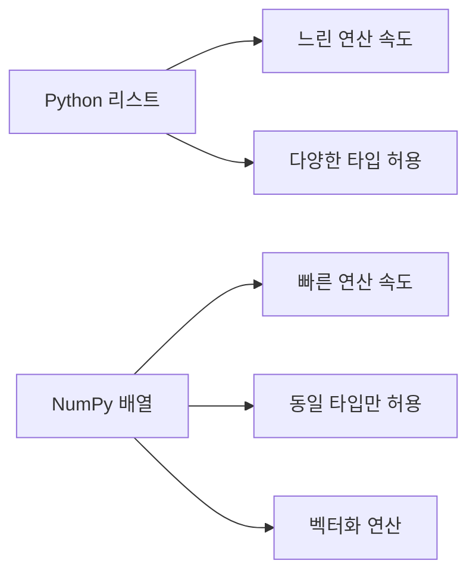

# 1. NumPy란

::img{width="500" alt="NumPy 공식 문서" src="/images/basecamp-numpy-pandas/chapter01/numpylogo.png"}

**NumPy**(넘파이)는 "Numerical Python"의 줄임말로 파이썬으로 과학 연산을 하기 위한 핵심 라이브러리입니다. 다차원 배열을 효과적으로 처리할 수 있으며, 편리한 선형대수 연산과 푸리에 변환 같은 고수준 수학 함수도 제공합니다. NumPy는 데이터 과학, 기계 학습, 인공지능, 자연어 처리 등 다양한 분야에서 널리 사용되고 있습니다.

파이썬에서 NumPy를 사용하기 위해서는 아래와 같이 `import`하여 사용할 수 있습니다.

```python
import numpy as np
```

:::div{.callout}

코드는 위에서부터 순서대로 실행해주세요. 특히 앞서 import해야 하는 코드가 있을 경우 코드 실행을 하지 않고 넘어갔을 때 에러가 발생합니다.

:::

# 2. NumPy의 주요 특징


NumPy의 핵심은 n차원 배열 객체인 **ndarray**입니다. ndarray는 파이썬 리스트보다 대규모 데이터 처리에 월등히 뛰어난 성능을 보입니다.



<highlight>NumPy의 핵심 장점은 C언어로 구현된 내부 연산과 벡터화 연산을 통해 파이썬 리스트보다 훨씬 빠른 속도로 대규모 데이터를 처리할 수 있다는 것입니다.</highlight>

```python-exec
import numpy as np

arr = np.array([1, 2, 3, 4, 5])
print(arr)
```

이렇게 만들어진 `arr`은 1차원 배열이며, `ndarray` 클래스의 객체입니다. `ndarray`는 데이터를 다차원 배열로 쉽게 생성하고 다양한 연산을 수행할 수 있습니다.

```python-exec
arr = np.array([[1, 2, 3], [4, 5, 6], [7, 8, 9]])
print(arr + 3)
print(arr + arr)
```

추가로 print를 하지 않고 객체 그대로를 출력하면 콤마가 함께 출력됩니다.

```python-exec
arr + 3
```