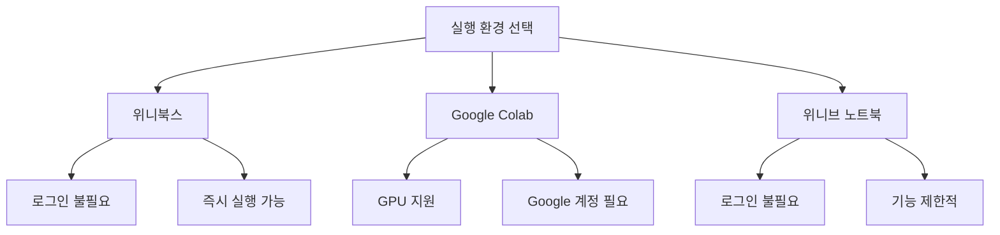

# 1. 실행 환경 소개

NumPy와 Pandas를 학습하기 위한 실행 환경은 다양합니다. 각 환경의 특징을 이해하고, 자신에게 맞는 환경을 선택하여 실습을 진행하세요.



## 1.1 위니북스

**위니북스**에서는 대부분의 데이터 분석을 위한 코드 실행 블록을 제공합니다. 왼쪽 상단에 있는 실행 버튼을 눌러 코드를 실행할 수 있으며, `Shift` + `Enter`를 눌러 코드를 실행할 수도 있습니다. 코드의 값을 바꾸어 보거나 연산자를 변경하여 결과가 어떻게 변하는지 확인할 수 있습니다. 아래 코드를 실행하고, 숫자를 변경하여 결과를 확인해보세요.

<highlight>위니북스는 로그인 없이도 사용이 가능하다는 점이 강점입니다.</highlight>

```python-exec
x = 10
y = 5

x + y
```

## 1.2 Google Colab 사용하기

**Google Colab**은 클라우드 기반의 무료 서비스로, Python 코드를 실행하고 실험할 수 있는 강력한 도구입니다. Google 계정만 있으면 누구나 쉽게 접근할 수 있으며, GPU를 활용하여 복잡한 연산도 빠르게 수행할 수 있습니다.

::a[Colab]{class='btn-link' href="https://colab.research.google.com/?hl=ko" target="_blank"}

셀 왼쪽의 실행 버튼이나 `Shift` + `Enter` 키를 눌러 코드를 실행하면 됩니다. NumPy 버전이 출력되면 설정이 완료된 것입니다. Google Colab에서는 NumPy를 비롯한 다양한 필수 라이브러리들이 이미 설치되어 있어 별도의 설치 과정 없이 바로 사용할 수 있습니다.

## 1.3 위니브 노트북 사용하기

로그인 없이 사용해야 한다면 위니브에서 개발한 **위니브 노트북**이 대안이 될 수 있습니다. 다만 위니브 노트북은 Google Colab에 비해 제공되는 기능이 제한적입니다.

::a[위니브 노트북]{class='btn-link' href="https://notebook.weniv.co.kr/" target="_blank"}

:::div{.callout}
**실행 환경 선택 가이드**

| 환경 | 장점 | 단점 |
|------|------|------|
| 위니북스 | 로그인 불필요, 즉시 실행 | 일부 기능 제한 |
| Google Colab | GPU 지원, 풍부한 기능 | Google 계정 필요 |
| 위니브 노트북 | 로그인 불필요 | 기능 제한적 |
:::


