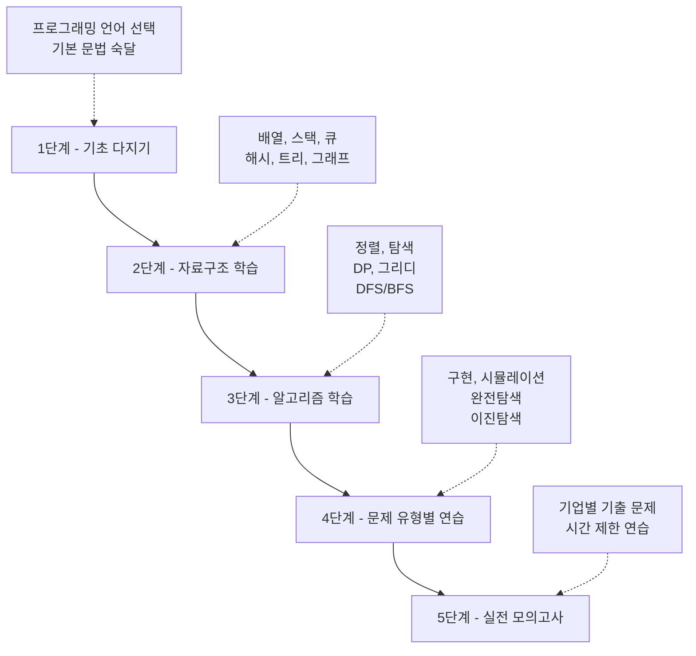

:::div{.callout}
이 책은 Python으로 코딩테스트를 준비하시는 분들을 위한 책입니다. 다른 언어는 다루지 않습니다.
:::

# 1. 코딩테스트

코딩테스트는 주로 자료구조와 알고리즘을 통한 문제 풀이 능력을 평가하는 시험입니다. 자료구조는 데이터를 효율적으로 저장하고 관리하는 방법을 의미하며, 알고리즘은 문제를 해결하기 위한 절차나 방법을 뜻합니다. 코딩테스트는 이러한 개념들을 활용하여 주어진 문제를 해결하는 능력을 평가합니다.

예를 들어, 자료구조는 배열, 스택, 큐, 해시 테이블, 트리, 그래프 등이 있으며, 알고리즘은 정렬, 탐색, 동적 프로그래밍, 그리디 알고리즘, 깊이 우선 탐색(DFS), 너비 우선 탐색(BFS), 에라토스테네스의 체, 투 포인터, 슬라이딩 윈도우 등이 있습니다.

생성형 AI의 등장으로 코딩 테스트의 중요도가 떨어졌다고 생각하는 기업도 있는 반면, 그렇기에 오히려 코딩테스트를 중요하게 생각하는 기업도 있습니다. 코드는 AI가 작성해줄 수 있지만, 작성한 코드를 읽으며 분석하고 원하는 바를 정확히 설명해 문제를 해결하는 능력은 여전히 인간의 몫이기 때문입니다. 코드를 읽는 눈과 문제 해결 능력을 평가하는 수단으로서 코딩 테스트는 여전히 유효합니다.

코딩 테스트는 단기간 되지 않습니다. 꾸준한 연습과 체계적인 학습이 필요하죠. 그렇기에 '주니어'만 코딩테스트를 보지 않습니다. '시니어'도 코딩테스트를 많이 본다는 사실 알고 있으신가요? Apple에 유명한 개발자가 Google에 코딩테스트에 떨어져 SNS에 이슈가 된 적도 있습니다. 단지 취업의 허들을 넘기 위한 수단으로만 코딩테스트를 생각하지 마시고, 자신의 프로그래밍 실력을 점검하고 향상시키는 좋은 기회로 삼으시길 바랍니다.

이 강의에서는 코딩테스트의 기본 개념부터 주요 기업의 유형, 온라인 저지 플랫폼 활용법, 그리고 단계별 준비 로드맵 등을 다룹니다.

# 2. 코딩테스트와 알고리즘 대회

코딩테스트(Coding Test)는 지원자의 프로그래밍 능력과 문제 해결 능력을 평가하기 위한 시험입니다. 주어진 문제를 분석하고, 효율적인 알고리즘을 설계한 뒤, 이를 코드로 구현하는 전 과정을 평가합니다.

반면 국제, 국내 정보올림피아드, 알고리즘 대회의 목적은 학생들의 컴퓨터 과학적 사고력과 문제 해결 능력을 증진시키고, 우수한 인재를 발굴하는 데 있습니다. 특히 정보올림피아드, 알고리즘 대회는 일부 매우 난이도 높은 알고리즘 문제를 다룹니다. 참가자들은 제한된 시간 내에 복잡한 문제를 해결해야 하며, 이는 창의적이고 논리적인 사고력을 요구합니다.

따라서 이 2개의 전략이 다릅니다. 코딩 테스트의 범위는 실무에 더 가까우며 나올 수 있는 문제의 유형이 정형화 되어있습니다. 전략만 잘 짜면 기초 문법은 이미 모두 숙지했다는 전제 하에 충분히 2 ~ 3달 안에 준비할 수 있습니다.

이 챕터에서 이것을 말씀드리는 이유는 온라인 저지 플랫폼에서 제공하는 문제들이 정보올림피아드, 알고리즘 대회 수준의 난이도를 포함하고 있기 때문입니다. 문제를 푸실 때에도 해당 문제가 코딩테스트에 나올만한 문제인지 아닌지를 구분하면서 풀기를 권해드립니다.

보통 코딩테스트의 문제는 회사의 실무자 TF가 만들거나, 외부의 온라인 저지 플랫폼 업체에 의뢰하여 제작합니다. 둘 다 정답률을 어느정도 예측하고 있으며, 문제를 맞추는 사람이 너무 적다면 출제하지 않는 경우가 많습니다. 떨어트리는 것이 목적이 아니라 합격시키는 것이 목적이기 때문입니다.

:::div{.callout}
일반 자료구조, 알고리즘 공부와 코딩테스트 공부는 그 결이 다릅니다. 예를 들어, 자료구조에서 링크드리스트, 그래프와 같은 것을 클래스로 구현하고 다양한 메서드를 구현해보는 것은 코딩테스트에서 크게 도움이 되지 않습니다. 자료형은 대부분 이미 구현되어 있는 것을 사용하기 때문입니다. 또한, 버블 정렬, 퀵 정렬, 병합 정렬 등을 직접 구현해보는 것도 코딩테스트에서는 크게 도움이 되지 않습니다. 대부분의 언어에서 이미 최적화된 정렬 메서드를 제공하기 때문입니다. 따라서 코딩테스트 준비를 위해서는 기본적인 자료구조와 알고리즘을 습득했다면 문제 유형에 따른 풀이에 집중하는 것이 더 효과적입니다.
:::

# 3. 코딩테스트 경험

자사에서 만들어놓은 코딩테스트 플랫폼이 있습니다. 간단하게 테스트해보실 수 있으니 아래 링크로 들어가 테스트를 진행해보시기 바랍니다.

* (lv0 ~ 1) pyalgo 100: https://100.pyalgo.co.kr
* (lv0 ~ 1) jsalgo 100: https://100.jsalgo.co.kr
* (lv1 ~ 2) pyalgo: https://pyalgo.co.kr
* (lv1 ~ 2) jsalgo: https://jsalgo.co.kr
* (lv1 ~ 3) 눈떠보니 코딩테스트 전날 python: https://to.pyalgo.co.kr/
* (lv1 ~ 3) 눈떠보니 코딩테스트 전날 javascript: https://to.jsalgo.co.kr/

# 4. 코딩 테스트 준비 단계

* 1단계 - 기초 다지기: 프로그래밍 언어의 기본 문법과 입출력 처리 방법을 숙달합니다.
* 2단계 - 자료구조 학습: 배열, 스택, 큐, 해시 테이블, 트리, 그래프 등 주요 자료구조를 학습합니다.
* 3단계 - 알고리즘 학습: 정렬, 탐색, 동적 프로그래밍, 그리디 알고리즘, DFS/BFS 등 핵심 알고리즘을 익힙니다.
* 4단계 - 문제 유형별 연습: Lv0 ~ Lv3 문제 유형을 연습합니다. 여유가 되면 Lv4 문제도 도전해봅니다.
* 5단계 - 실전 모의고사: 기업별 기출 문제를 풀어보고, 시간 제한 내에 문제를 해결하는 연습을 합니다.



:::div{.callout}
기업별 코딩 테스트 유형은 매우 다릅니다. 따라서 모든 기업에 위 단계를 적용하는 것은 옳지 않을 수 있습니다. 예를 들어, ChatGPT 사용이 허용된 '컬리'와 같은 기업의 경우에는 문제 유형별 연습이 더 유효할 수 있습니다. 6번 챕터에 정리해두었으니 참고하시기 바랍니다.
:::

# 5. 코테 전 준비사항

## 5.1 플랫폼에 익숙해지기
코딩 테스트를 치를 플랫폼에 미리 익숙해지는 것이 중요합니다. 각 플랫폼마다 인터페이스와 기능이 다르기 때문에, 사전에 연습 문제를 풀어보며 익숙해지는 것이 좋습니다. 예를 들어, 프로그래머스, 구름devth 등의 플랫폼에서 제공하는 모의고사를 활용할 수 있습니다.

* 프로그래머스: https://programmers.co.kr/
* 구름데브스: https://devth.io/

시험은 [모니토](https://monito.io/)와 같은 모니터링 서비스와 함께 시험을 보는 경우가 많습니다. 여러분의 눈동자 추적, 온라인 감독관, 물품 감지 등을 진행하니 이러한 환경에 1 ~ 2번 노출이 되어보는 것도 좋은 경험이 됩니다. 보통 휴대폰을 통해 상하 좌우 스캔 후 시험을 보고 A4 용지 1장, 앞 뒤 스캔을 해야합니다. 

# 6. 주요 기업의 코딩테스트 유형

* 코딩테스트 경향 정리: [코딩테스트 경향 정리](https://paullabworkspace.notion.site/446d03bf38df42e19d9fedcf5ceaec61?pvs=4) 해두었습니다. 매년 업데이트를 하고 있지는 않습니다. 여러분이 직접 여러분이 원하시는 기업 목록을 만들어서 정리해보시길 권해드립니다.
* 분석 서비스: 분석 서비스를 통해 [출제 경향](https://algoview.co.kr/)도 한 번 정리하세요.

아래 내용은 일반적인 경향을 정리한 것입니다. 기업마다 다르고 연도마다 다르니 꼭 참고용으로만 활용하시기 바랍니다. 삼성전자는 별도로 정리합니다.

## 6.1 IT 기업
- **플랫폼**: 프로그래머스, 구름devth 등 타사 플랫폼
- **문제 수**: 5 ~ 7문제
- **시간**: 4 ~ 5시간
- **난이도**: 중상
- **특징**: 자료구조/알고리즘 문제 위주, 언어별 제한 모듈이 거의 없음

## 6.2 삼성전자
- **플랫폼**: 자체 플랫폼 (SWEA 유사)
- **문제 수**: 2문제
- **시간**: 4시간
- **특징**: 자료구조/알고리즘 문제 혼합, 언어별 제한 모듈 있음
- **난이도**: 중상

## 6.3 금융권
- **플랫폼**: 프로그래머스, 구름devth 등 타사 플랫폼
- **문제 수**: 3 ~ 5문제
- **시간**: 2 ~ 3시간
- **특징**: 자료구조/알고리즘 문제 혼합 + SQL 문제 포함
- **난이도**: 중하

## 6.4 게임사
- **플랫폼**: 프로그래머스 등 타사 플랫폼
- **문제 수**: 4 ~ 6문제
- **시간**: 3 ~ 4시간
- **특징**: 자료구조/알고리즘 문제, 서술형, 주관식
- **난이도**: 중


:::div{.callout}
코딩 테스트의 경우 기업에서 보유한 문제 DB가 있기에 구체적인 문제 유형, 난이도 등은 수업에서 언급하도록 하겠습니다.
:::

# 7. 온라인 저지 플랫폼 소개

코딩테스트를 준비하기 위해서는 온라인 저지(Online Judge) 플랫폼에서 꾸준히 문제를 풀어보는 것이 중요합니다. 대표적인 플랫폼들을 소개합니다.

## 7.1 백준 온라인 저지 (BOJ)

::a[백준 온라인 저지]{class='btn-link' href="https://www.acmicpc.net/" target="\_blank"}

**특징:**
- 국내 최대 규모의 알고리즘 문제 은행
- 27,000개 이상의 문제 보유
- 난이도별(Bronze, Silver, Gold, Platinum, Diamond, Ruby) 문제 분류
- 다양한 알고리즘 대회 개최

**장점:**
- 문제의 질이 높고 양이 방대함
- 체계적인 난이도 구분
- 활발한 커뮤니티

**단점:**
- 초보자에게는 UI가 다소 복잡할 수 있음
- 문제 설명이 간결해서 이해가 어려울 수 있음
- 코딩테스트를 위한 플랫폼은 아님

## 7.2 프로그래머스

::a[프로그래머스]{class='btn-link' href="https://programmers.co.kr/" target="\_blank"}

**특징:**
- 기업 코딩테스트 연습용 플랫폼
- 실제 기업 코딩테스트 환경과 유사
- 난이도별(Level 0~5) 문제 분류
- SQL, 개발 상식 문제도 제공

**장점:**
- 실전과 유사한 환경
- 친절한 문제 설명
- 깔끔한 UI/UX

**단점:**
- 백준에 비해 문제 수가 적음
- 고난도 문제가 상대적으로 부족

## 7.3 LeetCode

::a[LeetCode]{class='btn-link' href="https://leetcode.com/" target="\_blank"}

**특징:**
- 글로벌 표준 코딩테스트 플랫폼
- 영어 기반 문제 (한국어 지원 없음)
- 난이도별(Easy, Medium, Hard) 문제 분류
- 기업별 문제 태그 제공

**장점:**
- 글로벌 기업 면접 준비에 최적
- 문제 해설(Editorial)이 상세함
- 다양한 접근법 제시

**단점:**
- 영어로만 제공
- 국내 기업 코딩테스트와는 다소 차이가 있음

## 7.4 코드업

::a[코드업]{class='btn-link' href="https://codeup.kr/" target="\_blank"}

**특징:**
- 입문자를 위한 기초 문제 중심
- 100제, 200제 등 체계적인 커리큘럼
- Python 기초 문법 학습에 최적

**장점:**
- 매우 친절한 문제 설명
- 입문자에게 최적화됨

**단점:**
- 고급 알고리즘 문제 부족

## 7.5 pyalgo, jsalgo

위니브에서 운영하고 있는 플랫폼입니다. 코딩테스트용으로만 만들어진 연습용 서비스 입니다.

* ::a[pyalgo 100]{class='btn-link' href="https://100.pyalgo.co.kr/" target="\_blank"}
* ::a[jsalgo 100]{class='btn-link' href="https://100.jsalgo.co.kr/" target="\_blank"}
* ::a[pyalgo]{class='btn-link' href="https://pyalgo.co.kr/" target="\_blank"}
* ::a[jsalgo]{class='btn-link' href="https://jsalgo.co.kr/" target="\_blank"}
* ::a[눈떠보니 코딩테스트 전날 python]{class='btn-link' href="https://to.pyalgo.co.kr/" target="\_blank"}
* ::a[눈떠보니 코딩테스트 전날 javascript]{class='btn-link' href="https://to.jsalgo.co.kr/" target="\_blank"}

**특징:**
- Python, JavaScript 특화 플랫폼
- 단계별 문제 제공 (Lv0 ~ Lv3)
- 실전 코딩테스트 환경 제공

**장점:**
- 언어별 최적화된 문제 제공
- 실전과 유사한 환경과 문제
- 로그인 없이 가볍게 해볼 수 있음

**단점:**
- 문제 수가 상대적으로 적음
- 코딩테스트 플랫폼이 아님


# 8. 성공적인 코딩테스트 준비를 위한 팁

## 8.1 꾸준함
코딩 테스트, 알고리즘, 자료구조 등은 단기간에 실력을 키우기 어렵습니다. 꾸준한 연습이 필요합니다. 매일 일정 시간을 투자하여 문제를 풀고, 새로운 개념을 학습하는 습관을 들이세요. 회사에 합격하셨다고 해도 이직이나 승진을 위해 계속해서 코딩테스트를 공부하시는 것을 권해드립니다. 삼성전자와 같은 경우 자사 코딩테스트 자격이 있어 주기적으로 시험을 볼 수 있게 합니다. 또한 개발 팀장급 이상이어도 코딩테스트를 보는 경우가 있습니다. 나중을 위해서라도 꾸준히 준비하시길 권해드립니다.

## 8.2 전략적 접근
코딩테스트는 전략적으로 접근하시길 바랍니다. 모든 문제를 다 푸는 것이 목표가 아니라, 합격 선에 도달하는 것을 목표로 잡으시면 좋을 것 같습니다. 특히 준비 기간이 짧다면 더욱 그렇게 해야합니다. 회사 커트라인을 보시고 Lv2 정도의 문제가 합격선이라면 Lv2 문제를 집중적으로 맞추는 것에 집중하시는 것을 권해드립니다. 그러면 실제 시험에서도 Lv3, Lv4 문제를 포기하게 되니 남들보다 더 많은 시간을 Lv2 문제에 투자하실 수 있습니다.

## 8.3 암기
준비기간이 짧다면 이해보다는 암기를 통해서 문제 유형을 숙달하시길 권해드립니다. 코딩테스트는 수능처럼 경우의 수가 매우 많지 않습니다. 유형은 한정적이며, 비슷한 유형의 풀이는 풀 수 있는 알고리즘이 제한적입니다. 따라서 암기를 하다보면 자주 나오는 유형들이 눈에 익게 되고 문제 풀이도 수월하실 겁니다.

## 8.4 손코딩
손으로 직접 코드를 작성하는 연습을 하시길 권해드립니다. 이는 IDE 환경이 다른 경우에도 문제 풀이를 잘 할 수 있게 도와줄 뿐만 아니라, 문제를 기억하고 이해하는 데도 도움이 됩니다.

## 8.5 다른 풀이 보기
같은 문제를 푼 다른 사람의 코드를 읽어보는 것도 큰 도움이 됩니다. 더 효율적인 답이 있을 수 있고, 다양한 접근법을 배울 수 있기 때문입니다. 특히 자신이 작성한 코드와 비교하면서 어떤 점이 더 나은지 분석해보세요. 만약 다른 사람의 풀이를 볼 수 없는 환경이라면 ChatGPT 등을 활용하여 다양한 풀이법을 요청하는 것도 좋은 방법입니다.

```
나는 코딩 테스트를 준비하고 있는 개발자입니다. 아래 문제를 보고 단계별로 어떻게 접근하고 해결할지 알려주세요.
```

```
나는 코딩 테스트를 준비하고 있는 개발자입니다. 아래 문제를 보고 3가지 풀이법을 제시해주세요. 제시한 풀이법에 대한 장단점도 함께 설명해주세요. 주석은 한국어로 상세히 달아주세요.
```