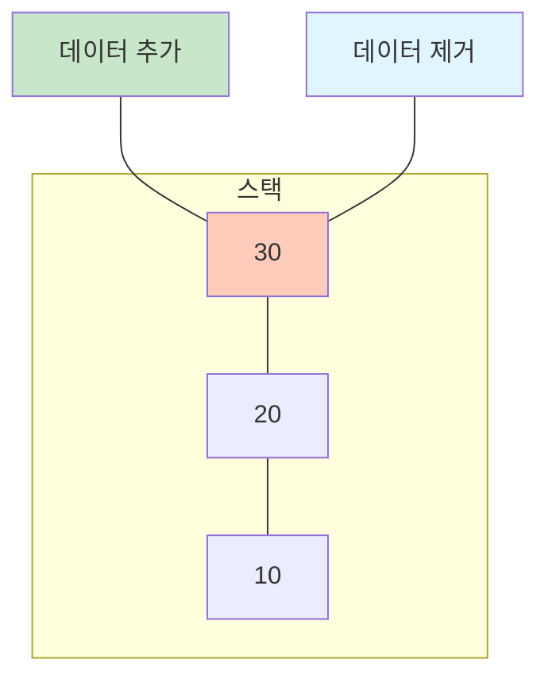
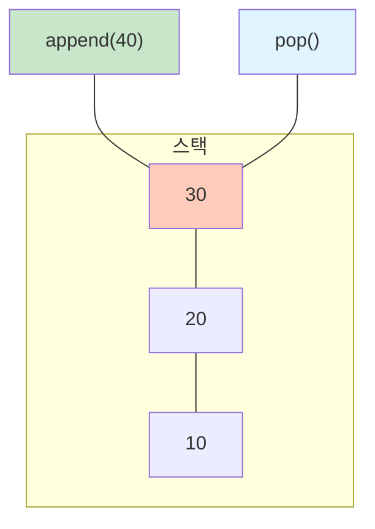
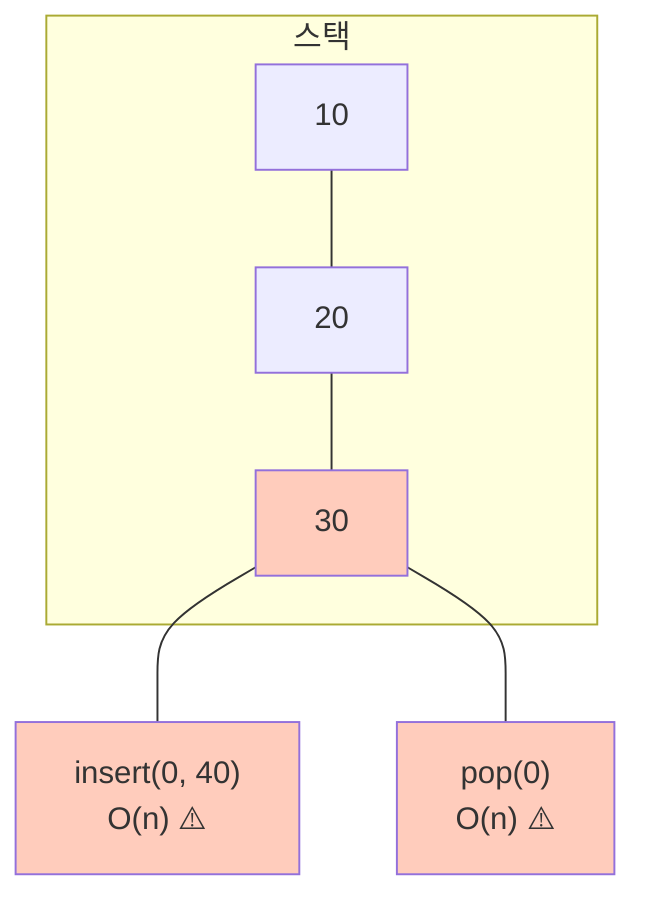
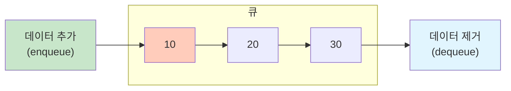
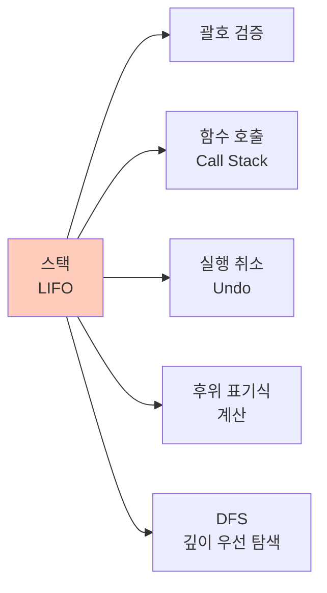
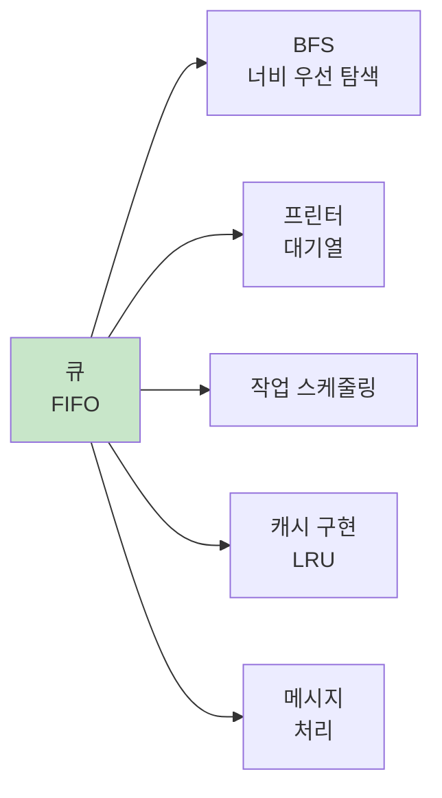

# 1. 스택 (Stack)

스택은 **후입선출(LIFO: Last In First Out)** 방식으로 동작하는 자료구조입니다. 마지막에 들어온 데이터가 가장 먼저 나가는 구조로, 책을 쌓아올리는 것과 유사합니다.

## 1.1 스택의 개념

접시를 쌓아올린다고 상상해보세요. 새로운 접시는 맨 위에 올려지고, 접시를 꺼낼 때도 맨 위에서부터 꺼냅니다. 이것이 바로 스택의 원리입니다.

아래 그림처럼 10을 넣고, 20을 넣고, 30을 넣으면, 스택의 맨 위에는 30이 있게 됩니다. 나중에 꺼낼 때도 30이 가장 먼저 나가게 됩니다. 10은 가장 나중에 나가게 되죠.

여기서 주의하셔야 할것은 스택은 개념입니다. 예를 들어, 파이썬 리스트로 스택을 구현한다고 하면, 뒤에서 데이터를 추가했으면 뒤에서 데이터를 제거해야 합니다. 만약 앞에서 추가했으면 앞에서 제거해야 합니다. 만약 앞에서 추가하고 뒤에서 제거한다면 스택의 개념을 깬 것입니다.



## 1.2 스택의 주요 연산

| 연산 | 설명 | 시간복잡도 |
|------|------|-----------|
| `push(x)` | 스택의 맨 위에 요소 x 추가 | O(1) |
| `pop()` | 스택의 맨 위 요소 제거하고 반환 | O(1) |
| `peek()` / `top()` | 스택의 맨 위 요소 확인 (제거 안 함) | O(1) |
| `is_empty()` | 스택이 비어있는지 확인 | O(1) |
| `size()` | 스택의 크기 반환 | O(1) |

## 1.3 Python으로 스택 구현

Python에서는 리스트를 사용하여 스택을 쉽게 구현할 수 있습니다. 두 가지 방법이 있습니다.

### 1.3.1 뒤에 추가/제거

리스트의 **끝(오른쪽)을 TOP**으로 사용하는 방법입니다. `append()`와 `pop()`을 사용하면 모두 O(1)입니다. 가장 많이 사용되는 방법입니다.

```python
# 빈 스택 생성
stack = []

# push: 뒤에 추가 - O(1)
stack.append(10)
stack.append(20)
stack.append(30)
print(stack)  # [10, 20, 30]  ← 30이 TOP

# peek: 맨 위 요소 확인 - O(1)
if stack:
    top = stack[-1]
    print(f"TOP: {top}")  # TOP: 30

# pop: 뒤에서 제거 - O(1)
item = stack.pop()
print(f"제거된 요소: {item}")  # 30
print(stack)  # [10, 20]

# is_empty: 비어있는지 확인
is_empty = len(stack) == 0  # False
is_empty = not stack        # False (더 Pythonic)

# size: 크기 확인
size = len(stack)  # 2
```

**시각화**



### 1.3.2 앞에 추가/제거

리스트의 **시작(왼쪽)을 TOP**으로 사용하는 방법입니다. `insert(0, x)`와 `pop(0)`을 사용하면 모두 O(n)이므로 비효율적입니다.

```python
# 빈 스택 생성
stack = []

# push: 앞에 추가 - O(n) ⚠️
stack.insert(0, 10)
stack.insert(0, 20)
stack.insert(0, 30)
print(stack)  # [30, 20, 10]  ← 30이 TOP

# peek: 맨 위 요소 확인 - O(1)
if stack:
    top = stack[0]
    print(f"TOP: {top}")  # TOP: 30

# pop: 앞에서 제거 - O(n) ⚠️
item = stack.pop(0)
print(f"제거된 요소: {item}")  # 30
print(stack)  # [20, 10]
```

**시각화**



:::div{.callout}
**권장 방법**

코딩테스트에서는 **뒤에 추가, 제거**를 사용하세요!
- `append()` + `pop()`: O(1)
- `insert(0, x)` + `pop(0)`: O(n) - 모든 요소를 이동시켜야 함

성능 차이가 크므로 반드시 뒤에 추가, 제거 방법을 사용해야 합니다.
:::

# 2. 큐 (Queue)

큐는 **선입선출(FIFO: First In First Out)** 방식으로 동작하는 자료구조입니다. 먼저 들어온 데이터가 먼저 나가는 구조로, 줄을 서는 것과 유사합니다.

## 2.1 큐의 개념

은행 창구에 줄을 선다고 상상해보세요. 먼저 온 사람이 먼저 서비스를 받고, 새로운 사람은 맨 뒤에 서게 됩니다. 이것이 바로 큐의 원리입니다.



## 2.2 큐의 주요 연산

| 연산 | 설명 | 시간복잡도 |
|------|------|-----------|
| `enqueue(x)` | 큐의 뒤(rear)에 요소 x 추가 | O(1) |
| `dequeue()` | 큐의 앞(front) 요소 제거하고 반환 | O(1) |
| `front()` / `peek()` | 큐의 앞 요소 확인 (제거 안 함) | O(1) |
| `is_empty()` | 큐가 비어있는지 확인 | O(1) |
| `size()` | 큐의 크기 반환 | O(1) |

## 2.3 Python으로 큐 구현

### 2.3.1 collections.deque 사용

Python의 `collections.deque`(Double-Ended Queue)는 양쪽 끝에서 O(1)로 삽입/삭제가 가능합니다. 큐를 구현할 때 가장 권장되는 방법입니다.

```python
from collections import deque

# 빈 큐 생성
queue = deque()

# enqueue: 뒤에 추가 - O(1)
queue.append(10)
queue.append(20)
queue.append(30)
print(queue)  # deque([10, 20, 30])

# front/peek: 맨 앞 요소 확인 - O(1)
if queue:
    front = queue[0]
    print(f"FRONT: {front}")  # FRONT: 10

# dequeue: 앞에서 제거 - O(1)
item = queue.popleft()
print(f"제거된 요소: {item}")  # 10
print(queue)  # deque([20, 30])

# is_empty: 비어있는지 확인
is_empty = len(queue) == 0  # False
is_empty = not queue        # False

# size: 크기 확인
size = len(queue)  # 2
```

### 2.3.2 리스트 사용

리스트를 사용할 수도 있지만, `pop(0)`이 O(n)이므로 비효율적입니다.

```python
# 빈 큐 생성
queue = []

# enqueue: 뒤에 추가 - O(1)
queue.append(10)
queue.append(20)
queue.append(30)
print(queue)  # [10, 20, 30]

# dequeue: 앞에서 제거 - O(n) ⚠️
item = queue.pop(0)
print(f"제거된 요소: {item}")  # 10
print(queue)  # [20, 30]
```

:::div{.callout}
**권장 방법**

큐를 구현할 때는 `collections.deque`를 사용하세요!
- `deque`: `append()` O(1), `popleft()` O(1)
- `list`: `append()` O(1), `pop(0)` O(n) - 모든 요소를 이동시켜야 함

코딩테스트에서 큐를 사용할 때는 항상 파일 맨 위에 `from collections import deque`를 추가하세요.
:::

# 3. 스택과 큐 비교

## 3.1 특징 비교표

| 특징 | 스택 (Stack) | 큐 (Queue) |
|------|-------------|-----------|
| **원리** | LIFO (후입선출) | FIFO (선입선출) |
| **추가 위치** | TOP (한쪽 끝) | REAR (뒤) |
| **제거 위치** | TOP (한쪽 끝) | FRONT (앞) |
| **Python 구현** | `list` (append/pop) | `deque` (append/popleft) |
| **주요 메서드** | push, pop, peek | enqueue, dequeue, front |
| **시간복잡도** | 모두 O(1) | 모두 O(1) (deque 사용 시) |

## 3.2 활용 사례

### 3.2.1 스택을 사용하는 경우



- **괄호 검증**: 짝이 맞는지 확인
- **함수 호출 스택**: 가장 최근 호출을 먼저 처리
- **실행 취소 (Undo)**: 가장 최근 작업부터 취소
- **DFS**: 깊이 우선 탐색
- **브라우저 뒤로가기**: 최근 방문 페이지부터

### 3.2.2 큐를 사용하는 경우



- **BFS**: 너비 우선 탐색 (레벨 순회)
- **프린터 대기열**: 먼저 요청한 작업부터 처리
- **작업 스케줄링**: 순서대로 처리
- **메시지 큐**: 도착 순서대로 처리
- **캐시 (LRU)**: 오래된 것부터 제거

# 4. 핵심 정리

:::div{.callout}
**스택과 큐 핵심 포인트**

**스택 (Stack)**
- **LIFO**: 마지막에 들어온 것이 먼저 나감
- **Python 구현**: `list` + `append()` + `pop()`
- **시간복잡도**: 모두 O(1)
- **활용**: 괄호 검증, DFS, 실행 취소, 후위 표기식

**큐 (Queue)**
- **FIFO**: 먼저 들어온 것이 먼저 나감
- **Python 구현**: `collections.deque` + `append()` + `popleft()`
- **시간복잡도**: 모두 O(1)
- **활용**: BFS, 작업 스케줄링, 프린터 대기열

**구현 시 주의사항**
- 스택: 리스트의 `append()`와 `pop()` 사용 (뒤에서 추가/제거)
- 큐: **반드시 `deque` 사용** (`pop(0)`은 O(n)으로 느림)
:::

# 5. 연습문제

* (스택) 샌드위치 포장: https://pyalgo.co.kr/?page=6