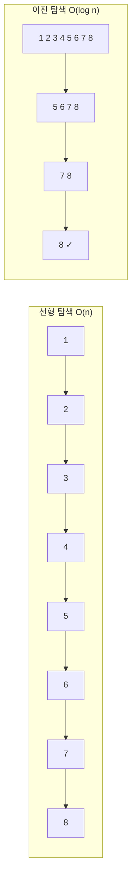
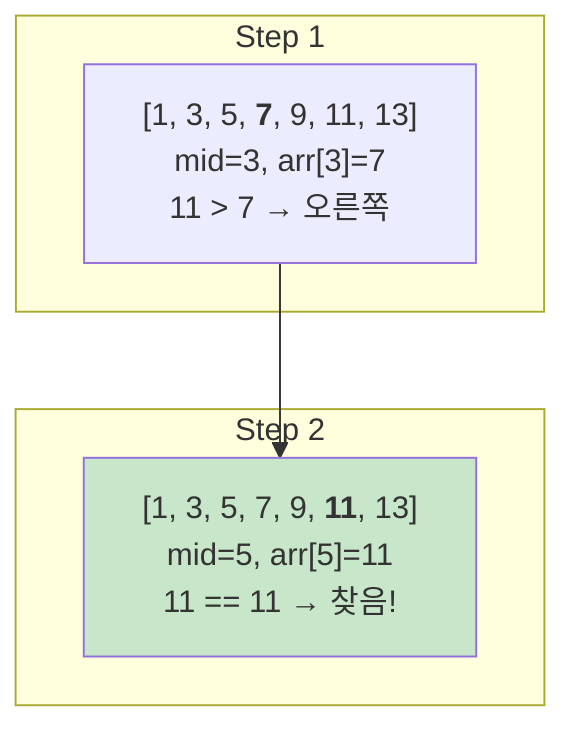

# 1. 이진탐색이란?

이진탐색(Binary Search)은 **정렬된 배열**에서 특정 값을 O(log n)에 찾는 알고리즘입니다. 배열의 중간값과 비교하여 탐색 범위를 절반씩 줄여나갑니다.

## 1.1 이진탐색 vs 선형탐색



| 특성 | 선형 탐색 | 이진 탐색 |
|------|----------|----------|
| 시간복잡도 | O(n) | O(log n) |
| 정렬 필요 | X | O (필수) |
| n = 1,000,000 | 1,000,000번 비교 | 약 20번 비교 |

## 1.2 이진탐색이 빠른 이유

n개의 데이터에서 값을 찾을 때 필요한 비교 횟수:

- **선형 탐색**: 최악 n번
- **이진 탐색**: 최악 log₂n번

```
n = 1,000 → log₂1000 ≈ 10
n = 1,000,000 → log₂1000000 ≈ 20
n = 1,000,000,000 → log₂1000000000 ≈ 30
```

# 2. 기본 이진탐색 구현

## 2.1 반복문 방식

```python
def binary_search(arr, target):
    """
    정렬된 배열에서 target의 인덱스 반환
    없으면 -1 반환
    """
    left, right = 0, len(arr) - 1

    while left <= right:
        mid = (left + right) // 2

        if arr[mid] == target:
            return mid
        elif arr[mid] < target:
            left = mid + 1   # 오른쪽 절반 탐색
        else:
            right = mid - 1  # 왼쪽 절반 탐색

    return -1

# 테스트
arr = [1, 3, 5, 7, 9, 11, 13, 15, 17, 19]
print(binary_search(arr, 7))   # 3
print(binary_search(arr, 10))  # -1
```

## 2.2 재귀 방식

```python
def binary_search_recursive(arr, target, left, right):
    """이진탐색 재귀 구현"""
    if left > right:
        return -1

    mid = (left + right) // 2

    if arr[mid] == target:
        return mid
    elif arr[mid] < target:
        return binary_search_recursive(arr, target, mid + 1, right)
    else:
        return binary_search_recursive(arr, target, left, mid - 1)

# 테스트
arr = [1, 3, 5, 7, 9, 11, 13, 15, 17, 19]
print(binary_search_recursive(arr, 7, 0, len(arr) - 1))  # 3
```

## 2.3 단계별 동작 과정

배열 `[1, 3, 5, 7, 9, 11, 13]`에서 `11`을 찾는 과정:



# 3. Python bisect 모듈

Python의 `bisect` 모듈은 이진탐색을 쉽게 사용할 수 있게 해줍니다.

## 3.1 기본 사용법

```python
import bisect

arr = [1, 3, 5, 7, 9, 11]

# bisect_left: target이 들어갈 가장 왼쪽 위치
print(bisect.bisect_left(arr, 5))   # 2 (5가 있는 위치)
print(bisect.bisect_left(arr, 6))   # 3 (6이 들어갈 위치)

# bisect_right (= bisect): target이 들어갈 가장 오른쪽 위치
print(bisect.bisect_right(arr, 5))  # 3 (5 다음 위치)
print(bisect.bisect(arr, 5))        # 3 (bisect_right와 동일)

# 값이 존재하는지 확인
def binary_search_bisect(arr, target):
    idx = bisect.bisect_left(arr, target)
    if idx < len(arr) and arr[idx] == target:
        return idx
    return -1

print(binary_search_bisect(arr, 5))   # 2
print(binary_search_bisect(arr, 6))   # -1
```

## 3.2 bisect_left vs bisect_right

```python
import bisect

arr = [1, 3, 3, 3, 5, 7]

# bisect_left: 같은 값 중 가장 왼쪽
print(bisect.bisect_left(arr, 3))   # 1 (첫 번째 3의 위치)

# bisect_right: 같은 값 중 가장 오른쪽 다음
print(bisect.bisect_right(arr, 3))  # 4 (마지막 3 다음 위치)

# 특정 값의 개수 세기
def count_value(arr, target):
    left = bisect.bisect_left(arr, target)
    right = bisect.bisect_right(arr, target)
    return right - left

print(count_value(arr, 3))  # 3
```

## 3.3 insort로 정렬 유지하며 삽입

```python
import bisect

arr = [1, 3, 5, 7, 9]

# 정렬 유지하며 삽입
bisect.insort(arr, 4)
print(arr)  # [1, 3, 4, 5, 7, 9]

bisect.insort(arr, 0)
print(arr)  # [0, 1, 3, 4, 5, 7, 9]
```

# 4. 이진탐색 응용: 파라메트릭 서치

## 4.1 파라메트릭 서치란?

파라메트릭 서치(Parametric Search)는 **최적화 문제를 결정 문제로 바꾸어** 이진탐색으로 해결하는 기법입니다.

- **최적화 문제**: "최솟값/최댓값은 얼마인가?"
- **결정 문제**: "X로 가능한가?" (Yes/No)


## 4.2 떡볶이 떡 만들기 (나무 자르기)

```python
def cut_rice_cake(heights, m):
    """
    높이가 heights인 떡들을 절단기로 잘라서
    최소 m 이상의 떡을 가져가려 할 때
    절단기 높이의 최댓값
    """
    left, right = 0, max(heights)
    result = 0

    while left <= right:
        mid = (left + right) // 2

        # mid 높이로 잘랐을 때 얻는 떡의 양
        total = sum(h - mid for h in heights if h > mid)

        if total >= m:
            # 충분히 얻을 수 있음 → 높이를 높여봄
            result = mid
            left = mid + 1
        else:
            # 부족함 → 높이를 낮춤
            right = mid - 1

    return result

heights = [19, 15, 10, 17]
m = 6
print(cut_rice_cake(heights, m))  # 15
# 높이 15로 자르면: 4 + 0 + 0 + 2 = 6
```

## 4.3 케이블 자르기

```python
def cut_cables(cables, n):
    """
    길이가 각각 다른 케이블들이 있습니다.
    이 케이블들을 동일한 길이로 잘라 n개 이상의 케이블을 만들려고 합니다.
    만들 수 있는 케이블의 최대 길이를 구하세요.

    cables: 각 케이블의 길이 리스트
    n: 필요한 케이블의 최소 개수
    """
    left, right = 1, max(cables)
    result = 0

    while left <= right:
        mid = (left + right) // 2

        # mid 길이로 만들 수 있는 케이블 개수
        count = sum(cable // mid for cable in cables)

        if count >= n:
            # n개 이상 만들 수 있음 → 길이를 늘려봄
            result = mid
            left = mid + 1
        else:
            # n개 미만 → 길이를 줄임
            right = mid - 1

    return result

cables = [802, 743, 457, 539]
n = 11
print(cut_cables(cables, n))  # 200
```

## 4.4 창구 대기 시간 최소화

```python
def min_service_time(n, service_times):
    """
    n명의 고객이 서비스를 받으려고 합니다.
    여러 창구가 있고, 각 창구마다 한 명을 처리하는 데 걸리는 시간이 다릅니다.
    모든 고객이 서비스를 받는 데 걸리는 최소 시간을 구하세요.

    n: 고객 수
    service_times: 각 창구의 처리 시간 리스트
    """
    left, right = 1, max(service_times) * n
    result = right

    while left <= right:
        mid = (left + right) // 2

        # mid 시간 동안 처리할 수 있는 최대 고객 수
        count = sum(mid // time for time in service_times)

        if count >= n:
            # n명 이상 처리 가능 → 시간을 줄여봄
            result = mid
            right = mid - 1
        else:
            # n명 미만 → 시간을 늘림
            left = mid + 1

    return result

print(min_service_time(6, [7, 10]))  # 28
# 28분: 7분 창구가 4명, 10분 창구가 2명 = 6명
```

# 5. 이진탐색 실전 문제

## 5.1 특정 수의 개수 세기

```python
import bisect

def count_by_range(arr, left_value, right_value):
    """
    정렬된 배열에서 [left_value, right_value] 범위의 개수
    """
    right_idx = bisect.bisect_right(arr, right_value)
    left_idx = bisect.bisect_left(arr, left_value)
    return right_idx - left_idx

arr = [1, 2, 2, 2, 3, 3, 4, 5, 5, 5, 5]
print(count_by_range(arr, 2, 4))  # 5 (2가 3개, 3이 2개)
print(count_by_range(arr, 5, 5))  # 4 (5가 4개)
```

## 5.2 가장 가까운 값 찾기

```python
import bisect

def find_closest(arr, target):
    """정렬된 배열에서 target에 가장 가까운 값"""
    if not arr:
        return None

    idx = bisect.bisect_left(arr, target)

    # 경계 처리
    if idx == 0:
        return arr[0]
    if idx == len(arr):
        return arr[-1]

    # 왼쪽과 오른쪽 중 가까운 값
    left_val = arr[idx - 1]
    right_val = arr[idx]

    if target - left_val <= right_val - target:
        return left_val
    else:
        return right_val

arr = [1, 3, 5, 7, 9]
print(find_closest(arr, 4))  # 3 또는 5 (3 반환)
print(find_closest(arr, 6))  # 5 또는 7 (5 반환)
```

## 5.3 K번째 수 찾기

```python
def kth_number(n, k):
    """
    n x n 배열에서 k번째로 작은 수 찾기
    배열[i][j] = i * j (1-indexed)
    """
    left, right = 1, n * n
    result = 0

    while left <= right:
        mid = (left + right) // 2

        # mid 이하의 수 개수
        count = 0
        for i in range(1, n + 1):
            count += min(mid // i, n)

        if count >= k:
            result = mid
            right = mid - 1
        else:
            left = mid + 1

    return result

print(kth_number(3, 7))  # 6
# 3x3 배열: [[1,2,3],[2,4,6],[3,6,9]]
# 정렬: [1,2,2,3,3,4,6,6,9] → 7번째는 6
```

# 6. 이진탐색 팁

:::div{.callout}
**이진탐색 문제 판별법**

1. **정렬된 배열**에서 특정 값을 찾는 문제
2. **"최소가 되는 최대"** 또는 **"최대가 되는 최소"** 형태의 문제
3. 탐색 범위가 매우 큰 경우 (10^9 이상)
4. "X가 가능한가?"라는 결정 문제로 바꿀 수 있는 경우
:::

## 6.1 이진탐색 구현 주의사항

```python
# 1. 무한 루프 방지
while left <= right:  # <= 사용
    mid = (left + right) // 2
    if condition:
        left = mid + 1   # mid가 아닌 mid+1
    else:
        right = mid - 1  # mid가 아닌 mid-1

# 2. 오버플로우 방지 (Python은 상관없지만 다른 언어 주의)
mid = left + (right - left) // 2  # (left + right) // 2 대신

# 3. 범위 설정
# - 값을 찾는 경우: left=0, right=len(arr)-1
# - 파라메트릭 서치: left=최솟값, right=최댓값
```

## 6.2 이진탐색 vs Lower/Upper Bound

| 함수 | 설명 | 반환값 |
|------|------|--------|
| `bisect_left(arr, x)` | x 이상인 첫 위치 (lower bound) | x가 들어갈 가장 왼쪽 인덱스 |
| `bisect_right(arr, x)` | x 초과인 첫 위치 (upper bound) | x가 들어갈 가장 오른쪽 인덱스 |

# 7. 연습문제

* (이진탐색) 숫자 배열 탐색: https://100.pyalgo.co.kr/?page=21
* (이진탐색) 이진 탐색 구현: https://100.pyalgo.co.kr/?page=22
* (이진탐색) 특정 값 찾기: https://100.pyalgo.co.kr/?page=23
