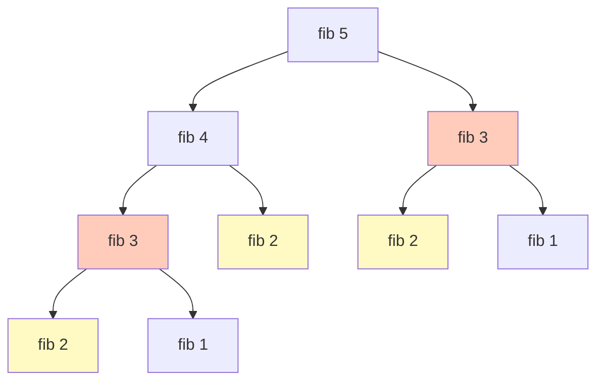
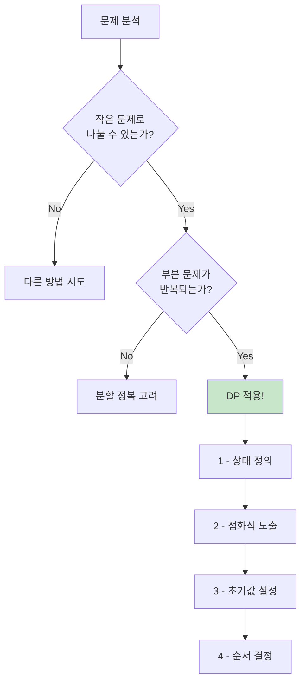

:::div{.callout}
동적 프로그래밍(DP)은 코딩테스트에서 출제 비중(약 6%)은 낮지만, Lv3 이상의 고난도 문제에서 자주 등장합니다. 기초적인 DP 유형만 익혀도 많은 문제를 해결할 수 있습니다. 이 챕터에서는 코딩테스트에 자주 나오는 기초 DP 패턴만 다룹니다.
:::

# 1. 동적 프로그래밍이란?

동적 프로그래밍(Dynamic Programming, DP)은 **큰 문제를 작은 문제로 나누어 해결**하고, 작은 문제의 결과를 **저장해두었다가 재활용**하는 기법입니다.

## 1.1 DP가 필요한 이유

피보나치 수열을 재귀로 구현하면 같은 계산을 반복합니다.

```python
# 비효율적인 재귀 (O(2^n))
def fib_recursive(n):
    if n <= 1:
        return n
    return fib_recursive(n-1) + fib_recursive(n-2)

# fib(5)를 계산하면:
# fib(3)이 2번 호출
# fib(2)가 3번 호출
# fib(1)이 5번 호출
```



DP를 사용하면 이미 계산한 값을 저장해두고 재사용합니다.

## 1.2 DP의 두 가지 조건

1. **최적 부분 구조 (Optimal Substructure)**
   - 큰 문제의 최적해가 작은 문제의 최적해로 구성됨
   - 예: `fib(n) = fib(n-1) + fib(n-2)`

2. **중복되는 부분 문제 (Overlapping Subproblems)**
   - 동일한 작은 문제가 반복적으로 등장
   - 예: `fib(3)`이 여러 번 필요

# 2. DP 구현 방식

## 2.1 탑다운 (Top-Down, 메모이제이션)

재귀 + 저장 방식입니다. 큰 문제에서 시작해서 작은 문제로 내려갑니다.

```python
# 메모이제이션 (탑다운)
def fib_topdown(n, memo={}):
    if n in memo:
        return memo[n]
    if n <= 1:
        return n

    memo[n] = fib_topdown(n-1, memo) + fib_topdown(n-2, memo)
    return memo[n]

print(fib_topdown(50))  # 12586269025 (빠르게 계산)
```

```python
# @lru_cache 데코레이터 사용 (더 간단)
from functools import lru_cache

@lru_cache(maxsize=None)
def fib_cached(n):
    if n <= 1:
        return n
    return fib_cached(n-1) + fib_cached(n-2)

print(fib_cached(50))  # 12586269025
```

## 2.2 바텀업 (Bottom-Up, 타뷸레이션)

반복문 + 테이블 방식입니다. 작은 문제부터 시작해서 큰 문제로 올라갑니다.

```python
# 타뷸레이션 (바텀업)
def fib_bottomup(n):
    if n <= 1:
        return n

    dp = [0] * (n + 1)
    dp[0] = 0
    dp[1] = 1

    for i in range(2, n + 1):
        dp[i] = dp[i-1] + dp[i-2]

    return dp[n]

print(fib_bottomup(50))  # 12586269025
```

```python
# 공간 최적화 (변수 2개만 사용)
def fib_optimized(n):
    if n <= 1:
        return n

    prev, curr = 0, 1
    for _ in range(2, n + 1):
        prev, curr = curr, prev + curr

    return curr

print(fib_optimized(50))  # 12586269025
```

## 2.3 탑다운 vs 바텀업

| 특성 | 탑다운 (메모이제이션) | 바텀업 (타뷸레이션) |
|------|---------------------|-------------------|
| 구현 | 재귀 + 캐시 | 반복문 + 테이블 |
| 순서 | 큰 문제 → 작은 문제 | 작은 문제 → 큰 문제 |
| 필요한 부분만 계산 | O | X (모든 부분 계산) |
| 스택 오버플로우 위험 | O | X |
| 코딩테스트 추천 | 직관적일 때 | 안정적 |

# 3. 코딩테스트 필수 DP 유형

## 3.1 계단 오르기 (1차원 DP)

```python
def climb_stairs(n):
    """
    계단을 오르는 방법의 수
    한 번에 1칸 또는 2칸 오를 수 있음
    """
    if n <= 2:
        return n

    dp = [0] * (n + 1)
    dp[1] = 1  # 1칸: 1가지
    dp[2] = 2  # 2칸: 2가지 (1+1, 2)

    for i in range(3, n + 1):
        # i번째 계단 = (i-1)에서 1칸 + (i-2)에서 2칸
        dp[i] = dp[i-1] + dp[i-2]

    return dp[n]

print(climb_stairs(5))  # 8
# 1+1+1+1+1, 1+1+1+2, 1+1+2+1, 1+2+1+1, 2+1+1+1,
# 1+2+2, 2+1+2, 2+2+1
```

**점화식**: `dp[i] = dp[i-1] + dp[i-2]`

## 3.2 동전 교환 (최소 개수)

```python
def min_coins(coins, amount):
    """
    주어진 동전으로 amount를 만들기 위한 최소 동전 개수
    만들 수 없으면 -1 반환
    """
    # dp[i] = i원을 만들기 위한 최소 동전 개수
    dp = [float('inf')] * (amount + 1)
    dp[0] = 0  # 0원은 동전 0개 필요

    for i in range(1, amount + 1):
        for coin in coins:
            if coin <= i and dp[i - coin] != float('inf'):
                dp[i] = min(dp[i], dp[i - coin] + 1)

    return dp[amount] if dp[amount] != float('inf') else -1

print(min_coins([1, 2, 5], 11))  # 3 (5+5+1)
print(min_coins([2], 3))         # -1 (불가능)
```

**점화식**: `dp[i] = min(dp[i], dp[i - coin] + 1)` for each coin

## 3.3 최장 증가 부분 수열 (LIS)

```python
def longest_increasing_subsequence(arr):
    """
    가장 긴 증가하는 부분 수열의 길이
    예: [10, 20, 10, 30, 20, 50] → [10, 20, 30, 50] → 4
    """
    n = len(arr)
    if n == 0:
        return 0

    # dp[i] = arr[i]로 끝나는 LIS의 길이
    dp = [1] * n

    for i in range(1, n):
        for j in range(i):
            if arr[j] < arr[i]:
                dp[i] = max(dp[i], dp[j] + 1)

    return max(dp)

print(longest_increasing_subsequence([10, 20, 10, 30, 20, 50]))  # 4
print(longest_increasing_subsequence([3, 1, 4, 1, 5, 9, 2, 6]))   # 4
```

**점화식**: `dp[i] = max(dp[j] + 1)` where `arr[j] < arr[i]` and `j < i`

## 3.4 배낭 문제 (0/1 Knapsack)

```python
def knapsack(weights, values, capacity):
    """
    배낭의 용량 내에서 가치의 합이 최대가 되도록
    물건을 선택할 때의 최대 가치
    각 물건은 한 번만 선택 가능
    """
    n = len(weights)

    # dp[i][w] = i번째 물건까지 고려했을 때, 용량 w에서의 최대 가치
    dp = [[0] * (capacity + 1) for _ in range(n + 1)]

    for i in range(1, n + 1):
        for w in range(capacity + 1):
            # i번째 물건을 넣지 않는 경우
            dp[i][w] = dp[i-1][w]

            # i번째 물건을 넣는 경우 (넣을 수 있다면)
            if weights[i-1] <= w:
                dp[i][w] = max(dp[i][w], dp[i-1][w - weights[i-1]] + values[i-1])

    return dp[n][capacity]

weights = [2, 3, 4, 5]
values = [3, 4, 5, 6]
capacity = 5
print(knapsack(weights, values, capacity))  # 7 (물건 1, 2 선택)
```

**점화식**: `dp[i][w] = max(dp[i-1][w], dp[i-1][w-weight[i]] + value[i])`

## 3.5 2차원 격자 경로

```python
def unique_paths(m, n):
    """
    m x n 격자에서 좌상단에서 우하단까지
    오른쪽 또는 아래로만 이동할 때의 경로 수
    """
    dp = [[1] * n for _ in range(m)]

    for i in range(1, m):
        for j in range(1, n):
            # 위에서 오거나 왼쪽에서 오는 경우의 합
            dp[i][j] = dp[i-1][j] + dp[i][j-1]

    return dp[m-1][n-1]

print(unique_paths(3, 3))  # 6
print(unique_paths(3, 7))  # 28
```

**점화식**: `dp[i][j] = dp[i-1][j] + dp[i][j-1]`

## 3.6 최소 경로 합

```python
def min_path_sum(grid):
    """
    격자에서 좌상단에서 우하단까지
    경로 합이 최소가 되는 값
    """
    m, n = len(grid), len(grid[0])

    # dp[i][j] = (0,0)에서 (i,j)까지의 최소 경로 합
    dp = [[0] * n for _ in range(m)]
    dp[0][0] = grid[0][0]

    # 첫 행: 왼쪽에서만 올 수 있음
    for j in range(1, n):
        dp[0][j] = dp[0][j-1] + grid[0][j]

    # 첫 열: 위에서만 올 수 있음
    for i in range(1, m):
        dp[i][0] = dp[i-1][0] + grid[i][0]

    # 나머지: 위 또는 왼쪽 중 작은 값 + 현재 값
    for i in range(1, m):
        for j in range(1, n):
            dp[i][j] = min(dp[i-1][j], dp[i][j-1]) + grid[i][j]

    return dp[m-1][n-1]

grid = [
    [1, 3, 1],
    [1, 5, 1],
    [4, 2, 1]
]
print(min_path_sum(grid))  # 7 (1→3→1→1→1)
```

# 4. DP 문제 접근법

## 4.1 DP 문제 판별



## 4.2 DP 문제 풀이 단계

1. **상태 정의**: `dp[i]`가 무엇을 의미하는지 정의
2. **점화식 도출**: `dp[i]`를 이전 상태로 표현
3. **초기값 설정**: 가장 작은 문제의 답 설정
4. **계산 순서**: 작은 문제부터 큰 문제 순서로

:::div{.callout}
**DP 문제 키워드**

- "~의 최솟값/최댓값"
- "~의 경우의 수"
- "~가 가능한가?"
- "가장 긴/짧은 ~"
- "연속된 ~"
:::

## 4.3 자주 사용하는 상태 정의

| 유형 | 상태 정의 | 예시 |
|------|----------|------|
| 1차원 | `dp[i]`: i번째까지의 최적해 | 계단 오르기, 피보나치 |
| 부분 배열 | `dp[i]`: i에서 끝나는 최적해 | LIS, 최대 부분 합 |
| 2차원 격자 | `dp[i][j]`: (i,j)까지의 최적해 | 경로 수, 최소 비용 |
| 배낭 | `dp[i][w]`: i번째까지, 용량 w | 0/1 배낭 문제 |
| 문자열 | `dp[i][j]`: s1[0:i], s2[0:j] | LCS, 편집 거리 |

# 5. DP 심화 문제

## 5.1 숫자로 목표값 만들기

```python
def min_uses(n, target):
    """
    숫자 n을 사칙연산으로 조합하여 target을 만들 때
    n을 최소 몇 번 사용해야 하는지 반환합니다.
    8번 초과면 -1 반환

    예: n=5, target=12 → (55+5)/5=12 → 4번 사용
    """
    if n == target:
        return 1

    # dp[i] = n을 i번 사용해서 만들 수 있는 모든 수
    dp = [set() for _ in range(9)]

    for i in range(1, 9):
        # n을 i번 연속 사용 (예: 5, 55, 555, ...)
        dp[i].add(int(str(n) * i))

        # j번 사용 + (i-j)번 사용 조합
        for j in range(1, i):
            for a in dp[j]:
                for b in dp[i - j]:
                    dp[i].add(a + b)
                    dp[i].add(a - b)
                    dp[i].add(a * b)
                    if b != 0:
                        dp[i].add(a // b)

        if target in dp[i]:
            return i

    return -1

print(min_uses(5, 12))   # 4
print(min_uses(2, 11))   # 3
```

## 5.2 삼각형 경로 최대합

```python
def max_triangle_path(triangle):
    """
    삼각형 형태의 숫자 배열에서 꼭대기부터 바닥까지
    이동하며 거쳐간 숫자의 최대 합을 구합니다.
    각 단계에서 바로 아래 또는 오른쪽 아래로만 이동할 수 있습니다.
    """
    n = len(triangle)

    # 바닥부터 올라가기 (바텀업)
    dp = triangle[-1][:]  # 마지막 행 복사

    for i in range(n - 2, -1, -1):  # 아래에서 두 번째 행부터
        for j in range(len(triangle[i])):
            # 아래 두 값 중 큰 값 선택
            dp[j] = triangle[i][j] + max(dp[j], dp[j + 1])

    return dp[0]

triangle = [[7], [3, 8], [8, 1, 0], [2, 7, 4, 4], [4, 5, 2, 6, 5]]
print(max_triangle_path(triangle))  # 30
```

# 6. 연습문제

* (DP) 마라탕: https://pyalgo.co.kr/?page=12
* (DP) 연속 수열 최대합: https://100.pyalgo.co.kr/?page=24
* (DP) 계단 오르기: https://100.pyalgo.co.kr/?page=25
