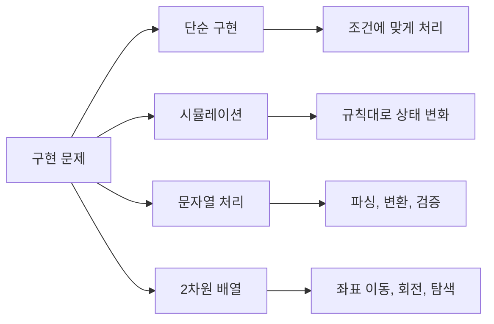

# 1. 구현 문제란?

구현(Implementation) 문제는 **문제에서 요구하는 대로 정확하게 코드를 작성**하는 문제입니다. 특별한 알고리즘보다 **코딩 능력**과 **문제 이해력**을 평가합니다.

## 1.1 구현 문제의 특징

- **출제 비중 최고**: 약 33%로 가장 많이 출제
- **알고리즘 지식보다 코딩력**: 조건문, 반복문, 배열 조작 능력
- **디테일이 중요**: 예외 처리, 경계값, 순서
- **시뮬레이션 포함**: 주어진 규칙대로 상태 변화 시키기

:::div{.callout}
**구현 문제 키워드**

- "주어진 규칙대로", "시뮬레이션"
- "게임", "로봇", "이동"
- "2차원 배열", "좌표"
- "문자열 조작", "파싱"
:::

## 1.2 구현 문제 유형



# 2. 2차원 배열 다루기

2차원 배열(격자) 문제는 구현 문제에서 매우 자주 등장합니다.

## 2.1 좌표 이동

```python
# 상하좌우 이동 (가장 많이 사용)
# 순서: 상, 하, 좌, 우
dx = [-1, 1, 0, 0]
dy = [0, 0, -1, 1]

# 또는 딕셔너리로
directions = {
    'U': (-1, 0), 'D': (1, 0),
    'L': (0, -1), 'R': (0, 1)
}

# 8방향 이동 (대각선 포함)
dx = [-1, -1, -1, 0, 0, 1, 1, 1]
dy = [-1, 0, 1, -1, 1, -1, 0, 1]


def move(x, y, direction, n, m):
    """
    (x, y)에서 direction 방향으로 이동
    n x m 격자 내에 있으면 새 좌표 반환, 아니면 None
    """
    nx = x + dx[direction]
    ny = y + dy[direction]

    if 0 <= nx < n and 0 <= ny < m:
        return (nx, ny)
    return None


# 예: 5x5 격자에서 (2, 3)에서 상(0)으로 이동
print(move(2, 3, 0, 5, 5))  # (1, 3)
```

## 2.2 격자 범위 확인

```python
def is_valid(x, y, n, m):
    """격자 범위 내인지 확인"""
    return 0 <= x < n and 0 <= y < m


def get_neighbors(x, y, n, m):
    """4방향 이웃 좌표 반환"""
    dx = [-1, 1, 0, 0]
    dy = [0, 0, -1, 1]

    neighbors = []
    for i in range(4):
        nx, ny = x + dx[i], y + dy[i]
        if is_valid(nx, ny, n, m):
            neighbors.append((nx, ny))

    return neighbors


# 예: 3x3 격자에서 (1, 1)의 이웃
print(get_neighbors(1, 1, 3, 3))  # [(0,1), (2,1), (1,0), (1,2)]
```

## 2.3 배열 회전

```python
def rotate_90_clockwise(matrix):
    """2차원 배열 90도 시계방향 회전"""
    n = len(matrix)
    m = len(matrix[0])

    # 새 배열 크기: m x n
    rotated = [[0] * n for _ in range(m)]

    for i in range(n):
        for j in range(m):
            rotated[j][n - 1 - i] = matrix[i][j]

    return rotated


def rotate_90_counterclockwise(matrix):
    """2차원 배열 90도 반시계방향 회전"""
    n = len(matrix)
    m = len(matrix[0])

    rotated = [[0] * n for _ in range(m)]

    for i in range(n):
        for j in range(m):
            rotated[m - 1 - j][i] = matrix[i][j]

    return rotated


# 예시
matrix = [
    [1, 2, 3],
    [4, 5, 6]
]
print(rotate_90_clockwise(matrix))
# [[4, 1], [5, 2], [6, 3]]
```

## 2.4 zip을 이용한 회전 (간단 버전)

```python
def rotate_90_clockwise_zip(matrix):
    """zip을 이용한 90도 시계방향 회전"""
    return [list(row) for row in zip(*matrix[::-1])]


def rotate_90_counterclockwise_zip(matrix):
    """zip을 이용한 90도 반시계방향 회전"""
    return [list(row)[::-1] for row in zip(*matrix)]


matrix = [
    [1, 2, 3],
    [4, 5, 6],
    [7, 8, 9]
]
print(rotate_90_clockwise_zip(matrix))
# [[7, 4, 1], [8, 5, 2], [9, 6, 3]]
```

# 3. 시뮬레이션 문제

시뮬레이션은 주어진 규칙을 그대로 구현하여 상태를 변화시키는 문제입니다.

## 3.1 상하좌우 이동

```python
def solution(n, commands):
    """
    n x n 격자에서 (0, 0)에서 시작하여
    명령에 따라 이동한 최종 위치
    """
    x, y = 0, 0

    directions = {
        'U': (-1, 0),
        'D': (1, 0),
        'L': (0, -1),
        'R': (0, 1)
    }

    for cmd in commands.split():
        dx, dy = directions[cmd]
        nx, ny = x + dx, y + dy

        # 범위 내에 있을 때만 이동
        if 0 <= nx < n and 0 <= ny < n:
            x, y = nx, ny

    return (x, y)


# 예: 5x5 격자, "R R D D" 명령
print(solution(5, "R R D D"))  # (2, 2)
```

## 3.2 로봇 청소기 (삼성 기출 스타일)

```python
def robot_cleaner(room, start_x, start_y, start_dir):
    """
    로봇 청소기가 청소하는 칸의 개수
    1. 현재 칸 청소
    2. 반시계 방향으로 탐색
    3. 빈 칸이 있으면 한 칸 전진 후 1번으로
    4. 빈 칸이 없으면 후진
    5. 후진 불가능하면 종료
    """
    n, m = len(room), len(room[0])
    # 방향: 북(0), 동(1), 남(2), 서(3)
    dx = [-1, 0, 1, 0]
    dy = [0, 1, 0, -1]

    x, y, d = start_x, start_y, start_dir
    cleaned = 0

    while True:
        # 1. 현재 칸 청소
        if room[x][y] == 0:
            room[x][y] = 2  # 청소됨 표시
            cleaned += 1

        # 2. 주변 4칸 탐색
        found = False
        for _ in range(4):
            d = (d + 3) % 4  # 반시계 방향 회전
            nx = x + dx[d]
            ny = y + dy[d]

            if 0 <= nx < n and 0 <= ny < m and room[nx][ny] == 0:
                x, y = nx, ny
                found = True
                break

        if not found:
            # 3. 후진 시도
            back_x = x - dx[d]
            back_y = y - dy[d]

            if 0 <= back_x < n and 0 <= back_y < m and room[back_x][back_y] != 1:
                x, y = back_x, back_y
            else:
                # 후진 불가능하면 종료
                break

    return cleaned


# 예시 (1: 벽, 0: 빈 칸)
room = [
    [1, 1, 1, 1, 1],
    [1, 0, 0, 0, 1],
    [1, 0, 0, 0, 1],
    [1, 0, 0, 0, 1],
    [1, 1, 1, 1, 1]
]
print(robot_cleaner(room, 1, 1, 0))  # 9
```

## 3.3 뱀 게임 (삼성 기출)

```python
from collections import deque

def snake_game(n, apples, commands):
    """
    n x n 보드에서 뱀 게임
    게임이 끝나는 시간(초) 반환
    """
    # 사과 위치 셋
    apple_set = set(apples)

    # 방향 전환 딕셔너리
    cmd_dict = dict(commands)

    # 방향: 우(0), 하(1), 좌(2), 상(3)
    dx = [0, 1, 0, -1]
    dy = [1, 0, -1, 0]

    # 뱀 초기 상태 (머리가 앞, 꼬리가 뒤)
    snake = deque([(0, 0)])
    snake_set = {(0, 0)}
    direction = 0  # 처음에 오른쪽
    time = 0

    while True:
        time += 1

        # 다음 머리 위치
        head_x, head_y = snake[-1]
        next_x = head_x + dx[direction]
        next_y = head_y + dy[direction]

        # 벽 충돌 또는 자기 자신과 충돌
        if not (0 <= next_x < n and 0 <= next_y < n):
            break
        if (next_x, next_y) in snake_set:
            break

        # 이동
        snake.append((next_x, next_y))
        snake_set.add((next_x, next_y))

        # 사과 확인
        if (next_x, next_y) in apple_set:
            apple_set.remove((next_x, next_y))  # 사과 먹음
        else:
            # 사과 없으면 꼬리 줄임
            tail = snake.popleft()
            snake_set.remove(tail)

        # 방향 전환 확인
        if time in cmd_dict:
            if cmd_dict[time] == 'L':
                direction = (direction - 1) % 4
            else:  # 'D'
                direction = (direction + 1) % 4

    return time


# 예시
n = 6
apples = [(3, 4), (2, 5), (5, 3)]
commands = [(3, 'D'), (15, 'L'), (17, 'D')]
print(snake_game(n, apples, commands))
```

# 4. 실전 구현 문제

## 4.1 격자 버튼 누르기

```python
def press_buttons(numbers, dominant_hand):
    """
    4x3 격자 형태의 버튼 패드에서 번호를 누를 때
    어떤 손으로 눌렀는지 반환합니다.

    격자 배치:
    1 2 3
    4 5 6
    7 8 9
    * 0 #

    규칙:
    - 왼쪽 열(1,4,7): 왼손으로만 누름
    - 오른쪽 열(3,6,9): 오른손으로만 누름
    - 가운데 열(2,5,8,0): 가까운 손으로 누름 (거리가 같으면 주 손 사용)

    numbers: 누를 버튼 번호 리스트
    dominant_hand: 주 손 ("left" 또는 "right")
    """
    # 버튼 좌표
    button_pos = {
        1: (0, 0), 2: (0, 1), 3: (0, 2),
        4: (1, 0), 5: (1, 1), 6: (1, 2),
        7: (2, 0), 8: (2, 1), 9: (2, 2),
        '*': (3, 0), 0: (3, 1), '#': (3, 2)
    }

    def distance(pos1, pos2):
        return abs(pos1[0] - pos2[0]) + abs(pos1[1] - pos2[1])

    left_pos = button_pos['*']
    right_pos = button_pos['#']
    result = []

    for num in numbers:
        pos = button_pos[num]

        if num in [1, 4, 7]:
            result.append('L')
            left_pos = pos
        elif num in [3, 6, 9]:
            result.append('R')
            right_pos = pos
        else:
            left_dist = distance(left_pos, pos)
            right_dist = distance(right_pos, pos)

            if left_dist < right_dist:
                result.append('L')
                left_pos = pos
            elif right_dist < left_dist:
                result.append('R')
                right_pos = pos
            else:
                if dominant_hand == 'left':
                    result.append('L')
                    left_pos = pos
                else:
                    result.append('R')
                    right_pos = pos

    return ''.join(result)


print(press_buttons([1, 3, 4, 5, 8, 2, 1, 4, 5, 9, 5], "right"))
# "LRLLLRLLRRL"
```

## 4.2 퍼즐 맞추기

```python
def can_fit_puzzle(piece, board):
    """
    퍼즐 조각을 회전/이동하여 보드의 빈 공간에 정확히 맞출 수 있는지 확인합니다.

    piece: 퍼즐 조각 (1은 조각, 0은 빈 공간)
    board: 보드 (0은 빈 공간, 1은 채워진 공간)

    퍼즐 조각의 1이 보드의 0과 정확히 일치하면 맞출 수 있습니다.
    """
    n = len(board)
    m = len(piece)

    def rotate(arr):
        """90도 시계방향 회전"""
        return [list(row) for row in zip(*arr[::-1])]

    def check(expanded, n, m):
        """보드 영역이 모두 1인지 확인 (빈 공간이 모두 채워졌는지)"""
        for i in range(n):
            for j in range(n):
                if expanded[m - 1 + i][m - 1 + j] != 1:
                    return False
        return True

    # 확장된 보드 (퍼즐이 보드 바깥까지 이동 가능)
    for _ in range(4):  # 4번 회전
        for x in range(n + m - 1):
            for y in range(n + m - 1):
                # 확장 보드 생성
                expanded = [[0] * (n + 2 * (m - 1)) for _ in range(n + 2 * (m - 1))]

                # 보드 배치
                for i in range(n):
                    for j in range(n):
                        expanded[m - 1 + i][m - 1 + j] = board[i][j]

                # 퍼즐 조각 배치 (더하기)
                for i in range(m):
                    for j in range(m):
                        expanded[x + i][y + j] += piece[i][j]

                # 확인
                if check(expanded, n, m):
                    return True

        piece = rotate(piece)

    return False
```

# 5. 구현 문제 팁

:::div{.callout}
**구현 문제 체크리스트**

1. **입력 조건 확인**: 범위, 예외 케이스
2. **좌표계 확인**: (x, y) vs (row, col)
3. **인덱스 확인**: 0-indexed vs 1-indexed
4. **경계 조건**: 범위를 벗어나는 경우 처리
5. **순서 확인**: 동시 처리 vs 순차 처리
6. **디버깅**: print로 중간 상태 확인
:::

## 5.1 자주 하는 실수

```python
# 1. 얕은 복사 문제
board = [[0] * 3] * 3  # 잘못! 같은 리스트 참조
board[0][0] = 1
print(board)  # [[1,0,0], [1,0,0], [1,0,0]] 모두 바뀜!

board = [[0] * 3 for _ in range(3)]  # 올바른 방법

# 2. 범위 체크 순서
if board[x][y] == 1 and 0 <= x < n:  # 잘못! 인덱스 에러 가능
if 0 <= x < n and board[x][y] == 1:  # 올바른 방법 (단축 평가)

# 3. 동시 업데이트
# 잘못된 방법: 순차적으로 업데이트하면 이전 값이 덮어씌워짐
for i in range(n):
    for j in range(m):
        board[i][j] = calculate(board)  # 이미 바뀐 값 참조!

# 올바른 방법: 임시 배열 사용
new_board = [[0] * m for _ in range(n)]
for i in range(n):
    for j in range(m):
        new_board[i][j] = calculate(board)
board = new_board
```

# 6. 연습문제

* (구현) 369게임 박수 세기: https://pyalgo.co.kr/?page=1
* (구현) 알파벳 빈도: https://pyalgo.co.kr/?page=5
* (구현) 유효한 셀 개수 세기: https://100.pyalgo.co.kr/?page=54
* (구현) 숫자 뒤집기: https://100.pyalgo.co.kr/?page=58
* (시뮬레이션) 로봇 이동: https://100.pyalgo.co.kr/?page=59
