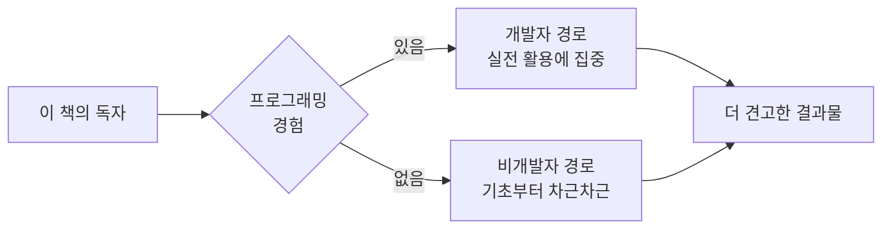
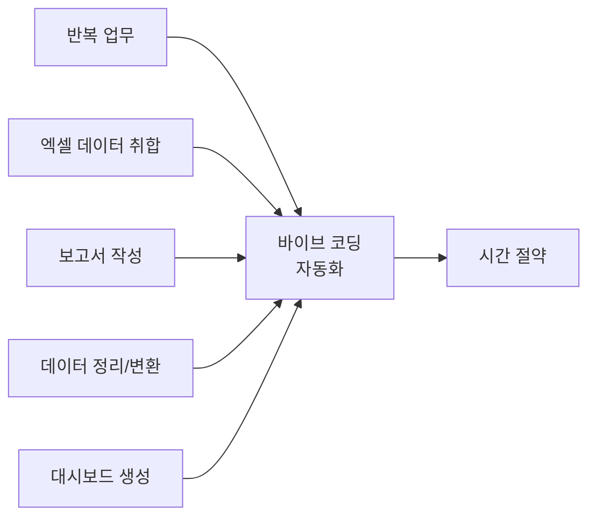
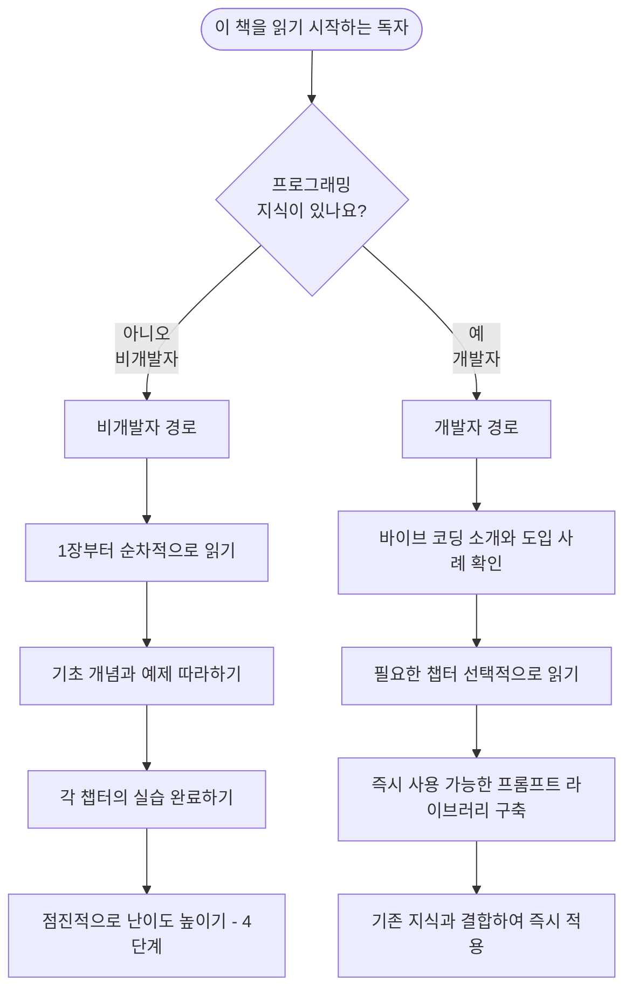
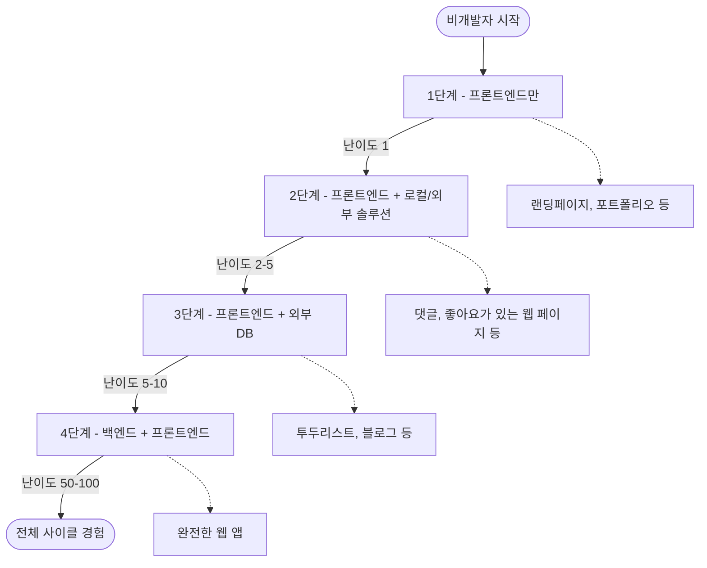
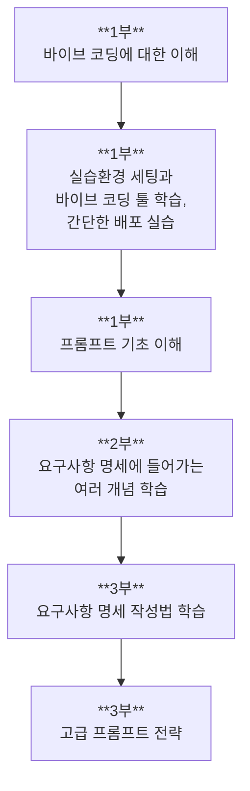

:::div{.callout}
이 책은 '코드를 짜는 새로운 패러다임, 바이브 코딩 with Claude Code'로 출간될 예정입니다. 종이책과는 일부 목차가 다르거나 내용이 다를 수 있습니다. 전체 내용은 25년 12월 서점에서 확인이 가능합니다.
:::

# 1. 대상 독자와 선수 지식

<highlight>이 책을 읽기 위해 필요한 프로그래밍 지식은 없습니다.</highlight>

HTML이 무엇인지 몰라도 됩니다. 자바스크립트와 자바의 차이를 구분하지 못해도 됩니다. 터미널이 무엇인지, API가 무엇인지 몰라도 문제없습니다. 다만 프로그래밍 지식이 있다면 좀 더 세부적으로, 견고하게 활용할 수 있습니다.

프로그래밍 지식이 있는 분들과 없는 분들은 약간 다른 관점과 다른 챕터를 읽게 되실 겁니다. 프로그래밍 지식이 없으신 분들은 너무 고급 지식을 들여다보지 않도록 해주시고, 프로그래밍 지식이 있는 분들은 너무 기초적인 내용에 머무르지 않도록 해주세요. 읽는 방법에 대한 소개는 뒤에 이어집니다.

이 책은 다음과 같은 분들을 위해 쓰였습니다.

## 1.1 아이디어는 있지만 실현 방법을 모르는 기획자와 창업가

"이런 서비스가 있으면 좋겠는데..."라는 생각을 매일 하시는 분들입니다. 견적을 받아보니 5천만 원, 개발 기간 3개월이라는 답변에 좌절했던 경험이 있으신가요?

이제 서비스를 직접 만들 수 있습니다. 완벽하지 않아도 됩니다. 작동하는 프로토타입을 만들어 시장의 반응을 먼저 확인하고, 그다음에 전문 개발팀과 협업하면 됩니다. 무엇보다 개발자와 대화할 때 "이렇게 만들어봤는데, 여기서부터 도와주실 수 있나요?"라고 말할 수 있게 됩니다. <highlight>이것은 완전히 다른 출발점입니다.</highlight>

바이브 코딩을 활용하면 기획자와 창업가에게 다음과 같은 이점이 있습니다.

- **아이디어 검증 속도 향상**: 몇 시간 만에 MVP(최소 기능 제품)를 만들어 시장 반응을 테스트할 수 있습니다.
- **개발 비용 절감**: 외주 개발 없이 초기 프로토타입을 직접 제작할 수 있습니다.
- **개발자와의 소통 개선**: 직접 만든 결과물을 기반으로 구체적인 대화가 가능해집니다.

## 1.2 개발의 영역에 다가서고 싶은 디자이너

피그마(Figma)에서 나온 디자인으로 결과물을 만들고 싶은 디자이너분들입니다. 버튼 간격 등이 맞지 않아 "이것만 수정해주세요"라고 말하고 '오늘은 수정이 되었나? 확인해볼까? 다시 물어볼까?'라는 생각을 가지지 않아도 됩니다. 이제 "이렇게 수정해주세요."가 아닌 "이렇게 수정했어요. 반영해도 되나요?" 또는 "이런 서비스를 구현해봤는데 사용해보고 말씀해주세요"라고 말할 수 있습니다.

꼭 Claude Code가 아니더라도 Figma의 Make 등을 사용해 실제 동작하는 웹 서비스를 만드세요. 인터랙션을 직접 구현하고, 애니메이션을 추가하며, 반응형 디자인을 즉시 테스트할 수 있습니다. <highlight>디자인 핸드오프(Handoff)가 필요 없는 세상, 여러분이 만들어갈 수 있습니다.</highlight>

디자이너가 바이브 코딩을 통해 얻을 수 있는 변화는 다음과 같습니다.

| 이전 | 이후 |
| --- | --- |
| 디자인 완료 후 개발자에게 전달 | 디자인과 동시에 구현 가능 |
| 수정 요청 후 대기 시간 발생 | 직접 수정하고 즉시 확인 |
| 정적인 시안만 제작 | 인터랙션이 포함된 프로토타입 제작 |
| 개발 용어 이해의 어려움 | 코드 구조에 대한 기본 이해 습득 |

## 1.3 엑셀 지옥에서 벗어나고 싶은 직장인

매달 같은 보고서를 만들기 위해 수십 개의 엑셀 파일을 열고, 복사하고, 붙여넣기를 반복할 필요가 없습니다. "이거 자동화할 수 없을까?"라고 생각해 유튜브에 자동화 도구를 수십 개 사용해보고 생각보다 어렵다고 생각하신 분들은 이제 클로드 코드로 자동화 도구를 직접 '자연어'로 만들고 연결할 수도 있습니다. 이미 만들어진 도구를 가져와도 클로드 코드가 실행해 여러분이 원하는 엑셀로 된 보고서를 만듭니다.

보고서뿐인가요? 수집한 데이터로 대시보드를 만들고 싶다면 개발자에게 도움을 요청할 필요가 없습니다. 그것도 즉시요. 이렇게 말하기만 하면 됩니다.

> "지금 내가 엑셀로 만든 이 파일을 분석해서 대시보드로 만들어줘."

바이브 코딩으로 자동화할 수 있는 직장인의 반복 업무 예시입니다.

## 1.4 변화를 두려워하는 시니어 개발자

"AI가 내 자리를 위협한다"고 생각하시는 분들입니다. 20년간 쌓아온 경험과 지식이 무의미해질까 봐 불안하신 분들입니다.

<highlight>오히려 여러분께 가장 큰 기회가 있습니다.</highlight> 여러분은 '무엇이 좋은 코드인지' 알고 있습니다. '어떤 아키텍처가 확장 가능한지' 이해하고 있습니다. '왜 이 방식이 위험한지' 설명할 수 있습니다. AI는 코드를 생성할 수 있지만, 그것이 옳은지 판단하는 것은 여전히 인간의 영역입니다. 바이브 코딩은 여러분의 경험을 10배, 100배로 증폭시키는 **증폭기**입니다.

시니어 개발자가 바이브 코딩 시대에 갖는 강점은 다음과 같습니다.

- **코드 품질 판단 능력**: AI가 생성한 코드의 품질을 평가하고 개선점을 제시할 수 있습니다.
- **아키텍처 설계 경험**: 전체 시스템 구조를 이해하고 올바른 방향으로 이끌 수 있습니다.
- **위험 요소 식별**: 보안 취약점, 성능 이슈 등을 사전에 파악할 수 있습니다.
- **베스트 프랙티스 적용**: 오랜 경험에서 나온 노하우를 AI에게 전달할 수 있습니다.

여러분의 경험으로 더 좋은 코드를, 더 좋은 서비스를 만들 수 있습니다.

## 1.5 미래를 준비하는 학생

컴퓨터공학과가 아니어도 됩니다. 문과생도, 예체능 전공자도 모두 환영합니다. 오히려 다양한 배경이 장점이 될 수 있습니다. 경영학도는 비즈니스 로직을 더 잘 이해하고, 심리학도는 사용자 경험을 더 깊이 고민하며, 예술 전공자는 더 창의적인 인터페이스를 만들 수 있습니다.

<highlight>지금 시작하여 졸업할 때가 되면, 남들보다 2년, 3년을 앞서갈 수 있습니다.</highlight>

전공별로 바이브 코딩을 활용할 수 있는 영역을 정리해보았습니다.

| 전공 | 바이브 코딩 활용 영역 |
| --- | --- |
| 경영학 | 비즈니스 자동화 도구, 데이터 분석 대시보드 |
| 심리학 | UX 리서치 도구, 설문조사 플랫폼 |
| 예술/디자인 | 포트폴리오 사이트, 인터랙티브 아트 |
| 교육학 | 학습 관리 시스템, 교육용 콘텐츠 플랫폼 |
| 의료/보건 | 건강 데이터 시각화, 환자 관리 도구 |

## 1.6 새로운 커리어를 모색하는 전직자

"40대에 새로 시작하기엔 너무 늦지 않았을까?" 절대 그렇지 않습니다. 오히려 여러분의 도메인 지식이 빛을 발할 때입니다. 20년간 물류 업계에서 일했다면, 물류 시스템을 누구보다 잘 이해하고 있을 것입니다. 10년간 병원에서 근무했다면, 의료 현장의 문제점을 정확히 알고 있을 것입니다.

<highlight>바이브 코딩은 그 지식을 직접 솔루션으로 만들 수 있게 해줍니다.</highlight> 개발자가 되는 것이 아니라, 여러분의 전문성에 개발 능력을 더하는 것입니다.

## 1.7 효율성에 목마른 경영자와 관리자

"우리 회사도 디지털 전환을 해야 하는데..."라고 고민하시는 분들입니다. 하지만 외주 개발은 비싸고, 내부 개발팀을 구축하기는 부담스러우셨을 겁니다.

바이브 코딩을 이해하면 최소한의 리소스로 최대한의 결과를 만들어낼 수 있습니다. 더 중요한 것은 개발 프로젝트를 제대로 관리할 수 있게 된다는 점입니다. "그게 왜 한 달이나 걸리나요?"라는 질문에 대한 답을 스스로 알게 됩니다.

경영자와 관리자가 바이브 코딩을 이해하면 얻을 수 있는 이점은 다음과 같습니다.

- **프로젝트 관리 능력 향상**: 개발 과정을 이해하여 현실적인 일정과 리소스를 산정할 수 있습니다.
- **의사소통 개선**: 개발팀과 기술적인 대화가 가능해져 오해를 줄일 수 있습니다.
- **비용 최적화**: 어떤 기능이 복잡하고 어떤 기능이 간단한지 파악하여 우선순위를 정할 수 있습니다.
- **신속한 의사결정**: 직접 프로토타입을 만들어 빠르게 방향을 결정할 수 있습니다.

# 2. 읽는 방법

이 책은 크게 두 가지 방식으로 읽힐 수 있습니다.

1. 프로그래밍 지식이 없는 분들을 위한 '기초 입문서'
2. 프로그래밍 지식이 있는 분들을 위한 '실전 활용서'

각 독자군에 맞는 읽는 방법을 아래의 플로우차트로 정리해보았습니다.

특히 프로그래밍 지식이 없으신 분들은 '점진적으로 난이도 높이기'를 권장합니다. 처음부터 너무 어려운 내용을 시도하기보다는, 기초적인 예제부터 시작해 점차 복잡한 프로젝트로 나아가세요. 각 챕터의 실습을 완료하며 자신감을 쌓아가시길 바랍니다.

## 2.1 비개발자를 위한 점진적 난이도 높이기

비개발자의 점진적 난이도를 높이는 단계는 아래와 같습니다. 각 단계별로 2~3개의 프로젝트를 진행하고 다음 단계로 넘어가시는 것을 권합니다. 이 책을 천천히 따라가시면 점진적으로 배울 수 있도록 구성이 되어 있습니다. 자세한 용어 설명은 해당 챕터에 이어집니다. 여기서는 전체적인 흐름만 이해하고 넘어가시고, 필요한 경우 다시 이 챕터로 와서 참고해주세요.

## 2.2 각 단계별 상세 설명

1. 백엔드 없이 프론트엔드 만으로 개발하기
    - 난이도: 1
    - 요약: 랜딩페이지 등 저장공간이 불필요한 서비스
    - 배포: GitHub Pages, Netlify, Vercel 등
    - 설명: 이 단계에서는 HTML, CSS, JavaScript를 사용하여 간단한 웹 페이지를 만듭니다. 저장공간이 필요 없는 랜딩 페이지, 포트폴리오 사이트 등을 제작해보세요. Claude Code를 활용하여 코드 생성을 자동화하고, 기본적인 웹 개발 개념을 익힐 수 있습니다.

2. 백엔드 없이 프론트엔드 만으로 개발하기
    - 난이도: 2 ~ 5
    - 요약: 로컬스토리지 또는 외부 솔루션을 활용한 저장공간이 필요한 서비스
    - 배포: GitHub Pages, Netlify, Vercel 등
    - 설명: 이 단계에서는 로컬 스토리지나 Disqus, Utterances, Giscus 등 외부 솔루션을 활용하여 데이터를 저장하는 웹 애플리케이션을 만듭니다. 예를 들어, 간단한 댓글, 좋아요 등의 서비스는 백엔드 없이 구현할 수 있습니다.

3. 백엔드 없이 프론트엔드와 구글 시트 등의 외부 DB를 이용해 개발하기
    - 난이도: 5 ~ 10
    - 요약: 구글 시트, Firebase, Notion API 등 개발자가 직접 연동을 해야 하는 솔루션
    - 배포: GitHub Pages, Netlify, Vercel 등
    - 설명: 이 단계에서는 구글 시트, Firebase, Notion API 등 외부 DB를 활용하여 데이터를 저장하고 관리하는 웹 애플리케이션을 만듭니다. API 연동을 해야 하며, 때에 따라서는 내 컴퓨터에서 실행되는 Claude Code만으로는 연결이 불가할 때가 있습니다. 구글 시트에 Google Script를 작성하거나, Notion API 등을 활용해가며 간단한 투두리스트 또는 블로그를 만들어보세요.

4. 백엔드 + 프론트엔드로 개발하기
    - 난이도: 50 ~ 100
    - 요약: Django, Rails 등 백엔드 풀스택 프레임워크를 활용한 서비스
    - 배포: Render, Lightsail 등
    - 설명: 이 단계에서는 Django, Rails 등 백엔드 풀스택 프레임워크를 활용하여 완전한 웹 애플리케이션을 만들어보시는 것을 권합니다. 물론 FastAPI나 Express.js 등 다양한 백엔드 프레임워크를 사용할 수도 있지만 관리자 페이지를 제공하는 풀스택 프레임워크를 사용하는 편이 초급자에게는 쉽습니다. 사용자 인증, 데이터베이스 관리, 서버 사이드 로직 등을 포함한 복잡한 기능을 구현할 수 있습니다. Claude Code를 활용하여 백엔드와 프론트엔드 코드를 생성하고, 전체적인 아키텍처 설계에 도움을 받을 수 있습니다. 다만 이 단계에 진입했다면 코드를 이해하지 못한 상태로 배포하는 것은 권장하지 않습니다. 유지보수 때문에 그렇습니다. 또한 개인 정보가 포함된 서비스라면 보안에 신경써야하며, 개인정보보호법, 정보통신망법 등 관련 법률이 무엇이 있는지도 반드시 숙지해야 합니다.

# 3. 전체 구성

책의 전체 구성은 아래와 같습니다.

