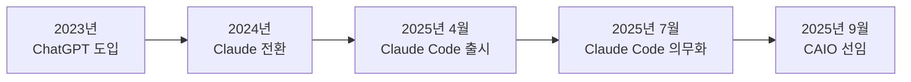

# 1. 클로드 코드 도입기

이 장에서는 위니브에서 클로드 코드를 도입하게 된 과정과 그로 인한 조직 변화를 공유합니다. 도입에 어떤 허들이 있었는지, 일하는 방식이 어떻게 변화했는지를 중심으로 보시면 좋겠습니다.

2023년, 회사에 챗지피티(ChatGPT) 도입을 의무화했습니다. 24년에는 클로드(Claude)로 옮겼고, 25년에 커서(Cursor) 도입을 공식화하기 전(25년 4월)에 클로드 코드(Claude Code)가 나왔습니다. 그리고 25년 7월 20일 위니브는 클로드 코드 도입을 공식화했습니다. 그리고 9월에는 모든 개발 단계를 프롬프트로 만들기 위한 CAIO(Chief AI Officer)를 선임했습니다.



> ***"이제 코드를 직접 타이핑하는 시대는 끝났다."***

처음엔 과장된 마케팅 용어로 들렸습니다. 오랜 시간 키보드로 한 글자 한 글자 코드를 작성해 온 저에게 직접 타이핑을 치는 시대가 끝났다는 것은 너무 섣부른 얘기였습니다. 그런 일은 있을 수 없다고 생각했습니다. 확신했습니다. 제가 공부했던 수많은 알고리즘, 자료구조, 디자인 패턴, 아키텍처, 코드를 작성하는 원칙 등이 모두 학습이 된다고 하더라도 그것들을 이어 붙여 하나의 인간이 쓸 수 있는 소프트웨어를 개발하는 일은 인간만의 영역이라 생각했습니다.

> ***"코드의 가치가 0에 수렴하는 시대가 온다."***

말도 안된다 생각했습니다. 코드의 가치가 설사 반토막이 난다 하더라도, AI가 작성하는 것도 결국 코드이기 때문에 코드의 가치는 0에 수렴하지는 않을 것이라 생각했습니다. 코드는 여전히 중요할 것이고, 코드를 작성하는 사람의 가치도 여전히 중요할 것이라 생각했습니다. 그런 저에게 가는 곳마다 클로드 코드 얘기가 들려왔습니다. 

설치를 망설였던 것은 생각보다 큰 거부반응 때문이었을 것입니다. <highlight>설치를 하고 프롬프트를 작성하여 엔터를 치는 순간, 그 결과물로 저는 알 수 있었습니다. 이것은 단순한 도구의 변화가 아니라, **개발 패러다임 자체의 전환**이라는 것을요.</highlight> 아니, 단지 개발 뿐만이 아닙니다. 일하는 방식의 근본적인 변화를 의미합니다. 그럼에도 불구하고, 회사의 공식 도입을 망설였던 것은 비용 때문은 아니었고 아마도 자기부정을 하기 쉽지 않았던 것 같습니다.

## 1.1 비개발자가 만든 웹 서비스

우선 회사 내에 몇 분에게 클로드 코드 테스트 부탁을 드렸습니다. 그 다음주에 SW 개발을 해본적 없는 디자이너가 3개의 웹 서비스를 런칭했습니다. 이 중 하나는 저희가 이 패러다임을 널리 알려야겠다는 마음으로 시작한 직장인 바이브 코딩 부트캠프 페이지입니다. 한번 들어가 보시고 판단해 보시죠. 이 서비스가 '코딩을 모르는 사람'의 결과물입니다.


- 바이브 코딩 부트캠프: https://vibe.weniv.co.kr/

## 1.2 웹에서 앱으로의 확장

웹 서비스는 명령어 한 번에 앱으로도 만들어집니다. 단지 '이 웹 서비스를 일렉트론으로 데스크톱 앱으로 만들어줘.'라고 했을 뿐입니다. 아래 이미지는 이 명령어가 전부인 결과물입니다. 웹이 아니라, 데스크톱 앱입니다. 메모장 같은 앱이요.


## 1.3 실제 서비스에 적용하기

저도 열심히 사용해 봤습니다. 처음에는 서비스 리팩토링과 유지보수에만 사용하다가 10만 명이 접속하는 위니북스(https://books.weniv.co.kr/) 서비스에 새로운 기술 도입에도 적용해 보았습니다. 머메이드(Mermaid) 도입이었는데요. 머메이드는 텍스트 기반으로 도형을 그리는 문법입니다. 실제 적용된 곳을 보도록 하겠습니다.


위 텍스트는 실제 아래와 같은 텍스트로 만들어진 것입니다.

```markdown
graph LR
    A[TypeScript 코드] --> B[TypeScript 컴파일러]
    B --> C[JavaScript 코드]
    C --> D[JavaScript 엔진]
    D --> E[실행]
```

이 책 모든 곳에 있는 도표는 이렇게 만들어졌습니다. 이것도 단지 생산성 향상, 도구의 변화가 아닙니다. 우리는 아래와 같은 프롬프트로 모든 도형을 책에 추가하고 있습니다. 사람이 추가한 것이 아니라 아래와 같은 프롬프트를 통해 AI가 초안을 잡고 사람이 검토하여 반영한 것입니다. 아래 프롬프트는 회사에서 사용하고 있는 `퇴고.md` 프롬프트의 일부입니다.

```markdown
### 2. 시각화 작업 (Mermaid)
#### 2.1 적용 대상
- 프로세스 플로우가 있는 내용
- 데이터 관계를 설명하는 부분
- 단계별 진행 과정이 있는 섹션
- 복잡한 개념의 구조화가 필요한 부분
```

우리는 더이상 도표를 그리기 위해 파워포인트나 피그잼을 사용하지 않습니다. 그러면서도 더 빠르고, 공유할 필요도 없는 의도한 대로의 도표를 만들 수 있게 되었습니다. <highlight>이러한 기능 추가를, 책마다 도표 추가를 직접 했다면 몇달은 걸렸을 일입니다. 클로드 코드를 통해 하루만에 기능을 추가했고, 회사에서 보유한 20권에 책에 도표를 추가하는 것에는 3일이 걸렸습니다.</highlight>

> ***"이게 생산성 향상이잖아요? 일하는 방식은 어디가 차이가 있다는 것이죠?"***

위와 같이 반문할 수 있을 것입니다. 급격한 생산성의 향상은 우리를 좀 더 창의적인 일에 집중할 수 있도록 만들어줍니다. 또한 좀 더 창의적인 일에 도움을 받아가면서도 일을 할 수 있게 만듭니다. 역시나 `퇴고.md` 프롬프트의 일부를 공유합니다.

```markdown
### 4. 콘텐츠 보강 전략
#### 4.1 검토 항목
- **정확성**: 기술적 오류나 outdated 정보 수정
- **완성도**: 불충분한 설명 보완
- **실용성**: 실무 예제 추가
- **연결성**: 챕터 간 논리적 흐름 확인
- **고도화**: 최신 정보 반영 및 심화 설명 추가, 불필요한 중복 제거

#### 4.2 보강 원칙
- 기존 챕터와의 중복 내용 확인
- 독자 수준에 맞는 설명 깊이 조정
- 핵심 개념은 반복 설명 허용 (다른 관점에서)
- 실습 가능한 예제 코드 포함
- 이미지가 있는 경우에도 머메이드가 필요하면 삽입(추후 인간이 검토)
```

이렇게 퇴고해서 나온 결과물을 가지고 인간의 지성으로 재편집과 수정을 거칩니다. 논리적 확장이 필요한 곳에는 대제목만 주고 그 아래 내용을 채웁니다. 이 모든 과정에서 우리는 **논리 상승**을 경험합니다. <highlight>닿을 수 없던 내용을 집필하게 되고, 개발할 수 없던 기능을 개발하게 되고, 생각치 못한 아이디어에 도달하게 됩니다.</highlight>

## 1.4 서비스 제작 - 30일 도전기

서비스를 처음부터 바이브 코딩으로 개발해보는 경험이 중요하겠다 생각했습니다. 단지 프롬프트의 나열로 주먹구구식으로 개발하는 것이 아니라, 서비스 기획부터 디자인, 개발, 배포까지의 전 과정을 경험해보는 것이 중요하겠다 생각했습니다. 우선은 큰 서비스 대신 간단한 서비스를 먼저 만들어 보기로 했습니다.

마침 제주대학교 계절학기 강의 출강 일정이 잡혀 있어서 맞춰서 개발을 해보기로 했습니다. 10년 전에는 파워포인트로 발표 자료를 만들었고, 5년 전부터는 Marp라는 마크다운 프레젠테이션 도구를 사용해 발표 자료를 만들었습니다. 회사 내에서는 오래전부터 한글, 엑셀, 파워포인트 같은 도구를 사용하지 않도록 권장하고 있기도 했습니다. 그런데 Marp가 불편한 점이 몇가지 있었는데요. 강의자료 공유, 강의자료 원격 수정 등이었습니다. 마크다운으로 바로 웹으로 프레젠테이션 할 수 있는 도구가 필요했던 것이죠.

이런 도구를 직접 개발하는 것은 이전에는 상상하지 못했던 일이었습니다. 물론 GPT나 클로드의 도움을 받아 개발 할 수는 있겠지만, 물어보고 답하는 것을 반복해야 하는 과정을 생각해보면 쉽지 않은 결정인 것이죠. 회사 내에서 해야 할일이 홍수처럼 쌓여있는 상황에서 비즈니스와 관계 없는 '도구'를 만드는 일은 상상조차 하기 어려운 일이었습니다.

하루 1시간, 3일 이전에 주요한 기능 개발이 모두 끝났습니다. 디테일한 부분을 다듬는 일이 남았을 뿐이었죠. 업데이트를 하는 동안 모델이 한 번 업그레이드 되었습니다. 그 덕분에 남은 작업을 더 빨리 할 수 있게 되었습니다. 여기서 중요한 인사이트 하나를 얻었습니다.

> *도구의 발전 속도가 업무에 지대한 영향을 끼치기 때문에 AI가 앞으로 더 잘 할 수 있는 업무를 최대한 뒤로 배치하는 것이 좋을 수도 있겠다.*

물론 대표라면 AI 발전 속도에 민감하게 반응하는 것은 당연합니다. 하지만 모델이 업데이트가 될 때마다 생산성이 1.2배, 1.5배, 2배 이렇게 올라간다면, 지금 해야할 업무가 2 ~ 3달 뒤에도 같은 시간을 들어야 하는 업무인지도 고민해봐야 합니다. 지금 당장 필요한 업데이트가 아니라, 적어도 반년 이내에 좋은 모델이 나와 생산성을 20%, 30% 올려줄 수 있다면, 지금 당장 해야할 업무가 아니라면 뒤로 미루는 것도 방법일 수 있습니다. 지금 작업의 가치를 미래 작업 가치로 환산해 움직이는 것이지요. 이 인사이트로 우선순위에 있던 항목 중 지금 당장 업데이트가 필요하지 않은 항목을 뒤로 미뤄 진행하여 마무리 했습니다.

프로젝트는 잘 마무리 되었습니다. 이 프레젠테이션으로 제주대 계절학기 뿐만 아니라 여러 발표도 잘 마쳤습니다. 이 이상으로 업데이트를 하고 있지는 않지만 감사하게도 몇 분이 프로젝트를 좋게 봐주셔서 PR(코드를 함께 수정하는 행위)을 주셨습니다. 오픈소스이며 프로젝트 링크는 아래와 같습니다.

- [WENIV Presenter - 마크다운 프레젠테이션 도구](https://weniv.github.io/mdpre/)


## 1.5 조직의 변화

몇 분이 테스트를 진행하였고, 몇 개의 서비스가 런칭이 되자 사내에 분위기도 많이 바뀌었습니다. 위니브는 분기마다 대토론회라는 행사를 진행합니다. 여기에 주요 안건으로 올라와 공식 도입을 위한 논의를 진행하였습니다. 가장 큰 쟁점은 비용이었는데요. 처음에 기업으로 API 형태로 사용료를 책정하자 회사에서 감당하기 힘든 비용이 청구가 되어 개별로 200달러인 MAX 요금제를 가입하여 사용하도록 했습니다. MAX가 아니어도 기본 요금제로도 충분히 감당이 가능한 분은 기본 요금제를 사용하도록 했습니다.

의무 도입 후 회사에 아이디어 채팅방에는 아이디어가 아니라 제품이 올라오기 시작했습니다.


이런 아이디어가 쌓여가자 사내에서는 노하우 축적과 사내 노하우 공유, 실무에 바로 사용할 수 있는 프롬프트 제작 등을 위해 바이브 코딩 해커톤을 진행하였습니다. 평상시 업무가 있는 상태에서 기간이 1주일로 짧았음에도 불구하고 개발자, 비개발자 가릴 것 없이 많은 분이 참여해 주셨고, 다양한 서비스 완성도 있게 나왔습니다.

* 사내 HR 시스템
* 제안서 공동 편집 시스템(한글 설치를 안하고 제안서 공동 작성)
* 단계별 실습형 데이터 분석 캠프 서비스
* 강의소개 이미지 자동생성
* Q&A DB 구축(OCR을 통한 유사도 답변, AI 답변 등의 답변 DB)


이러한 캠프를 진행해보고 결과물을 나누어보니, 모두가 사용하는 사용법과 선호하는 방식이 다르다는 것을 알게 되었고, 각자가 생각하는 좋은 방식에 대한 의견들을 나눌 수 있었습니다. 정답은 없다는 전재로 서로의 의견을 들어보니 사내에 프롬프트 시스템을 만들어 일률적으로 사용하는 것보다는 각자가 스스로의 상황에 맞게 참고하여 사용할 수 있는 프롬프트 예시 라이브러리를 만드는 것이 좋겠다는 생각이 들었습니다. 

아래 뉴스가 나왔을 때를 기억합니다. '아무리 그래도 모든 직원들에게 앱 개발을 시키다니..'라는 생각을 했습니다. 이 뉴스가 나온 지 얼마 후 저는 혼자서 서비스 8개를 리뉴얼했고, 서비스 5개를 런칭하였습니다. 회사에서는 클로드 코드를 의무화했고, 해커톤을 진행하는 과정을 거쳐 이 이야기는 이제 우리 회사 이야기가 되었습니다. <highlight>이제 누구든 회사 내에서 웹 서비스와 앱 서비스를 만들 수 있게 되었습니다. 누구든요.</highlight>


과장이 아닙니다. 이전에 가능하지 않았던 것들이 가능해지기 시작했습니다. 심지어 이것은 시작일 뿐입니다. 이미 ChatGPT의 발전을 경험한 우리는 인공지능의 발전 속도를 과소평가해서는 안 됩니다. 지금 이 순간은 미래에서 보았을 때 '인공지능이 그것밖에 못했던 시절'일 것입니다.

## 1.6 시대의 변화

많은 공감을 받은 게시물 하나를 공유합니다. 물론 아래 프롬프트 정도로는 휴지통에 들어갈 코드가 될 수밖에 없지만, 극적인 변화를 체감할 수 있는 예시입니다.


<highlight>우리는 이런 시대에 와 있습니다. 명령어 한 번에 유명한 서비스를 비슷하게 만들 수 있는 시대요. 오직 자연어로 원하는 것을 충분히 만들 수 있는 시대입니다.</highlight>

:::div{.callout}
한경도서관에서 초등학생 대상으로 AI 특강을 진행했었습니다. 참가했던 아이 중에는 제 아들(9살)도 있었습니다. 특강이 끝나고 집에 돌아오는 길에 컴퓨터에 클로드 코드를 설치해달라고 졸랐습니다. 집에 돌아와서 클로드 코드를 설치해주고, 사용하는 방법을 알려주자 아래와 같은 게임을 3일 만에 만들었습니다. 이제는 누구나 만들 수 있습니다. 필요한 것은 관심과 결심 뿐이지요.


:::