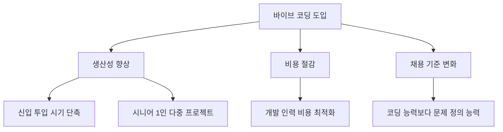

이 장에서는 바이브 코딩의 정의와 핵심 개념을 다룹니다. 바이브 코딩이 기존 개발 방식과 어떻게 다른지, 그리고 왜 지금 이 시점에 주목받고 있는지를 살펴봅니다.

# 1. 바이브 코딩은 무엇이고, 왜 지금인가?

<highlight>바이브 코딩은 SW 생산의 새로운 패러다임입니다.</highlight> **AI와 함께 대화하면서 코드를 생성**하고, **수정**하며, **실행**하는 방식입니다. 특히 이전처럼 코드를 직접 짜는 것이 아니라 AI 발전으로 '자연어'만으로 원하는 것을 만들 수 있게 되었습니다. 이 용어가 나온 이후에도 계속 그 의미가 변하고 있습니다. '수개월' 전까지만 해도 커서(Cursor)와 같은 AI툴을 사용하여 바이브 코딩을 하는 것이 당연했지만, 지금은 커서조차도 필요 없게 되었습니다.

## 1.1 AI 개발 능력

현재 AI는 일부 개발 능력에서 인간 수준의 임계점을 넘어섰다고 평가받습니다. 물론 여전히 많은 부분에서 인간 개발자의 역할이 필요하지만, AI가 상당 부분의 코딩 작업을 대체할 수 있는 능력을 갖추게 되었습니다. 일부 코드는 AI가 더 빠르고 정확하게 작성할 수 있습니다. 프롬프트만 잘 작성된다면 말이죠.

앞서 본 것처럼 클로드 코드는 한 번의 프롬프트로 수천 줄의 코드를 작성하여 작동하는 웹 애플리케이션을 생성합니다. 프롬프트가 견고하다면 시니어 수준의 결과물을 만들어 냅니다. 이제 클로드 코드는 더 이상 코드 조각을 생성하는 도구가 아닙니다. 서비스 전체에 가장 빠르고 프롬프트에 충실한 코드를 생성하는 도구입니다.

코드만 생성하는 것이 아닙니다. 코드 생성에는 필수적으로 따라오는 디버깅, 테스트, 배포까지 모두 처리할 수 있습니다. 특히 문서화 부분에서는 인간 개발자보다 더 뛰어난 결과물을 만들어내기도 합니다. 만들어진 코드나 SW를 MCP나 Claude Code Skills와 연결하여 자동화된 업무 프로세스를 구축할 수 있습니다.

## 1.2 AI 개발 외 능력

앞서 말한 것처럼 클로드 코드는 코드를 작성하는 능력 뿐만 아니라 문서를 이해하고 생성하는 능력도 뛰어납니다. 엑셀, 한글, 워드, PDF 뿐만 아니라 이미지 파일도 이해합니다. 이해하지 못하는 양식은 이해할 수 있도록 하는 SW를 만들어 이해하려고 노력합니다. 아래처럼 말이죠.

> "나는 2025 AI 컨퍼런스 문서를 작성해야해. 지금 내 컴퓨터 '사업문서' 폴더에 있는 문서 중에 2020년부터 지금까지 했던 모든 컨퍼런스 문서를 가지고 와서 2025년 AI 컨퍼런스 제안서를 작성해줘. 예산은 엑셀 파일로 별도로 정리해줘. 총 예산은 2,000만원이야. 특히 강사 숙박 관련해서 지난번에 좀 적었다는 피드백이 있어서 반영해서 작성해줘."

바이브 코딩을 하는 행위가 코드를 작성하는 행위를 벗어나 무언가를 작성하는 행위로 확장시킬 수 있습니다. 문서도 코드도 대규모 모델 입장에서는 모두 '텍스트'이기 때문입니다.

## 1.3 바이브 코딩이 미치는 영향

이렇게 되니 '생산성'뿐만 아니라 '비용', '채용' 여러 방면에 영향을 끼치게 됩니다. 예를 들어, 이전에는 신입 개발자가 들어오면 바로 코드를 작성하지 못하고 한동안 배워야 합니다. 그런데 클로드 코드로 인해 이 투입 시기가 매우 빠르게 앞당겨집니다. 시니어 개발자는 더 많은 생산성을 가지게 됩니다. 이전에 '시간'이 없어 개발하지 못했던 수많은 프로젝트를 혼자 처리할 수 있게 됩니다.

25년 위니브에서 바이브 코딩을 공식 도입한 후, 위니브의 주요한 변화는 다음과 같습니다. 생산성 향상 같은 것은 당연한 이야기이니 빼고, 조직의 변화를 중심으로 정리해보겠습니다.

1. 신입을 뽑을 때 이제 '바로 투입 가능'한 인력을 전제하고 뽑게 됩니다. 이력서를 받아보면 실무 수준의 포트폴리오를 가진 사람이 너무 많습니다. '그거 다 AI가 만든거에요!'라고 생각하시나요? 면접관 입장에서는 그것을 세세하게 이해했다는 것이 평가 기준이 아닙니다. 이해하지 못했다면 AI에게 물어보면 되기 때문입니다. 어떻게든 거기까지 해냈다는 것이 중요한 것이죠. '이해'와 '암기'가 가지는 인간의 경쟁력은 앞으로도 더 낮아질 것이라 봅니다.
2. 신입을 뽑을 이유가 많이 사라졌습니다. 'OO한 업무 때문에 인력이 더 필요하다'라는 요청이 이제 없습니다. 줄어든 것이 아니라 사라진 것이죠. 대부분의 업무는 AI가 처리할 수 있습니다. 회사 입장에서는 한 개인에게 의존하는 의존도가 더 높아졌습니다. 낮아질 것이라 생각을 하시겠지만, 한 사람이 처리할 수 있는 업무가 많아지면서 오히려 그 업무가 개인에게 종속되는 경향이 나타났습니다. 이는 장점과 단점 모두를 가지고 있습니다.
3. 한 사람이 TF 조직을 꾸릴 때, 이제 팀장급 인원이 필요 없습니다. 비용만 MAX로 지원해주면 됩니다. 인원도 최소한의 인원으로 모두가 AI Agent 조직을 관리하는 관리자로서 합류하게 됩니다. 그러다 보니 복잡한 의사결정의 과정이 사라지고, 실행 속도가 매우 빨라졌습니다. 다만, 이렇게 해서 나온 결과물에 가치 평가는 더욱 엄격해졌습니다.

기업 뿐이겠습니까? ICT 지식을 배우는 방식이 달라졌습니다. 창의성 병목이 해소되었고, 지식과 능력은 모두가 평균 이상으로 끌어올려졌습니다. 끌어올려지지 않는다면 도태되는 시대가 되었습니다. 위에서 언급한 신입사원 포트폴리오를 예로 들어보겠습니다. 이제는 모두가 평균 이상의 포트폴리오를 만들어 제출하기 때문에 그 이상을 만들어내지 못하면 변별력이 사라집니다. 모두가 평균 이상이 되는 시대, 이제는 '평균 이상'이 기본이 되는 시대가 되었습니다. 이를 '평균의 종말'이라고 부르기도 합니다.