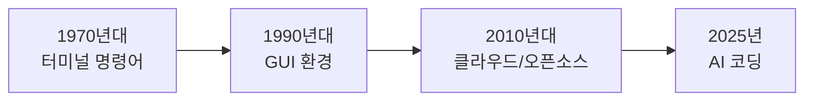
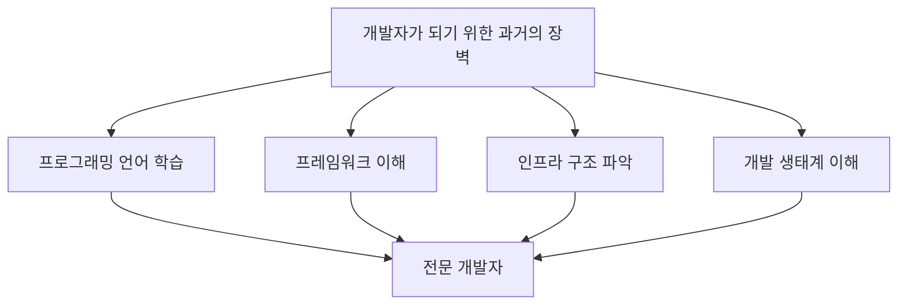
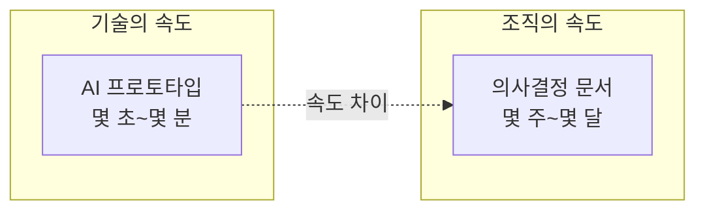

# 1. 빠르게 변하는 기술

1970년대, 터미널에서 명령어를 입력하던 시대가 있었습니다. 1990년대, 그래픽 기반 환경이 등장했습니다. 2010년대에는 클라우드와 오픈소스가 생태계를 재편했습니다.

그리고 2025년, 우리는 또 다른 변곡점에 서 있습니다. 챗지피티(ChatGPT)가 세상에 나온 지 불과 3년. 이 짧은 시간 동안 인공지능은 단순한 코드 자동완성 도구에서 완전한 애플리케이션을 생성할 수 있는 파트너로 진화했습니다. <highlight>이것은 이전의 변곡점들과는 차원이 다릅니다.</highlight>

깃헙 코파일럿(GitHub Copilot)이 코드 한 줄 한 줄을 제안하던 시절, 커서(Cursor)가 터미널과 코드 수정을 위해 허락을 요구하던 시절이 엊그제 같습니다. 그러나 이제 우리는 전혀 새로운 패러다임 속에 있습니다.

## 1.1 AI 코딩 도구의 진화

AI 코딩 도구는 빠르게 진화해왔습니다. 각 단계별 특징을 살펴보겠습니다.

| 단계 | 대표 도구 | 특징 |
| --- | --- | --- |
| 1세대 | GitHub Copilot | 코드 자동완성, 한 줄씩 제안 |
| 2세대 | Cursor | 파일 단위 편집, 컨텍스트 이해 |
| 3세대 | Claude Code | 프로젝트 전체 이해, 자율적 코드 생성 |

## 1.2 코드 작성의 민주화

<highlight>"코드 작성의 민주화"</highlight>

이전의 어떤 도구도 비전공자가 코드 작성의 장벽을 넘어서도록 돕지 못했습니다. 프로그래밍은 여전히 고도의 훈련을 요구하는 영역이었습니다. 숙련도가 높을수록 더 복잡한 프로젝트를 수행할 수 있었죠. 다양한 프로그래밍 언어를 습득하고, 복잡한 생태계를 이해하며, 인프라 구조를 파악하는 것은 누구에게나 버거운 과제였습니다. 이 모든 산을 넘어야만 비로소 개발자가 될 수 있던 시대가 있었습니다. 맞습니다. 이제 '있었습니다.' 이렇게 표현해야 합니다.

과거에 개발자가 되기 위해 넘어야 했던 장벽들을 정리해보겠습니다.

이 모든 장벽이 바이브 코딩으로 인해 낮아지고 있습니다. 물론 완전히 사라진 것은 아니지만, 진입 장벽이 크게 낮아진 것은 분명합니다.

## 1.3 변화의 속도와 적응

한편, 인간의 관점에서 이 변화를 살펴보겠습니다. 저 역시 AI 발전을 따라잡아야 한다는 압박감에 매일같이 새로운 소식을 찾아 읽었습니다. 그 피로감은 상당했죠.

> '또 나왔어?'

**회사 정보 공유 채널에 올려둔 뉴스 중 읽지 못한 것들이 산더미**처럼 쌓여 있습니다. 아마 동료들도 마찬가지일 겁니다.

빠르게 변화하는 기술 환경에서 느끼는 감정들을 정리하면 다음과 같습니다.

- **피로감**: 매일 쏟아지는 새로운 도구와 기술 소식
- **불안감**: 뒤처지는 것 같은 느낌
- **호기심**: 새로운 가능성에 대한 기대
- **기회**: 변화를 빠르게 수용하는 사람에게 열리는 문

# 2. 일하는 방식의 재정의

그런데 이번은 다릅니다.

<highlight>이번 변화는 단순한 기술 발전이 아닙니다. 이는 인간과 기계가 코드로 협업하는 방식의 근본적인 재정의입니다.</highlight> AI는 더 이상 우리가 작성한 코드를 보조하는 도구가 아닙니다. 우리의 아이디어를 직접, 즉각, 실행 가능한 형태로 변환하는 파트너가 되었습니다. 파트너라는 말로는 부족합니다. 다만 대체할만한 단어가 없기에 이 단어를 사용합니다.

## 2.1 기술과 조직의 속도 차이

여기서 **우리가 직면한 아이러니**가 있습니다. **기술은 거의 매달 새로운 모습**을 보여주는데, **우리 조직의 의사결정 구조는 여전히 이전에 머물러** 있습니다. **AI가 몇 초 만에 프로토타입**을 만들어내는데, **우리는 여전히 문제 해결을 위한 솔루션 개발이 아니라 경영진을 설득하는 문서**를 몇 주간 작성하고 있습니다. 이미 정착한 문화의 관성대로, 절차대로 개발해야 한다는 강박관념 때문에, 새로운 기술을 도입하고 있지 못합니다.

## 2.2 변화를 위한 질문

이 새로운 기술 앞에 질문해야 합니다.

> "나는, 우리는 얼마나 변화했는가?" "조직은 어떻게 변화해야 하는가?"

변화에 적응하기 위해 스스로에게 던져야 할 질문들입니다.

| 대상 | 질문 |
| --- | --- |
| 개인 | 새로운 도구를 배우는 데 얼마나 시간을 투자하고 있는가? |
| 팀 | 새로운 기술 도입에 대한 논의가 활발한가? |
| 조직 | 의사결정 프로세스가 기술 변화 속도에 맞게 유연한가? |
