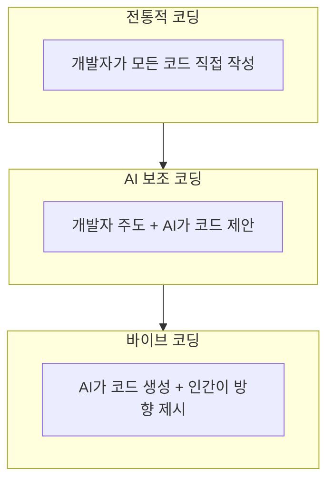

# 1. 바이브 코딩은 무엇이고, 왜 지금인가?

이 장에서는 바이브 코딩의 정의와 핵심 개념을 다룹니다. 바이브 코딩이 기존 개발 방식과 어떻게 다른지, 그리고 왜 지금 이 시점에 주목받고 있는지를 살펴봅니다.

<highlight>바이브 코딩은 SW 생산의 새로운 패러다임입니다.</highlight> **AI와 함께 대화하면서 코드를 생성**하고, **수정**하며, **실행**하는 방식입니다. 특히 이전처럼 코드를 직접 짜는 것이 아니라 AI 발전으로 '자연어'만으로 원하는 것을 만들 수 있게 되었습니다. 이 용어가 나온 이후에도 계속 그 의미가 변하고 있습니다. '수개월' 전까지만 해도 커서(Cursor)를 사용하여 바이브 코딩을 하는 것이 당연했지만, 지금은 커서조차도 필요 없게 되었습니다.

## 1.1 AI의 임계점

현재 AI는 임계점을 넘어섰다고 얘기합니다. 앞서 본 것처럼 클로드 코드는 한 번의 프롬프트로 수천 줄의 코드를 작성하여 완전한 웹 애플리케이션을 생성합니다. 이제 클로드 코드는 더 이상 코드 조각을 생성하던 도구가 아닙니다.

더 놀라운 것은 이것이 단지 코드에만 국한되지 않는다는 것입니다. 파일을 읽고, 씁니다. 소프트웨어가 없으면 만들어서 정보를 가져옵니다. MCP가 있다면 MCP도 연결할 수 있습니다. 얼마 전에는 Claude Code Skills라는 기능이 도입되어 손과 발 역할을 하게 할 수도 있습니다.

클로드 코드가 할 수 있는 작업들을 정리하면 다음과 같습니다.

| 작업 유형 | 설명 |
| --- | --- |
| **코드 생성** | 프롬프트 한 번으로 수천 줄의 코드 작성 |
| **파일 조작** | 파일 읽기, 쓰기, 수정 |
| **도구 생성** | 필요한 소프트웨어를 직접 만들어 사용 |
| **MCP 연결** | 외부 서비스와의 연동 |
| **Skills 활용** | 특정 작업을 위한 확장 기능 사용 |

## 1.2 실제 사용 예시

한국에서 많이 쓰이는 한글 문서를 예시로 들어보겠습니다.

> "지금 이 폴더에 있는 문서 중에 2020년부터 지금까지 했던 모든 컨퍼런스 문서를 가지고 와서 2025년 AI 컨퍼런스 제안서를 작성해줘. 예산은 엑셀 파일로 별도로 정리해줘. 총 예산은 OO원이야. 알맞게 구성해줘."

<highlight>이런 명령이 가능한 시대가 된 것입니다.</highlight>

## 1.3 바이브 코딩이 미치는 영향

이렇게 되니 '생산성'뿐만 아니라 '비용', '채용' 여러 방면에 영향을 끼치게 됩니다. 예를 들어, 신입 개발자가 들어오면 바로 코드를 작성하지 못하고 한동안 배워야 합니다. 그런데 클로드 코드로 인해 이 투입 시기가 매우 빠르게 앞당겨집니다. 시니어 개발자는 더 많은 생산성을 가지게 됩니다. 이전에 '시간'이 없어 개발하지 못했던 수많은 프로젝트를 혼자 처리할 수 있게 됩니다.

### 1.3.1 지식의 반감기 단축

5년 전 배운 리액트(React) 지식이 이제는 구식이 되었습니다. 3년 전 도입한 쿠버네티스(Kubernetes) 설정법도 마찬가지입니다. 그런데 이제는 그것조차 중요하지 않습니다. AI는 학습한 데이터 기반의 비교적 최신 버전, 최신 베스트 프랙티스를 알고 있습니다. 보통은 2~3년 전 데이터였는데 이제는 이 기간도 단축되어 6개월 전의 데이터는 알고 있습니다. <highlight>우리에게 필요한 것은 특정 기술의 세부사항이 아니라, 무엇을 만들고 싶은지를 명확하게 표현하는 능력입니다.</highlight>

### 1.3.2 창의성의 병목 해소

"아이디어는 있는데 만들 줄 몰라서..." 이 변명이 사라졌습니다. 디자이너가 백엔드 API를 만들 수 있고, 마케터가 데이터 대시보드를 구축할 수 있으며, CEO가 직접 프로토타입을 만들 수 있습니다. 기술적 장벽이 낮아지면서, 진짜 중요한 것은 '무엇을 만들 것인가'와 '왜 만들 것인가'가 되었습니다. <highlight>지금 위니브에서 가장 많은 웹 서비스를 만들고 있는 직군은 디자이너입니다.</highlight>

### 1.3.3 산업 구조의 재편

대기업들이 수천 명의 개발자를 고용하던 시대가 저물고 있습니다. 5명의 엔지니어가 AI와 함께 유니콘 기업을 만드는 사례가 등장하고 있습니다. 인스타그램이 13명으로 10억 달러 가치를 만들어낸 것이 놀라웠다면, 이제는 3명이 같은 가치를 만들어내는 시대가 올 것입니다.

| 시대 | 유니콘 기업 인력 구성 |
| --- | --- |
| 과거 | 수백~수천 명의 개발자 |
| 현재 | 수십 명의 개발자 + AI 도구 |
| 미래 | 소수의 AI 디렉터 + AI |

:::div{.callout}
2012년 인스타그램이 페이스북에 10억 달러에 인수될 때 직원 수는 13명이었습니다. 2021년 디스코드가 마이크로소프트와 120억 달러 규모의 인수 협상을 할 때 직원 수는 약 500명이었습니다. AI 시대에는 이러한 숫자가 더욱 줄어들 것으로 예상됩니다.
:::

### 1.3.4 글로벌 경쟁의 평준화

서울의 개발자와 실리콘밸리의 개발자 사이의 격차가 줄어들고 있습니다. 모두가 같은 AI 도구에 접근할 수 있기 때문입니다. <highlight>이제 경쟁력은 지역이나 학벌이 아닌, 얼마나 AI와 효과적으로 소통하고 협업할 수 있느냐에 달려 있습니다.</highlight>

## 1.4 지금이 바로 그 시점

우리는 인터넷 초창기와 같은 변곡점에 서 있습니다. 1995년에 웹사이트를 만들 줄 아는 사람이 얼마나 큰 기회를 잡았는지 기억하십니까? 2007년에 아이폰 앱을 만들 줄 아는 사람이 어떤 성공을 거두었는지 아십니까?

2025년 지금, 바이브 코딩을 잘 하는 사람이 바로 그 위치에 있습니다. 기술이 충분히 성숙했고, 도구가 준비되었으며, 시장이 열려 있습니다. 하지만 아직 대부분의 사람들은 이 변화를 완전히 이해하지 못하고 있습니다.

문제는 "AI가 내 일자리를 빼앗을까?"가 아닙니다. <highlight>진짜 질문은 "나는 AI와 함께 무엇을 창조할 수 있을까?"입니다.</highlight> 바이브 코딩은 단순한 개발 방법론이 아닙니다. 이것은 우리가 생각을 현실로 변환하는 새로운 언어입니다.

지금 이 순간, 우리 머릿속 아이디어가 몇 시간 후 실제로 작동하는 서비스가 될 수 있습니다. 이것이 바로 우리가 바이브 코딩을 배워야 하는 이유입니다.

## 1.5 전통적 코딩과 AI 보조 코딩, 바이브 코딩

세 가지 코딩 방식을 비교해보면 다음과 같습니다.

| 항목 | 전통적 코딩 | AI 보조 코딩 | 바이브 코딩 |
| --- | --- | --- | --- |
| **학습 곡선** | 매우 가파름 | 중간 | 완만함 |
| **개발 속도** | 느림 | 빠름 | 초고속 |
| **제어 정밀도** | 상당히 높음 | 높음 | 보통 |
| **창의성** | 개발자 한계 | 개발자 주도 | AI와 협업 |
| **비용** | 인건비 많음 | 인건비 중간 + 도구 | 인건비 적음 + 도구비용 많음 |
| **유지보수** | 직접 | 직접 | AI 지원 |

각 방식의 특징을 시각화하면 다음과 같습니다.

## 1.6 바이브 코딩의 핵심 원칙

바이브 코딩을 효과적으로 활용하기 위한 핵심 원칙을 정리하면 다음과 같습니다.

| 원칙 | 설명 |
| --- | --- |
| **명확한 의도 전달** | AI가 이해할 수 있도록 구체적이고 명확하게 요구사항 전달 |
| **반복적 개선** | 한 번에 완벽한 결과를 기대하지 않고 점진적으로 개선 |
| **검증과 테스트** | AI가 생성한 코드를 항상 검증하고 테스트 |
| **학습하는 자세** | AI와 협업하면서 지속적으로 새로운 기술과 방법 학습 |
| **안전 우선** | 민감한 데이터나 중요한 시스템에는 신중하게 접근 |

<highlight>바이브 코딩은 마법이 아닙니다. AI와의 효과적인 협업을 통해 생산성을 극대화하는 새로운 개발 방법론입니다.</highlight>