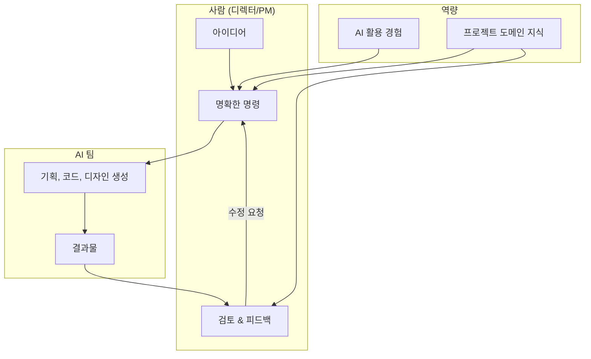
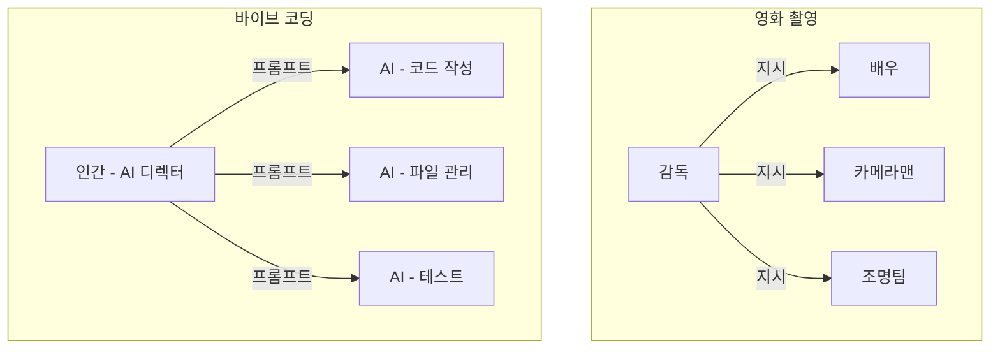
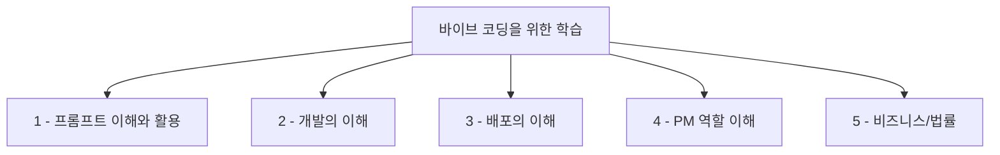

이 장에서는 AI가 코드를 생성하는 시대에 인간이 담당해야 할 역할이 무엇인지 살펴봅니다. 그 역할에 따라 어떤 역량을 학습하면 좋은지를 제안합니다.

# 1. 바이브 코딩을 위해 무엇을 왜 배워야 하는가?

<highlight>바이브 코딩을 하기 위해서는 디렉터 또는 프로젝트 매니저(PM)가 되어야 합니다.</highlight> AI는 더 발전할 것입니다. 곧 우리 개인이 할 수 있는 최상위 그룹의 결과물을 만들어 낼 것입니다. 그것도 매우 신속하게요. 그렇게 가정을 한다면 매우 똑똑한 직원들이 모여 있는 직원들이 있다고 생각하고 명확하게 명령을 내릴 수 있는 능력이 중요할 것입니다. AI 경험이 많을수록, 해당 프로젝트에 대해 아는 것이 많을수록 더 높은 수준의 결과물을 얻을 수 있습니다.



# 2. 바이브 코딩에서 AI와 사람의 역할

## 2.1 감독과 배우의 비유

굳이 비유까지 들어야 하나 싶지만, 여기서 말씀드려야 할 포인트가 하나 있기에 영화 촬영에 비유해보겠습니다. 여러분은 명령을 내리는 위치, 감독의 역할을 수행하게 될 것입니다. 감독은 직접 연기를 하지 않습니다. 감독은 카메라를 직접 조작하지 않습니다. 조명 장비를 설치하지도 않습니다. 감독은 전체 그림을 보고, 각 장면이 어떤 느낌이어야 할지 상세히 알아야 합니다. 여기서 중요한 포인트 중 하나는 각 구성원이 모두 '전체 그림'을 이해할 필요는 없다는 것입니다. 오늘만 출연하는 사람이 결말까지 알 필요는 없습니다. AI도 오늘 지시한 것에 필요한 것만 이해합니다. <highlight>항상 모든 코드를 다 읽어보고 다음 코드를 작성하는 것이 아닙니다.</highlight>



우리가 생각해봐야할 포인트는 아래와 같습니다.

1. (성장) 우리가 무엇을 배워야 하는가? 또는 어떤 역량을 길러야 하는가?
2. (채용, 취업) 우리가 채용할 때 어떤 역량을 가진 사람을 채용해야 하는가? 내가 어떤 역량을 길러야 채용이 될 것인가?
3. (프로젝트 관리) 프로젝트를 진행할 때 내가 어디까지 알아야 하는가?

## 2.2 AI의 간섭

예시와 다른 점도 있습니다. **간섭**입니다. 예를 들어, 영화 촬영에 있어 배우는 감독이 지시한 대로 연기하지만 각본이 이상하다고 하여 감독이 해야 할 지시를 직접 하지 않습니다. 그러나 바이브 코딩 툴은 다릅니다. **여러분의 지시가 불명확하면 단순 보조의 역할을 넘어섭니다.** 지시의 세부 사항을 다시 물어보지 않고 여러분이 채우지 않은 여백을 생성형 AI로 생성한 글로 채웁니다. 이것을 앞으로 간섭이라 부를 것입니다. 이러한 간섭이 많아질수록 여러분의 의도와는 먼 결과물이, 또는 의도 자체가 모호했기에 오히려 더 마음에 드는 결과물이 나올 수 있습니다. <highlight>불확실성이 커지는 것이죠.</highlight>

:::div{.callout}
AI의 간섭은 양날의 검입니다. 명확한 지시가 없을 때 AI가 스스로 판단하여 채워넣는 것이 때로는 좋은 결과를 가져오기도 하지만, 의도와 다른 방향으로 갈 수도 있습니다. 프로젝트의 중요도에 따라 지시의 명확성 수준을 조절해야 합니다. 기업이라면 항상 일정한 품질을 유지하기 위해 프롬프트 템플릿 라이브러리를 구축하여 셈플로 활용할 수 있도록 하는 것을 권해드립니다.
:::

예를 들어보겠습니다. 가벼운 프로젝트에서는 단지 '애플 느낌이 나는 바이브 코딩 랜딩 페이지를 만들어줘'라고 하는 것으로 족합니다. 그것만으로도 아래와 같은 결과물을 만들 수 있습니다.


이 '애플 느낌이 나는 바이브 코딩 랜딩 페이지를 만들어줘'라는 프롬프트에는 배경색이 어떻게 되고, 페이지는 어떤 페이지로 구성되어 있어야 하며, 로그인이나 로그아웃 등이 구현되어야 할지, 게시판이 있어야 할지, 반응형은 어떻게 해야 할지 등의 내용이 없습니다. 그럼에도 훌륭히 결과물을 만들어내죠.

만약 기획한 것도 없고, 호기심에 시작한 프로젝트라면 그럭저럭 만족스러운 결과물일 수 있습니다. 그런데 만약 회사 내에서 개발한 프로젝트였다면 어떨까요? 회사 로고가 들어가야 하고, 회사 메인 컬러가 들어가야하며, 회사에서 사용하고 있는 카드 스타일 등이 반영되어야 할 것입니다. 통합 로그인과 로그아웃도 연동이 되어야하고, 회사 정보도 있어야 할 것입니다. 

따라서 우리는 프로젝트의 중요도에 따라 프롬프트의 구체성을 조절할 필요가 있습니다. 프롬프트의 구체성이란, 프롬프트에 담긴 요구사항의 상세함을 뜻합니다. 적어도 프롬프트를 어떻게 작성해야 하는지에 대한 이해와 전략이 필요합니다.

## 2.3 전략 없는 개발의 위험성

가벼운 랜딩 페이지 정도는 전략 없이도 개발할 수 있습니다. 다만 프로젝트의 규모가 조금만 커지면 전략 없이 개발하는 것의 위험성이 커지게 됩니다. 예시를 들어보겠습니다.

1. 여러분이 '로그인을 구현해줘'라고 한다면 클로드 코드는 여기에 로그인 서비스를 붙이기 위해 다른 백엔드 언어를 도입할 것입니다. 
2. 백엔드 언어가 도입되었으니 실행하는 법을 별도로 알아야 합니다. 여러분은 '실행하는 법을 정리해줘'라고 말할 것입니다. 실행하다보니 회원 목록을 관리할 수 있는 페이지가 필요하다는 사실을 인지하게 되었습니다. '관리자 페이지를 만들어줘'라고 요청합니다.
3. 게시판을 도입합니다. '게시판 기능을 추가해줘'라고 말합니다. 관리자 페이지에서 회원 관리 뿐만 아니라 게시판 관리를 할 수 있게 '게시판 관리를 관리자 페이지에서 할 수 있게 해줘'라고 요청합니다. 

이렇게 설계 없이도 결과물은 나올 수 있습니다. 다만, 이 과정이서 처음에 기획했던 목적에 부합하지 않은 기술 스택을 중간에 클로드 코드가 도입을 한다던지, 데이터베이스에 있는 데이터를 한 번 더 추가한다던지 하는 문제가 발생할 수 있습니다. 유지보수는 사람도, AI도 힘들어집니다.

클로드 코드 바이브 코딩 부트캠프 2기에서 실제 있었던 일입니다. 게시판은 Flask로, 로그인은 FastAPI로 만들어져 있었습니다. 코딩을 처음 해보시는 분이었죠. 동작하는 것이 신기한 조합이었습니다. 지금 Flask나 FastAPI라는 용어가 중요한 것은 아닙니다. 중요한 것은 개발자라면 누구라도 이렇게 개발하진 않았을 것이라는 점이죠.

좀 더 쉽게 설명하자면 고객이 '가'라는 음식점에 가서 음식을 주문했습니다. 그런데 음료수는 '나'라는 음식점에서, 고기는 '다'라는 음식점에서, 야채는 '라'라는 음식점에서 서빙하는 상태가 된 것입니다. 음식만 '가'라는 음식점에서 먹게 된 것이죠. 이러면 운영자는 '가', '나', '다', '라' 이 모든 음식점을 개업한 상태여야 합니다. '가'라는 음식점이 다 할 수 있는데 말이죠.

:::div{.callout}
이런 상황을 방지하려면 처음부터 코드를 작성하기 전에 자신의 상황을 설명하고 어떠한 전략을 가지고, 어떻게 질문할 것인지 물어보는 것이 좋습니다. 답변 온 것들 중 모르는 것이 있다면 하나하나 물어봐 가면서 명령을 내리기 이전에 최대한 상세히 쓰려는 노력을 하는 것이 좋습니다. 그리고 가능하다면 '개발해줘'가 아니라 실제 개발 명령어, 코드를 작성하게 하고, 직접 하나씩 실행해보시는 것을 권해드립니다.
```markdown
나는 회사 내에서 사용할 수 있는 가벼운 사내 게시판을 만들고 싶어. 나는 개발을 전혀 모르는 사람이야. 이 게시판을 만들기 위한 최적의 기술 스택과 개발 전략을 제안해주고, 그 이유에 대해서도 알려줘. 또한 이 게시판을 더 잘 만들기 위한 프롬프트 템플릿도 제안해줘.
```
:::

## 2.4 메이커인 동시에 학습자

왜 이런 일이 발생이 되었을까요? AI는 항상 모든 코드를 '전부' 읽지 않습니다. 필요한 코드를 찾고, 해결책이 그 코드 안에서 만들어지면, 다른 코드는 생각하지 않습니다. 앞에서 영화에 비유한 것처럼 오늘 하루 연기하시는 분이 결말까지 알 필요는 없는 상태인 것이죠.

<highlight>따라서 우리에게 전체를 보는 눈이 필요합니다.</highlight> 따라서 적어도 한 번의 프로젝트는 AI 도움을 받아 기술 스택을 선정하고, 코드를 따라서 타이핑 해보며 결과물을 만드는 경험이 필요합니다. 그리고 가능하다면 폭넓은 경험이 필요합니다. 어느 프로젝트에 어떤 기술이 합당한지, 나에게 좀 더 맞는지 판단하기 위해서는 적어도 한 번은 경험을 해보는 것이 좋습니다.

다만 모든 것을 다 깊이 알 필요는 없습니다. 우리의 생성형 AI 활용은 코드를 생성하는 것 외에도 코드를 배우는 것에도 쓸 수 있기 때문입니다. 집요하게 물어보고, 적정 기술인지 확인하고, 지금 이 프로젝트에 도입했을 때 내 수준에서 운영이 가능한지 등을 물어가며, 배워가며 개발할 수 있습니다.

<highlight>**메이커인 동시에 학습자**이며, **프로젝트 매니저인 동시에 프로젝트 멤버**가 되는 상황을 맞이하게 되는 것입니다.</highlight>

# 3. 무엇을 공부해 나가야 하는가?

아무것도 모르고 시작할 수도 있지만, 알면 더 견고한 결과물을 제작할 수 있습니다. 앞으로도 그럴까요? 만약 지금보다 AI가 2~3배 뛰어나진다면, 아무것도 모르고도 원하는 결과물까지 만들 수 있지 않을까요? 그러니 배울 필요가 없지 않을까요? AI 발전 속도가 매우 빠르기 때문에 우리는 기술 발전 속도를 감안하여 학습을 시작할 필요가 있습니다.

아래 나열한 몇 가지는 그러한 사항을 가정한 것이기 때문에, 논리적 허점이 있거나 당위성이 부족하다 생각이 된다면 여러분들만의 공부 방법으로 공부를 하시는 것을 권합니다. 특히 이 책을 읽는 시점에서의 AI는 지금 제가 쓰고 있는 AI와 의미가 다를 수 있기에 현재 AI 수준에 맞춰 고민해보시면 좋을 것 같습니다.



## 3.1 프롬프트 이해와 활용

첫 번째로, 바이브 코딩을 위한 프롬프트를 공부해야 합니다. 아무리 AI가 대단해진다고 해도 프롬프트 한 줄로 내가 원하는 결과물을 만들 수는 없습니다. 이는 기술적인 문제가 아닙니다. 내가 원하는 것을 나도 알지 못하는 상태에서 막연하게 요구사항을 제시한다면 앞서 얘기한 AI 간섭이 커질 수 밖에 없습니다. 기술의 문제가 아니라 요구사항 구체화 문제인 것이죠.

두 번째로, 프롬프트로 어떻게 지시해야 하는지에 대한 전략이 필요합니다. 이러한 내용은 프롬프트 엔지니어링이라는 제목으로 이 책에서 다루고 있습니다. 종이책으로 보시는 분들은 이 챕터가 없습니다. 아래 링크를 참고해주세요.

* 링크: https://www.books.weniv.co.kr/essentials-vibecoding/chapter04

세 번째로, 프롬프트로 어떻게 '제약'사항을 줄 것인지에 대한 학습이 필요합니다. 이러한 학습은 단지 만드는 것에 그치지 않습니다. 무엇을 하지 말아야 하는지도, 위험 회피는 어떻게 하는지 등의 프롬프트 기법들이 제시되어야 합니다. 예를 들어, 코드는 수정해도 되돌릴 수 있으니 괜찮지만 데이터베이스는 그렇지 않은 경우도 많습니다. 특히 실 사용이 되고 있는 서비스라면 더욱 그렇습니다. 이러한 명확한 권한 구분이 없다면 오히려 생산성을 저하시킬 수도 있습니다.

개발에 있어 프롬프트를 배워야 하는 중요성을 나열하자면 이 세 가지 뿐만 아니라 더 있겠지만 우선은 이 세 가지를 중심으로 공부를 해나가시면 좋을 것 같습니다. 요약하자면 아래와 같습니다.

1. 요구사항 구체화 해서 원하는 결과물 얻기(바이브 코딩을 위한 요구사항 명세 작성)
2. 프롬프트 엔지니어링 전략(효과적인 프롬프트 작성법)
3. 제약사항 부여(위험 회피 및 권한 구분)

## 3.2 코드 이해

만들어진 코드를 어느 정도는 이해할 수 있어야 합니다. 가벼운 랜딩 페이지 정도라 하더라도 이해하고 쓰는 것과 모르고 쓰는 것은 프롬프트 작성과 유지보수에 차이가 큽니다. 예를 들어, 태그를 알고, 개발자도구를 열고, 콘솔을 확인하는 등의 기본적인 학습이 되지 않은 상태에서는 프롬프트를 명확하게 작성하기 어렵습니다.

개발자라 한다면 AI가 개발한 그대로를 반영하지 않고 적어도 리뷰 정도는 해보아야 합니다. 그렇지 않으면 유지보수하는 시간이 길어져 오히려 프로젝트 총 투입 시간은 더 들 수도 있습니다.

:::div{.callout}
코드를 완벽히 이해할 필요는 없습니다. 하지만 "이 부분이 어떤 역할을 하는지", "이 오류가 왜 발생했는지" 정도는 파악할 수 있어야 AI에게 적절한 수정 지시를 내릴 수 있습니다.
:::

## 3.3 배포 이해

배포에 대한 이해가 필요합니다. 배포는 실제 사용자가 서비스를 이용할 수 있도록 하는 과정입니다. 코드를 작성해서 내 컴퓨터에서 실행하는 것과, 다른 사람이 인터넷을 통해 접속할 수 있도록 하는 것은 다릅니다. 배포 과정에서는 서버 설정, 도메인 연결, SSL 인증서 설치, 데이터베이스 설정 등 다양한 작업이 필요합니다.

물론 이러한 복잡한 절차를 자동화하고 간소화하는 AI 기반의 도구들이 계속 나오고 있습니다. 이러한 도구를 AI 풀스택 도구라고 합니다. 구글에 firebase studio가 대표적인 도구죠. '그럼 배포도 안배워도 되지 않을까?'라는 생각이 들 수 있습니다. 그러나 AI를 통한 배포에 대한 자동화는 아직까지 어려운 문제들이 산적해 있습니다. 예를 들어, 모든 것을 다 해주는 AI 도구가 나온다고 해도, 그 도구가 지원하는 플랫폼에 종속될 가능성이 큽니다. 만약 여러분의 프로젝트가 그 플랫폼에서 지원하지 않는 기능을 필요로 한다면, 여러분은 여전히 배포 과정을 직접 관리해야 할 것입니다. 이것 말고도 지역 제한의 문제, 보안 요구사항의 문제, 비용 문제, 유지보수의 문제 등 다양한 문제로 인해 아직까지는 배포에 대한 기본적인 이해가 필요합니다.

## 3.4 PM 역할 이해

프로세스와 구조 등 PM이 하는 역할에 대한 이해가 필요합니다. 앞서 우리는 디렉터의 역할을 한다고 말씀드렸습니다. 따라서 PM이 하는 역할에 대한 이해가 되면, 좀 더 수월하게 AI와 업무를 할 수 있습니다. 스토리보드, 프로토타입, 웹 기획서, 디자인 등 각 단계별 산출물도 정리해두면 보다 견고한 프로세스를 정립할 수 있습니다. 다만 이 부분은 획일적인 정답이 없습니다. 이러한 단계를 거치지 않고, 요구사항 명세만으로도 충분히 수준 높은 결과물을 만들어 낼 수 있습니다.

## 3.5 비즈니스와 법률 이해

만약 창업을 하실 분들이라면 비즈니스와 법률 이해가 필요합니다. 이 부분은 이 책에서 다루지 않는 부분입니다. 가벼운 토이 프로젝트를 하실 분이면 상관이 없지만 실제 서비스로 런칭하기 위해서 알아야 할 필수 지식들이 있습니다. 예를 들어, 채팅 서비스를 만들고 개발자가 채팅을 들여다보면 안 되겠죠? 해당 데이터는 암호화되어 있어야 할 것입니다. 이러한 법률적인 지식까지 이 책에서 모두 다루진 않습니다. 개인정보보호법, 정보통신망법 등 다양한 한국의 법을 이해하고, 런칭해야 합니다.

:::div{.callout}
비즈니스 모델 등도 이 책에서 다루지 않습니다. 이 책은 '창업'을 위한 책이 아니라 '바이브 코딩'을 위한 책입니다. 물론 바이브 코딩으로 만든 서비스로 창업을 할 수 있습니다. 하지만 창업에는 기술 외에도 시장 분석, 고객 발굴, 투자 유치, 팀 빌딩, 마케팅 전략 등 수많은 요소가 필요합니다. 이런 부분들은 별도의 창업 관련 서적이나 강의를 통해 학습하시기를 권합니다.
:::

# 4. 책에서 다루는 것

이 책은 위에서 언급한 것 중 서비스를 만드는 것에 집중합니다. 비개발자나 개발자가 아이디어를 실제 작동하는 서비스로 구현하는 과정, AI와 효과적으로 협업하는 방법, 프로젝트를 체계적으로 관리하는 노하우를 다룹니다.

또한 이 책은 단지 Claude Code의 사용법뿐만 아니라 AI가 지금보다 2배, 3배 더 일을 잘할 수 있는 환경을 가정해서 협업할 수 있는 부분을 작성하려 노력하였습니다. AI의 발전 속도는 너무나 빨라서 책이 출간되면 시장의 강자가 바뀌어 있을 수 있습니다. 또한 터미널이 아니라 무언가 대체되는 대체물이 나올 가능성이 있습니다. 브라우저나, VSCode의 Extension이요. 이러한 상황을 염두하고 글을 써내려갔습니다.

<highlight>지금보다 AI가 2~3배 더 좋아진다면 개발자든, 개발자가 아니든 AI와 소통하는 방법이 매우 중요해질 것입니다.</highlight> 소통하는 방법은 결국 프롬프트입니다. 앞으로 AI가 더 발전하게 되면 생산된 코드의 자산가치가 급격히 하락하고 이를 만들게 했던 프롬프트의 가치가 올라가는 시대가 올 것이라 생각합니다.