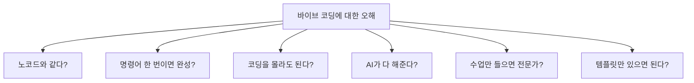
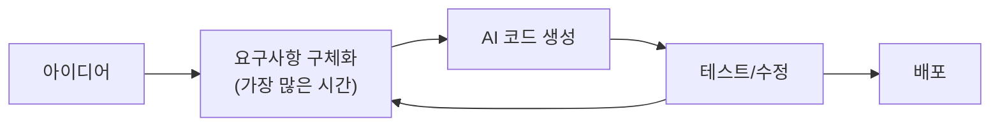
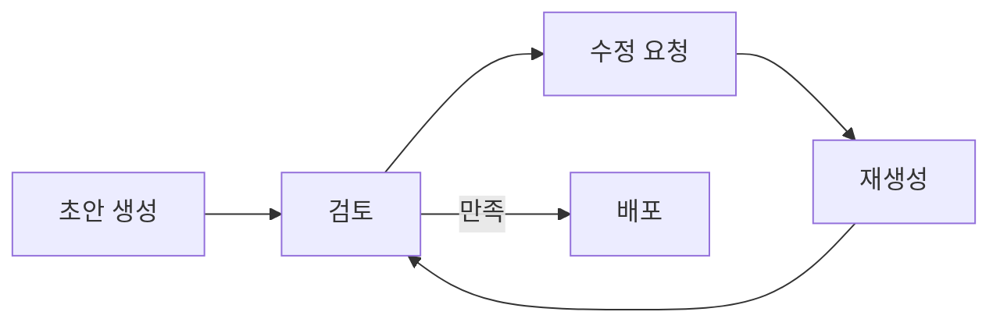
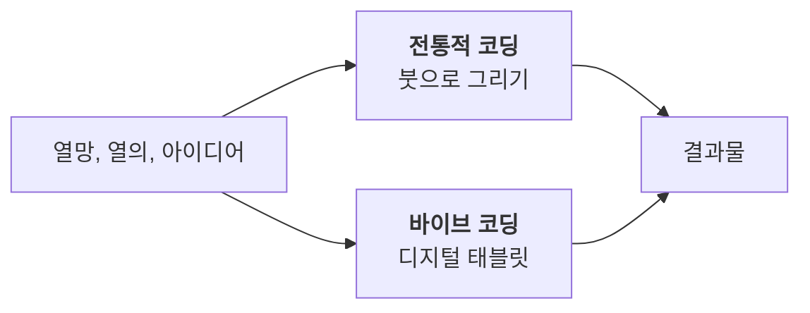

이 장에서는 바이브 코딩에 대한 흔한 오해들을 짚어보고, 현실적인 기대치를 설정하는 데 도움을 드립니다. 과대 포장된 기대나 근거 없는 두려움 없이, 바이브 코딩의 실체를 명확하여 할 수 있는 업무의 범위를 이해하는 것을 목표로 합니다.

# 1. 바이브 코딩에 대한 오해

새로운 기술이 등장할 때마다 우리는 극단적인 기대와 우려를 동시에 품게 됩니다. 바이브 코딩(Vibe Coding) 역시 예외는 아닙니다. AI와 함께 코딩하는 이 새로운 패러다임에 대해 많은 분들이 궁금해하시는 동시에, 여러 오해를 갖고 계신 것을 봅니다. 부트캠프를 운영하며 가장 자주 받았던 질문들을 통해, 바이브 코딩의 실체를 명확히 들여다보겠습니다.

## 1.1 바이브 코딩은 노코드 아닌가요?

가장 흔한 오해입니다. 노코드(No-code)나 로우코드(Low-code) 플랫폼은 드래그 앤 드롭 방식으로 시각적 인터페이스를 통해 애플리케이션을 만듭니다. 코드를 전혀 보지 않거나 최소한만 다루죠.

<highlight>반면 바이브 코딩은 정반대입니다.</highlight> AI와 대화하면서 **엄청난 양의 코드를 생성**하는 행위입니다. 여러분은 필요에 따라 생성된 코드를 읽고, 이해하고, 수정해야 합니다. 어떤 면에서는 전통적인 코딩보다 더 많은 코드를 다루게 될 수도 있습니다. 다만 그 코드를 한 줄 한 줄 타이핑하는 대신, AI와의 협업을 통해 빠르게 생성하고 수정한다는 점이 다를 뿐입니다.

| 구분 | 노코드/로우코드 | 바이브 코딩 |
| --- | --- | --- |
| **코드 접촉** | 거의 없음 | 매우 많음 |
| **인터페이스** | 시각적 드래그 앤 드롭 | 자연어 대화 |
| **생성 방식** | 미리 만들어진 블록 조합 | AI가 코드 생성 |
| **유연성** | 제한적 | 높음 |

## 1.2 명령어 한 번이면 뚝딱 완성되는 거 아닌가요?

앞에 AI 간섭 부분에서 말씀 드린 것처럼 스스로도 만들 결과물에 대한 모호성이 구체화 되지 않았기 때문에 그런 일은 일어나지 않습니다. 모호성이 있으면서도 기대치가 있는 경우는 더욱 그러할 것입니다.

물론 뚝딱 완성되는 결과물이 없지 않습니다. 아주 간단한 웹페이지나 기본적인 기능을 구현하는 데에는 AI가 생성한 코드를 바로 사용할 수 있을 것입니다. 하지만 대부분의 실제 프로젝트에서는 여러 번의 수정과 검토가 필요합니다. 만약 조금이라도 큰 서비스를 '뚝딱' 만들 수 있다면 그것은 대부분 예쁜 시연용 데모일 가능성이 큽니다. 그것은 AI가 만들어낸 코드 품질 때문이 아니라, 시장상황, 기획의도, 비즈니스 요구사항, 유지보수, 사용자 경험, 보안 등 다양한 요소를 충분히 반영하지 못했기 때문입니다. 그렇기에 앞으로도 이러한 부분은 강조될 가능성이 큽니다.

<highlight>특히 "무엇을 만들어야 할지 구체화하는 과정"에 가장 많은 시간이 들어갑니다.</highlight> 이는 AI가 대신해줄 수 없는, 인간의 창의성과 판단이 필요한 영역입니다.

## 1.3 코딩을 전혀 몰라도 되는 거네요?

이 질문에 대한 답은 "어느 정도 수준을 원하느냐"에 달려 있습니다.

간단한 랜딩 페이지나 기본적인 웹사이트라면 코딩 지식 없이도 만들 수 있을 것입니다. 하지만 조금만 복잡도가 올라가도 상황이 달라집니다. 코딩 지식이 있어야 AI가 생성한 코드를 이해하고, 문제를 진단하고, 정확한 수정 지시를 내릴 수 있습니다.

예를 들어보겠습니다. "버튼을 빨간색으로 바꿔줘"라고 막연히 요청하는 것보다, "btn 클래스의 background-color 속성을 `#FF0000`으로 변경해줘"라고 구체적으로 지시하는 것이 훨씬 효과적입니다. 또한 이러한 간단한 수정이라면 지시를 하는 것보다 직접 수정하는 것이 정확하고 토큰도 아낄 수 있으며 빠릅니다. <highlight>코딩 지식이 있을수록 AI와의 소통이 명확해지고, 원하는 결과를 빠르게 얻을 수 있습니다.</highlight>

| 프로젝트 | 필요한 코딩 지식 |
| --- | --- |
| 간단한 랜딩 페이지 | 거의 없어도 가능 |
| 기본 웹사이트 | HTML/CSS 기초 |
| 데이터베이스 연동 | 백엔드 기초 이해 |
| 실제 서비스 운영 | 아키텍처/보안 이해 |

## 1.4 AI가 알아서 다 해주는 거죠?

안타깝게도 그렇지 않습니다. AI가 처음 생성한 결과물을 보면 대부분 실망하실 겁니다. "이게 뭐야?"라는 생각이 들 정도로 엉성할 수 있습니다.

<highlight>바이브 코딩은 반복적인 개선 과정입니다.</highlight> 위 1.2에서 보았던 단계 그래프에서 `요구사항 구체화 - AI 코드 생성`에는 아래와 같은 단계가 더 들어갑니다. 초안을 받고, 수정하고, 다시 요청하고, 또 수정하는 과정을 거쳐야 합니다. 이 작업은 때로 지난하고, 인내심이 필요한 작업입니다. 위니브에 한 디자이너도 이 작업에서 새벽까지 간단한 작업 하나가 수정이 안되어 헬프가 왔던 적이 있습니다. 다시 요청을 반복해도 실수를 반복하고, 해결을 못하는 경우도 많습니다. 개발 지식이 없다면, 결국 이 과정이 꽤나 고통스러울 수 있습니다.

더 나아가, 완성된 코드를 실제 사용자들이 접속할 수 있도록 서버에 배포하는 과정, 도메인을 연결하는 작업, 데이터베이스를 설정하는 일 등은 여전히 여러분이 직접 해야 할 일입니다. 여러분은 이 프로젝트의 주인으로, 디렉터로, 프로젝트 매니저로 여러 업무 중 필요한 업무를 명확하고, AI의 특성을 이해한 상태에서 정확하게 "명령"을 내릴 수 있어야 합니다.

## 1.5 수업만 들으면 바로 전문가가 되나요?

생각보다 많이 질문을 받았던 질문이라 여기에 올려봅니다. 위니브는 컴퓨터학원으로 먼저 출발했는데요. 이것은 마치 "방학 동안에 파이썬 배우면 파이썬 마스터 할 수 있나요?"라는 질문과 비슷합니다. 피아노 학원에 다닌다고 상상해보세요. 일주일에 한 번 레슨을 받지만, 집에서 전혀 연습하지 않는다면 실력이 늘까요? 당연히 아닙니다.

SW 개발 생태계는 생각보다 복잡하고, 다양한 기술 스택과 도구들이 얽혀 있습니다. 이 복잡함을 어림잡고, 다양한 기술 스택 도구들이 어떤 역할을 하는지 이해하는 것만으로도 많은 시간이 걸립니다. 바이브 코딩은 앞서 말씀드린 것처럼 수 많은 코드를 빠르게 생성하고, 수정하는 행위입니다. 이 코드를 어렴풋이 이해하고, 원하는 방향으로 이끌어가며, 문제가 생겼을 때 해결하는 능력은 하루 아침에 생기지 않습니다.

여기서는 기본기를 다룹니다. 음악학원에 다시 비유를 해보자면 악보 보는 법과 악기를 다루는 방법 등을 반복적이고 체계적으로 가르쳐드립니다. 이러한 방법들은 때론 너무 장황하거나 내가 알 필요가 없는 지식이라고 느껴질 수도 있습니다. 그러나 여러 프로젝트를 해보고, 실패하고, 다시 시도하는 과정에서 필요한 기본기가 될 것입니다.

## 1.6 프롬프트 템플릿 가져다 쓰면 바로 사용할 수 있네요?

이렇게 말씀 드려도 결국 수업에서 진행하는 프롬프트 또는 회사에서 사용하는 프롬프트는 정해져 있습니다. 그렇다면 수업에서 진행하는 프롬프트를 그대로 가져와서 쓰거나, 위니브에서 사용하고 있는 프롬프트를 그대로 가져다 쓰면 비슷한 결과물을 그대로 만들 수 있다고 생각하시는 분들이 있습니다.

물론 그럴 수도 있지만 대부분의 경우는 그렇지 않습니다. 개인의 지식 수준, 조직의 개발 문화, 프로젝트의 성격 등 프롬프트 안에 담긴 여러 요소들이 다르기 때문입니다. 어떠한 구조로 이뤄지는지 참고할 수는 있지만 완전히 동일한 결과물을 얻기는 어렵습니다. 다만, 우리는 쉽게 시작할 수 있는 출발점을 제공할 뿐입니다.

프롬프트 템플릿이 정교하면 정교할수록 더욱 그렇습니다. 위니브는 모든 프로젝트에 claude 라는 폴더를 만들어 이곳에 프롬프트를 저장하는데요. 기획부터 배포까지 수백개의 프롬프트 셈플이 있음에도 불구하고, 개개인이 사용하는 프롬프트가 다릅니다. 이런 상황을 보았을 때 프롬프트를 가져다 쓰는 것은 마치 남의 코드를 복사해서 붙여넣는 것과 같다고 생각이 듭니다. 처음에는 큰 도움이 될 수 있고, 그렇게 하는 것이 나쁜 방식도 아니지만, 결국에는 자신만의 스타일과 방식을 찾아야 합니다.

# 2. 바이브 코딩의 현실적인 기대치 설정

<highlight>바이브 코딩은 마법이 아닙니다.</highlight> 개발자를 대체하는 기술도 아니고, 코딩을 몰라도 되게 만드는 지름길도 아닙니다. 오히려 AI 시대에 맞는 **새로운 개발 방법론**입니다.

전통적인 코딩이 붓으로 그림을 그리는 것이라면, 바이브 코딩은 디지털 태블릿으로 여러 자동화된 도형그리기, 보정 기능 등을 통하여 그리는 것과 같습니다. 도구는 바뀌었지만, 그림을 그리는 본질적인 능력과 창의성은 여전히 필요합니다.

이러한 현실적인 이해를 바탕으로 바이브 코딩에 접근한다면, 분명 강력한 무기가 될 것입니다. 과도한 기대도, 근거 없는 두려움도 내려놓고, 새로운 도구를 익히는 즐거움을 느껴보시기 바랍니다.

## 2.1 오해와 현실 한눈에 보기

앞서 다룬 오해들과 현실을 한눈에 정리하면 다음과 같습니다.

| 오해 | 현실 |
| --- | --- |
| 노코드와 같다 | 오히려 더 많은 코드를 다루게 됨 |
| 명령어 한 번에 완성 | 반복적인 개선 과정 필요 |
| 코딩 지식 불필요 | 복잡한 프로젝트일수록 지식 필요 |
| AI가 다 해준다 | 검토, 수정, 배포는 인간의 몫 |
| 수업만 들으면 전문가 | 개인 연습이 필수 |
| 템플릿만 있으면 됨 | 상황에 맞게 커스터마이징 필요 |