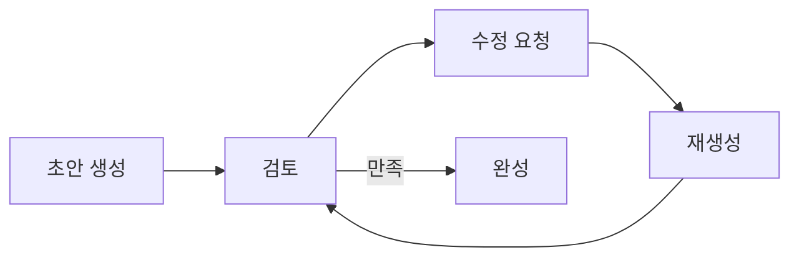
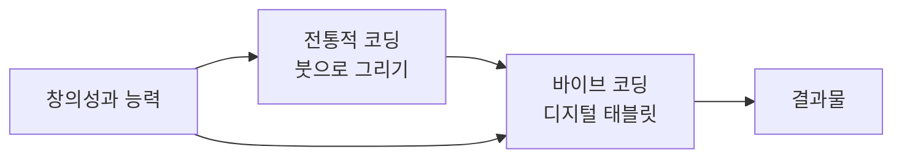

# 1. 바이브 코딩에 대한 오해

이 장에서는 바이브 코딩에 대한 흔한 오해들을 짚어보고, 현실적인 기대치를 설정하는 데 도움을 드립니다. 과대 포장된 기대나 근거 없는 두려움 없이, 바이브 코딩의 실체를 명확히 이해하는 것이 중요합니다.

새로운 기술이 등장할 때마다 우리는 극단적인 기대와 우려를 동시에 품게 됩니다. 바이브 코딩(Vibe Coding) 역시 예외는 아닙니다. AI와 함께 코딩하는 이 새로운 패러다임에 대해 많은 분들이 궁금해하시는 동시에, 여러 오해를 갖고 계신 것을 봅니다. 부트캠프를 운영하며 가장 자주 받았던 질문들을 통해, 바이브 코딩의 실체를 명확히 들여다보겠습니다.

## 1.1 바이브 코딩은 노코드 아닌가요?

가장 흔한 오해입니다. 노코드(No-code)나 로우코드(Low-code) 플랫폼은 드래그 앤 드롭 방식으로 시각적 인터페이스를 통해 애플리케이션을 만듭니다. 코드를 전혀 보지 않거나 최소한만 다루죠.

<highlight>반면 바이브 코딩은 정반대입니다.</highlight> AI와 대화하면서 **엄청난 양의 코드를 생성**하는 행위입니다. 여러분은 생성된 코드를 읽고, 이해하고, 수정해야 합니다. 어떤 면에서는 전통적인 코딩보다 더 많은 코드를 다루게 될 수도 있습니다. 다만 그 코드를 한 줄 한 줄 타이핑하는 대신, AI와의 협업을 통해 빠르게 생성하고 수정한다는 점이 다를 뿐입니다.

| 구분 | 노코드/로우코드 | 바이브 코딩 |
| --- | --- | --- |
| **코드 접촉** | 거의 없음 | 매우 많음 |
| **인터페이스** | 시각적 드래그 앤 드롭 | 자연어 대화 |
| **생성 방식** | 미리 만들어진 블록 조합 | AI가 코드 생성 |
| **유연성** | 제한적 | 높음 |

## 1.2 명령어 한 번이면 뚝딱 완성되는 거 아닌가요?

영화에서나 나올 법한 이야기입니다. "AI야, 쇼핑몰 하나 만들어줘"라고 했더니 완벽한 서비스가 짠! 하고 나타나는 일은 일어나지 않습니다.

바이브 코딩은 개발 시간을 1/30에서 1/50 정도로 단축시킬 수 있습니다. 하지만 이것은 '완성품'이 아닙니다. 여러분이 생각하는 완성품을 만들기 위해서는 여러분도 제대로 된 명령을 내려야 합니다. AI는 여러분의 마음을 읽을 수 없고, 비즈니스 요구사항을 완벽히 이해할 수도 없습니다.

예를 들어, 저희가 운영하는 '위니북스'라는 서비스는 원래 6개월짜리 프로젝트였습니다. 바이브 코딩을 활용했다고 해서 이것을 2~3일 만에 뚝딱 만들 수는 없었습니다. <highlight>특히 "무엇을 만들어야 할지 구체화하는 과정"에 가장 많은 시간이 들어갑니다.</highlight> 이는 AI가 대신해줄 수 없는, 인간의 창의성과 판단이 필요한 영역입니다.

## 1.3 코딩을 전혀 몰라도 되는 거네요?

이 질문에 대한 답은 "어느 정도 수준을 원하느냐"에 달려 있습니다.

간단한 랜딩 페이지나 기본적인 웹사이트라면 코딩 지식 없이도 만들 수 있을 것입니다. 하지만 조금만 복잡도가 올라가도 상황이 달라집니다. 코딩 지식이 있어야 AI가 생성한 코드를 이해하고, 문제를 진단하고, 정확한 수정 지시를 내릴 수 있습니다.

예를 들어보겠습니다. "버튼을 빨간색으로 바꿔줘"라고 막연히 요청하는 것보다, "btn 클래스의 background-color 속성을 `#FF0000`으로 변경해줘"라고 구체적으로 지시하는 것이 훨씬 효과적입니다. <highlight>코딩 지식이 있을수록 AI와의 소통이 명확해지고, 원하는 결과를 빠르게 얻을 수 있습니다.</highlight>

| 프로젝트 복잡도 | 필요한 코딩 지식 |
| --- | --- |
| 간단한 랜딩 페이지 | 거의 없어도 가능 |
| 기본 웹사이트 | HTML/CSS 기초 |
| 데이터베이스 연동 | 백엔드 기초 이해 |
| 실제 서비스 운영 | 아키텍처/보안 이해 |

## 1.4 AI가 알아서 다 해주는 거죠?

안타깝게도 그렇지 않습니다. AI가 처음 생성한 결과물을 보면 대부분 실망하실 겁니다. "이게 뭐야?"라는 생각이 들 정도로 엉성할 수 있습니다.

<highlight>바이브 코딩은 반복적인 개선 과정입니다.</highlight> 초안을 받고, 수정하고, 다시 요청하고, 또 수정하는 과정을 거쳐야 합니다. 대리석을 깎아나가듯, 여러분은 AI와 함께 코드를 다듬어가야 합니다.

더 나아가, 완성된 코드를 실제 사용자들이 접속할 수 있도록 서버에 배포하는 과정, 도메인을 연결하는 작업, 데이터베이스를 설정하는 일 등은 여전히 여러분이 직접 해야 할 일입니다. 여러분은 이 프로젝트의 주인으로, 디렉터로, 프로젝트 매니저로 여러 업무 중 필요한 업무를 명확하고, AI의 특성을 이해한 상태에서 정확하게 "명령"을 내릴 수 있어야 합니다.

## 1.5 수업만 들으면 바로 전문가가 되나요?

피아노 학원에 다닌다고 상상해보세요. 일주일에 한 번 레슨을 받지만, 집에서 전혀 연습하지 않는다면 실력이 늘까요? 당연히 아닙니다.

바이브 코딩도 마찬가지입니다. 수업에서는 악보 보는 법과 악기 다루는 방법, 즉 AI와 대화하는 방법과 코드를 다루는 기본기를 가르쳐드립니다. 하지만 실제로 손에 익히려면 <highlight>개인 연습이 필수</highlight>입니다.

의도적으로 여러 프로젝트를 해보시고, 단기 프로젝트가 아닌 장기 프로젝트를 해보세요. 수업에서 배운 내용을 자신만의 프로젝트에 적용해보고, 실패하고, 다시 시도하는 과정을 거쳐야 진짜 실력이 됩니다.

:::div{.callout}
바이브 코딩 실력을 키우기 위한 연습 방법을 정리하면 다음과 같습니다. 
1. 작은 프로젝트부터 시작하기 
2. 점차 복잡한 기능 추가해보기 
3. 실패를 두려워하지 않고 다양하게 시도하기 
4. 장기 프로젝트 유지보수 경험하기
:::

## 1.6 프롬프트 템플릿 가져다 쓰면 바로 사용할 수 있네요?

그렇지 않습니다. 프롬프트 템플릿, 프롬프트 템플릿 라이브러리는 그 회사 사정에 맞게 모두 변경하셔야 합니다. 어떠한 구조로 이뤄지는지는 참고할 수 있지만 일관된 프롬프트 라이브러리는 있을 수 없습니다.

<highlight>개인의 실력, 조직의 문화, 프로젝트의 성격에 따라 모두 달라집니다.</highlight> 프롬프트 템플릿이 정교하면 정교할수록 그렇습니다. 프롬프트를 가져다 쓰는 것은 마치 남의 코드를 복사해서 붙여넣는 것과 같습니다. 처음에는 도움이 될 수 있지만, 결국에는 자신만의 스타일과 방식을 찾아야 합니다.

| 프롬프트 템플릿 활용 | 설명 |
| --- | --- |
| **참고용** | 구조와 형식을 배우는 데 유용 |
| **그대로 사용** | 효과가 제한적, 맞춤화 필요 |
| **커스터마이징** | 자신의 상황에 맞게 수정하여 사용 |

---

# 2. 정리

<highlight>바이브 코딩은 마법이 아닙니다.</highlight> 개발자를 대체하는 기술도 아니고, 코딩을 몰라도 되게 만드는 지름길도 아닙니다. 오히려 AI 시대에 맞는 **새로운 개발 방법론**입니다.

전통적인 코딩이 붓으로 그림을 그리는 것이라면, 바이브 코딩은 디지털 태블릿으로 여러 자동화된 도형그리기, 보정 기능 등을 통하여 그리는 것과 같습니다. 도구는 바뀌었지만, 그림을 그리는 본질적인 능력과 창의성은 여전히 필요합니다.

이러한 현실적인 이해를 바탕으로 바이브 코딩에 접근한다면, 분명 강력한 무기가 될 것입니다. 과도한 기대도, 근거 없는 두려움도 내려놓고, 새로운 도구를 익히는 즐거움을 느껴보시기 바랍니다.

## 2.1 오해와 현실 한눈에 보기

앞서 다룬 오해들과 현실을 한눈에 정리하면 다음과 같습니다.

| 오해 | 현실 |
| --- | --- |
| 노코드와 같다 | 오히려 더 많은 코드를 다루게 됨 |
| 명령어 한 번에 완성 | 반복적인 개선 과정 필요 |
| 코딩 지식 불필요 | 복잡한 프로젝트일수록 지식 필요 |
| AI가 다 해준다 | 검토, 수정, 배포는 인간의 몫 |
| 수업만 들으면 전문가 | 개인 연습이 필수 |
| 템플릿만 있으면 됨 | 상황에 맞게 커스터마이징 필요 |

:::div{.callout}
바이브 코딩의 핵심은 "AI와의 효과적인 협업"입니다. AI는 코드를 빠르게 생성할 수 있지만, 무엇을 만들지 결정하고, 품질을 판단하고, 방향을 수정하는 것은 여전히 인간의 역할입니다. 이 역할을 잘 수행하기 위해 이 책을 활용하시기 바랍니다.
:::
