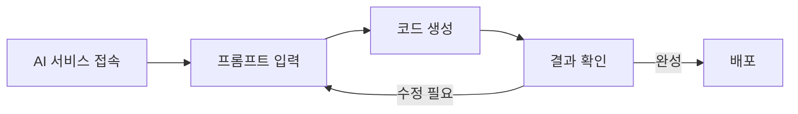

이 장에서는 별도의 설치 없이 웹 브라우저만으로 바이브 코딩을 체험해 봅니다. Claude나 ChatGPT 같은 AI 서비스를 통해 웹페이지를 만들고 배포하는 전체 과정을 경험할 수 있습니다.

# 1. 바이브 코딩 체험하기

<highlight>복잡한 설치 없이 우리가 바로 실험해볼 수 있는 것이 있습니다.</highlight> 누구나 무료로요. ChatGPT나 Claude에 접속하세요. 그리고 '바이브 코딩 랜딩 페이지'를 만들어달라고 하세요. 원하는 페이지가 있을 경우 원하는 페이지를 아래와 같이 요청하세요. 사용한 프롬프트는 아래와 같습니다.



```
바이브 코딩을 소개하는 랜딩페이지를 만들어주세요.

기술 스택: HTML, CSS, JavaScript
요구사항:
- 모든 코드는 하나의 HTML 파일에 포함
- 반응형 디자인
- 부드러운 스크롤 애니메이션
- 현대적이고 깔끔한 디자인
```

## 1.1 프롬프트 입력하기

Claude를 예시로 들어보겠습니다. 아래와 같이 프롬프트를 입력하였습니다.


:::div{.callout}
HTML, CSS, JavaScript가 무엇인지 모르셔도 괜찮습니다. 이런 기술적인 내용은 이후 챕터에서 자세히 다룰 예정입니다. 지금은 그저 웹페이지를 구성하는 요소라고만 이해하시면 충분합니다.

강의에서는 Naver에 들어가 실제 웹 페이지들이 어떻게 구성되는지 살펴봅니다.
:::

## 1.2 코드 생성 확인하기

엔터를 누르면 Claude가 즉시 코드를 생성하기 시작합니다. 웹페이지 코드와 이 코드를 실행한 화면이 오른쪽에 나타날 것입니다. 놀랍게도 클로드는 '게시'버튼을 통해 프로젝트를 바로 배포할 수 있도록 해줍니다. 그 옆에 있는 '복사' 버튼을 누르면 코드를 복사하거나, 다운로드 할 수도 있습니다.


## 1.3 대화하며 수정하기

생성된 페이지가 마음에 들지 않거나 수정해야 할 것이 발생하면 AI와 계속 대화하며 원하는 방향으로 수정해나갈 수 있습니다. 예를 들어 "배경색을 더 어둡게 바꿔주세요"라고 요청하거나, "제목에 애니메이션 효과를 추가해주세요"라고 할 수 있습니다. 각 요청마다 AI는 즉시 코드를 수정해서 보여줄 것입니다.


다만, AI가 항상 완벽한 코드를 생성하는 것은 아닙니다. 때로는 오류가 발생할 수도 있고, 원하는 결과와 다를 수도 있습니다. 이런 경우를 위해 직접 수정을 해보도록 하겠습니다. Claude는 다운로드 버튼이 있으나 ChatGPT는 없기 때문에 복사를 하여 진행을 해보도록 하겠습니다. 메모장에 붙여넣고 저장할 때에는 제목을 `index.html`로 하고, 파일 형식을 `모든 파일`로 선택하세요. 이렇게 저장된 파일은 웹 브라우저로 열립니다. 수정하고 싶다면 메모장에서 수정할 수 있습니다.

## 1.4 웹페이지 배포하기

만족스러운 결과물이 완성되면 우측 상단의 '게시' 버튼을 클릭해보세요. 걱정하지 않으셔도 됩니다. 여러분이 AI와 나눈 대화 내용이 공개되는 것은 아닙니다. 오직 최종 결과물인 웹페이지만 공개됩니다. 게시를 완료하면 고유한 URL이 생성되고, 이 링크를 통해 누구나 여러분이 만든 웹페이지에 접속할 수 있게 됩니다. <highlight>이렇게 웹페이지를 인터넷에 공개하는 과정을 우리는 '배포'라고 부릅니다.</highlight>


이제 이 웹페이지에서 여러분이 만든 결과물을 남들도 접속할 수 있게 됩니다. 예를 들어, 제가 방금 만든 바이브 코딩 소개 페이지는 [https://weniv.link/DBi7w_](https://weniv.link/DBi7w_) 에서 서비스 되고 있습니다. 단 2번의 대화로 만들어진 결과물 치고는 꽤 그럴듯하죠. 다만 느리고, `콘텐츠는 사용자가 생성한 것으로 검증되지 않았습니다.`라는 문구가 붙습니다. 이러한 문구를 없애고, 더 빠른 로딩 속도를 가지기 위해서는 다음 챕터에서 다룰 '배포'에 대한 내용을 참고해야 합니다.

* [바이브 코딩 랜딩페이지 | Claude](https://weniv.link/DBi7w_)

# 2. 간단한 배포

:::div{.callout}
만약 오프라인 수업에서 30명 이상 같은 공간에서 회원가입을 하면 부정한 방법으로 회원가입하는 것으로 인식을 하여 캡차가 뜨는 경우가 있습니다. 이 경우에는 수업이 끝난 후 집에서 가입을 하시길 권장드립니다. 따로 캡차를 풀어드리지는 않습니다. 생각보다 잘 안풀리기 때문입니다.
:::

마이크로소프트에서 서비스하고 있는 깃헙이라는 도구를 사용해서 간단한 배포를 경험해보는 시간을 가져보겠습니다. 깃헙은 버전 관리 도구이자, 무료로 정적 웹사이트를 호스팅할 수 있는 기능을 제공합니다.

## 2.1 깃헙 가입 및 저장소 생성

아래 링크에서 회원가입을 진행해주세요.

* [GitHub 회원가입](https://github.com/)


빨간색 네모 박스 2개 중 하나를 클릭하시면 새로운 저장소를 만들 수 있습니다. 여러분은 왼쪽에 `New` 버튼이 있는 곳에 `Create repository` 버튼이 있습니다. 이것을 클릭해주세요. 오른쪽에 `+` 버튼을 누르고 `New repository` 버튼을 누르셔도 됩니다. 저장소는 우리가 프로젝트를 올려놓는 폴더를 만드시는 것이라 생각하시면 됩니다. 


저장소 이름은 `sample`로 하도록 하겠습니다. 설명서인 `README.md` 파일은 체크하시고, `Create repository` 버튼을 클릭합니다.


위와 같이 화면이 나오면 성공적으로 저장소가 만들어진 것입니다. 이제 우리가 만든 `index.html` 파일을 업로드 해보도록 하겠습니다. `Add file` 버튼을 클릭하고, `Upload files`를 선택합니다.


드래그앤드롭으로 `index.html` 파일을 업로드 합니다. 여기서 주의하셔야 할 점이 대문 페이지는 항상 `index.html`이라는 사실입니다. `Commit changes` 버튼을 클릭합니다. 자 이렇게 하면 파일 업로드가 완료되었습니다.

## 2.2 깃헙 페이지 설정

이제 업로드한 파일을 웹페이지로 배포해보도록 하겠습니다. 아래 순서대로 클릭하면 됩니다.


1. Settings 클릭
2. Pages 클릭
3. None 버튼 클릭
4. main 브랜치 선택
5. Save 클릭

약 2 ~ 3분 정도 기다리고 페이지 새로고침을 해보면 아래와 같이 배포된 URL이 나타납니다. 클릭해보세요.

