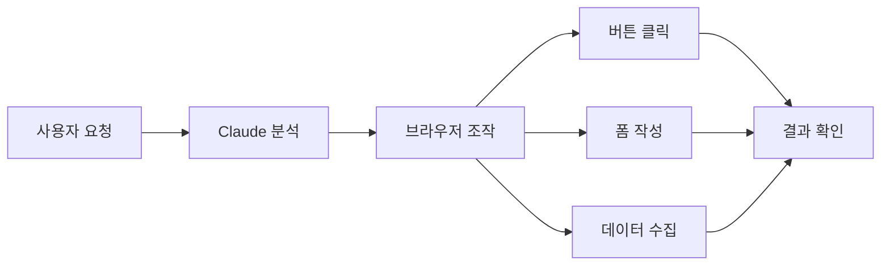

이 장에서는 Claude의 크롬 익스텐션을 소개합니다. 브라우저에서 직접 Claude를 활용하여 웹 페이지 탐색, 캡처, 디자인 시스템으로 활용할 JSON 파일 추출 등 다양한 작업을 자동화할 수 있습니다.

# 1. Claude 크롬 익스텐션이란?

<highlight>Claude 크롬 익스텐션은 브라우저 내에서 Claude가 직접 웹 페이지를 조작할 수 있게 해주는 도구입니다.</highlight> 기존에는 Claude에게 무언가를 요청하면 텍스트로 답변을 받거나 코드를 생성받는 방식이었습니다. 하지만 크롬 익스텐션을 사용하면 Claude가 실제로 웹 브라우저를 조작하여 작업을 수행할 수 있습니다.



:::div{.callout}
현재 Claude 크롬 익스텐션은 **베타 버전**으로 유료 구독자에게만 제공됩니다. 추후 정식 출시 시 기능이 변경되거나 확장될 수 있습니다.
:::

# 2. 설치 방법

크롬 익스텐션 설치는 매우 간단합니다. 아래 링크에서 `Add to Chrome` 버튼을 클릭하면 Chrome 웹 스토어에서 바로 설치할 수 있습니다.


* 링크: https://claude.com/chrome

저는 이미 설치가 되어 있기 때문에 'Chrome에서 삭제' 버튼이 있지만, 여러분에게는 설치 버튼이 있을 것입니다. 


설치가 완료되면 크롬 브라우저 우측 상단에 Claude 아이콘이 나타납니다. 이 아이콘을 클릭하여 익스텐션을 활성화할 수 있습니다. 로그인이 되어 있지 않으면 로그인 화면이 나타납니다. 로그인 후에는 익스텐션이 정상적으로 작동합니다.


# 3. 기본 사용법

간단하게 몇 가지 실험을 해보도록 하겠습니다. 우선 아래와 같이 탐색을 하거나, 요약을 할 수 있습니다.

```
이 서비스에 책이 몇 권 있지?
```


아래 '플랜 승인' 버튼을 누르면 Claude가 해당 페이지의 정보를 가지고 원하는 결과를 생성합니다. 모든 작업이 완료된 화면입니다.


## 3.1 특정 정보 추출

페이지 정보를 추출해서 JSON 파일이나 CSV 파일로 만들어 다운로드 받을 수 있습니다. 예를 들어, 아래와 같이 요청할 수 있습니다.

```
이 페이지에 있는 모든 책 제목과 저자를 JSON 파일로 만들어줘.
```

추출이 되었고, 다운로드까지 된 것을 확인할 수 있습니다.


## 3.2 버튼 클릭 및 폼 작성

특정 버튼을 클릭하거나 폼을 작성하는 것도 가능합니다. 예를 들어, 아래와 같이 요청할 수 있습니다.

```
'베스트셀러 보기' 버튼을 클릭해줘.
```

또는 폼 작성을 할 수도 있습니다.

```
이 폼을 모두 작성해줘. 모르는 내용이 있다면 임시로 넣어줘.
```


이처럼 메일 작성, 회원 가입, 검색 등 다양한 작업을 자동화할 수 있습니다.

## 3.3 다양한 활용

바이브 코딩에 이를 접목시키면, 디자인 시스템에서 컴포넌트 정보를 추출하거나, 생성된 웹 페이지를 자동으로 테스트하는 등 다양한 활용이 가능합니다. Claude Code에서 실행하는 것보다 수정된 것을 바로 확인할 수 있으니 직관적 개발이 가능하다는 장점도 있습니다. 다만 Claude Code와 익스텐션이 연결되어 있는 것은 아니기 때문에 작업을 한 다음에는 '어디서 어떻게 수정했는지 요약해줘. Claude Code에게 수행해서 이렇게 수정하라고 알려줄게.'라고 요청하는 것이 좋습니다.